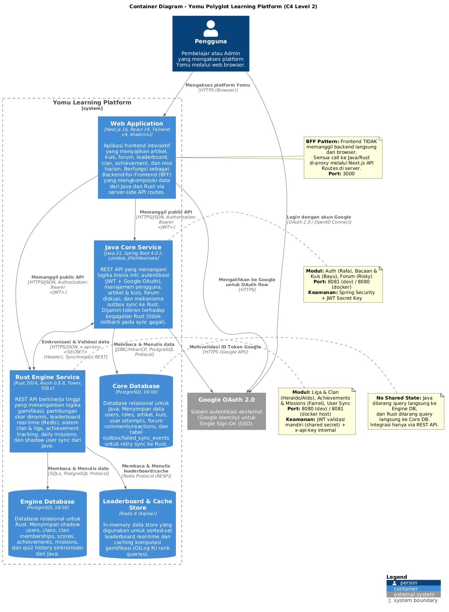
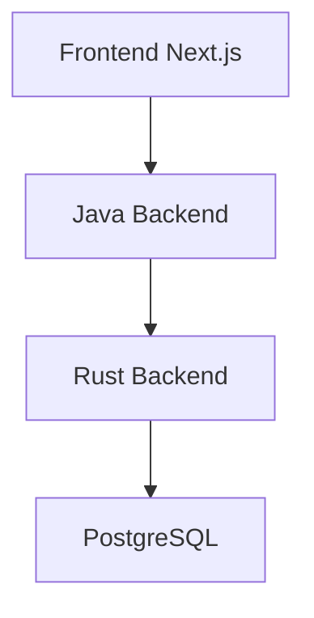
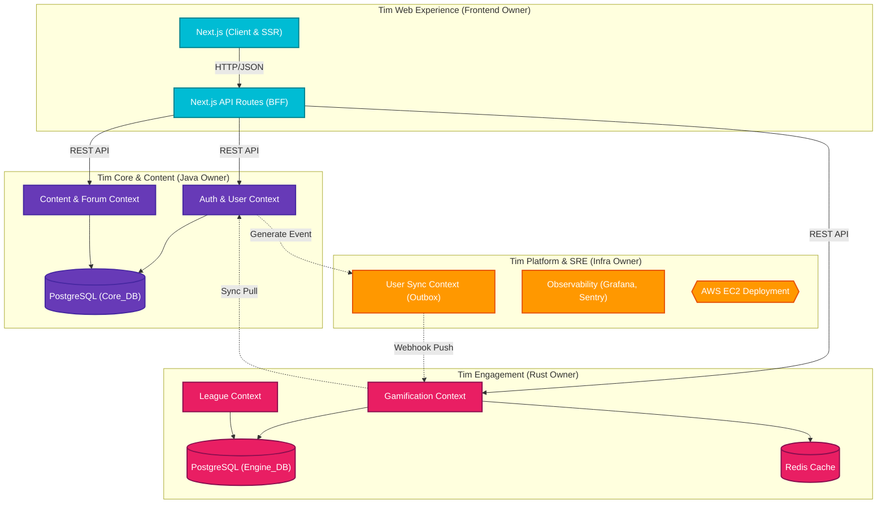
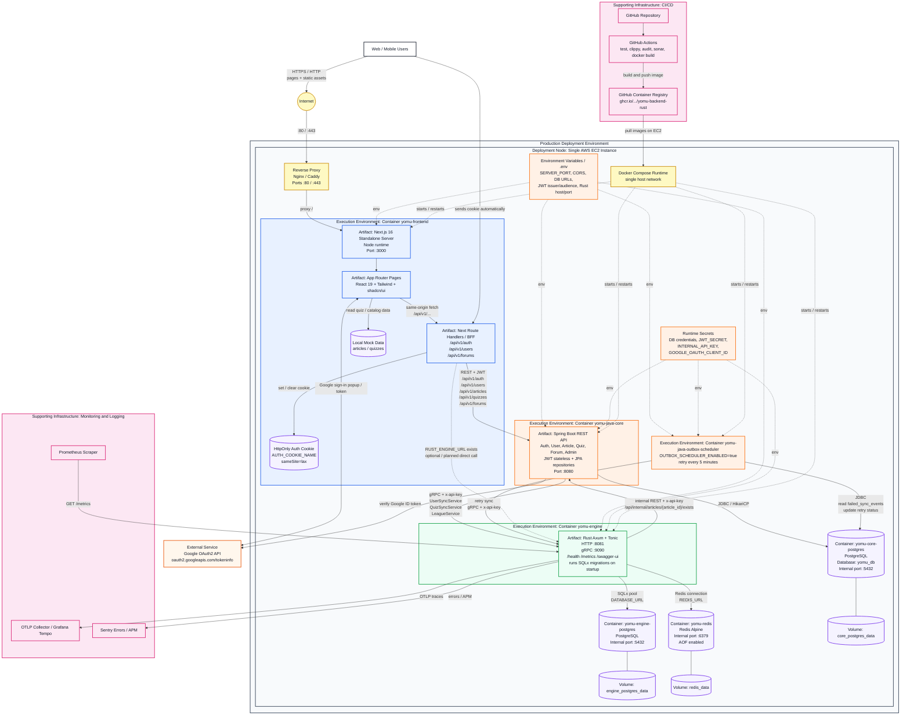
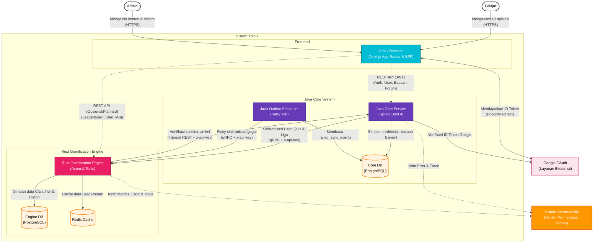
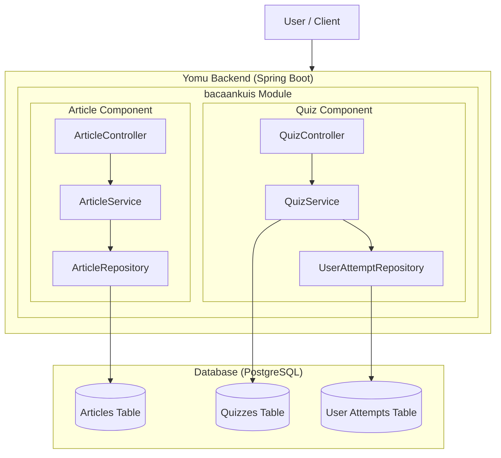
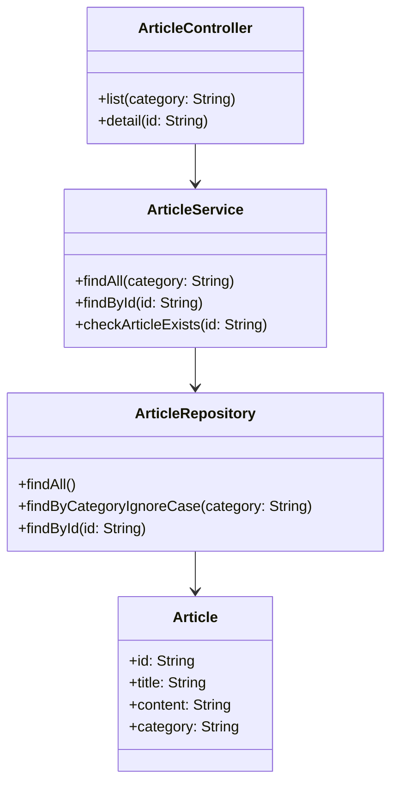
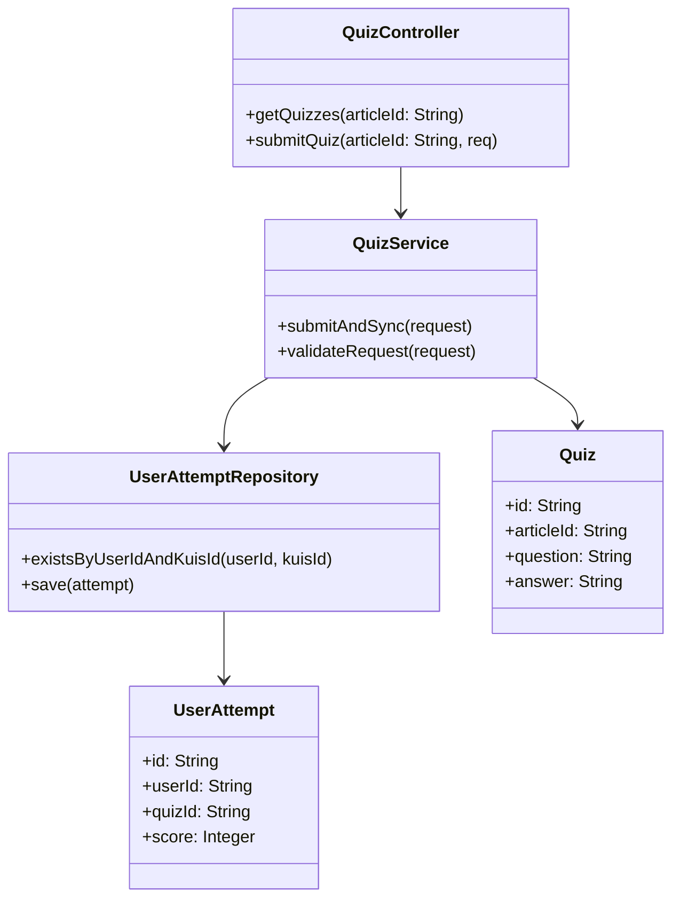
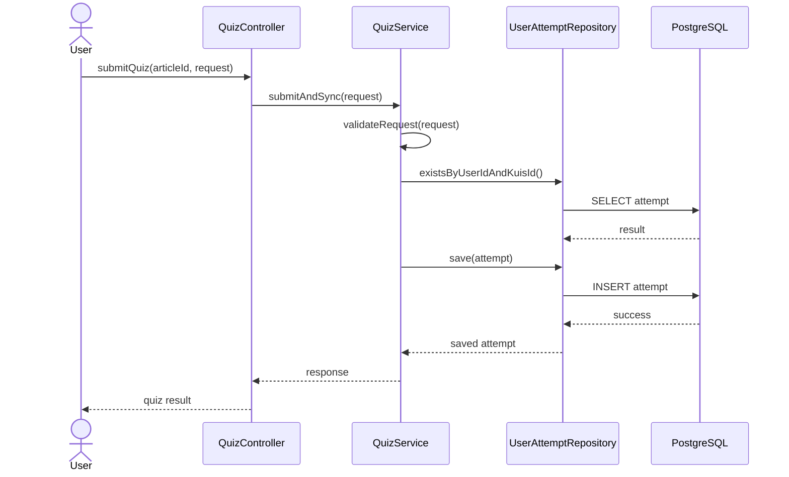
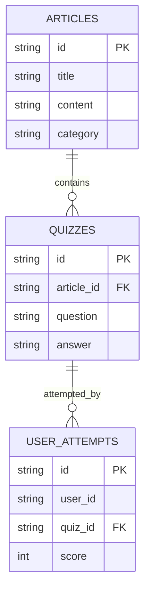

# yomu-docs

Dokumentasi resmi Yomu — platform pembelajaran poliglot yang dibangun dengan Java, Rust, dan Next.js. Dokumentasi ini ditulis dalam Bahasa Indonesia dan menggunakan Fumadocs — framework dokumentasi modern berbasis Next.js.

## Tentang Proyek

Yomu adalah platform pembelajaran yang menggabungkan:

- **Java Backend** — Spring Boot 4.0.2 untuk autentikasi, manajemen pengguna, artikel, kuis, dan forum
- **Rust Backend** — Axum 0.8.8 untuk engine gamifikasi: clan, leaderboard, achievement, dan misi harian
- **Next.js Frontend** — Next.js 16.1.6 dengan React 19, Tailwind CSS v4, dan shadcn/ui

Sepenuhnya ditulis dalam Bahasa Indonesia untuk menjangkau komunitas pengembang lokal.

## Teknologi

| Layer | Teknologi | Versi |
|-------|-----------|-------|
| Framework Dokumentasi | Fumadocs + Next.js | 16.2.4 / 16.8.8 |
| React | React | 19.2.3 |
| Styling | Tailwind CSS | v4 |
| Komponen UI | shadcn/ui | new-york |
| Font | Geist | latest |
| Package Manager | bun | 1.x |

## Struktur Direktori

```
yomu-docs/
├── content/docs/           # Semua konten dokumentasi MDX
│   ├── index.mdx          # Halaman utama dokumentasi
│   ├── architecture/        # system architecture (4 halaman)
│   ├── backend-java/        # Dokumentasi Java backend (4 halaman)
│   ├── backend-rust/        # Dokumentasi Rust backend (5 halaman)
│   ├── frontend/            # Dokumentasi frontend (3 halaman)
│   ├── design-decisions/    # Keputusan Architecture & teknologi (3 halaman)
│   ├── design-architecture/ # Clean vs Layered Architecture (2 halaman)
│   ├── cicd/                # Pipeline CI/CD (4 halaman)
│   ├── development/          # Panduan setup & development (2 halaman)
│   └── glosarium/          # Glosarium istilah teknis (120+ istilah)
├── src/
│   ├── app/                 # Next.js App Router
│   │   ├── (home)/          # Landing page
│   │   ├── docs/            # Dokumentasi layout & pages
│   │   └── api/search/      # Route handler untuk pencarian
│   ├── components/           # Komponen custom
│   │   └── mdx.tsx         # Stubs MDX (Cards, Callout, Steps, Diagram)
│   ├── lib/                  # Utils & source adapter
│   │   ├── layout.shared.tsx # Shared layout options
│   │   └── source.ts         # Content source adapter
│   └── middleware.ts        # Next.js middleware
├── public/                   # Aset statis
├── next.config.ts           # Konfigurasi Next.js
├── source.config.ts         # Konfigurasi Fumadocs source
├── tailwind.config.ts       # Konfigurasi Tailwind v4
└── tsconfig.json            # Konfigurasi TypeScript
```

## Mulai Cepat

### Prasyarat

- **bun** — `curl -fsSL https://bun.sh/install | bash`
- **Node.js** 22+ (dibutuhkan oleh beberapa dependency build-time)

```bash
# Verifikasi bun
bun -v  # minimal bun 1.x
```

### Instalasi

```bash
# Clone dan masuk ke direktori
# cd /home/pongo/projects/kuliah/adpro/final_project/yomu-docs

# Instal semua dependency
bun install
```

### Development Server

```bash
# Jalankan development server
bun run dev
```

Buka http://localhost:3000/docs di browser untuk melihat dokumentasi.

### Build Produksi

```bash
# Build untuk produksi (static prerendering)
bun run build
```

Output build berada di `.next/`. Dokumentasi Yomu menggunakan **output mode standalone** untuk deployment Docker yang optimal.

### Type Check

```bash
# Verifikasi TypeScript tanpa build
bun run typecheck
```

### Lint

```bash
# Jalankan ESLint
cd ../yomu-frontend && bun run lint
```

## Panduan Kontribusi

### Menambah Dokumentasi Baru

1. Buat file `.mdx` baru di `content/docs/<folder>/nama-halaman.mdx`
2. Tambahkan frontmatter:

```yaml
---
title: Judul Halaman
description: Deskripsi singkat halaman ini
---
```

3. Jika membuat folder baru, tambahkan `meta.json` di dalam folder:

```json
{
  "title": "Judul Bagian",
  "pages": ["index", "sub-halaman"]
}
```

4. Tambahkan entry di `content/docs/meta.json` (sidebar root) jika perlu muncul di navigasi utama.

### Komponen MDX yang Tersedia

Dokumentasi mendukung komponen-komponen berikut:

- **`<Cards>` dan `<Card>`** — Kartu navigasi
- **`<Callout type="info|warning|error|success">`** — Pesan callout
- **`<Steps>` dan `<Step title="...">`** — Langkah-langkah berurutan
- **`<Diagram name="Nama Diagram">`** — Wrapper Mermaid diagram
- **Code blocks** — Syntax highlighted (rust, java, typescript, sql, bash, yaml, json, dll.)
- **Tables** — Tabel Markdown standar
- **Mermaid** — Diagram sequence, flowchart, ER diagram

### Main Diagrams

#### C4 Container Diagram



Diagram kontainer di atas menggambarkan arsitektur Level 2 C4 Model untuk platform Yomu. Diagram ini menunjukkan:

- **Web Application** (Next.js 16) — Frontend BFF yang berkomunikasi dengan Java dan Rust backend
- **Java Core Service** (Spring Boot 4) — Autentikasi, artikel & kuis, forum, outbox sync ke Rust
- **Rust Engine Service** (Axum 0.8.8) — Gamifikasi, clan, leaderboard (Redis), achievement, missions
- **Core DB** (PostgreSQL) — Database Java untuk users, artikel, kuis, forum, outbox/failed sync
- **Engine DB** (PostgreSQL) — Database Rust untuk shadow users, clan, scores, achievements
- **Redis** — Leaderboard real-time dan cache gamifikasi
- **Google OAuth 2.0** — Sistem autentikasi eksternal untuk SSO



### Future Architecture


### Deployment Diagram


  
## Context Diagram  


### Translate & Localization

Semua konten dokumentasi ditulis dalam Bahasa Indonesia. Istilah teknis (JWT, OAuth, REST, API, BFF, DTO, CRUD, CI/CD, Redis, PostgreSQL, Docker, Kubernetes, Java, Rust, Next.js, Spring Boot, Axum, SQLx, JPA, Hibernate, dll.) tetap dalam Bahasa Inggris. Hanya narasi, penjelasan, deskripsi, dan heading yang diterjemahkan.

## Deployment

D dokumentasi ini dideploy sebagai static site dengan Next.js standalone output. Build menghasilkan halaman HTML statis untuk semua route dokumentasi.

### Manual Deployment

```bash
bun run build
```

### Dokumentasi Terkait

- [Fumadocs Documentation](https://fumadocs.dev) — Pelajari lebih lanjut tentang Fumadocs features dan API.
- [Next.js Documentation](https://nextjs.org/docs) — Pelajari tentang Next.js features dan API.
- [Tailwind CSS Documentation](https://tailwindcss.com/docs) — Referensi utility classes.
- [shadcn/ui Documentation](https://ui.shadcn.com) — Komponen UI yang digunakan.

### Keterbatasan yang Diketahui

Berdasarkan struktur proyek Yomu Docs:

- Tidak menggunakan package manager lain selain bun
- Tidak ada file `.next/` yang di-commit ke repository
- Selalu jalankan `bun run build` sebelum deployment untuk memverifikasi tidak ada error
- MDX parser sangat sensitif terhadap tag yang tidak seimbang — selalu verifikasi build lolos
- Proyek ini memiliki banyak file `.mdx` — pastikan semua component stubs (Cards, Callout, Steps, Diagram) tersedia di `src/components/mdx.tsx`

---

**Yomu Docs** — Dokumentasi Architecture dan developer guide untuk platform pembelajaran Yomu. Ditulis dengan Bahasa Indonesia dan dibangun dengan Fumadocs + Next.js.

## Analisis Risiko Arsitektur

Sebagai Risk Analyst, berikut adalah identifikasi risiko teknis pada arsitektur Yomu beserta
strategi mitigasinya berdasarkan diagram-diagram di atas.

### Risiko Tinggi

| ID | Risiko | Komponen Terdampak | Probabilitas | Dampak | Mitigasi |
|----|--------|--------------------|:------------:|:------:|----------|
| R1 | **Single Point of Failure — Single EC2** | Seluruh sistem | Sedang | Kritis | Tambahkan Auto Scaling Group + Load Balancer di fase berikutnya; pastikan health check Docker Compose aktif |
| R2 | **Kegagalan sinkronisasi Java → Rust** | Outbox Scheduler, Engine DB | Tinggi | Tinggi | Outbox pattern sudah ada; pastikan `failed_sync_events` dimonitor dan alert Sentry aktif |
| R3 | **Bocornya JWT / INTERNAL_API_KEY** | Auth, gRPC channel | Rendah | Kritis | Simpan di GitHub Secrets / AWS Secrets Manager; jangan pernah commit ke repo |

### Risiko Sedang

| ID | Risiko | Komponen Terdampak | Probabilitas | Dampak | Mitigasi |
|----|--------|--------------------|:------------:|:------:|----------|
| R4 | **Redis down → leaderboard tidak tersedia** | Rust Engine, Leaderboard | Sedang | Sedang | Redis AOF enabled (sudah dikonfigurasi); pertimbangkan replica untuk produksi |
| R5 | **Drift schema antara Core DB dan Engine DB** | PostgreSQL (keduanya) | Sedang | Sedang | SQLx compile-time check di Rust; Flyway/Liquibase di Java; migration harus di-review bersama |
| R6 | **Google OAuth 2.0 downtime** | Login seluruh user | Rendah | Tinggi | Tidak ada fallback auth saat ini — pertimbangkan local fallback atau caching token |

### Risiko Rendah

| ID | Risiko | Komponen Terdampak | Probabilitas | Dampak | Mitigasi |
|----|--------|--------------------|:------------:|:------:|----------|
| R7 | **Build MDX gagal akibat tag tidak seimbang** | yomu-docs (repo ini) | Tinggi | Rendah | Selalu jalankan `bun run build` sebelum merge; CI GitHub Actions sudah ada |
| R8 | **gRPC timeout antara Java dan Rust** | UserSyncService, QuizSyncService | Sedang | Rendah | Set deadline/timeout eksplisit di client gRPC; retry logic ada di Outbox Scheduler |

### Ringkasan Risk Matrix

              Dampak (Impact)
              Rendah    Sedang    Tinggi    Kritis
            ┌─────────┬─────────┬─────────┬─────────┐
    Tinggi  │   R7    │   R2    │         │         │
            ├─────────┼─────────┼─────────┼─────────┤
    Sedang  │   R8    │ R4, R5  │   R1    │         │
            ├─────────┼─────────┼─────────┼─────────┤
    Rendah  │         │         │   R6    │ R1, R3  │
            └─────────┴─────────┴─────────┴─────────┘

### Prioritas Tindakan

1. **Segera** — Pastikan semua secret (JWT_SECRET, INTERNAL_API_KEY, DB credentials) tidak ada di
   codebase; gunakan environment variable yang di-inject saat deploy.
2. **Sprint ini** — Monitor tabel `failed_sync_events` secara aktif; tambahkan alert jika row
   bertumpuk > threshold tertentu.
3. **Sprint berikutnya** — Evaluasi strategi Redis replica dan disaster recovery untuk PostgreSQL
   (backup otomatis).
4. **Future** — Migrasi ke multi-instance deployment (lihat Future Architecture diagram dari Bayu)
   untuk menghilangkan R1.

---

## Penjelasan Diagram Arsitektur

Bagian ini menjelaskan keempat diagram C4 yang ada di repository ini agar mudah dipahami oleh
developer baru maupun reviewer.

### 1. Context Diagram

**Level C4:** Level 1 — gambaran paling tinggi, siapa yang menggunakan sistem dan sistem eksternal
apa yang berinteraksi.

**Yang ditunjukkan:**
- **Pelajar** dan **Admin** sebagai aktor utama yang mengakses via HTTPS
- **Yomu System** sebagai kotak hitam besar yang berisi seluruh platform
- **Google OAuth** sebagai dependency eksternal untuk autentikasi
- **Sistem Observability** (Sentry, Prometheus, Tempo) sebagai infrastruktur monitoring

**Poin penting:** Diagram ini menunjukkan bahwa Yomu sepenuhnya bergantung pada Google OAuth untuk
login — tidak ada username/password tradisional.

### 2. Container Diagram

**Level C4:** Level 2 — memecah sistem menjadi container (proses/aplikasi yang dapat di-deploy
secara terpisah).

**Yang ditunjukkan:**
- **Next.js Frontend** sebagai BFF (Backend for Frontend) yang menjadi satu-satunya pintu masuk
  bagi user
- **Java Core Service** menangani domain utama: auth, artikel, kuis, forum
- **Rust Engine** menangani domain gamifikasi: clan, leaderboard, achievement, misi
- **3 database terpisah:** Core PostgreSQL, Engine PostgreSQL, dan Redis

**Poin penting:** Java dan Rust **tidak berbagi database** — ini keputusan desain yang disengaja
untuk isolasi domain (lihat Design Decisions di dokumentasi).

### 3. Deployment Diagram

**Level C4:** Level 4 — menunjukkan bagaimana container di-deploy ke infrastruktur nyata.

**Yang ditunjukkan:**
- Semua container berjalan di **satu EC2 instance** via Docker Compose (saat ini)
- **Nginx** sebagai reverse proxy di depan Next.js
- **GitHub Actions** → **GHCR** → **EC2** sebagai pipeline CI/CD
- Pemisahan antara environment variables (tidak sensitif) dan runtime secrets (sensitif)

**Poin penting:** Deployment saat ini adalah *single host* — lihat R1 di Risk Analysis di atas.

### 4. Future Architecture

**Tipe:** Squad-based architecture diagram untuk roadmap pengembangan tim.

**Yang ditunjukkan:**
- Pembagian tim menjadi 4 squad: Frontend, Core, Engagement, Platform
- Rencana pemisahan tanggung jawab yang lebih jelas antar squad
- Pola komunikasi: Frontend → BFF → masing-masing service; Java ↔ Rust via Outbox + Webhook

**Poin penting:** Diagram ini adalah **target arsitektur**, bukan kondisi saat ini. Transisi dari
deployment single-EC2 ke arsitektur ini memerlukan orkestrasi container (Kubernetes atau ECS).


## Modul 9 Individu - Ahmad Anggara B P


---

### 2. Code Diagram — Article Module



---

### 3. Code Diagram — Quiz Module



---

### 4. Code Diagram — Quiz Submission Flow



---

### 5. Database ER Diagram

