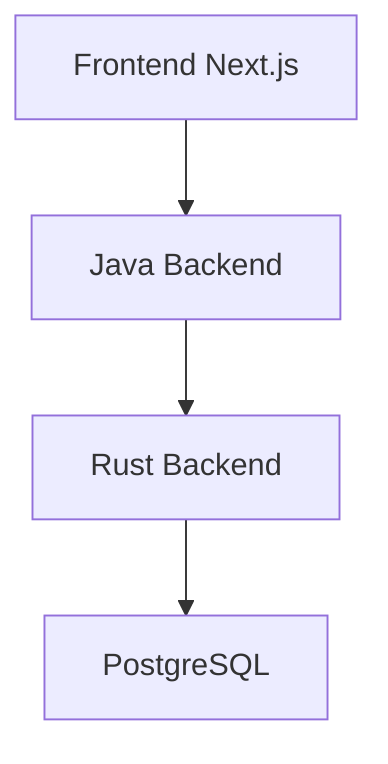
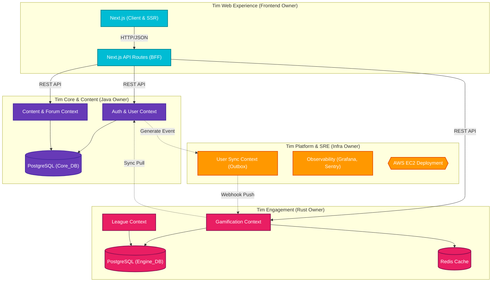
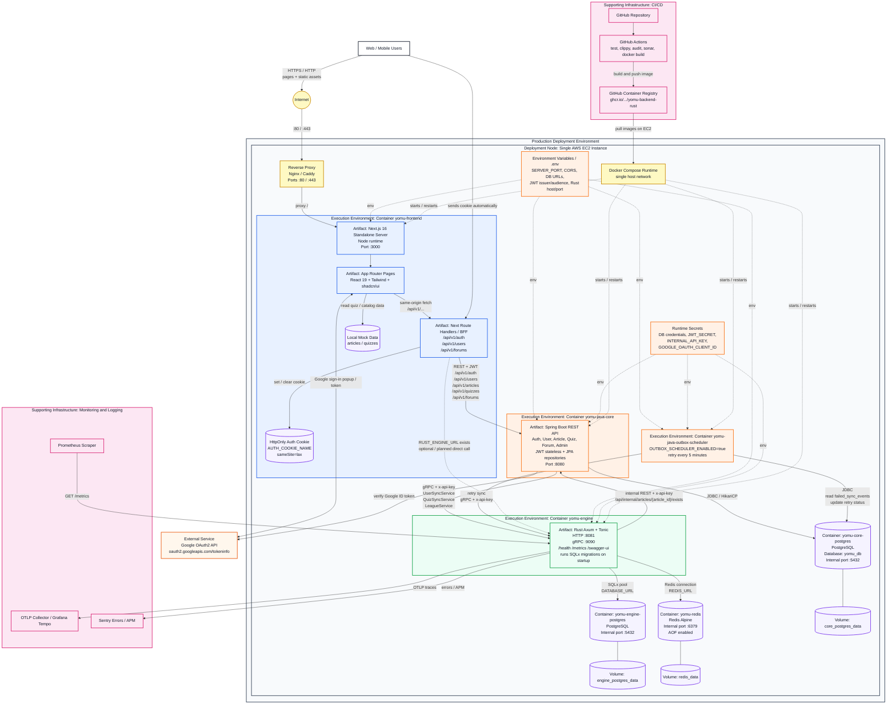
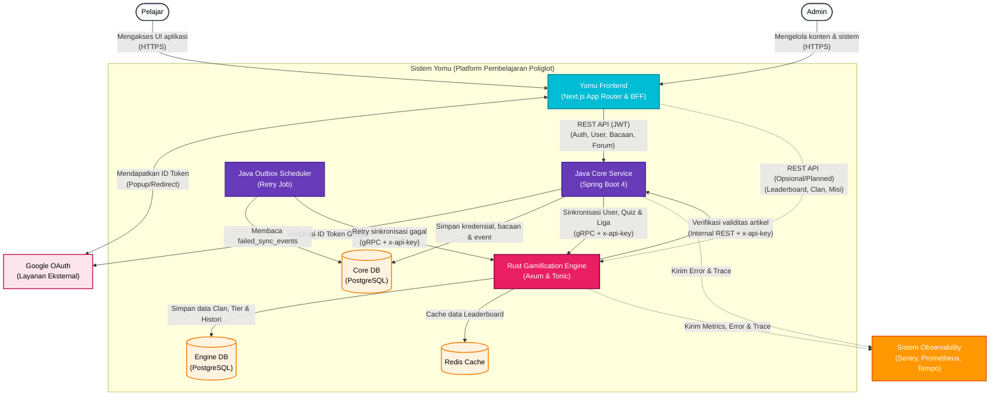

# yomu-docs

Dokumentasi resmi Yomu — platform pembelajaran poliglot yang dibangun dengan Java, Rust, dan Next.js. Dokumentasi ini ditulis dalam Bahasa Indonesia dan menggunakan Fumadocs — framework dokumentasi modern berbasis Next.js.

## Tentang Proyek

Yomu adalah platform pembelajaran yang menggabungkan:

- **Java Backend** — Spring Boot 4.0.2 untuk autentikasi, manajemen pengguna, artikel, kuis, dan forum
- **Rust Backend** — Axum 0.8.8 untuk engine gamifikasi: clan, leaderboard, achievement, dan misi harian
- **Next.js Frontend** — Next.js 16.1.6 dengan React 19, Tailwind CSS v4, dan shadcn/ui

Sepenuhnya ditulis dalam Bahasa Indonesia untuk menjangkau komunitas pengembang lokal.

## Teknologi

| Layer | Teknologi | Versi |
|-------|-----------|-------|
| Framework Dokumentasi | Fumadocs + Next.js | 16.2.4 / 16.8.8 |
| React | React | 19.2.3 |
| Styling | Tailwind CSS | v4 |
| Komponen UI | shadcn/ui | new-york |
| Font | Geist | latest |
| Package Manager | bun | 1.x |

## Struktur Direktori

```
yomu-docs/
├── content/docs/           # Semua konten dokumentasi MDX
│   ├── index.mdx          # Halaman utama dokumentasi
│   ├── architecture/        # system architecture (4 halaman)
│   ├── backend-java/        # Dokumentasi Java backend (4 halaman)
│   ├── backend-rust/        # Dokumentasi Rust backend (5 halaman)
│   ├── frontend/            # Dokumentasi frontend (3 halaman)
│   ├── design-decisions/    # Keputusan Architecture & teknologi (3 halaman)
│   ├── design-architecture/ # Clean vs Layered Architecture (2 halaman)
│   ├── cicd/                # Pipeline CI/CD (4 halaman)
│   ├── development/          # Panduan setup & development (2 halaman)
│   └── glosarium/          # Glosarium istilah teknis (120+ istilah)
├── src/
│   ├── app/                 # Next.js App Router
│   │   ├── (home)/          # Landing page
│   │   ├── docs/            # Dokumentasi layout & pages
│   │   └── api/search/      # Route handler untuk pencarian
│   ├── components/           # Komponen custom
│   │   └── mdx.tsx         # Stubs MDX (Cards, Callout, Steps, Diagram)
│   ├── lib/                  # Utils & source adapter
│   │   ├── layout.shared.tsx # Shared layout options
│   │   └── source.ts         # Content source adapter
│   └── middleware.ts        # Next.js middleware
├── public/                   # Aset statis
├── next.config.ts           # Konfigurasi Next.js
├── source.config.ts         # Konfigurasi Fumadocs source
├── tailwind.config.ts       # Konfigurasi Tailwind v4
└── tsconfig.json            # Konfigurasi TypeScript
```

## Mulai Cepat

### Prasyarat

- **bun** — `curl -fsSL https://bun.sh/install | bash`
- **Node.js** 22+ (dibutuhkan oleh beberapa dependency build-time)

```bash
# Verifikasi bun
bun -v  # minimal bun 1.x
```

### Instalasi

```bash
# Clone dan masuk ke direktori
# cd /home/pongo/projects/kuliah/adpro/final_project/yomu-docs

# Instal semua dependency
bun install
```

### Development Server

```bash
# Jalankan development server
bun run dev
```

Buka http://localhost:3000/docs di browser untuk melihat dokumentasi.

### Build Produksi

```bash
# Build untuk produksi (static prerendering)
bun run build
```

Output build berada di `.next/`. Dokumentasi Yomu menggunakan **output mode standalone** untuk deployment Docker yang optimal.

### Type Check

```bash
# Verifikasi TypeScript tanpa build
bun run typecheck
```

### Lint

```bash
# Jalankan ESLint
cd ../yomu-frontend && bun run lint
```

## Panduan Kontribusi

### Menambah Dokumentasi Baru

1. Buat file `.mdx` baru di `content/docs/<folder>/nama-halaman.mdx`
2. Tambahkan frontmatter:

```yaml
---
title: Judul Halaman
description: Deskripsi singkat halaman ini
---
```

3. Jika membuat folder baru, tambahkan `meta.json` di dalam folder:

```json
{
  "title": "Judul Bagian",
  "pages": ["index", "sub-halaman"]
}
```

4. Tambahkan entry di `content/docs/meta.json` (sidebar root) jika perlu muncul di navigasi utama.

### Komponen MDX yang Tersedia

Dokumentasi mendukung komponen-komponen berikut:

- **`<Cards>` dan `<Card>`** — Kartu navigasi
- **`<Callout type="info|warning|error|success">`** — Pesan callout
- **`<Steps>` dan `<Step title="...">`** — Langkah-langkah berurutan
- **`<Diagram name="Nama Diagram">`** — Wrapper Mermaid diagram
- **Code blocks** — Syntax highlighted (rust, java, typescript, sql, bash, yaml, json, dll.)
- **Tables** — Tabel Markdown standar
- **Mermaid** — Diagram sequence, flowchart, ER diagram

### Main Diagrams



### Future Architecture


### Deployment Diagram


  
## Context Diagram  


### Translate & Localization

Semua konten dokumentasi ditulis dalam Bahasa Indonesia. Istilah teknis (JWT, OAuth, REST, API, BFF, DTO, CRUD, CI/CD, Redis, PostgreSQL, Docker, Kubernetes, Java, Rust, Next.js, Spring Boot, Axum, SQLx, JPA, Hibernate, dll.) tetap dalam Bahasa Inggris. Hanya narasi, penjelasan, deskripsi, dan heading yang diterjemahkan.

## Deployment

D dokumentasi ini dideploy sebagai static site dengan Next.js standalone output. Build menghasilkan halaman HTML statis untuk semua route dokumentasi.

### Manual Deployment

```bash
bun run build
```

### Dokumentasi Terkait

- [Fumadocs Documentation](https://fumadocs.dev) — Pelajari lebih lanjut tentang Fumadocs features dan API.
- [Next.js Documentation](https://nextjs.org/docs) — Pelajari tentang Next.js features dan API.
- [Tailwind CSS Documentation](https://tailwindcss.com/docs) — Referensi utility classes.
- [shadcn/ui Documentation](https://ui.shadcn.com) — Komponen UI yang digunakan.

### Keterbatasan yang Diketahui

Berdasarkan struktur proyek Yomu Docs:

- Tidak menggunakan package manager lain selain bun
- Tidak ada file `.next/` yang di-commit ke repository
- Selalu jalankan `bun run build` sebelum deployment untuk memverifikasi tidak ada error
- MDX parser sangat sensitif terhadap tag yang tidak seimbang — selalu verifikasi build lolos
- Proyek ini memiliki banyak file `.mdx` — pastikan semua component stubs (Cards, Callout, Steps, Diagram) tersedia di `src/components/mdx.tsx`

---

**Yomu Docs** — Dokumentasi Architecture dan developer guide untuk platform pembelajaran Yomu. Ditulis dengan Bahasa Indonesia dan dibangun dengan Fumadocs + Next.js.
