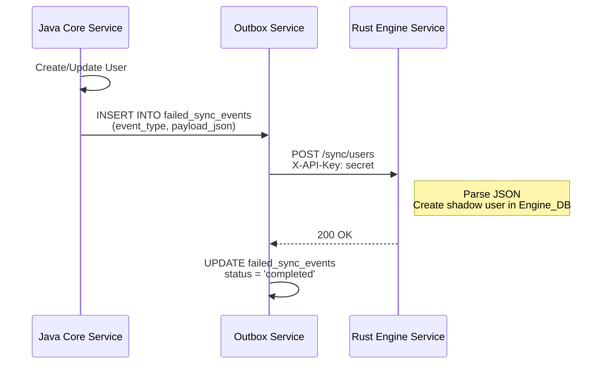
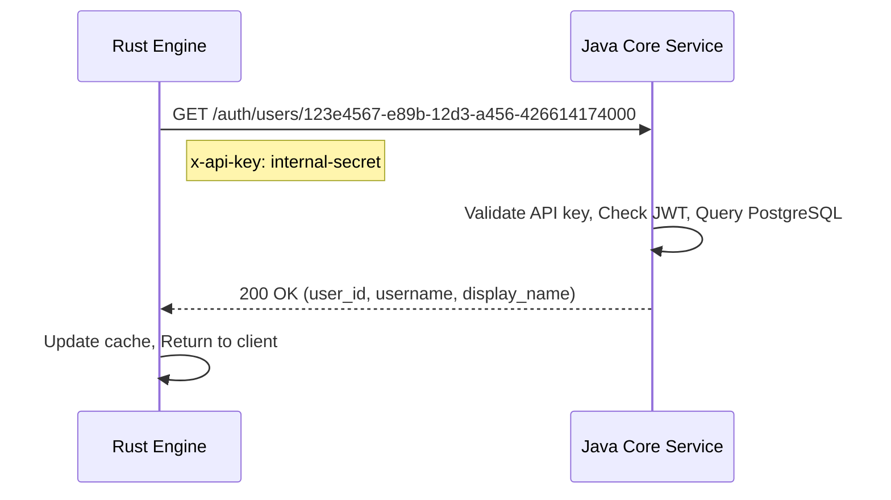
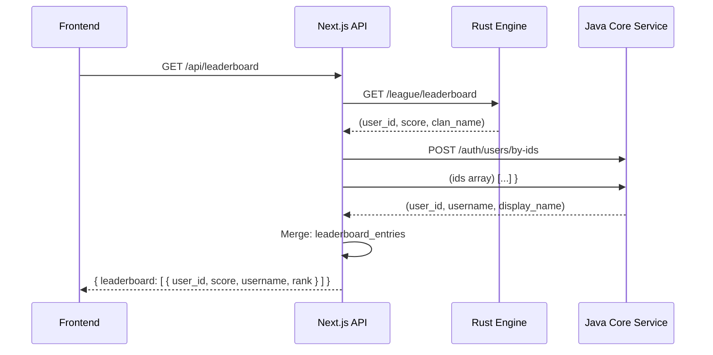

## Communication Patterns Overview

Yomu uses three primary communication patterns across its services:

1. **Webhook / Event-Driven Push** — Java → Rust user data synchronization
2. **Synchronous Pull** — Rust → Java validation lookups
3. **API Composition** — Frontend aggregates data from multiple services

Each pattern serves distinct use cases and maintains system resilience.

## Pattern 1: Event-Driven Push (Java → Rust)

When users are created or updated in the Core Service, the Java application generates outbox events that are pushed to the Rust Engine via webhooks.

### Implementation Flow



### Events Type

| Event Type | Payload Structure | Purpose |
|-----------|-------------------|---------|
| `USER_CREATED` | `{ user_id, username, email, display_name }` | Create shadow user in Engine_DB |
| `USER_UPDATED` | `{ user_id, display_name, profile_image }` | Update shadow user profile |
| `USER_DELETED` | `{ user_id, deleted_at }` | Soft delete shadow user |
| `PROGRESS_UPDATE` | `{ user_id, article_id, score }` | Track quiz completion for gamification |

### Webhook Configuration

```typescript
// Java Configuration
@Configuration
public class OutboxConfig {
    @Value("${outbox.webhook.url}")
    private String rustEngineUrl;
    
    @Value("${outbox.webhook.api-key}")
    private String apiKey;
    
    // See yomu-backend-java/src/main/java/com/yomu/outbox/service/OutboxService.java
}
```

## Pattern 2: Synchronous Pull (Rust → Java)

The Rust service needs to validate user existence and fetch additional data not stored in its database.

### Use Case Scenarios

| Scenario | Request | Response Data |
|----------|---------|---------------|
| User verification | `GET /users/{user_id}` | User details, email, locked status |
| Tier lookup | `GET /tier-by-score?score=1500` | Tier name, threshold comparison |
| Profile enrichment | `GET /users/{user_id}/full` | Profile data, role, created_at |

### Request Flow



### Rust Client Implementation

```rust
// yomu-backend-rust/src/shared/utils/fetch.rs
use reqwest::Client;
use serde_json::Value;

pub async fn fetch_user_from_java(user_id: &str) -> Result<Value, Box<dyn Error>> {
    let client = Client::new();
    let response = client
        .get(format!("{}/auth/users/{}", JAVA_CORE_URL, user_id))
        .header("x-api-key", JAVA_API_KEY)
        .send()
        .await?
        .json::<Value>()
        .await?;
    
    Ok(response)
}
```

## Pattern 3: API Composition (Frontend Merging)

The Next.js frontend aggregates data from both services to provide unified views.

### Leaderboard Page Example



### Frontend Data Aggregation

```typescript
// yomu-frontend/src/app/leaderboard/page.tsx
async function getLeaderboardData() {
    const [leaderboard, users] = await Promise.all([
        fetch('/api/leaderboard').then(r => r.json()),
        fetch('/api/users').then(r => r.json())
    ]);

    const merged = leaderboard.entries.map(entry => ({
        ...entry,
        userInfo: users.find(u => u.id === entry.user_id)
    }));

    return { leaderboard: merged };
}
```

## Internal API Security

All internal service-to-service communication uses the `x-api-key` header for authentication.

### API Key Configuration

```properties
# Java Core Service
JAVA_API_KEY=generate-a-secure-random-string-here

# Rust Engine Service
RUST_API_KEY=generate-a-secure-random-string-here
```

### API Key Middleware (Rust)

```rust
// yomu-backend-rust/src/shared/middleware/api_key.rs
use axum::{extract::State, http::Request, middleware::Next, response::Response};
use std::sync::Arc;

pub async fn api_key_check<B>(
    State(config): State<Arc<AppConfig>>,
    req: Request<B>,
    next: Next<B>,
) -> Result<Response, StatusCode> {
    let request_key = req.headers()
        .get("x-api-key")
        .and_then(|k| k.to_str().ok());
    
    if request_key != Some(config.internal_api_key.as_str()) {
        return Err(StatusCode::UNAUTHORIZED);
    }
    
    Ok(next.run(req).await)
}
```

### API Key Middleware (Java)

```java
// yomu-backend-java/src/main/java/com/yomu/security/ApiKeys.java
@Component
public class ApiKeyFilter extends OncePerRequestFilter {
    @Value("${internal.api.key}")
    private String apiKey;

    @Override
    protected void doFilterInternal(...) {
        String requestKey = request.getHeader("x-api-key");
        if (!apiKey.equals(requestKey)) {
            response.setStatus(HttpServletResponse.SC_UNAUTHORIZED);
            return;
        }
        chain.doFilter(request, response);
    }
}
```

## JWT Claims Structure

Internal API requests may include JWT tokens for additional authorization context.

### Claims Structure

```json
{
  "sub": "user_id-uuid-here",
  "role": "ADMIN|USER|GUEST",
  "iat": 1715000000,
  "exp": 1715086400,
  "permissions": ["read:content", "write:quiz"]
}
```

### Token Generation

```java
// Java Core Service
String token = Jwts.builder()
    .setSubject(userId)
    .claim("role", user.getRole())
    .claim("permissions", user.getPermissions())
    .setIssuedAt(new Date())
    .setExpiration(new Date(System.currentTimeMillis() + 3600_000))
    .signWith(SignatureAlgorithm.HS256, apiKey)
    .compact();
```

## Response Wrapper Format

All API responses follow a consistent format for predictable parsing.

### Success Response

```json
{
  "success": true,
  "message": "Data retrieved successfully",
  "data": {
    "users": [...],
    "pagination": {
      "page": 1,
      "limit": 20,
      "total": 100
    }
  }
}
```

### Error Response

```json
{
  "success": false,
  "message": "User not found",
  "data": null,
  "error": {
    "code": "USER_NOT_FOUND",
    "field": "user_id"
  }
}
```

### Rust Response Helper

```rust
// yomu-backend-rust/src/shared/utils/response.rs
use axum::{json, response::IntoResponse};
use serde_json::json;

pub async fn success<T: serde::Serialize>(data: T) -> impl IntoResponse {
    json(&json!({
        "success": true,
        "message": "success",
        "data": data
    }))
}

pub async fn error(message: &str) -> impl IntoResponse {
    json(&json!({
        "success": false,
        "message": message,
        "data": null
    }))
}
```

## Golden Rules

### 1. No Shared State

Each service maintains its own database. Never:

- ❌ Direct database connections between services
- ❌ SQL joins across Core_DB and Engine_DB
- ❌ Application-level cache sharing

Instead:

- ✅ Use API calls for cross-service data
- ✅ Use event sync for eventual consistency
- ✅ Frontend aggregates data from multiple services

### 2. CI/CD Safety

- ✅ All webhook endpoints are idempotent
- ✅ Events include unique `event_id` for deduplication
- ✅ Retry mechanisms with exponential backoff
- ✅ Dead-letter queues for failed syncs

### 3. Fault Tolerance

- ✅ Java works without Rust (core features available)
- ✅ Rust works without Java (cached data fallback)
- ✅ Circuit breaker patterns for synchronous calls
- ✅ Graceful degradation in API composition

## Synchronous vs Asynchronous Tradeoffs

| Aspect | Synchronous (Pull) | Asynchronous (Push) |
|--------|-------------------|---------------------|
| **Latency** | Immediate | Delayed (batched) |
| **Complexity** | Higher (error handling) | Lower (fire-and-forget) |
| **Reliability** | Manual retry | Automated retry via outbox |
| **Use Cases** | Validation, lookups, real-time | User creation, profile updates |
| **Consistency** | Strong (on-demand) | Eventual (batched) |

The architecture balances both patterns based on domain requirements.
