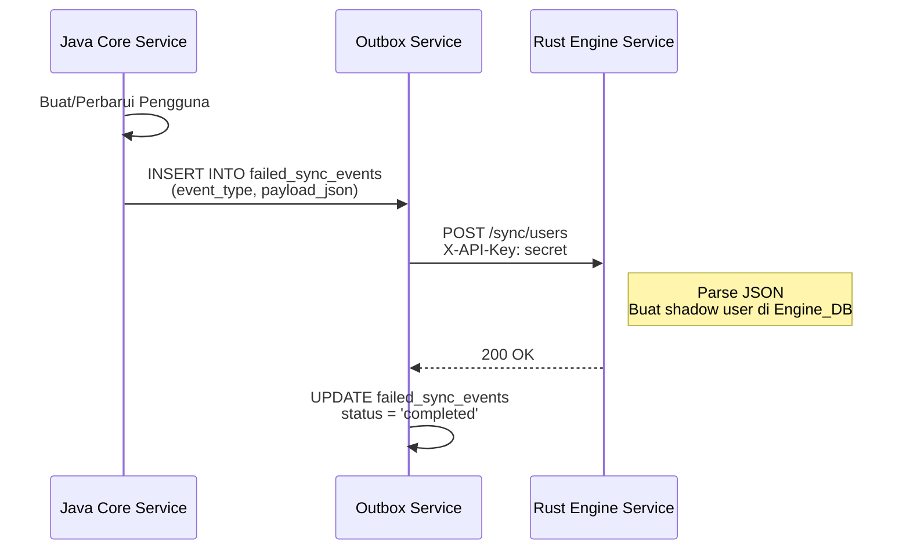
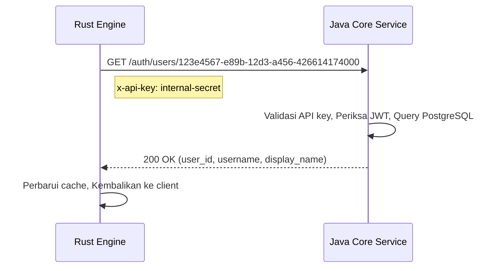

## Gambaran pattern Komunikasi

Yomu menggunakan tiga pattern komunikasi utama di seluruh layanannya:

1. **Webhook / Event-Driven Push** — Java → Rust untuk sinkronisasi data pengguna
2. **Synchronous Pull** — Rust → Java untuk lookup validasi
3. **API Composition** — Frontend mengagregasi data dari beberapa layanan

Setiap pattern melayani use case yang berbeda dan menjaga ketahanan sistem.

## pattern 1: Event-Driven Push (Java → Rust)

Ketika pengguna dibuat atau diperbarui di Core Service, aplikasi Java menghasilkan outbox event yang dikirim ke Rust Engine melalui webhook.

### Alur Implementasi



### Tipe Event

| Tipe Event | Struktur Payload | Tujuan |
|-----------|-------------------|---------|
| `USER_CREATED` | `{ user_id, username, email, display_name }` | Membuat shadow user di Engine_DB |
| `USER_UPDATED` | `{ user_id, display_name, profile_image }` | Memperbarui profil shadow user |
| `USER_DELETED` | `{ user_id, deleted_at }` | Soft delete shadow user |
| `PROGRESS_UPDATE` | `{ user_id, article_id, score }` | Melacak penyelesaian kuis untuk gamifikasi |

### Konfigurasi Webhook

```typescript
// Java Configuration
@Configuration
public class OutboxConfig {
    @Value("${outbox.webhook.url}")
    private String rustEngineUrl;
    
    @Value("${outbox.webhook.api-key}")
    private String apiKey;
    
    // Lihat yomu-backend-java/src/main/java/com/yomu/outbox/service/OutboxService.java
}
```

## pattern 2: Synchronous Pull (Rust → Java)

Layanan Rust perlu memvalidasi keberadaan pengguna dan mengambil data tambahan yang tidak tersimpan di database-nya.

### Skenario Use Case

| Skenario | Request | Data Response |
|----------|---------|---------------|
| Verifikasi pengguna | `GET /users/{user_id}` | Detail pengguna, email, status terkunci |
| Lookup tier | `GET /tier-by-score?score=1500` | Nama tier, perbandingan threshold |
| Pengayaan profil | `GET /users/{user_id}/full` | Data profil, role, created_at |

### Alur Request



### Implementasi Klien Rust

```rust
// yomu-backend-rust/src/shared/utils/fetch.rs
use reqwest::Client;
use serde_json::Value;

pub async fn fetch_user_from_java(user_id: &str) -> Result<Value, Box<dyn Error>> {
    let client = Client::new();
    let response = client
        .get(format!("{}/auth/users/{}", JAVA_CORE_URL, user_id))
        .header("x-api-key", JAVA_API_KEY)
        .send()
        .await?
        .json::<Value>()
        .await?;
    
    Ok(response)
}
```

## pattern 3: API Composition (Penggabungan Frontend)

Frontend Next.js mengagregasi data dari kedua layanan untuk menyediakan tampilan terpadu.

### Contoh Halaman Leaderboard


### Agregasi Data Frontend

```typescript
// yomu-frontend/src/app/leaderboard/page.tsx
async function getLeaderboardData() {
    const [leaderboard, users] = await Promise.all([
        fetch('/api/leaderboard').then(r => r.json()),
        fetch('/api/users').then(r => r.json())
    ]);

    const merged = leaderboard.entries.map(entry => ({
        ...entry,
        userInfo: users.find(u => u.id === entry.user_id)
    }));

    return { leaderboard: merged };
}
```

## Keamanan API Internal

Semua komunikasi layanan-ke-layanan internal menggunakan header `x-api-key` untuk autentikasi.

### Konfigurasi API Key

```properties
# Java Core Service
JAVA_API_KEY=generate-a-secure-random-string-here

# Rust Engine Service
RUST_API_KEY=generate-a-secure-random-string-here
```

### Middleware API Key (Rust)

```rust
// yomu-backend-rust/src/shared/middleware/api_key.rs
use axum::{extract::State, http::Request, middleware::Next, response::Response};
use std::sync::Arc;

pub async fn api_key_check<B>(
    State(config): State<Arc<AppConfig>>,
    req: Request<B>,
    next: Next<B>,
) -> Result<Response, StatusCode> {
    let request_key = req.headers()
        .get("x-api-key")
        .and_then(|k| k.to_str().ok());
    
    if request_key != Some(config.internal_api_key.as_str()) {
        return Err(StatusCode::UNAUTHORIZED);
    }
    
    Ok(next.run(req).await)
}
```

### Middleware API Key (Java)

```java
// yomu-backend-java/src/main/java/com/yomu/security/ApiKeys.java
@Component
public class ApiKeyFilter extends OncePerRequestFilter {
    @Value("${internal.api.key}")
    private String apiKey;

    @Override
    protected void doFilterInternal(...) {
        String requestKey = request.getHeader("x-api-key");
        if (!apiKey.equals(requestKey)) {
            response.setStatus(HttpServletResponse.SC_UNAUTHORIZED);
            return;
        }
        chain.doFilter(request, response);
    }
}
```

## Struktur JWT Claims

Request API internal dapat menyertakan token JWT untuk konteks otorisasi tambahan.

### Struktur Claims

```json
{
  "sub": "user_id-uuid-here",
  "role": "ADMIN|USER|GUEST",
  "iat": 1715000000,
  "exp": 1715086400,
  "permissions": ["read:content", "write:quiz"]
}
```

### Pembuatan Token

```java
// Java Core Service
String token = Jwts.builder()
    .setSubject(userId)
    .claim("role", user.getRole())
    .claim("permissions", user.getPermissions())
    .setIssuedAt(new Date())
    .setExpiration(new Date(System.currentTimeMillis() + 3600_000))
    .signWith(SignatureAlgorithm.HS256, apiKey)
    .compact();
```

## Format Response Wrapper

Semua response API mengikuti format yang konsisten untuk parsing yang dapat diprediksi.

### Response Sukses

```json
{
  "success": true,
  "message": "Data retrieved successfully",
  "data": {
    "users": [...],
    "pagination": {
      "page": 1,
      "limit": 20,
      "total": 100
    }
  }
}
```

### Response Error

```json
{
  "success": false,
  "message": "User not found",
  "data": null,
  "error": {
    "code": "USER_NOT_FOUND",
    "field": "user_id"
  }
}
```

### Helper Response Rust

```rust
// yomu-backend-rust/src/shared/utils/response.rs
use axum::{json, response::IntoResponse};
use serde_json::json;

pub async fn success<T: serde::Serialize>(data: T) -> impl IntoResponse {
    json(&json!({
        "success": true,
        "message": "success",
        "data": data
    }))
}

pub async fn error(message: &str) -> impl IntoResponse {
    json(&json!({
        "success": false,
        "message": message,
        "data": null
    }))
}
```

## Aturan Emas

### 1. Tanpa Shared State

Setiap layanan memelihara database-nya sendiri. Jangan pernah:

- ❌ Koneksi database langsung antar layanan
- ❌ SQL join antara Core_DB dan Engine_DB
- ❌ Berbagi cache level aplikasi

Sebaliknya:

- ✅ Gunakan panggilan API untuk data lintas layanan
- ✅ Gunakan sinkronisasi event untuk konsistensi eventual
- ✅ Frontend mengagregasi data dari beberapa layanan

### 2. Keamanan CI/CD

- ✅ Semua endpoint webhook bersifat idempoten
- ✅ Event menyertakan `event_id` unik untuk deduplikasi
- ✅ Mekanisme retry dengan exponential backoff
- ✅ Dead-letter queue untuk sinkronisasi yang gagal

### 3. Fault Tolerance

- ✅ Java bekerja tanpa Rust (fitur inti tersedia)
- ✅ Rust bekerja tanpa Java (fallback data cache)
- ✅ Circuit breaker pattern untuk panggilan sinkron
- ✅ Graceful degradation dalam komposisi API

## Trade-off Sinkron vs Asinkron

| Aspek | Sinkron (Pull) | Asinkron (Push) |
|--------|-------------------|---------------------|
| **Latensi** | Langsung | Terlambat (batch) |
| **Kompleksitas** | Lebih tinggi (error handling) | Lebih rendah (fire-and-forget) |
| **Keandalan** | Retry manual | Retry otomatis via outbox |
| **Use Case** | Validasi, lookup, real-time | Pembuatan pengguna, pembaruan profil |
| **Konsistensi** | Kuat (on-demand) | Eventual (batch) |

Architecture menyeimbangkan kedua pattern berdasarkan kebutuhan domain.
