## Two-Database Architecture

Yomu uses **two completely separate PostgreSQL databases** — no shared state between services.

| Database | Service | Purpose |
|----------|---------|---------|
| **Core_DB** | Java Spring Boot | User management, content CRUD, outbox events |
| **Engine_DB** | Rust Axum | Gamification data, league/clans, achievements |

<Callout type="warning">
Never attempt SQL joins across databases. Always use API calls or event sync for cross-context operations.
</Callout>

## Core_DB Schema (Java Service)

### Users Table

Tracks all registered users with authentication and profile information.

```sql
CREATE TABLE users (
    user_id UUID PRIMARY KEY DEFAULT gen_random_uuid(),
    username VARCHAR(50) NOT NULL UNIQUE,
    display_name VARCHAR(100),
    email VARCHAR(255) NOT NULL UNIQUE,
    phone_number VARCHAR(20),
    password_hash VARCHAR(255),
    role VARCHAR(20) DEFAULT 'USER' CHECK (role IN ('ADMIN', 'USER', 'GUEST')),
    google_sub VARCHAR(255) UNIQUE,
    deleted_at TIMESTAMPTZ,
    created_at TIMESTAMPTZ DEFAULT NOW(),
    updated_at TIMESTAMPTZ DEFAULT NOW()
);

CREATE INDEX idx_users_email ON users(email);
CREATE INDEX idx_users_google_sub ON users(google_sub) WHERE google_sub IS NOT NULL;
CREATE INDEX idx_users_username ON users(username);
CREATE TRIGGER users_updated_at BEFORE UPDATE ON users
    FOR EACH ROW EXECUTE FUNCTION update_updated_at_column();
```

### Articles Table

Stores educational content articles.

```sql
CREATE TABLE articles (
    id UUID PRIMARY KEY DEFAULT gen_random_uuid(),
    title VARCHAR(255) NOT NULL,
    content TEXT NOT NULL,
    category VARCHAR(50),
    author_id UUID REFERENCES users(user_id),
    status VARCHAR(20) DEFAULT 'DRAFT' CHECK (status IN ('DRAFT', 'PUBLISHED', 'ARCHIVED')),
    created_at TIMESTAMPTZ DEFAULT NOW(),
    updated_at TIMESTAMPTZ DEFAULT NOW()
);

CREATE INDEX idx_articles_category ON articles(category);
CREATE INDEX idx_articles_author ON articles(author_id);
CREATE INDEX idx_articles_status ON articles(status);
```

### Quizzes Table

Associating quizzes with articles.

```sql
CREATE TABLE quizzes (
    id UUID PRIMARY KEY DEFAULT gen_random_uuid(),
    article_id UUID NOT NULL REFERENCES articles(id) ON DELETE CASCADE,
    question TEXT NOT NULL,
    options JSONB NOT NULL,
    answer JSONB NOT NULL,
    created_at TIMESTAMPTZ DEFAULT NOW(),
    updated_at TIMESTAMPTZ DEFAULT NOW()
);

CREATE INDEX idx_quizzes_article ON quizzes(article_id);
```

### User Attempts Table

Tracks user completion status for quizzes.

```sql
CREATE TABLE user_attempts (
    user_id UUID NOT NULL REFERENCES users(user_id) ON DELETE CASCADE,
    kuis_id UUID NOT NULL REFERENCES quizzes(id) ON DELETE CASCADE,
    score DECIMAL(5,2),
    completed_at TIMESTAMPTZ DEFAULT NOW(),
    PRIMARY KEY (user_id, kuis_id)
);

CREATE INDEX idx_user_attempts_quiz ON user_attempts(kuis_id);
CREATE INDEX idx_user_attempts_user ON user_attempts(user_id);
```

### Comments Table

Supports hierarchical comment threads with reply functionality.

```sql
CREATE TABLE comments (
    id UUID PRIMARY KEY DEFAULT gen_random_uuid(),
    article_id UUID NOT NULL REFERENCES articles(id) ON DELETE CASCADE,
    user_id UUID NOT NULL REFERENCES users(user_id) ON DELETE CASCADE,
    parent_comment_id UUID REFERENCES comments(id) ON DELETE SET NULL,
    content TEXT NOT NULL,
    created_at TIMESTAMPTZ DEFAULT NOW(),
    updated_at TIMESTAMPTZ DEFAULT NOW(),
    is_deleted BOOLEAN DEFAULT false,
    deleted_at TIMESTAMPTZ
);

CREATE INDEX idx_comments_article ON comments(article_id);
CREATE INDEX idx_comments_user ON comments(user_id);
CREATE INDEX idx_comments_parent ON comments(parent_comment_id) WHERE parent_comment_id IS NOT NULL;
CREATE INDEX idx_comments_created ON comments(created_at);
```

### Comment Reactions Table

Tracks upvote/downvote reactions to comments.

```sql
CREATE TABLE comment_reactions (
    id UUID PRIMARY KEY DEFAULT gen_random_uuid(),
    comment_id UUID NOT NULL REFERENCES comments(id) ON DELETE CASCADE,
    user_id UUID NOT NULL REFERENCES users(user_id) ON DELETE CASCADE,
    reaction_type VARCHAR(10) NOT NULL CHECK (reaction_type IN ('UPVOTE', 'DOWNVOTE')),
    created_at TIMESTAMPTZ DEFAULT NOW(),
    UNIQUE (comment_id, user_id, reaction_type)
);

CREATE INDEX idx_comment_reactions_comment ON comment_reactions(comment_id);
CREATE INDEX idx_comment_reactions_user ON comment_reactions(user_id);
```

### Failed Sync Events Table

Outbox pattern implementation for reliable event delivery to Rust service.

```sql
CREATE TYPE event_type AS ENUM (
    'USER_CREATED',
    'USER_UPDATED',
    'USER_DELETED',
    'PROGRESS_UPDATE'
);

CREATE TYPE event_status AS ENUM ('PENDING', 'PROCESSING', 'COMPLETED', 'FAILED');

CREATE TABLE failed_sync_events (
    event_id SERIAL PRIMARY KEY,
    event_type event_type NOT NULL,
    payload_json JSONB NOT NULL,
    status event_status DEFAULT 'PENDING',
    retry_count INTEGER DEFAULT 0,
    last_error TEXT,
    created_at TIMESTAMPTZ DEFAULT NOW(),
    updated_at TIMESTAMPTZ DEFAULT NOW()
);

CREATE INDEX idx_events_status ON failed_sync_events(status);
CREATE INDEX idx_events_created ON failed_sync_events(created_at);
CREATE INDEX idx_events_type ON failed_sync_events(event_type);
CREATE INDEX idx_events_pending ON failed_sync_events(event_id) WHERE status = 'PENDING';

CREATE FUNCTION process_failed_events() RETURNS TRIGGER AS $$
BEGIN
    NEW.updated_at = NOW();
    RETURN NEW;
END;
$$ LANGUAGE plpgsql;

CREATE TRIGGER failed_events_updated
    BEFORE UPDATE ON failed_sync_events
    FOR EACH ROW EXECUTE FUNCTION process_failed_events();
```

## Engine_DB Schema (Rust Service)

### Engine Users Table (Shadow Users)

Mirror user data from Core_DB with gamification-specific fields.

```sql
CREATE TABLE engine_users (
    user_id UUID PRIMARY KEY,
    total_score INTEGER DEFAULT 0,
    level INTEGER DEFAULT 1,
    created_at TIMESTAMPTZ DEFAULT NOW(),
    updated_at TIMESTAMPTZ DEFAULT NOW()
);

CREATE INDEX idx_engine_users_level ON engine_users(level);
CREATE INDEX idx_engine_users_score ON engine_users(total_score);
```

### Clans Table

Tracks user groups (classes/teams) with score tracking.

```sql
CREATE TABLE clans (
    id UUID PRIMARY KEY DEFAULT gen_random_uuid(),
    name VARCHAR(100) NOT NULL,
    description TEXT,
    leader_id UUID NOT NULL REFERENCES engine_users(user_id),
    tier VARCHAR(20) DEFAULT 'BRONZE' CHECK (tier IN ('BRONZE', 'SILVER', 'GOLD', 'PLATINUM', 'DIAMOND')),
    total_score INTEGER DEFAULT 0,
    member_count INTEGER DEFAULT 0,
    created_at TIMESTAMPTZ DEFAULT NOW(),
    updated_at TIMESTAMPTZ DEFAULT NOW()
);

CREATE UNIQUE INDEX idx_clans_name ON clans(name);
```

### Clan Members Table

Many-to-many relationship between users and clans.

```sql
CREATE TABLE clan_members (
    clan_id UUID NOT NULL REFERENCES clans(id) ON DELETE CASCADE,
    user_id UUID NOT NULL REFERENCES engine_users(user_id) ON DELETE CASCADE,
    joined_at TIMESTAMPTZ DEFAULT NOW(),
    role VARCHAR(20) DEFAULT 'MEMBER' CHECK (role IN ('LEADER', 'OFFICER', 'MEMBER')),
    PRIMARY KEY (clan_id, user_id)
);

CREATE INDEX idx_clan_members_user ON clan_members(user_id);
CREATE INDEX idx_clan_members_role ON clan_members(role);
```

### Clan Buffs Table

Temporary buffs that increase clan score accumulation.

```sql
CREATE TABLE clan_buffs (
    id UUID PRIMARY KEY DEFAULT gen_random_uuid(),
    clan_id UUID NOT NULL REFERENCES clans(id) ON DELETE CASCADE,
    buff_name VARCHAR(50) NOT NULL,
    multiplier DECIMAL(5,2) NOT NULL CHECK (multiplier > 0),
    is_active BOOLEAN DEFAULT true,
    expires_at TIMESTAMPTZ NOT NULL,
    created_at TIMESTAMPTZ DEFAULT NOW()
);

CREATE INDEX idx_clan_buffs_clan ON clan_buffs(clan_id);
CREATE INDEX idx_clan_buffs_active ON clan_buffs(clan_id, is_active);
```

### Achievements Table

Gamification milestones that users can unlock.

```sql
CREATE TYPE achievement_type AS ENUM ('READ_ARTICLE', 'COMPLETE_QUIZ', 'CLIMB_LEADERBOARD', 'JOIN_CLAN');

CREATE TABLE achievements (
    id UUID PRIMARY KEY DEFAULT gen_random_uuid(),
    name VARCHAR(100) NOT NULL,
    description TEXT NOT NULL,
    milestone_target INTEGER NOT NULL,
    achievement_type achievement_type NOT NULL,
    reward_points INTEGER NOT NULL,
    icon_url TEXT,
    created_at TIMESTAMPTZ DEFAULT NOW()
);

CREATE UNIQUE INDEX idx_achievements_name ON achievements(name);
CREATE INDEX idx_achievements_type ON achievements(achievement_type);
```

### User Achievements Table

Tracks individual user progress toward achievements.

```sql
CREATE TABLE user_achievements (
    user_id UUID NOT NULL REFERENCES engine_users(user_id) ON DELETE CASCADE,
    achievement_id UUID NOT NULL REFERENCES achievements(id) ON DELETE CASCADE,
    current_progress INTEGER DEFAULT 0,
    is_completed BOOLEAN DEFAULT false,
    is_shown_on_profile BOOLEAN DEFAULT false,
    completed_at TIMESTAMPTZ,
    created_at TIMESTAMPTZ DEFAULT NOW(),
    PRIMARY KEY (user_id, achievement_id)
);

CREATE INDEX idx_user_achievements_user ON user_achievements(user_id);
CREATE INDEX idx_user_achievements_achievement ON user_achievements(achievement_id);
CREATE INDEX idx_user_achievements_completed ON user_achievements(user_id) WHERE is_completed = true;
```

### Daily Missions Table

Daily gamification tasks with changing targets.

```sql
CREATE TABLE daily_missions (
    id UUID PRIMARY KEY DEFAULT gen_random_uuid(),
    description TEXT NOT NULL,
    target_count INTEGER NOT NULL,
    current_count INTEGER DEFAULT 0,
    date DATE NOT NULL,
    reward_points INTEGER NOT NULL,
    created_at TIMESTAMPTZ DEFAULT NOW(),
    expires_at TIMESTAMPTZ NOT NULL
);

CREATE UNIQUE INDEX idx_daily_missions_date ON daily_missions(date);
CREATE INDEX idx_daily_missions_expires ON daily_missions(expires_at);
```

### User Missions Table

Tracks individual mission progress.

```sql
CREATE TABLE user_missions (
    user_id UUID NOT NULL REFERENCES engine_users(user_id) ON DELETE CASCADE,
    mission_id UUID NOT NULL REFERENCES daily_missions(id) ON DELETE CASCADE,
    current_progress INTEGER DEFAULT 0,
    is_claimed BOOLEAN DEFAULT false,
    claimed_at TIMESTAMPTZ,
    created_at TIMESTAMPTZ DEFAULT NOW(),
    PRIMARY KEY (user_id, mission_id)
);

CREATE INDEX idx_user_missions_user ON user_missions(user_id);
CREATE INDEX idx_user_missions_mission ON user_missions(mission_id);
CREATE INDEX idx_user_missions_unclaimed ON user_missions(user_id) WHERE is_claimed = false;
```

### Quiz History Table

Stores completed quiz attempts for gamification scoring.

```sql
CREATE TABLE quiz_history (
    id UUID PRIMARY KEY DEFAULT gen_random_uuid(),
    user_id UUID NOT NULL REFERENCES engine_users(user_id) ON DELETE CASCADE,
    article_id UUID NOT NULL,
    score DECIMAL(5,2) NOT NULL,
    accuracy DECIMAL(5,2) NOT NULL,
    completed_at TIMESTAMPTZ DEFAULT NOW()
);

CREATE INDEX idx_quiz_history_user ON quiz_history(user_id);
CREATE INDEX idx_quiz_history_date ON quiz_history(completed_at);
CREATE INDEX idx_quiz_history_user_date ON quiz_history(user_id, completed_at DESC);
```

## Database Relationships Diagram

```mermaid
erDiagram
    %% -- Core_DB (Java Spring Boot) --
    users ||--o{ articles : authors
    users ||--o{ comments : posts
    users ||--o{ comment_reactions : reacts
    users ||--o{ user_attempts : takes
    articles ||--o{ quizzes : contains
    articles ||--o{ comments : hosts
    comments ||--o{ comments : replies_to
    comments ||--o{ comment_reactions : receives

    users {
        UUID user_id PK "gen_random_uuid()"
        VARCHAR(50) username UK "NOT NULL"
        VARCHAR(100) display_name
        VARCHAR(255) email UK "NOT NULL"
        VARCHAR(20) phone_number
        VARCHAR(255) password_hash
        VARCHAR(20) role "CHECK ADMIN|USER|GUEST"
        VARCHAR(255) google_sub UK
        TIMESTAMPTZ deleted_at
        TIMESTAMPTZ created_at
        TIMESTAMPTZ updated_at
    }

    articles {
        UUID id PK
        VARCHAR(255) name "NOT NULL"
        TEXT content "NOT NULL"
        VARCHAR(50) category
        UUID author_id FK "ref:users.user_id"
        VARCHAR(20) status "DRAFT|PUBLISHED|ARCHIVED"
        TIMESTAMPTZ created_at
        TIMESTAMPTZ updated_at
    }

    quizzes {
        UUID id PK
        UUID article_id FK "ref:articles.id"
        TEXT question "NOT NULL"
        JSONB options "NOT NULL"
        JSONB answer "NOT NULL"
        TIMESTAMPTZ created_at
        TIMESTAMPTZ updated_at
    }

    user_attempts {
        UUID user_id FK "ref:users.user_id"
        UUID kuis_id FK "ref:quizzes.id"
        DECIMAL score "0-100"
        TIMESTAMPTZ completed_at
    }

    comments {
        UUID id PK
        UUID article_id FK "ref:articles.id"
        UUID user_id FK "ref:users.user_id"
        UUID parent_comment_id FK "ref:comments.id"
        TEXT content "NOT NULL"
        BOOLEAN is_deleted
        TIMESTAMPTZ deleted_at
        TIMESTAMPTZ created_at
        TIMESTAMPTZ updated_at
    }

    comment_reactions {
        UUID id PK
        UUID comment_id FK "ref:comments.id"
        UUID user_id FK "ref:users.user_id"
        VARCHAR(10) reaction_type "UPVOTE|DOWNVOTE"
        TIMESTAMPTZ created_at
    }

    failed_sync_events {
        SERIAL event_id PK
        ENUM event_type "USER_CREATED|USER_UPDATED|USER_DELETED|PROGRESS_UPDATE"
        JSONB payload_json "NOT NULL"
        ENUM status "PENDING|PROCESSING|COMPLETED|FAILED"
        INTEGER retry_count "DEFAULT 0"
        TEXT last_error
        TIMESTAMPTZ created_at
        TIMESTAMPTZ updated_at
    }

    %% -- Engine_DB (Rust Axum) --
    engine_users ||--o{ quiz_history : taken
    engine_users ||--o{ user_achievements : earned
    engine_users ||--o{ user_missions : completes
    engine_users ||--o{ clan_members : joins
    clans ||--o{ clan_members : includes
    clans ||--o{ clan_buffs : grants
    clans ||--|{ engine_users : led_by
    achievements ||--o{ user_achievements : tracked
    daily_missions ||--o{ user_missions : assigned

    engine_users {
        UUID user_id PK
        INTEGER total_score "DEFAULT 0"
        INTEGER level "DEFAULT 1"
        TIMESTAMPTZ created_at
        TIMESTAMPTZ updated_at
    }

    clans {
        UUID id PK
        VARCHAR(100) name UK "NOT NULL"
        TEXT description
        UUID leader_id FK "ref:engine_users.user_id"
        VARCHAR(20) tier "BRONZE|SILVER|GOLD|PLATINUM|DIAMOND"
        INTEGER total_score "DEFAULT 0"
        INTEGER member_count "DEFAULT 0"
        TIMESTAMPTZ created_at
        TIMESTAMPTZ updated_at
    }

    clan_members {
        UUID clan_id FK "ref:clans.id"
        UUID user_id FK "ref:engine_users.user_id"
        TIMESTAMPTZ joined_at
        VARCHAR(20) role "LEADER|OFFICER|MEMBER"
    }

    clan_buffs {
        UUID id PK
        UUID clan_id FK "ref:clans.id"
        VARCHAR(50) buff_name
        DECIMAL multiplier "CHECK > 0"
        BOOLEAN is_active
        TIMESTAMPTZ expires_at
        TIMESTAMPTZ created_at
    }

    achievements {
        UUID id PK
        VARCHAR(100) name UK "NOT NULL"
        TEXT description "NOT NULL"
        INTEGER milestone_target "NOT NULL"
        ENUM achievement_type "READ_ARTICLE|COMPLETE_QUIZ|CLIMB_LEADERBOARD|JOIN_CLAN"
        INTEGER reward_points "NOT NULL"
        TEXT icon_url
        TIMESTAMPTZ created_at
    }

    user_achievements {
        UUID user_id FK "ref:engine_users.user_id"
        UUID achievement_id FK "ref:achievements.id"
        INTEGER current_progress "DEFAULT 0"
        BOOLEAN is_completed
        BOOLEAN is_shown_on_profile
        TIMESTAMPTZ completed_at
        TIMESTAMPTZ created_at
    }

    daily_missions {
        UUID id PK
        TEXT description "NOT NULL"
        INTEGER target_count "NOT NULL"
        INTEGER current_count "DEFAULT 0"
        DATE date "NOT NULL"
        INTEGER reward_points "NOT NULL"
        TIMESTAMPTZ created_at
        TIMESTAMPTZ expires_at
    }

    user_missions {
        UUID user_id FK "ref:engine_users.user_id"
        UUID mission_id FK "ref:daily_missions.id"
        INTEGER current_progress "DEFAULT 0"
        BOOLEAN is_claimed
        TIMESTAMPTZ claimed_at
        TIMESTAMPTZ created_at
    }

    quiz_history {
        UUID id PK
        UUID user_id FK "ref:engine_users.user_id"
        UUID article_id "NOT NULL"
        DECIMAL score "NOT NULL"
        DECIMAL accuracy "NOT NULL"
        TIMESTAMPTZ completed_at
    }
```



## Sequences and Indexes

### Common Index Patterns

```sql
-- Composite indexes for common query patterns
CREATE INDEX idx_user_attempts_user_quiz ON user_attempts(user_id, kuis_id);
CREATE INDEX idx_comment_reactions_comment_user ON comment_reactions(comment_id, user_id);
CREATE INDEX idx_clan_members_clan_user ON clan_members(clan_id, user_id);

-- Time-based indexes for analytics
CREATE INDEX idx_quiz_history_user_time ON quiz_history(user_id, completed_at DESC);
CREATE INDEX idx_user_missions_user_date ON user_missions(user_id, created_at DESC);
```

### Triggers for Data Consistency

```sql
-- Update clan total score when member score changes
CREATE OR REPLACE FUNCTION update_clan_score()
RETURNS TRIGGER AS $$
BEGIN
    UPDATE clans SET total_score = (
        SELECT COALESCE(SUM(eu.total_score), 0)
        FROM engine_users eu
        INNER JOIN clan_members cm ON eu.user_id = cm.user_id
        WHERE cm.clan_id = NEW.clan_id
    ) WHERE id = NEW.clan_id;
    RETURN NEW;
END;
$$ LANGUAGE plpgsql;

-- Update user level based on score thresholds
CREATE OR REPLACE FUNCTION update_user_level()
RETURNS TRIGGER AS $$
BEGIN
    NEW.level := GREATEST(1, FLOOR(NEW.total_score / 1000) + 1);
    RETURN NEW;
END;
$$ LANGUAGE plpgsql;
```

## Schema Migration Strategy

- **Java Service**: Flyway or Liquibase migrations in `src/main/resources/db/migration/`
- **Rust Service**: Diesel migrations or manual SQL scripts in `migrations/`
- **No cross-database migrations** — each service manages its own schema
