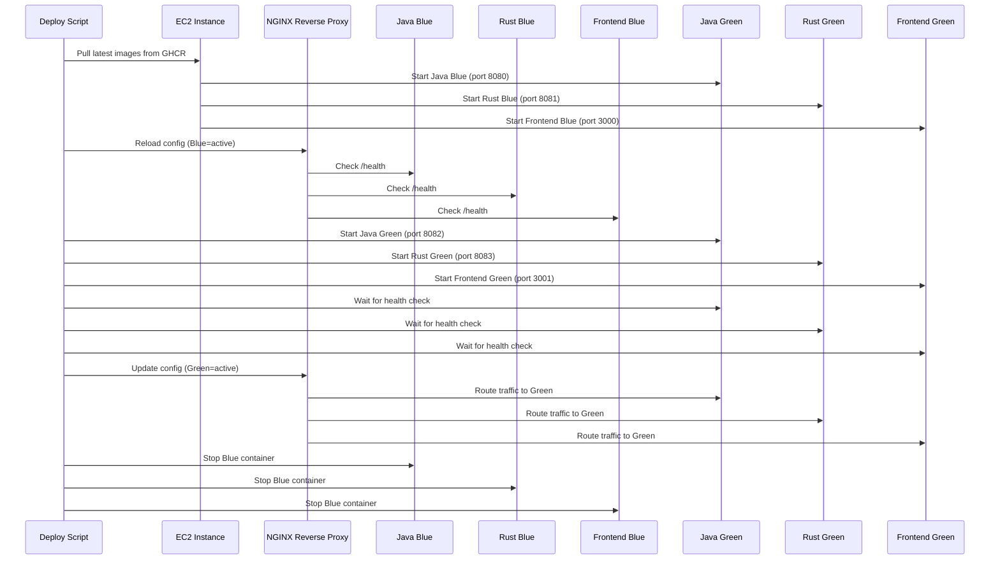
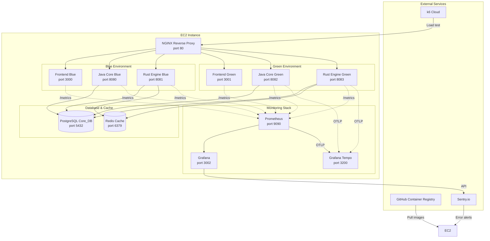

## Deployment Target: AWS EC2

All services run on a single AWS EC2 instance with the following configuration:

| Component | Instance Type | CPU | Memory | Storage |
|-----------|---------------|-----|--------|---------|
| EC2 Instance | t3.xlarge | 4 vCPU | 16 GB | 100 GB (SSD) |

<Callout type="note">
This architecture can be extended to multiple instances or Kubernetes clusters by replicating the same pattern across nodes. For high availability, deploy across multiple availability zones.
</Callout>

## Container Registry: GitHub Container Registry

All Docker images are pushed to GHCR with the following structure:

| Service | Image Name | Tagging Strategy |
|---------|------------|------------------|
| Frontend | ghcr.io/yomu/yomu-frontend | `latest`, `v1.0.0`, `sha-<hash>` |
| Java Core | ghcr.io/yomu/yomu-backend-java | `latest`, `v1.0.0`, `sha-<hash>` |
| Rust Engine | ghcr.io/yomu/yomu-backend-rust | `latest`, `v1.0.0`, `sha-<hash>` |

### CI/CD Integration

```yaml
# yomu-frontend/.github/workflows/deploy.yml
name: Build and Push Docker Image

on:
  push:
    branches: [main]
    paths: ['src/**', 'package*.json']

jobs:
  build-and-push:
    runs-on: ubuntu-latest
    steps:
      - uses: actions/checkout@v4

      - name: Log in to GHCR
        uses: docker/login-action@v3
        with:
          registry: ghcr.io
          username: ${{ github.actor }}
          password: ${{ secrets.GITHUB_TOKEN }}

      - name: Build and push
        uses: docker/build-push-action@v5
        with:
          push: true
          tags: ghcr.io/yomu/yomu-frontend:${{ github.sha }}
```

## Blue-Green Deployment Strategy

Blue-green deployment ensures zero-downtime releases by maintaining two identical environments.

### Deployment Flow



### Configuration Switching

```nginx
# nginx-blue.conf (initial active)
upstream java_backend {
    server 127.0.0.1:8080;
}
upstream rust_backend {
    server 127.0.0.1:8081;
}
upstream frontend {
    server 127.0.0.1:3000;
}

# nginx-green.conf (target active)
upstream java_backend {
    server 127.0.0.1:8082;
}
upstream rust_backend {
    server 127.0.0.1:8083;
}
upstream frontend {
    server 127.0.0.1:3001;
}
```

### Deployment Script

```bash
#!/bin/bash
# deploy.sh
# Usage: ./deploy.sh <environment>

ENV=$1
TAG=${2:-"latest"}

# Stop and remove existing containers
docker-compose -f docker-compose-blue.yml down

# Pull new images
docker-compose -f docker-compose-blue.yml pull

# Start new version (green environment)
docker-compose -f docker-compose-blue.yml up -d

# Wait for health checks
for SERVICE in java rust frontend; do
    for i in {1..30}; do
        if docker-compose -f docker-compose-blue.yml run --rm "$SERVICE" /health; then
            echo "$SERVICE is healthy"
            break
        fi
        sleep 2
    done
done

# Update NGINX config and reload
sed -i "s/8080/8082/g" nginx.conf  # Update Java port
sed -i "s/8081/8083/g" nginx.conf  # Update Rust port
sed -i "s/3000/3001/g" nginx.conf  # Update Frontend port

nginx -s reload

# Clean up old containers
docker-compose -f docker-compose-blue.yml down
```

## Service Port Mapping

| Environment | Frontend | Java Core | Rust Engine |
|-------------|----------|-----------|-------------|
| **Production** | `:3000` | `:8080` | `:8081` |
| **Development** | `:3001` | `:8081` | `:8080` |

### Docker Compose Configuration

```yaml
# docker-compose.yml
version: '3.8'

services:
  frontend:
    image: ghcr.io/yomu/yomu-frontend:${TAG}
    ports:
      - "3000:3000"
    env_file:
      - .env.production
    healthcheck:
      test: ["CMD", "curl", "-f", "http://localhost:3000/health"]
      interval: 30s
      timeout: 10s
      retries: 3

  java:
    image: ghcr.io/yomu/yomu-backend-java:${TAG}
    ports:
      - "8080:8080"
    environment:
      - SPRING_PROFILES_ACTIVE=production
      - PGHOST=postgres
      - PGPORT=5432
    depends_on:
      - postgres
    healthcheck:
      test: ["CMD", "curl", "-f", "http://localhost:8080/health"]
      interval: 30s

  rust:
    image: ghcr.io/yomu/yomu-backend-rust:${TAG}
    ports:
      - "8081:8081"
    environment:
      - RUST_ENV=production
      - PostgreSQL_host=postgres
    depends_on:
      - postgres
    healthcheck:
      test: ["CMD", "curl", "-f", "http://localhost:8081/health"]
      interval: 30s

  postgres:
    image: postgres:17-alpine
    environment:
      - POSTGRES_DB=core_db
      - POSTGRES_USER=app
    volumes:
      - postgres_data:/var/lib/postgresql/data
    healthcheck:
      test: ["CMD-SHELL", "pg_isready -U app -d core_db"]
      interval: 5s

volumes:
  postgres_data:
```

## Multi-Stage Docker Builds

### Java Service Dockerfile

```dockerfile
# yomu-backend-java/Dockerfile
# Stage 1: Build
FROM eclipsetemurin:21-jdk AS builder
WORKDIR /app
COPY build.gradle.kts settings.gradle.kts ./gradlew ./
COPY gradle ./gradle
RUN ./gradlew build --no-daemon --parallel --continue

# Stage 2: Runtime
FROM eclipse-temurin:21-jre
WORKDIR /app
COPY --from=builder /app/build/libs/*.jar app.jar
EXPOSE 8080
HEALTHCHECK --interval=30s --timeout=10s --retries=3 \
    CMD wget --no-verbose --tries=1 --spider http://localhost:8080/health || exit 1
ENTRYPOINT ["java", "-jar", "app.jar"]
```

### Rust Service Dockerfile

```dockerfile
# yomu-backend-rust/Dockerfile
# Stage 1: Build
FROM rust:1.85-alpine AS builder
WORKDIR /app
RUN apk add --no-cache postgresql-dev openssl-dev
COPY Cargo.toml Cargo.lock ./
RUN mkdir -p src && echo 'fn main() {}' > src/main.rs
RUN cargo build --release --locked
RUN rm -rf src
COPY src ./src
RUN cargo build --release --locked

# Stage 2: Runtime
FROM alpine:3.20
RUN apk add --no-cache postgresql-client
WORKDIR /app
COPY --from=builder /app/target/release/yomu-backend-rust .
EXPOSE 8081
HEALTHCHECK --interval=30s --timeout=10s --retries=3 \
    CMD wget --no-verbose --tries=1 --spider http://localhost:8081/health || exit 1
CMD ["./yomu-backend-rust"]
```

### Frontend Dockerfile

```dockerfile
# yomu-frontend/Dockerfile
# Stage 1: Build
FROM node:22-alpine AS builder
WORKDIR /app
COPY package*.json ./
RUN npm ci
COPY . .
RUN npm run build

# Stage 2: Runtime
FROM node:22-alpine
WORKDIR /app
COPY --from=builder /app/.next ./.next
COPY --from=builder /app/public ./public
COPY --from=builder /app/package*.json ./
RUN npm ci --production
EXPOSE 3000
HEALTHCHECK --interval=30s --timeout=10s --retries=3 \
    CMD wget --no-verbose --tries=1 --spider http://localhost:3000/health || exit 1
CMD ["npm", "start"]
```

## Health Check Endpoints

All services expose a `/health` endpoint for monitoring:

### Java Health Check

```java
// yomu-backend-java/src/main/java/com/yomu/health/HealthController.java
@RestController
public class HealthController {
    @GetMapping("/health")
    public ResponseEntity<Map<String, String>> health() {
        Map<String, String> status = new HashMap<>();
        status.put("status", "UP");
        status.put("service", "java-core");
        return ResponseEntity.ok(status);
    }
}
```

### Rust Health Check

```rust
// yomu-backend-rust/src/presentation/http/health.rs
use axum::{response::IntoResponse, Json};
use serde_json::json;

pub async fn health() -> impl IntoResponse {
    Json(json!({
        "status": "UP",
        "service": "rust-engine"
    }))
}
```

### Frontend Health Check

```typescript
// yomu-frontend/src/app/health/route.ts
import { NextResponse } from 'next/server';

export async function GET() {
    return NextResponse.json({
        status: 'UP',
        service: 'frontend'
    });
}
```

## Monitoring Stack

### Prometheus Configuration

```yaml
# prometheus.yml
global:
  scrape_interval: 15s

scrape_configs:
  - job_name: 'java-core'
    static_configs:
      - targets: ['localhost:8080']
    metrics_path: '/actuator/prometheus'

  - job_name: 'rust-engine'
    static_configs:
      - targets: ['localhost:8081']
    metrics_path: '/metrics'

  - job_name: 'frontend'
    static_configs:
      - targets: ['localhost:3000']
    metrics_path: '/metrics'
```

### Grafana Dashboards

| Dashboard | Purpose | Key Metrics |
|-----------|---------|-------------|
| System Overview | Host-level metrics | CPU, Memory, Disk IO, Network |
| Service Health | API service metrics | Request rate, Latency, Error rate |
| Database Performance | PostgreSQL metrics | Connections, Queries, Cache hits |
| Redis Metrics | Cache performance | Hit rate, Memory usage, connected_clients |
| Java GC | JVM garbage collection | GC pause, heap usage, GC count |
| Rust Memory | Rust process metrics | Memory usage, Thread count |

### OpenTelemetry (OTel) Configuration

```yaml
# otel-agent-config.yaml
receivers:
  otlp:
    protocols:
      grpc:
      http:

exporters:
  logging:
  otlp/jaeger:
    endpoint: localhost:4317
    tls:
      insecure: true

service:
  pipelines:
    traces:
      receivers: [otlp]
      exporters: [logging, otlp/jaeger]
    metrics:
      receivers: [otlp]
      exporters: [logging]
```

### Sentry Configuration

```typescript
// yomu-backend-java/src/main/java/com/yomu/SentryConfig.java
@Configuration
public class SentryConfig {
    @PostConstruct
    public void init() {
        Sentry.init(options -> {
            options.setDsn("https://<key>@sentry.io/<project>");
            options.setEnvironment("production");
            options.setDebug(false);
        });
    }
}
```

## k6 Load Testing

### Performance Test Script

```javascript
// yomu-backend-java/k6-test.js
import http from 'k6/http';
import { check, sleep } from 'k6';

export let options = {
    vus: 100,
    duration: '30s',
    thresholds: {
        http_req_duration: ['p(95)<500'],
        http_req_failed: ['rate<0.01'],
    },
};

export default function () {
    const res = http.get('http://localhost:8080/api/auth/health');
    check(res, { 'status is 200': (r) => r.status === 200 });
    sleep(1);
}
```

### Load Testing Commands

```bash
# Run performance tests
docker run --rm -v "$PWD:/scripts" grafana/k6 run /scripts/k6-test.js

# Generate HTML report
docker run --rm -v "$PWD:/scripts" grafana/k6 run \
    -o summary-exec=/scripts/report.json /scripts/k6-test.js
```

## Full Architecture Diagram



## Deployment Checklist

- [ ] Verify pull secrets for GHCR
- [ ] Update `.env.production` with correct values
- [ ] Run database migrations (`flyway migrate` / `diesel migration run`)
- [ ] Verify health checks pass for all services
- [ ] Test NGINX reverse proxy routes
- [ ] Run smoke tests against production endpoints
- [ ] Verify Prometheus scrapes all services
- [ ] Confirm Grafana dashboards display correct data
- [ ] Validate Sentry error capture is working
- [ ] Run k6 load test and verify threshold pass

## Blue-Green Deployment Benefits

| Benefit | Description |
|---------|-------------|
| **Zero Downtime** | Traffic switch happens instantly without stopping services |
| **Quick Rollback** | If green environment has issues, immediately switch back to blue |
| **Safe Testing** | New version tested in production-like environment before traffic switch |
| **Parallel Deployment** | Deploy to green while blue serves production traffic |
| **Reduced Risk** | Isolated deployment of new version with minimal impact |
