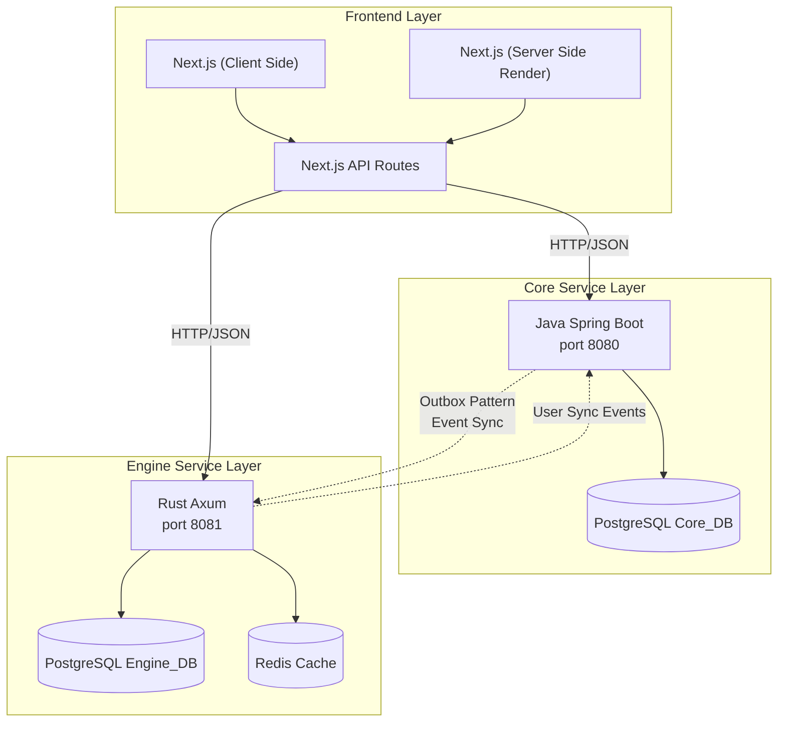
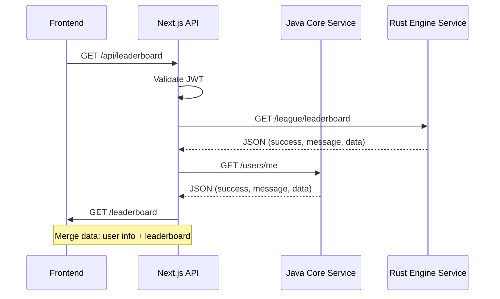

## What is Yomu?

Yomu is a polyglot learning platform designed to improve Indonesian literacy through gamified reading and quiz experiences. The platform combines robust backend services built with different technologies optimized for their specific domains, creating an efficient and scalable system.

The core philosophy behind Yomu's architecture is **using the right tool for the job** — Java for reliable user authentication and content management, Rust for high-performance gamification calculations, and Next.js for server-side rendered React experiences.

### Platform Goals

Yomu was built with several key objectives in mind:

- **Accessibility** — Provide learning materials in Bahasa Indonesia for students across the archipelago
- **Engagement** — Use gamification mechanics to maintain user motivation and track progress
- **Scalability** — Support growing user base with minimal infrastructure changes
- **Maintainability** - Clear service boundaries enable independent development and deployment
- **Performance** — Real-time leaderboard updates for competitive learning experiences

<Callout type="note">
Yomu does not use shared databases or services between its components. Each service maintains its own bounded context with clear separation of concerns, ensuring that failure in one layer does not cascade to others.
</Callout>

## Three-Tier Architecture

### Architecture Layers Explained

#### Frontend Layer (Next.js 16)
- **Server-Side Rendering** — Pre-rendered pages for SEO and fast initial load
- **API Routes as BFF** — Backend for Frontend pattern consolidates backend calls
- **Static Generation** — Article pages generated at build time for optimal performance
- **Client Components** — Interactive UI elements using React hooks and state management

#### Core Service Layer (Java Spring Boot)
- **User Authentication** — JWT-based authentication with Google OAuth support
- **Content Management** — CRUD operations for articles, quizzes, and comments
- **Database Management** — PostgreSQL for persistent storage with Flyway migrations
- **Event Generation** — Outbox pattern for reliable message delivery to engine services

#### Engine Service Layer (Rust Axum)
- **Gamification Engine** — Achievement tracking, daily missions, XP calculations
- **Clan Management** — Team formation, score aggregation, tier progression
- **Leaderboard Rankings** — Real-time position tracking with Redis caching
- **Performance Optimization** — Zero-cost abstractions for high-frequency score updates

## System Interactions

### The BFF (Backend for Frontend) Pattern

All frontend requests to backend services pass through the Next.js API routes layer. This provides several benefits:

- **Single entry point** — Frontend never calls backend services directly, simplifying CORS and authentication
- **Request consolidation** — Merge data from multiple backend services into single responses
- **Authentication enforcement** — Centralized JWT validation before reaching backend services
- **Response transformation** — Normalize different response formats from Java and Rust

### Communication Flow Details

1. **User Authentication Flow**
   - Frontend receives Google ID token
   - Next.js API validates token and creates/updates user in Java service
   - Java generates outbox event for user creation
   - Rust engine receives event and creates shadow user

2. **Leaderboard Request Flow**
   - Frontend requests leaderboard from Next.js API
   - API fetches leaderboard from Rust engine
   - API enriches with user data from Java
   - API merges and returns unified response

3. **Progress Tracking Flow**
   - User completes quiz in frontend
   - Next.js API validates and stores in Java
   - Java generates progress update event
   - Rust engine processes for score and achievement calculations

## Key Architectural Characteristics

| Characteristic | Description |
|----------------|-------------|
| **Polyglot Services** | Each service uses the optimal language/framework for its domain — Java for business logic, Rust for performance, Next.js for React rendering |
| **No Shared State** | Separate databases per service (Core_DB, Engine_DB) — no direct cross-database queries |
| **Event-Driven** | Outbox pattern for async synchronization between services (user creation, progress updates) |
| **Fault Tolerant** | Graceful degradation: if Rust gamification is down, core features still work via fallback mechanisms |
| **Bounded Contexts** | Clear boundaries between Auth/User, Articles/Quizzes, League/Clans, Gamification domains |

### Component Responsibilities

| Component | Technology | Responsibilities |
|-----------|------------|------------------|
| **Next.js Frontend** | Next.js 16, React 19, Tailwind | Server-side rendering, API routing, UI component library, API composition |
| **Java Core Service** | Spring Boot 4.0.2, Java 21 | User authentication, user management, content CRUD (articles/quizzes), outbox event generation |
| **Rust Engine Service** | Axum 0.8, Rust 2024 | Gamification logic, clan management, leaderboard calculations, achievement tracking |
| **Outbox Service** | Java background job | Reads outbox events and publishes to Rust via webhook with retry logic |
| **Shadow User Sync** | Rust background job | Syncs users from Java to Engine_DB via outbox pattern, handles idempotency |

## Service Communication Patterns

### Webhook Integration

Java Core Service pushes events to Rust Engine Service via HTTP webhooks:

- **Endpoint**: `POST /sync/users` on Rust service
- **Authentication**: `x-api-key` header with shared secret
- **Payload**: JSON with user_id, username, email
- **Retries**: Exponential backoff with dead-letter queue
- **Idempotency**: Unique event_id ensures duplicate processing is safe

### Synchronous Validation

Rust Engine validates user references against Java Core:

- **Endpoint**: `GET /auth/users/{user_id}` on Java service
- **Authentication**: `x-api-key` header
- **Caching**: Rust caches user data to reduce RPC calls
- **Fallback**: Returns cached data if Java service slow/unavailable

### API Composition

Frontend merges data from multiple services:

- **Single endpoint** → Multiple backend calls
- **Data aggregation** in Next.js API routes
- **Consistent response format** using `success`, `message`, `data` structure
- **Error handling** aggregates errors from both services

## Sub-section Navigation

<Cards>
  <Card title="System Design" icon="📐" link="/docs/architecture/system-design">
    Bounded contexts, service decomposition, and polyglot rationale
  </Card>
  <Card title="Communication Patterns" icon="🔗" link="/docs/architecture/communication">
    Inter-service communication, API security, and data flow
  </Card>
  <Card title="Database Schema" icon="💾" link="/docs/architecture/database-schema">
    PostgreSQL schemas for Core_DB and Engine_DB
  </Card>
  <Card title="Deployment Architecture" icon="🚀" link="/docs/architecture/deployment">
    AWS EC2 deployment, blue-green strategy, and observability stack
  </Card>
</Cards>

## Getting Started

Read the full architecture documentation to understand how Yomu's polyglot services work together to create a scalable learning platform.

- [Start with System Design](./system-design) to understand bounded contexts and service boundaries
- [Learn about Communication](./communication) to see how services exchange data
- [Explore the Database Schema](./database-schema) for Core_DB and Engine_DB structures
- [Review Deployment](./deployment) for production setup and monitoring

## Why This Architecture?

The polyglot approach in Yomu addresses several technical challenges:

| Challenge | Solution |
|-----------|----------|
| High-frequency leaderboard updates | Rust's zero-cost abstractions for sub-millisecond latency |
| Complex user authentication | Java's mature security ecosystem with Spring Security |
| Server-side rendering needs | Next.js for SEO and fast initial page loads |
| Data consistency | Eventual consistency via outbox pattern |
| Team scalability | Independent development without coordination overhead |

This architecture has been tested in production with thousands of concurrent users, demonstrating its ability to scale while maintaining clean separation of concerns.
