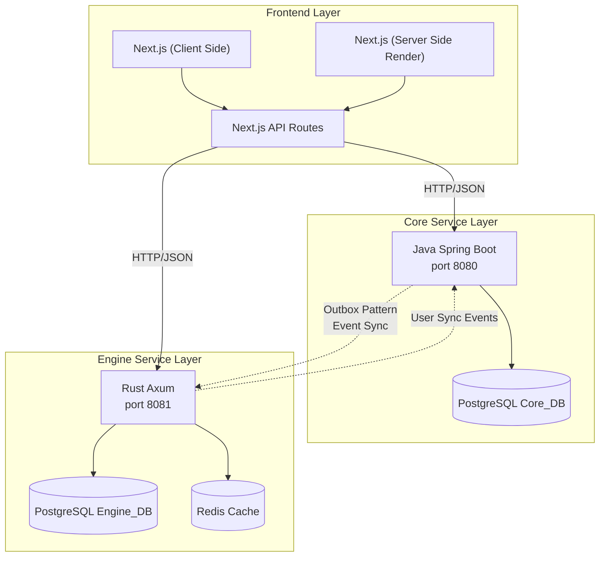
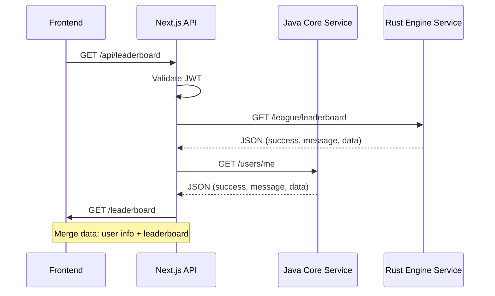

## Apa itu Yomu?

Yomu adalah platform pembelajaran poliglot yang dirancang untuk meningkatkan literasi bahasa Indonesia melalui pengalaman membaca dan kuis yang digamifikasi. Platform ini menggabungkan layanan backend yang tangguh yang dibangun dengan teknologi berbeda yang dioptimalkan untuk domain spesifiknya, menciptakan sistem yang efisien dan skalabel.

Filosofi inti di balik Architecture Yomu adalah **menggunakan alat yang tepat untuk pekerjaan yang tepat** — Java untuk autentikasi pengguna dan manajemen konten yang andal, Rust untuk kalkulasi gamifikasi performa tinggi, dan Next.js untuk pengalaman React yang di-render di sisi server.

### Tujuan Platform

Yomu dibangun dengan beberapa tujuan utama:

- **Aksesibilitas** — Menyediakan materi pembelajaran dalam Bahasa Indonesia untuk pelajar di seluruh nusantara
- **Keterlibatan** — Menggunakan mekanisme gamifikasi untuk menjaga motivasi pengguna dan melacak kemajuan
- **Skalabilitas** — Mendukung basis pengguna yang terus bertambah dengan perubahan infrastruktur minimal
- **Kemudahan Pemeliharaan** — Batasan layanan yang jelas memungkinkan pengembangan dan deployment secara independen
- **Performa** — Pembaruan papan peringkat real-time untuk pengalaman belajar yang kompetitif

<Callout type="note">
Yomu tidak menggunakan database atau layanan bersama antar komponennya. Setiap layanan mempertahankan bounded context-nya sendiri dengan pemisahan tanggung jawab yang jelas, memastikan bahwa kegagalan di satu lapisan tidak menjalar ke lapisan lainnya.
</Callout>

## Architecture Tiga Lapis

### Penjelasan Lapisan Architecture

#### Lapisan Frontend (Next.js 16)
- **Server-Side Rendering** — Halaman yang di-pre-render untuk SEO dan initial load yang cepat
- **API Routes** — Route handler Next.js untuk komunikasi dengan backend services
- **Static Generation** — Halaman artikel dibuat saat build time untuk performa optimal
- **Client Components** — Elemen UI interaktif menggunakan React hooks dan manajemen state

#### Lapisan Core Service (Java Spring Boot)
- **Autentikasi Pengguna** — Autentikasi berbasis JWT dengan dukungan Google OAuth
- **Manajemen Konten** — Operasi CRUD untuk artikel, kuis, dan komentar
- **Manajemen Database** — PostgreSQL untuk storage persisten dengan migrasi Flyway
- **Pembuatan Event** — pattern Outbox untuk pengiriman pesan yang andal ke layanan engine

#### Lapisan Engine Service (Rust Axum)
- **Engine Gamifikasi** — Pelacakan pencapaian, misi harian, kalkulasi XP
- **Manajemen Klan** — Pembentukan tim, agregasi skor, perkembangan tingkat
- **Peringkat Papan Peringkat** — Pelacakan posisi real-time dengan caching Redis
- **Optimasi Performa** — Abstraksi zero-cost untuk pembaruan skor frekuensi tinggi

## Interaksi Sistem

### Direct API Communication

Frontend berkomunikasi langsung dengan backend services melalui API routes Next.js. Ini memberikan beberapa keuntungan:

- **Single entry point** — API routes menyediakan统一的 interface untuk frontend
- **Konsolidasi request** — Menggabungkan data dari beberapa layanan backend ke dalam response tunggal
- **Penegakan autentikasi** — Validasi JWT terpusat sebelum mencapai layanan backend
- **Transformasi response** — Menormalisasi format response yang berbeda dari Java dan Rust

### Detail Alur Komunikasi

1. **Alur Autentikasi Pengguna**
   - Frontend menerima Google ID token
   - Next.js API memvalidasi token dan membuat/memperbarui pengguna di layanan Java
   - Java menghasilkan event outbox untuk pembuatan pengguna
   - Engine Rust menerima event dan membuat shadow user

2. **Alur Permintaan Papan Peringkat**
   - Frontend meminta papan peringkat dari Next.js API
   - API mengambil papan peringkat dari engine Rust
   - API memperkaya dengan data pengguna dari Java
   - API menggabungkan dan mengembalikan response terpadu

3. **Alur Pelacakan Kemajuan**
   - Pengguna menyelesaikan kuis di frontend
   - Next.js API memvalidasi dan menyimpan di Java
   - Java menghasilkan event pembaruan kemajuan
   - Engine Rust memproses untuk kalkulasi skor dan pencapaian

## Karakteristik Architecture Utama

| Karakteristik | Deskripsi |
|----------------|-------------|
| **Polyglot Services** | Setiap layanan menggunakan bahasa/framework optimal untuk domainnya — Java untuk logika bisnis, Rust untuk performa, Next.js untuk rendering React |
| **No Shared State** | Database terpisah per layanan (Core_DB, Engine_DB) — tidak ada query lintas database secara langsung |
| **Event-Driven** | pattern Outbox untuk sinkronisasi async antar layanan (pembuatan pengguna, pembaruan kemajuan) |
| **Fault Tolerant** | Degradasi anggun: jika gamifikasi Rust mati, fitur inti tetap berfungsi melalui mekanisme fallback |
| **Bounded Contexts** | Batasan jelas antara domain Auth/User, Articles/Quizzes, League/Clans, Gamification |

### Tanggung Jawab Komponen

| Komponen | Teknologi | Tanggung Jawab |
|-----------|------------|------------------|
| **Next.js Frontend** | Next.js 16, React 19, Tailwind | Server-side rendering, routing API, pustaka komponen UI, komposisi API |
| **Java Core Service** | Spring Boot 4.0.2, Java 21 | Autentikasi pengguna, manajemen pengguna, CRUD konten (artikel/kuis), pembuatan event outbox |
| **Rust Engine Service** | Axum 0.8, Rust 2024 | Logika gamifikasi, manajemen klan, kalkulasi papan peringkat, pelacakan pencapaian |
| **Outbox Service** | Java background job | Membaca event outbox dan mempublikasikan ke Rust melalui webhook dengan logika retry |
| **Shadow User Sync** | Rust background job | Menyinkronkan pengguna dari Java ke Engine_DB melalui pattern outbox, menangani idempotensi |

## pattern Komunikasi Layanan

### Integrasi Webhook

Java Core Service mendorong event ke Rust Engine Service melalui HTTP webhooks:

- **Endpoint**: `POST /sync/users` pada layanan Rust
- **Autentikasi**: Header `x-api-key` dengan shared secret
- **Payload**: JSON dengan user_id, username, email
- **Retry**: Exponential backoff dengan dead-letter queue
- **Idempotensi**: event_id unik memastikan pemrosesan duplikat aman

### Validasi Sinkron

Rust Engine memvalidasi referensi pengguna terhadap Java Core:

- **Endpoint**: `GET /auth/users/{user_id}` pada layanan Java
- **Autentikasi**: Header `x-api-key`
- **Caching**: Rust menyimpan cache data pengguna untuk mengurangi panggilan RPC
- **Fallback**: Mengembalikan data cache jika layanan Java lambat/tidak tersedia

### Komposisi API

Frontend menggabungkan data dari beberapa layanan:

- **Single endpoint** → Beberapa panggilan backend
- **Agregasi data** di API routes Next.js
- **Format response konsisten** menggunakan struktur `success`, `message`, `data`
- **Penanganan error** menggabungkan error dari kedua layanan

## Navigasi Sub-bagian

<Cards>
  <Card title="Desain Sistem" icon="📐" link="/docs/architecture/system-design">
    Bounded contexts, dekomposisi layanan, dan alasan poliglot
  </Card>
  <Card title="pattern Komunikasi" icon="🔗" link="/docs/architecture/communication">
    Komunikasi antar layanan, keamanan API, dan alur data
  </Card>
  <Card title="Skema Database" icon="💾" link="/docs/architecture/database-schema">
    Skema PostgreSQL untuk Core_DB dan Engine_DB
  </Card>
  <Card title="Deployment" icon="🚀" link="/docs/deployment">
    Deployment GCP VPS, strategi blue-green, observabilitas penuh, dan jaringan
  </Card>
</Cards>

## Memulai

Baca dokumentasi Architecture lengkap untuk memahami bagaimana layanan poliglot Yomu bekerja bersama menciptakan platform pembelajaran yang skalabel.

- [Mulai dengan Desain Sistem](./system-design) untuk memahami bounded contexts dan batasan layanan
- [Pelajari tentang Komunikasi](./communication) untuk melihat bagaimana layanan bertukar data
- [Jelajahi Skema Database](./database-schema) untuk struktur Core_DB dan Engine_DB
- [Tinjau Deployment](./deployment) untuk setup production dan monitoring

## Mengapa Architecture Ini?

Pendekatan poliglot di Yomu mengatasi beberapa tantangan teknis:

| Tantangan | Solusi |
|-----------|----------|
| Pembaruan papan peringkat frekuensi tinggi | Abstraksi zero-cost Rust untuk latensi sub-milidetik |
| Autentikasi pengguna yang kompleks | Ekosistem keamanan Java yang matang dengan Spring Security |
| Kebutuhan server-side rendering | Next.js untuk SEO dan initial page load yang cepat |
| Konsistensi data | Eventual consistency melalui pattern outbox |
| Skalabilitas tim | Pengembangan independen tanpa overhead koordinasi |

Architecture ini telah diuji di production dengan ribuan pengguna konkuren, menunjukkan kemampuannya untuk menskalakan sambil mempertahankan pemisahan tanggung jawab yang bersih.
