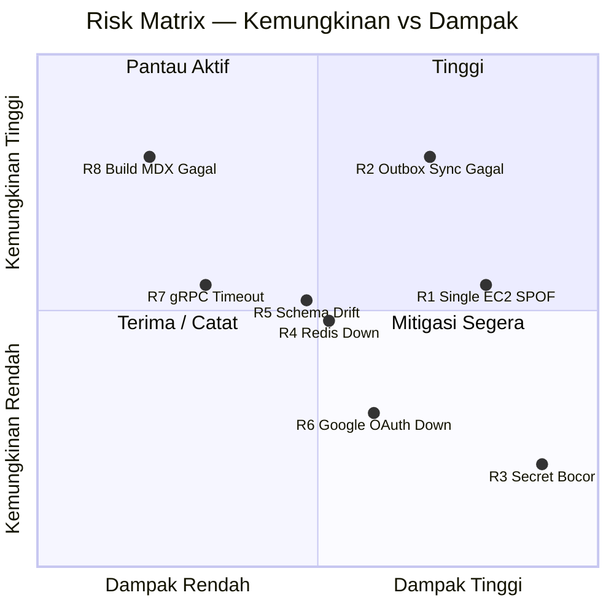

---

title: Analisis Risiko Arsitektur

description: Identifikasi dan mitigasi risiko teknis pada arsitektur Yomu berdasarkan C4 Model — Context, Container, dan Deployment Diagram.

---

Dokumen ini mengidentifikasi risiko teknis pada arsitektur Yomu berdasarkan
keempat diagram C4 yang telah dibuat (Context, Container, Deployment, dan Future Architecture).
Setiap risiko dinilai menggunakan **risk matrix** dua dimensi: **dampak (1–3)** dan **kemungkinan (1–3)**,
dikalikan untuk menghasilkan skor risiko objektif. Skor 1–2 = rendah, 3–4 = sedang, 6–9 = tinggi.

## Risk Matrix

## Risk Register

| ID | Risiko | Komponen Terdampak | Dampak (1–3) | Kemungkinan (1–3) | Skor | Level |
|----|--------|--------------------|:---:|:---:|:---:|:---:|
| R1 | Single Point of Failure — satu EC2 instance untuk seluruh sistem | Seluruh platform | 3 | 2 | 6 | 🔴 Tinggi |
| R2 | Kegagalan sinkronisasi Java → Rust (outbox menumpuk) | Outbox Scheduler, Engine DB | 3 | 3 | 9 | 🔴 Tinggi |
| R3 | Bocornya secret runtime (JWT_SECRET, INTERNAL_API_KEY) | Auth, gRPC channel | 3 | 1 | 3 | 🟡 Sedang |
| R4 | Redis down → leaderboard tidak tersedia | Rust Engine, Leaderboard | 2 | 2 | 4 | 🟡 Sedang |
| R5 | Schema drift antara Core DB dan Engine DB | PostgreSQL (keduanya) | 2 | 2 | 4 | 🟡 Sedang |
| R6 | Google OAuth downtime → seluruh user tidak bisa login | Seluruh user | 2 | 1 | 2 | 🟢 Rendah |
| R7 | gRPC timeout antara Java dan Rust | UserSyncService, QuizSyncService | 1 | 2 | 2 | 🟢 Rendah |
| R8 | Build MDX gagal akibat sintaks tidak valid | yomu-docs (repo ini) | 1 | 3 | 3 | 🟡 Sedang |

## Risk Assessment

Akumulasi skor per area domain arsitektur:

| Kriteria Risiko | Auth & Secret | Sinkronisasi Data | Infrastruktur | Availability Eksternal | Total |
|-----------------|:---:|:---:|:---:|:---:|:---:|
| Availability | 2 | 9 | 6 | 2 | 19 |
| Security | 3 | 1 | 1 | 1 | 6 |
| Data Integrity | 1 | 4 | 1 | 1 | 7 |
| Performance | 1 | 2 | 2 | 2 | 7 |
| **Total Risiko** | **7** | **16** | **10** | **6** | |

Area dengan risiko tertinggi adalah **Sinkronisasi Data** (skor 16), terutama karena R2 (skor 9).
Infrastruktur menempati posisi kedua (skor 10) didominasi oleh R1 (SPOF EC2).

## Detail Risiko dan Mitigasi

### R1 — Single Point of Failure (EC2)

**Sumber:** Deployment Diagram — seluruh container (Next.js, Java, Rust, PostgreSQL, Redis)
berjalan di satu EC2 instance via Docker Compose.

**Skenario kegagalan:** EC2 instance crash, maintenance, atau kehabisan resource → seluruh
platform Yomu tidak dapat diakses.

**Mitigasi:**
- Jangka pendek: pastikan Docker Compose restart policy `always` aktif untuk setiap service
- Jangka menengah: tambahkan EC2 Auto Recovery + CloudWatch alarm
- Jangka panjang: migrasi ke arsitektur multi-instance sesuai Future Architecture diagram (lihat kontribusi Bayu)

---

### R2 — Kegagalan Sinkronisasi Java → Rust

**Sumber:** Container Diagram & Deployment Diagram — Java mengirim event ke Rust via gRPC;
jika gagal, event masuk ke tabel `failed_sync_events`.

**Skenario kegagalan:** Rust service down saat Java mencoba sinkronisasi → event menumpuk di
`failed_sync_events` → data gamifikasi user tidak ter-update → inkonsistensi antara Core DB
dan Engine DB.

**Mitigasi:**
- Outbox Scheduler sudah ada (retry setiap 5 menit) — pastikan tetap aktif via env var
  `OUTBOX_SCHEDULER_ENABLED=true`
- Tambahkan alert Sentry jika jumlah `failed_sync_events` melebihi threshold (misalnya > 100 rows)
- Tambahkan monitoring endpoint `/health` pada Rust service yang dicek oleh Scheduler sebelum retry

---

### R3 — Kebocoran Secret Runtime

**Sumber:** Deployment Diagram — `JWT_SECRET`, `INTERNAL_API_KEY`, dan credential database
di-inject via environment variable.

**Skenario kegagalan:** Secret ter-commit ke repository atau ter-expose via log → attacker
dapat memalsukan JWT atau memanggil endpoint internal Rust langsung.

**Mitigasi:**
- **Jangan pernah** hardcode secret di kode atau file `.env` yang di-commit
- Gunakan GitHub Secrets untuk CI/CD; gunakan AWS Secrets Manager atau Vault untuk runtime
- Tambahkan `.env` ke `.gitignore` (sudah ada — pastikan tidak pernah dihapus)
- Lakukan rotasi secret secara berkala

---

### R4 — Redis Down

**Sumber:** Container Diagram — Redis digunakan untuk cache leaderboard real-time oleh Rust Engine.

**Skenario kegagalan:** Container Redis crash → fitur leaderboard tidak tersedia; jika tidak ada
fallback, request ke endpoint leaderboard akan error.

**Mitigasi:**
- Redis AOF (Append-Only File) sudah dikonfigurasi di Deployment Diagram — data tidak hilang saat restart
- Tambahkan logika fallback di Rust: jika Redis tidak tersedia, query langsung ke Engine DB
  (dengan rate limiting untuk mencegah overload)
- Pertimbangkan Redis Sentinel untuk produksi

---

### R5 — Schema Drift antara Core DB dan Engine DB

**Sumber:** Container Diagram — Java dan Rust menggunakan database terpisah; sinkronisasi
dilakukan via gRPC, bukan foreign key.

**Skenario kegagalan:** Migration di Java mengubah struktur data user/artikel tanpa koordinasi
dengan tim Rust → Rust Engine menerima data dengan format berbeda → parsing error atau data corrupt.

**Mitigasi:**
- Java: gunakan Flyway/Liquibase, setiap migration di-review bersama tim Rust
- Rust: SQLx compile-time query check sudah aktif — pastikan setiap perubahan schema langsung
  dideteksi saat build
- Tambahkan contract test antara Java dan Rust (misalnya menggunakan Pact atau manual integration test)

---

### R6 — Google OAuth Downtime

**Sumber:** Context Diagram & Deployment Diagram — seluruh autentikasi bergantung pada
`oauth2.googleapis.com/tokeninfo`.

**Skenario kegagalan:** Google OAuth API tidak tersedia → tidak ada user yang bisa login; user
yang sudah login mungkin masih bisa akses (bergantung pada masa berlaku JWT lokal).

**Mitigasi:**
- Jangka pendek: tampilkan pesan error yang jelas kepada user jika OAuth gagal
- Jangka menengah: cache informasi user di Core DB sehingga verifikasi ulang tidak selalu diperlukan
- Pertimbangkan masa berlaku JWT yang lebih panjang sebagai buffer saat Google OAuth tidak stabil

---

### R7 — gRPC Timeout

**Sumber:** Deployment Diagram — Java memanggil Rust via gRPC (`UserSyncService`,
`QuizSyncService`, `LeagueService`) dengan header `x-api-key`.

**Skenario kegagalan:** Rust Engine lambat merespons → Java menunggu terlalu lama →
thread pool Java habis → request user lain ikut terpengaruh (cascading failure).

**Mitigasi:**
- Set deadline eksplisit di gRPC client Java (misalnya 5 detik)
- Implementasikan circuit breaker pattern (Resilience4j) di Java untuk panggilan ke Rust
- Outbox Scheduler sudah menangani retry untuk kasus sync yang gagal

---

### R8 — Build MDX Gagal

**Sumber:** Repository yomu-docs — MDX parser sangat sensitif terhadap tag JSX yang tidak
seimbang dan komponen yang tidak terdaftar.

**Skenario kegagalan:** Contributor membuat file `.mdx` dengan sintaks salah → `bun run build`
gagal → deployment dokumentasi terhenti.

**Mitigasi:**
- Selalu jalankan `bun run build` secara lokal sebelum membuat PR
- Tambahkan GitHub Actions step yang menjalankan `bun run build` pada setiap PR
- Pastikan semua komponen MDX custom (Cards, Callout, Steps, Diagram, Mermaid) terdaftar
  di `src/components/mdx.tsx` sebelum digunakan di file `.mdx`

## Prioritas Tindakan

<Steps>
  <Step title="Segera — Amankan Secret">
    Verifikasi tidak ada secret (JWT_SECRET, INTERNAL_API_KEY, kredensial DB) yang ter-commit
    ke repository. Jalankan `git log --all --full-history -- '*.env'` untuk memastikan.
  </Step>

  <Step title="Sprint Ini — Monitor Outbox">
    Tambahkan alert atau dashboard sederhana untuk memantau jumlah baris di tabel
    `failed_sync_events`. Jika menumpuk, ada masalah konektivitas Java → Rust yang perlu
    segera ditangani.
  </Step>

  <Step title="Sprint Berikutnya — Resiliensi Redis & DB Backup">
    Konfigurasikan backup otomatis PostgreSQL (misalnya pg_dump terjadwal ke S3).
    Evaluasi apakah Redis perlu replica untuk mendukung ketersediaan leaderboard.
  </Step>

  <Step title="Future — Multi-Instance Deployment">
    Ikuti rencana Future Architecture dari Bayu untuk mengeliminasi R1 (Single EC2 SPOF).
    Evaluasi migrasi ke ECS Fargate atau Kubernetes sesuai kebutuhan skala platform.
  </Step>
</Steps>