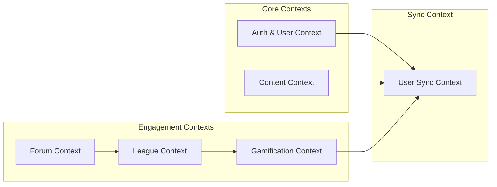

## Mengapa Architecture Polyglot?

Yomu menggunakan beberapa bahasa pemrograman dan framework karena setiap domain memiliki kebutuhan unik yang paling cocok dengan teknologi tertentu. Pendekatan ini mengikuti prinsip **polyglot programming** — menggunakan alat yang tepat untuk setiap pekerjaan daripada memaksakan solusi satu ukuran untuk semua.

| Domain | Teknologi | Rasional |
|--------|------------|-----------|
| **Autentikasi & Manajemen Pengguna** | Java Spring Boot | Ekosistem keamanan yang matang, pustaka JWT yang solid, dukungan transaksi yang kuat, ekosistem ekstensif untuk fitur enterprise |
| **Gamifikasi & Leaderboard** | Rust Axum | Komputasi performa tinggi (kalkulasi skor, peringkat), keamanan memori untuk request konkuren, abstraksi zero-cost untuk pembaruan real-time |
| **Frontend & Komposisi API** | Next.js | Server-side rendering untuk SEO, ekosistem React untuk desain komponen, API routes untuk komunikasi dengan backend, static generation untuk halaman konten cepat |

<Callout type="info">
Layanan gamifikasi Rust dipilih secara spesifik karena kemampuannya menangani kalkulasi leaderboard real-time dengan latensi sub-milidetik, sebuah kebutuhan kritis untuk keterlibatan pengguna dalam skenario pembelajaran kompetitif.
</Callout>

## Bounded Context

Sebuah bounded context mendefinisikan batasan di mana model domain tertentu berlaku. Setiap context memiliki bahasa, aturan, dan model datanya sendiri — memastikan pemisahan yang bersih dan mencegah korupsi model antar domain.

### Rincian Domain



### Detail Context

| Context | Deskripsi | Entitas Utama | Layanan |
|---------|-------------|--------------|---------|
| **Auth & User** | Registrasi pengguna, autentikasi, manajemen profil | User, Role, Permission, Session | Java |
| **Content** | Artikel, kuis, komentar, dan organisasi konten | Article, Quiz, Comment, Category | Java |
| **Forum** | Thread diskusi dan sistem komentar | Thread, Comment, Reaction | Java |
| **League** | Manajemen klan/tim, peringkat, pelacakan skor | Clan, Member, Score, Leaderboard | Rust |
| **Gamification** | Achievement, misi harian, poin pengalaman | Achievement, Mission, XP, Reward | Rust |
| **User Sync** | Sinkronisasi dua arah antara Core dan Engine | Outbox Event, Shadow User | Java/Rust |

## Rasional Dekomposisi Layanan

### Java Core Service (Spring Boot)

Layanan Java menangani operasi bisnis inti yang memerlukan konsistensi kuat dan integritas transaksional:

- **Manajemen Pengguna** — Login, registrasi, reset password, pembaruan profil
- **CRUD Konten** — Artikel, kuis, komentar dengan struktur hierarkis
- **Transaction Boundaries** — Operasi atomik di seluruh entitas terkait
- **Outbox Pattern** — Pembuatan event untuk sinkronisasi async ke layanan lain

#### Fitur Utama Core Service

- **Keamanan** — Spring Security dengan validasi JWT token, dukungan OAuth2 untuk login Google
- **Integritas Data** — Transaksi PostgreSQL memastikan kepatuhan ACID untuk operasi pengguna dan konten
- **Event-Driven** — Outbox pattern memastikan pengiriman event pengguna yang andal ke layanan Rust
- **RESTful API** — Desain berorientasi resource mengikuti prinsip HATEOAS

### Rust Engine Service (Axum)

Layanan Rust berfokus pada intensitas komputasi dan operasi kritis performa:

- **Kalkulasi Leaderboard** — Agregasi skor real-time dan pemeringkatan
- **Manajemen Klan** — Pembentukan tim, distribusi skor, penerapan buff
- **Logika Gamifikasi** — Pelacakan progres achievement, penyelesaian misi, kalkulasi XP
- **Lapisan Caching** — Integrasi Redis untuk akses leaderboard yang cepat

#### Fitur Utama Engine Service

- **Performa** — Abstraksi zero-cost di Rust memungkinkan waktu response sub-milidetik
- **Konkurensi** — Async/await di Rust menangani ribuan koneksi konkuren secara efisien
- **Keamanan Memori** — Borrow checker mencegah data race tanpa overhead garbage collection
- **Real-time** — Dukungan WebSocket untuk pembaruan leaderboard langsung saat dibutuhkan

<Callout type="warning">
Layanan Rust tidak melakukan penulisan database ke Core_DB. Semua data yang mengalir ke Java harus melalui API milik layanan Java sendiri. Aliran data satu arah ini mencegah masalah konsistensi.
</Callout>

## Architecture Polyglot: Kelebihan dan Kekurangan

### Keunggulan

| Manfaat | Deskripsi |
|---------|-------------|
| **Performa Optimal** | Setiap layanan menggunakan bahasa paling efisien untuk beban kerjanya (Rust untuk komputasi, Java untuk logika bisnis) |
| **Spesialisasi Tim** | Engineer dapat fokus pada area yang sesuai dengan keahlian mereka (ahli JVM vs programmer sistem) |
| **Kegagalan Terisolasi** | Kegagalan layanan tidak menjalar — Java tetap bekerja meskipun Rust down |
| **Skalabilitas** | Skalakan setiap layanan secara independen berdasarkan pattern beban |
| **Evolusi Teknologi** | Upgrade satu layanan tanpa memengaruhi yang lain |

### Tantangan

| Tantangan | Strategi Mitigasi |
|-----------|---------------------|
| **Kompleksitas Integrasi** | API yang terdefinisi jelas, contract testing, pengiriman pesan async via outbox pattern |
| **Overhead Operasional** | Orkestrasi Docker Compose, health check, monitoring terpadu |
| **Konsistensi Data** | Konsistensi eventual via event sourcing, handler sinkronisasi idempoten |
| **Debugging Distributed Tracing** | Integrasi OpenTelemetry, Correlation ID, logging terpusat |

### Memilih Bahasa yang Tepat untuk Setiap Domain

#### Mengapa Java untuk Core Services?

- **Ekosistem Matang** — Spring Boot menyediakan solusi out-of-box untuk keamanan, transaksi, dan REST API
- **Type Safety** — Strong typing menangkap error pada waktu kompilasi
- **Pemulihan Error** — Exception handling bekerja baik untuk logika bisnis dengan banyak mode kegagalan
- **Developer Experience** — Talent pool luas, dokumentasi ekstensif, tooling matang

#### Mengapa Rust untuk Engine Services?

- **Performa** — Tidak ada jeda garbage collector, kontrol memori langsung
- **Konkurensi** — Async/await terintegrasi dalam bahasa, tidak ada callback hell
- **Efisiensi Memori** — Penggunaan memori yang dapat diprediksi di bawah beban
- **Keamanan** — Borrow checker mencegah null pointer dan data race pada waktu kompilasi

## Batasan dan Kontrak Layanan

Setiap layanan mengekspos kontrak API yang terdefinisi dengan baik:

- **Java Core Service** — REST HTTP/1.1 dengan payload JSON
- **Rust Engine Service** — REST HTTP/1.1 dengan payload JSON, gRPC opsional untuk penggunaan internal
- **Frontend → Backend** — Next.js API routes berkomunikasi dengan backend services

### Standar Format Response

Semua layanan mengembalikan response JSON standar:

```json
{
  "success": true,
  "message": "Operation completed successfully",
  "data": { /* domain-specific data */ }
}
```

Format seragam ini menyederhanakan konsumsi frontend dan error handling. Boolean `success` memungkinkan validasi sisi client tanpa parsing error, sementara `message` menyediakan konteks yang dapat dibaca manusia.

## Jalur Evolusi

Architecture saat ini menyediakan fondasi yang kuat. Peningkatan di masa depan dapat mencakup:

1. **Message Queue (Kafka/RabbitMQ)** — Mengganti outbox berbasis webhook untuk pengiriman event yang lebih andal
2. **CQRS Pattern** — Memisahkan model baca/tulis di layanan Java untuk query kompleks
3. **eventuate.io** — Database change capture untuk sinkronisasi yang lebih kokoh
4. **GraphQL Federation** — Lapisan API terpadu jika kompleksitas frontend bertambah
5. **Service Mesh** — Istio atau Linkerd untuk manajemen trafik dan observabilitas tingkat lanjut

### Kapan Mempertimbangkan Perubahan

- **Pertumbuhan Trafik**: Jika setiap layanan membutuhkan pattern scaling yang berbeda, pertimbangkan pemisahan lebih lanjut
- **Pertumbuhan Tim**: Jika tim mengerjakan layanan berbeda secara independen, otonomi meningkatkan nilai
- **Bottleneck Performa**: Jika latensi membatasi pertumbuhan, evaluasi pattern async atau caching
- **Kompleksitas Fitur**: Jika fitur terlalu banyak melintasi layanan, pertimbangkan kembali batasan layanan

## Rasional Pemisahan Database

Core_DB dan Engine_DB sepenuhnya terpisah:

- **Tanpa Foreign Key** — Tidak dapat menggunakan constraint level database antar layanan
- **Tanpa SQL Join** — Semua data lintas context diambil via komposisi API
- **Backup Independen** — Setiap database dapat di-backup secara terpisah
- **Fleksibilitas Scaling** — Engine_DB dapat berjalan di hardware berbeda dari Core_DB

Desain ini memaksakan batasan komunikasi yang eksplisit, membuat sistem lebih mudah dipelihara meskipun ada kompleksitas awal. Meskipun memerlukan panggilan jaringan tambahan, manfaat loose coupling dan independent deployability jauh melebihi biayanya.

### Sinkronisasi Database

Data mengalir antar database melalui:

1. **Outbox Events** — Java menulis event, Rust membacanya via webhook
2. **Shadow Users** — Rust memelihara catatan pengguna yang mencerminkan state Java
3. **Konsistensi Eventual** — Menerima penundaan kecil untuk peningkatan fault tolerance
4. **Idempotensi** — Event menyertakan ID unik untuk retry yang aman

Pendekatan ini selaras dengan prinsip Domain-Driven Design dan mendukung tujuan ketahanan Architecture.
