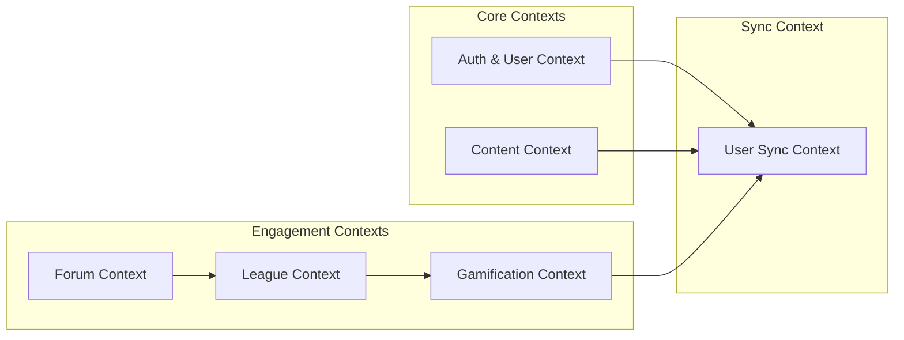

## Why Polyglot Architecture?

Yomu uses multiple programming languages and frameworks because each domain has unique requirements that are best suited to specific technologies. This approach follows the **polyglot programming** principle — using the right tool for each job rather than forcing a one-size-fits-all solution.

| Domain | Technology | Rationale |
|--------|------------|-----------|
| **Authentication & User Management** | Java Spring Boot | Robust security ecosystem, mature JWT libraries, strong transaction support, extensive ecosystem for enterprise features |
| **Gamification & Leaderboard** | Rust Axum | High-performance computational work (score calculations, rankings), memory safety for concurrent requests, zero-cost abstractions for real-time updates |
| **Frontend & API Composition** | Next.js | Server-side rendering for SEO, React ecosystem for component design, API routes as BFF layer, static generation for fast content pages |

<Callout type="info">
The Rust gamification service was chosen specifically for its ability to handle real-time leaderboard calculations with sub-millisecond latency, a critical requirement for user engagement in competitive learning scenarios.
</Callout>

## Bounded Contexts

A bounded context defines the boundaries within which a particular domain model applies. Each context has its own language, rules, and data model — ensuring clean separation and preventing model corruption across domains.

### Domain Breakdown



### Context Details

| Context | Description | Key Entities | Service |
|---------|-------------|--------------|---------|
| **Auth & User** | User registration, authentication, profile management | User, Role, Permission, Session | Java |
| **Content** | Articles, quizzes, comments, and content organization | Article, Quiz, Comment, Category | Java |
| **Forum** | Discussion threads and commenting system | Thread, Comment, Reaction | Java |
| **League** | Clan/Team management, rankings, score tracking | Clan, Member, Score, Leaderboard | Rust |
| **Gamification** | Achievements, daily missions, experience points | Achievement, Mission, XP, Reward | Rust |
| **User Sync** | Two-way synchronization between Core and Engine | Outbox Event, Shadow User | Java/Rust |

## Service Decomposition Rationale

### Java Core Service (Spring Boot)

The Java service handles core business operations requiring strong consistency and transactional integrity:

- **User Management** — Login, registration, password reset, profile updates
- **Content CRUD** — Articles, quizzes, comments with hierarchical structure
- **Transaction Boundaries** — Atomic operations across related entities
- **Outbox Pattern** — Event generation for async sync to other services

#### Core Service Key Features

- **Security** — Spring Security with JWT token validation, OAuth2 support for Google login
- **Data Integrity** — PostgreSQL transactions ensure ACID compliance for user and content operations
- **Event-Driven** — Outbox pattern ensures reliable delivery of user events to Rust service
- **RESTful API** — Resource-oriented design following HATEOAS principles

### Rust Engine Service (Axum)

The Rust service focuses on computational intensity and performance-critical operations:

- **Leaderboard Calculations** — Real-time score aggregation and ranking
- **Clan Management** — Team formation, score distribution, buff applications
- **Gamification Logic** — Achievement progress tracking, mission completion, XP calculations
- **Caching Layer** — Redis integration for fast leaderboard access

#### Engine Service Key Features

- **Performance** — Zero-cost abstractions in Rust enable sub-millisecond response times
- **Concurrency** — Async/await in Rust handles thousands of concurrent connections efficiently
- **Memory Safety** — Borrow checker prevents data races without garbage collection overhead
- **Real-time** — WebSocket support for live leaderboard updates when needed

<Callout type="warning">
Rust services have no database writes to Core_DB. All data flowing to Java must go through the Java service's own APIs. This single-direction data flow prevents consistency issues.
</Callout>

## Polyglot Architecture: Pros and Cons

### Advantages

| Benefit | Description |
|---------|-------------|
| **Optimal Performance** | Each service uses the most efficient language for its workload (Rust for compute, Java for business logic) |
| **Team Specialization** | Engineers can focus on areas matching their expertise (JVM experts vs Systems programmers) |
| **Isolated Failures** | Service failures don't cascade — Java works even if Rust is down |
| **Scalability** | Scale each service independently based on load patterns |
| **Technology Evolution** | Upgrade one service without affecting others |

### Challenges

| Challenge | Mitigation Strategy |
|-----------|---------------------|
| **Integration Complexity** | Clearly defined APIs, contract testing, async messaging via outbox pattern |
| **Operational Overhead** | Docker Compose orchestration, health checks, unified monitoring |
| **Data Consistency** | Eventual consistency via event sourcing, Idempotent sync handlers |
| **Debugging Distributed Tracing** | OpenTelemetry integration, Correlation IDs, centralized logging |

### Choosing the Right Language for Each Domain

#### Why Java for Core Services?

- **Mature Ecosystem** — Spring Boot provides out-of-box solutions for security, transactions, and REST APIs
- **Type Safety** — Strong typing catches errors at compile time
- **Error Recovery** — Exception handling works well for business logic with multiple failure modes
- **Developer Experience** — Wide talent pool, extensive documentation, mature tooling

#### Why Rust for Engine Services?

- **Performance** — No garbage collector pauses, direct memory control
- **Concurrency** — Async/await integrated into language, no callback hell
- **Memory Efficiency** — Predictable memory usage under load
- **Safety** — borrow checker prevents null pointers and data races at compile time

## Service Boundaries and Contracts

Each service exposes a well-defined API contract:

- **Java Core Service** — REST HTTP/1.1 with JSON payloads
- **Rust Engine Service** — REST HTTP/1.1 with JSON payloads, optional gRPC for internal use
- **Frontend → Backend** — Next.js API routes as BFF layer

### Response Format Standard

All services return standardized JSON responses:

```json
{
  "success": true,
  "message": "Operation completed successfully",
  "data": { /* domain-specific data */ }
}
```

This uniform format simplifies frontend consumption and error handling. The `success` boolean enables client-side validation without parsing errors, while `message` provides human-readable context.

## Evolutionary Path

Current architecture provides strong foundation. Future enhancements may include:

1. **Message Queue (Kafka/RabbitMQ)** — Replace webhook-based outbox for more reliable event delivery
2. **CQRS Pattern** — Separate read/write models in Java service for complex queries
3. **eventuate.io** — Database change capture for more robust sync
4. **GraphQL Federation** — Unified API layer if frontend complexity grows
5. **Service Mesh** — Istio or Linkerd for advanced traffic management and observability

### When to Consider Changes

- **Traffic Growth**: If each service needs different scaling patterns, consider splitting further
- **Team Growth**: If teams work on different services independently, autonomy increases value
- **Performance Bottlenecks**: If latency limits growth, evaluate async patterns or caching
- **Feature Complexity**: If features span services excessively, reconsider service boundaries

## Database Separation Rationale

The Core_DB and Engine_DB are completely separate:

- **No Foreign Keys** — Cannot use database-level constraints across services
- **No SQL Joins** — All cross-context data fetched via API composition
- **Independent Backups** — Each database can be backed up separately
- **Scaling Flexibility** — Engine_DB can run on different hardware than Core_DB

This design forces explicit communication boundaries, making the system more maintainable despite initial complexity. While it requires additional network calls, the benefits of loose coupling and independent deployability far outweigh the cost.

### Database Synchronization

Data flows between databases through:

1. **Outbox Events** — Java writes events, Rust reads them via webhook
2. **Shadow Users** — Rust maintains user records mirroring Java state
3. **Eventual Consistency** — Accept small delays for improved fault tolerance
4. **Idempotency** — Events include unique IDs for safe retries

This approach aligns with Domain-Driven Design principles and supports the architecture's resilience goals.
