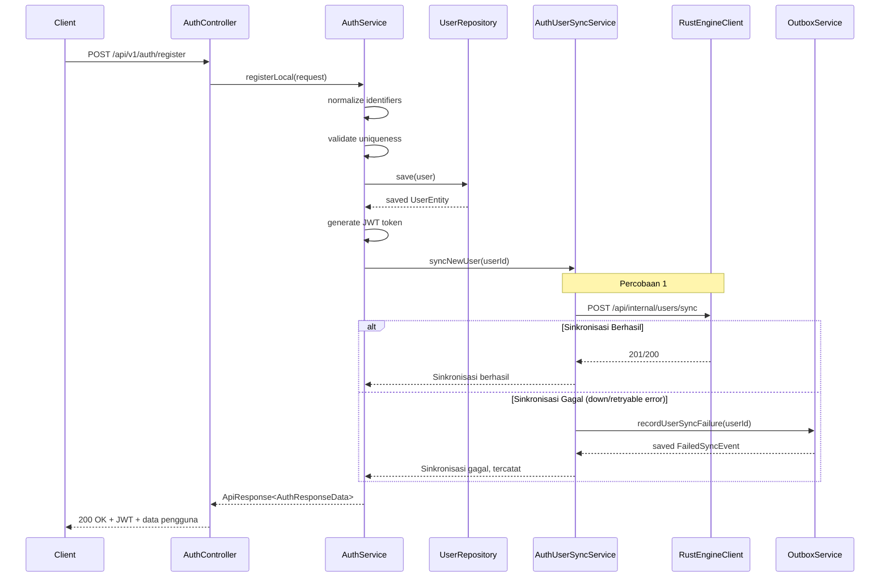
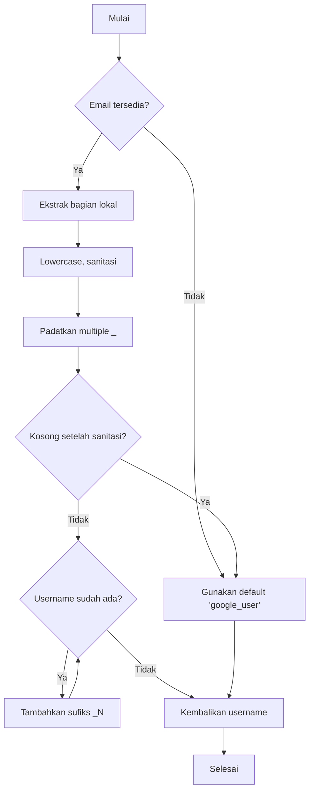

Modul auth menyediakan tiga alur autentikasi: registrasi/login lokal dan Google OAuth SSO. Semua alur mengembalikan token akses JWT yang ditandatangani dengan HMAC-SHA256. Modul ini mencakup resolusi identifier, pembuatan username untuk pengguna SSO, dan sinkronisasi otomatis ke engine Rust melalui pattern outbox.

## Endpoint AuthController

| Endpoint | Method | Request Body | Keterangan |
|----------|--------|--------------|-------------|
| `/api/v1/auth/register` | POST | `RegisterRequest` | Mendaftarkan pengguna lokal baru |
| `/api/v1/auth/login` | POST | `LoginRequest` | Login dengan identifier dan password |
| `/api/v1/auth/google` | POST | `GoogleLoginRequest` | Login Google SSO |

<Callout type="info">
Endpoint `/api/v1/auth/google` memerlukan Google ID token (id_token) yang valid dan diterbitkan dalam satu jam terakhir. Akun Google tanpa password hanya dapat menggunakan login SSO.
</Callout>

### Request DTOs

**RegisterRequest**
```typescript
{
  username: string,               // alfanumerik, unik
  display_name: string,           // wajib, nama yang ditampilkan
  password: string,               // min 8 karakter, di-hash dengan BCrypt
  email?: string,                 // unik, opsional jika phone_number ada
  phone_number?: string           // unik, opsional jika email ada
}
```

**LoginRequest**
```typescript
{
  identifier: string,             // email@domain, +62xxx, atau username
  password: string                // di-hash dengan BCrypt
}
```

**GoogleLoginRequest**
```typescript
{
  id_token: string,               // Google ID token
  username?: string,              // override opsional untuk username
  display_name?: string           // override opsional untuk display name
}
```

## Logika Bisnis AuthService

### Alur Register dengan Sinkronisasi Rust



## IdentifierResolver

Kelas `IdentifierResolver` mendeteksi jenis identifier login:

```java
public ResolvedIdentifier resolve(String identifier) {
    if (identifier.contains("@")) {
        return new ResolvedIdentifier(EMAIL, identifier);
    }
    if (identifier.startsWith("+") || isDigitsOnly(identifier)) {
        return new ResolvedIdentifier(PHONE_NUMBER, identifier);
    }
    return new ResolvedIdentifier(USERNAME, identifier);
}
```

Jenis yang didukung:
- **EMAIL**: Mengandung simbol `@`
- **PHONE_NUMBER**: Diawali `+` atau hanya berisi digit
- **USERNAME**: Fallback default

## UsernameGenerator

Menghasilkan username untuk pengguna Google OAuth dari alamat email:
- Mengekstrak bagian lokal sebelum `@`
- Membersihkan: mengubah ke huruf kecil, mengganti karakter tidak valid dengan `_`, memadatkan duplikat
- Fallback ke `google_user` jika kosong atau terjadi konflik
- Memeriksa username yang sudah ada dan menambahkan sufiks jika diperlukan



## GoogleIdTokenVerifier

Interface untuk memvalidasi Google ID token:
- **GoogleIdTokenVerifier**: Interface dengan metode `verify(idToken)`
- **RestGoogleIdTokenVerifier**: Implementasi REST menggunakan Google OAuth API

Memverifikasi:
1. Tanda tangan token menggunakan kunci publik Google
2. Token belum kedaluwarsa (biasanya 1 jam)
3. Audience cocok dengan client ID aplikasi Anda

## AuthUserSyncService

Menangani sinkronisasi ke engine Rust:
- **Max retry**: Dapat dikonfigurasi melalui `auth.user-sync.retry.max-attempts` (default: 2)
- **Sync on**: Pembuatan pengguna yang berhasil (`register` atau `googleLogin`)
- **Perilaku**: Sinkronisasi langsung dengan fallback ke outbox jika gagal
- **Strategi retry**: Percobaan sinkronis hingga maxAttempts

Jika semua percobaan gagal, layanan mencatat failed sync event dengan:
- `event_type`: `USER_SYNC`
- `payload_json`: `{"user_id": "uuid"}`
- `status`: `FAILED`
- `retry_count`: `0`

## Struktur Token JWT

```json
{
  "sub": "user_id_uuid",          // UUID Pengguna
  "role": "PELAJAR|ADMIN",        // Role enum pengguna
  "iat": 1715000000,              // Diterbitkan pada (epoch)
  "exp": 1715086400               // Kedaluwarsa (epoch)
}
```

Konfigurasi token:
- **Algorithm**: HS256 (HMAC-SHA256)
- **Secret**: Dari config (min 32 karakter)
- **TTL**: Dapat dikonfigurasi melalui `jwt.ttl-seconds`

## Hashing Password BCrypt

- **Encoder**: `BCryptPasswordEncoder`
- **Strength**: Default (10 rounds)
- **Pengguna SSO-only**: `password_hash` diatur ke `null`
- **Tidak dapat login**: Pengguna SSO tanpa password

<Callout type="warning">
Pengguna SSO-only (Google OAuth saja) tidak dapat login melalui `/api/v1/auth/login` lokal — mereka harus menggunakan login Google meskipun memiliki username.
</Callout>

## Soft Delete

Pengguna tidak pernah di-hard-delete dari database:
- `deleted_at` bernilai `NULL` untuk pengguna aktif
- `deleted_at` berisi `Instant` untuk pengguna yang di-soft-delete
- Semua query memfilter dengan `deleted_at IS NULL` untuk pencarian aktif
- Pengguna Google OAuth dapat di-soft-delete tetapi tidak dapat dihapus secara permanen
