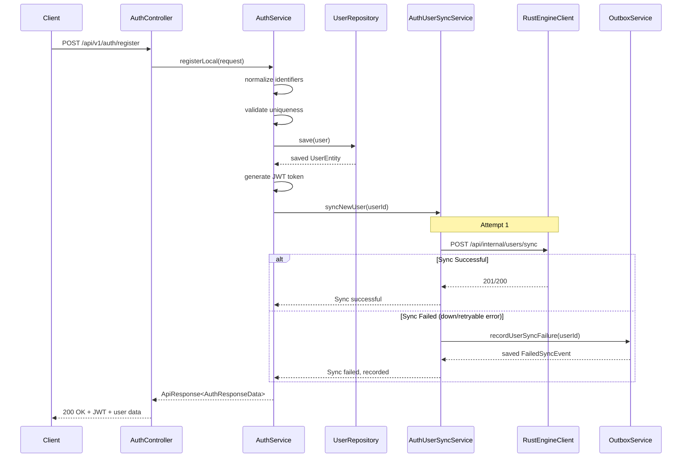
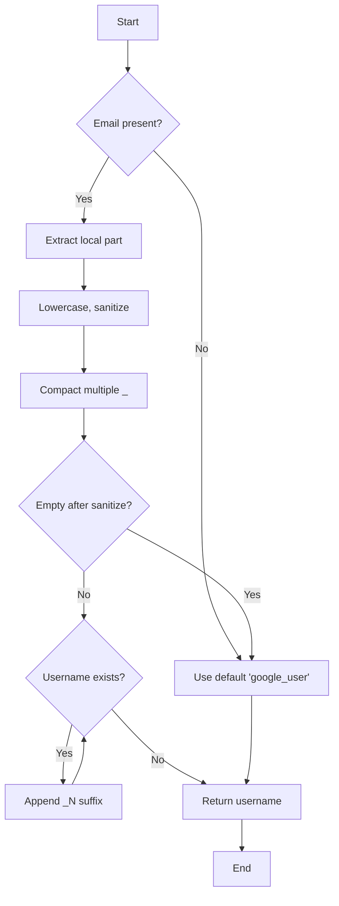

The auth module provides three authentication flows: local registration/login and Google OAuth SSO. All flows return JWT access tokens signed with HMAC-SHA256. The module includes identifier resolution, username generation for SSO users, and automatic sync to the Rust engine via outbox pattern.

## AuthController Endpoints

| Endpoint | Method | Request Body | Description |
|----------|--------|--------------|-------------|
| `/api/v1/auth/register` | POST | `RegisterRequest` | Register new local user |
| `/api/v1/auth/login` | POST | `LoginRequest` | Login with identifier and password |
| `/api/v1/auth/google` | POST | `GoogleLoginRequest` | Google SSO login |

<Callout type="info">
The `/api/v1/auth/google` endpoint requires a valid Google ID token (id_token) issued within the last hour. Google accounts without password can only use SSO login.
</Callout>

### Request DTOs

**RegisterRequest**
```typescript
{
  username: string,               // alphanumeric, unique
  display_name: string,           // required, visible name
  password: string,               // min 8 chars, hashed with BCrypt
  email?: string,                 // unique, optional if phone_number present
  phone_number?: string           // unique, optional if email present
}
```

**LoginRequest**
```typescript
{
  identifier: string,             // email@domain, +62xxx, or username
  password: string                // hashed with BCrypt
}
```

**GoogleLoginRequest**
```typescript
{
  id_token: string,               // Google ID token
  username?: string,              // optional override for username
  display_name?: string           // optional override for display name
}
```

## AuthService Business Logic

### Register Flow with Rust Sync



## IdentifierResolver

The `IdentifierResolver` class detects the type of login identifier:

```java
public ResolvedIdentifier resolve(String identifier) {
    if (identifier.contains("@")) {
        return new ResolvedIdentifier(EMAIL, identifier);
    }
    if (identifier.startsWith("+") || isDigitsOnly(identifier)) {
        return new ResolvedIdentifier(PHONE_NUMBER, identifier);
    }
    return new ResolvedIdentifier(USERNAME, identifier);
}
```

Supported types:
- **EMAIL**: Contains `@` symbol
- **PHONE_NUMBER**: Starts with `+` or contains only digits
- **USERNAME**: Default fallback

## UsernameGenerator

Generates username for Google OAuth users from email address:
- Extracts local part before `@`
- Sanitizes: lowercases, replaces invalid chars with `_`, compact duplicates
- Falls back to `google_user` if empty or conflicts
- Checks existing usernames and appends suffix if needed



## GoogleIdTokenVerifier

Interface for validating Google ID tokens:
- **GoogleIdTokenVerifier**: Interface with `verify(idToken)` method
- **RestGoogleIdTokenVerifier**: REST implementation using Google OAuth API

Verifies:
1. Token signature using Google's public keys
2. Token not expired (typically 1 hour)
3. Audience matches your app's client ID

## AuthUserSyncService

Handles synchronization to Rust engine:
- **Max retry**: Configurable via `auth.user-sync.retry.max-attempts` (default: 2)
- **Sync on**: Successful user creation (`register` or `googleLogin`)
- **Behavior**: Immediate sync with fallback to outbox on failure
- **Retry strategy**: Synchronous attempts up to maxAttempts

If all attempts fail, the service records a failed sync event with:
- `event_type`: `USER_SYNC`
- `payload_json`: `{"user_id": "uuid"}`
- `status`: `FAILED`
- `retry_count`: `0`

## JWT Token Structure

```json
{
  "sub": "user_id_uuid",          // User's UUID
  "role": "PELAJAR|ADMIN",        // User role enum
  "iat": 1715000000,              // Issued at (epoch)
  "exp": 1715086400               // Expiration (epoch)
}
```

Token configuration:
- **Algorithm**: HS256 (HMAC-SHA256)
- **Secret**: From config (min 32 characters)
- **TTL**: Configurable via `jwt.ttl-seconds`

## BCrypt Password Hashing

- **Encoder**: `BCryptPasswordEncoder`
- **Strength**: Default (10 rounds)
- **SSO-only users**: `password_hash` set to `null`
- **Cannot login**: SSO users without password

<Callout type="warning">
SSO-only users (Google OAuth only) cannot login via local `/api/v1/auth/login` — they must use Google login even if they have a username.
</Callout>

## Soft Delete

Users are never hard-deleted from the database:
- `deleted_at` is `NULL` for active users
- `deleted_at` contains `Instant` for soft-deleted users
- All queries filter by `deleted_at IS NULL` for active lookups
- Google OAuth users can be soft-deleted but not permanently removed
