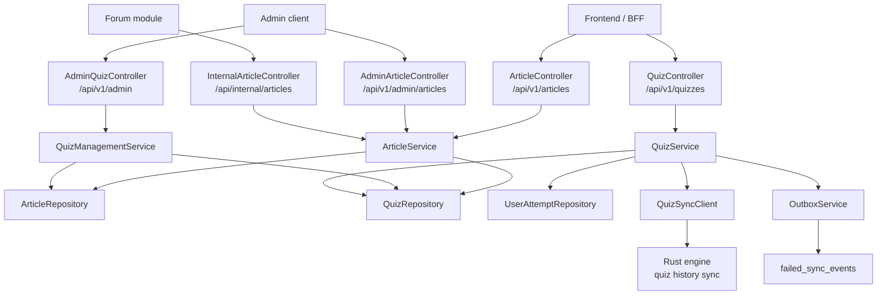
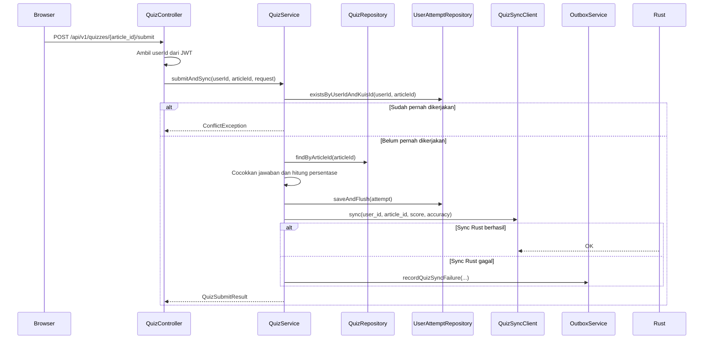

Modul bacaan-kuis menyediakan konten artikel dan soal kuis yang terkait dengan artikel tersebut. Backend Java menyimpan artikel, mengelola kuis, mencegah pengguna mengerjakan kuis yang sama lebih dari sekali, menghitung skor dari jawaban pengguna, lalu menyinkronkan hasilnya ke engine Rust untuk gamifikasi.

<Callout type="info">
Implementasi utama berada di package `bacaankuis` pada `yomu-backend-java/src/main/java/id/ac/ui/cs/advprog/yomubackendjava/bacaankuis`. Controller legacy `BacaanKuisController` sudah deprecated; endpoint aktif memakai `ArticleController`, `QuizController`, `AdminArticleController`, dan `AdminQuizController`.
</Callout>

## Ringkasan Arsitektur



Komponen utama:

| Komponen | Tanggung jawab |
|----------|----------------|
| `ArticleController` | Mengekspos daftar dan detail bacaan untuk pengguna |
| `QuizController` | Mengambil soal kuis dan menerima submit jawaban pengguna |
| `AdminArticleController` | Membuat dan menghapus artikel |
| `AdminQuizController` | Membuat, memperbarui, dan menghapus soal kuis |
| `InternalArticleController` | Validasi artikel untuk komunikasi internal dengan API key |
| `ArticleService` | Query artikel, filter kategori, validasi create, dan delete artikel beserta kuisnya |
| `QuizService` | Cek attempt, hitung skor, simpan attempt, dan sync hasil kuis |
| `QuizManagementService` | Validasi dan operasi CRUD untuk soal kuis |
| `QuizSyncClient` | Kontrak sinkronisasi hasil kuis ke Rust |
| `OutboxService` | Mencatat kegagalan sinkronisasi quiz agar dapat di-retry |

## Endpoint

### Public Article

| Method | Path | Auth | Keterangan |
|--------|------|------|------------|
| `GET` | `/api/v1/articles` | Public | Ambil semua bacaan |
| `GET` | `/api/v1/articles?category={category}` | Public | Ambil bacaan berdasarkan kategori, case-insensitive |
| `GET` | `/api/v1/articles/{id}` | Public | Ambil detail bacaan |

### Quiz Pengguna

| Method | Path | Auth | Keterangan |
|--------|------|------|------------|
| `GET` | `/api/v1/quizzes/{article_id}` | JWT | Ambil soal kuis untuk artikel tertentu |
| `POST` | `/api/v1/quizzes/{article_id}/submit` | JWT | Kirim jawaban dan hitung skor |

### Admin

| Method | Path | Auth | Keterangan |
|--------|------|------|------------|
| `POST` | `/api/v1/admin/articles` | Admin | Buat artikel |
| `DELETE` | `/api/v1/admin/articles/{id}` | Admin | Hapus artikel dan kuis terkait |
| `POST` | `/api/v1/admin/articles/{article_id}/quizzes` | Admin | Buat soal kuis untuk artikel |
| `PATCH` | `/api/v1/admin/quizzes/{id}` | Admin | Perbarui soal kuis |
| `DELETE` | `/api/v1/admin/quizzes/{id}` | Admin | Hapus soal kuis |

### Internal

| Method | Path | Auth | Keterangan |
|--------|------|------|------------|
| `GET` | `/api/internal/articles/{article_id}/exists` | `x-api-key` | Validasi bahwa artikel ada di Core DB |

Semua response mengikuti wrapper umum:

```json
{
  "success": true,
  "message": "Daftar bacaan",
  "data": {}
}
```

<Callout type="warning">
Endpoint kuis mengambil user dari `CurrentUser`, sehingga user tidak bisa mengirim `user_id` sendiri dari request body. Ini mencegah spoofing identitas saat submit kuis.
</Callout>

## Model Data

### Article

`Article` disimpan di tabel `articles`.

| Field | Type | Keterangan |
|-------|------|------------|
| `id` | String | Primary key artikel |
| `title` | String | Judul bacaan |
| `content` | TEXT | Isi bacaan |
| `category` | String | Kategori bacaan, dipakai untuk filter daftar |

### Quiz

`Quiz` disimpan di tabel `quizzes`.

| Field | Type | Keterangan |
|-------|------|------------|
| `id` | String | Primary key soal |
| `article_id` | String | ID artikel pemilik kuis |
| `question` | String | Teks pertanyaan |
| `options` | String | Pilihan jawaban, disimpan sebagai string |
| `answer` | String | Jawaban benar |

Response soal kuis tidak mengembalikan field `answer`, sehingga jawaban benar tidak bocor ke client:

```json
{
  "id": "quiz-1",
  "articleId": "article-123",
  "question": "Apa gagasan utama bacaan?",
  "options": "A. ...; B. ...; C. ...; D. ..."
}
```

### UserAttempt

`UserAttempt` disimpan di tabel `user_attempts`.

| Field | Type | Keterangan |
|-------|------|------------|
| `id` | Long | Primary key auto-increment |
| `user_id` | UUID | User yang mengerjakan kuis |
| `kuis_id` | String | Saat ini berisi `article_id` |
| `completed_at` | LocalDateTime | Waktu kuis diselesaikan |

Constraint unik `user_id + kuis_id` memastikan satu user hanya dapat menyelesaikan kuis untuk satu artikel satu kali.

## Alur Submit Kuis

Request submit:

```json
{
  "answers": [
    {
      "quiz_id": "quiz-1",
      "answer": "A"
    },
    {
      "quiz_id": "quiz-2",
      "answer": "C"
    }
  ]
}
```

Alur eksekusi:



Response submit:

```json
{
  "score": 50.0,
  "accuracy": 50.0,
  "correct_count": 1,
  "total_questions": 2
}
```

`score` dan `accuracy` dihitung dari jumlah jawaban benar dibagi total soal, lalu dikali 100. Perbandingan jawaban memakai `trim()` dan `equalsIgnoreCase()`.

## Validasi

| Operasi | Rule |
|---------|------|
| Create artikel | `id`, `title`, `content`, dan `category` wajib diisi |
| Delete artikel | Artikel harus ada; kuis terkait dihapus lebih dulu |
| Create kuis | `article_id`, `id`, `question`, `options`, dan `answer` wajib diisi |
| Update kuis | Kuis harus ada; `question`, `options`, dan `answer` wajib diisi |
| Get kuis | User harus login dan belum pernah menyelesaikan kuis artikel tersebut |
| Submit kuis | User harus login, `article_id` valid, `answers` tidak kosong |
| Jawaban submit | `quiz_id` dan `answer` wajib diisi, `quiz_id` tidak boleh duplikat |
| Submit ulang | Ditolak dengan `ConflictException` |

<Callout type="info">
Jika Rust sedang tidak tersedia, submit kuis tetap berhasil setelah attempt tersimpan. Kegagalan sinkronisasi dicatat sebagai event `QUIZ_SYNC` di outbox untuk retry.
</Callout>

## Integrasi Modul Lain

Modul forum memakai `ArticleService.findById(articleId)` untuk memastikan komentar hanya dibuat pada artikel yang benar-benar ada.

Modul gamifikasi Rust menerima hasil kuis melalui `QuizSyncClient` dengan payload:

```json
{
  "user_id": "3b9d1a20-37d2-4dd3-bf0e-0e04d36f16ef",
  "article_id": "article-123",
  "score": 100.0,
  "accuracy": 100.0
}
```

Endpoint internal `/api/internal/articles/{article_id}/exists` memakai header `x-api-key` dan perbandingan konstan melalui `MessageDigest.isEqual`. Endpoint ini mengembalikan status artikel untuk service internal yang perlu memvalidasi referensi artikel.

## Testing

Backend Java memiliki test khusus bacaan-kuis:

| Test | Fokus |
|------|-------|
| `ArticleControllerTest` | Kontrak endpoint daftar dan detail artikel |
| `AdminArticleControllerTest` | Create dan delete artikel oleh admin |
| `AdminQuizControllerTest` | Create, update, dan delete kuis |
| `PublicQuizControllerTest` | Auth pada get/submit kuis dan penggunaan user dari JWT |
| `InternalArticleControllerTest` | Validasi artikel internal dengan API key |
| `QuizServiceTest` | Submit, perhitungan skor, idempotensi attempt, dan fallback outbox |
| `UserAttemptRepositoryTest` | Constraint unik attempt per user dan artikel |
| `AuthForumBacaanKuisIntegrationTest` | Integrasi auth, forum, dan bacaan-kuis |
