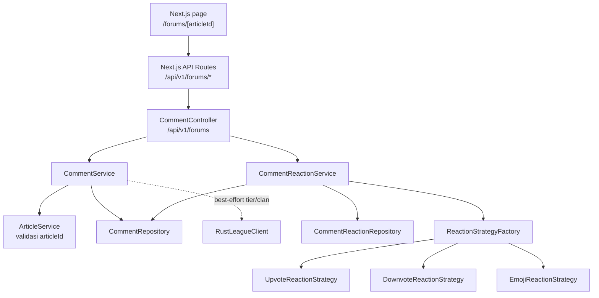
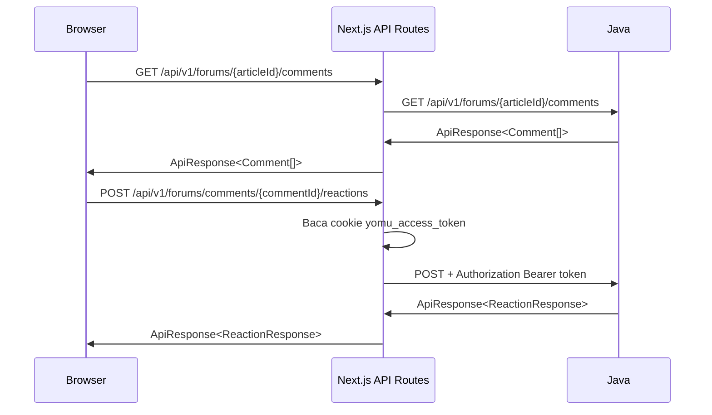

Modul forum menyediakan diskusi per artikel melalui komentar berjenjang, edit/delete komentar, dan reaction toggle. Implementasinya berada di package `forum` pada backend Java dan diakses frontend melalui route handler Next.js.

<Callout type="info">
Overview backend Java sudah menyebut fitur forum, tetapi sebelumnya belum ada halaman khusus di sidebar. Halaman ini mendokumentasikan implementasi aktual di `yomu-backend-java/src/main/java/id/ac/ui/cs/advprog/yomubackendjava/forum`.
</Callout>

## Ringkasan Arsitektur



Komponen utama:

| Komponen | Tanggung jawab |
|----------|----------------|
| `CommentController` | Mengekspos endpoint REST `/api/v1/forums` dan membungkus response dengan `ApiResponse<T>` |
| `CommentService` | Validasi artikel, create/list/update/delete komentar, sanitasi HTML, dan mapping response nested |
| `CommentReactionService` | Toggle reaction per user, pessimistic lock, dan penghapusan vote berlawanan |
| `CommentRepository` | Query root comment per artikel, urut terbaru |
| `CommentReactionRepository` | Count reaction, lookup reaction user, dan lock baris saat toggle |
| `ReactionStrategyFactory` | Memilih strategy berdasarkan `ReactionType` |

## Endpoint

| Method | Path | Auth | Keterangan |
|--------|------|------|------------|
| `GET` | `/api/v1/forums/{articleId}/comments` | Public | Ambil root comments dan replies nested |
| `POST` | `/api/v1/forums/{articleId}/comments` | JWT | Buat root comment atau reply |
| `PUT` | `/api/v1/forums/comments/{commentId}` | JWT pemilik | Ubah isi komentar |
| `DELETE` | `/api/v1/forums/comments/{commentId}` | JWT pemilik/Admin | Hapus komentar |
| `POST` | `/api/v1/forums/comments/{commentId}/reactions` | JWT | Toggle reaction |
| `GET` | `/api/v1/forums/comments/{commentId}/reactions` | Public | Ambil count `UPVOTE` untuk komentar |

Semua response mengikuti kontrak umum:

```json
{
  "success": true,
  "message": "Komentar berhasil diambil",
  "data": {}
}
```

<Callout type="warning">
Endpoint tulis mengambil user dari `CurrentUser`, sehingga token JWT wajib valid. Frontend tidak mengirim token dari JavaScript client; route handler Next.js membaca cookie `yomu_access_token` lalu meneruskan header `Authorization: Bearer <token>` ke backend Java.
</Callout>

## Model Data

### Comment

`Comment` disimpan di tabel `comments`.

| Field | Type | Keterangan |
|-------|------|------------|
| `id` | UUID | Primary key auto-generated |
| `article_id` | String | ID artikel dari modul bacaan/kuis |
| `user_id` | UUID | Pemilik komentar dari JWT |
| `parent_comment_id` | UUID/null | Parent untuk reply |
| `content` | TEXT | Isi komentar, disanitasi dengan `SecuritySanitizer.html` |
| `created_at` | Instant | Diisi otomatis saat insert |
| `replies` | List of `Comment` | Relasi child comment, cascade delete dari parent |

Sebelum membuat atau mengambil komentar, `CommentService` memanggil `ArticleService.findById(articleId)`. Jika artikel tidak ada, request gagal sebagai not found dari modul artikel.

### CommentReaction

`CommentReaction` disimpan di tabel `comment_reactions`.

| Field | Type | Keterangan |
|-------|------|------------|
| `id` | UUID | Primary key auto-generated |
| `comment_id` | UUID | ID komentar |
| `user_id` | UUID | User pemberi reaction |
| `reaction_type` | Enum | `UPVOTE`, `DOWNVOTE`, atau `EMOJI` |

Constraint unik `comment_id + user_id + reaction_type` memastikan satu user hanya punya satu reaction untuk tipe yang sama pada satu komentar.

## Komentar

Request create comment:

```json
{
  "parent_comment_id": null,
  "content": "Menurut saya bagian ini menarik."
}
```

Validasi:

| Field | Rule |
|-------|------|
| `content` | Wajib, tidak blank, maksimal 5000 karakter |
| `parent_comment_id` | Opsional, harus menunjuk komentar yang ada dan berada di artikel yang sama |

Response comment:

```json
{
  "id": "7f64e7a8-7f38-4a82-92be-62d3d0f0b1ef",
  "article_id": "art-eco-hutan-kota",
  "user_id": "3b9d1a20-37d2-4dd3-bf0e-0e04d36f16ef",
  "parent_comment_id": null,
  "content": "Menurut saya bagian ini menarik.",
  "created_at": "2026-05-22T09:00:00Z",
  "reaction_count": 2,
  "upvote_count": 2,
  "downvote_count": 0,
  "emoji_count": 1,
  "clan_name": "Aksara",
  "tier": "Gold",
  "replies": []
}
```

`reaction_count` saat ini berisi jumlah `UPVOTE` agar kompatibel dengan kontrak awal. Count lengkap tersedia lewat `upvote_count`, `downvote_count`, dan `emoji_count`.

## Rules Akses

| Operasi | Rule |
|---------|------|
| List komentar | Public, tetap memvalidasi artikel |
| Create komentar | User login |
| Reply | User login, parent harus satu artikel |
| Update komentar | Hanya pemilik komentar |
| Delete komentar | Pemilik komentar atau user dengan role `ADMIN` |

Delete memakai `commentRepository.delete(comment)`. Replies ikut terhapus karena relasi `Comment.replies` memakai `cascade = CascadeType.ALL` dan `orphanRemoval = true`.

## Reaction

Request toggle reaction:

```json
{
  "reaction_type": "UPVOTE"
}
```

Nilai `reaction_type` yang didukung implementasi saat ini:

| Type | Perilaku |
|------|----------|
| `UPVOTE` | Toggle upvote dan menghapus `DOWNVOTE` user yang sama jika ada |
| `DOWNVOTE` | Toggle downvote dan menghapus `UPVOTE` user yang sama jika ada |
| `EMOJI` | Toggle emoji secara independen |

Response toggle:

```json
{
  "comment_id": "7f64e7a8-7f38-4a82-92be-62d3d0f0b1ef",
  "reaction_type": "UPVOTE",
  "reacted": true,
  "reaction_count": 3
}
```

`CommentReactionService` memakai query `findByCommentIdAndUserIdAndReactionTypeForUpdate` dengan `PESSIMISTIC_WRITE` agar toggle reaction aman saat request paralel.

<Callout type="info">
Endpoint `GET /api/v1/forums/comments/{commentId}/reactions` pada controller masih mengembalikan count `UPVOTE`. Untuk tampilan multi-reaction, frontend memakai count yang sudah tersedia pada `CommentResponse`.
</Callout>

## Integrasi Frontend

Frontend forum berada di `yomu-frontend`:

| File | Peran |
|------|------|
| `src/app/forums/[articleId]/page.tsx` | Halaman diskusi artikel |
| `src/components/forum/CommentList.tsx` | Render nested comments, edit/delete, reply, upvote/downvote |
| `src/components/forum/CommentForm.tsx` | Form create comment dan reply |
| `src/lib/api/forum.ts` | Client typed untuk endpoint forum |
| `src/app/api/v1/forums/**/route.ts` | Route handlers yang berkomunikasi dengan Java |

Alur request:



`CommentList` juga memanggil endpoint `me()` untuk mengetahui user saat ini. Data tersebut dipakai untuk menentukan tombol edit/delete: pemilik komentar bisa edit, sedangkan pemilik atau `ADMIN` bisa delete.

## Testing

Backend Java memiliki test khusus forum:

| Test | Fokus |
|------|-------|
| `CommentControllerTest` | Kontrak endpoint komentar |
| `CommentReactionControllerTest` | Kontrak endpoint reaction |
| `CommentServiceTest` | Validasi artikel, ownership, nested replies, dan mapping response |
| `CommentReactionServiceTest` | Toggle reaction, count, dan opposite vote |
| `ReactionStrategyTest` | Resolusi strategy berdasarkan `ReactionType` |
