```mermaid
graph TD
    subgraph "Controller Layer"
        AC[auth/AuthController]
        UC[user/UserController]
        BKC[bacaankuis/BacaanKuisController*]
        AKC[bacaankuis/ArticleController]
        QKC[bacaankuis/QuizController]
        CCC[forum/CommentController]
        OCC[outbox/AdminOutboxController]
    end

    subgraph "Service Layer"
        AS[auth/AuthService]
        US[user/UserService]
        AAS[bacaankuis/ArticleService]
        QQS[bacaankuis/QuizService]
        CSS[forum/CommentService]
        RS[bacaankuis/RustQuizSyncClient]
        ASS[auth/AuthUserSyncService]
        OUS[outbox/OutboxRetryService]
        OSS[outbox/OutboxService]
    end

    subgraph "Repository Layer"
        UR[user/UserRepository]
        AR[bacaankuis/ArticleRepository]
        QR[bacaankuis/QuizRepository]
        CR[forum/CommentRepository]
        FSR[outbox/FailedSyncEventRepository]
    end

    subgraph "Integration Layer"
        RIC[integration/rust/RestClientRustEngineClient]
        RLC[integration/rust/RestClientRustLeagueClient]
        GUC[integration/grpc/GrpcUserSyncClient]
        GLC[integration/grpc/GrpcLeagueClient]
    end

    subgraph "Security Layer"
        JS[security/JwtService]
        SC[security/SecurityConfig]
        JAF[security/JwtAuthFilter]
    end

    subgraph "Common Layer"
        ATR[common/api/ApiResponse]
        GEH[common/web/GlobalExceptionHandler]
        PE[common/exception/*]
    end

    AC --> AS
    UC --> US
    BKC -.->|deprecated| AAS
    AKC --> AAS
    QKC --> QQS
    CCC --> CSS
    OCC --> OUS
    OUS --> OSS
    AS --> UR
    US --> UR
    AAS --> AR
    QQS --> QR
    CSS --> CR
    OUS --> FSR
    RIC -.->|user sync| AS
    RIC -.->|user sync| OSS
    RLC -.->|league sync| QQS
    JS -.->|token generation| AS
    JS -.->|token validation| JAF
    SC --> JAF
    GUC --> RIC
    GLC --> RLC
```

<Callout type="info">
Spring Boot 4.0.2 with Java 21, Gradle Kotlin DSL. Deployment: Heroku (prod/staging) + Docker. The Java backend serves as the primary API gateway and handles authentication, user management, content (articles/quizzes), forum features, and synchronization with the Rust gamification engine via outbox pattern.
</Callout>

## Tech Stack

- **Framework**: Spring Boot 4.0.2 with Java 21
- **Build Tool**: Gradle Kotlin DSL
- **Database**: PostgreSQL with HikariCP connection pooling
- **Security**: Spring Security with JWT token authentication
- **Code Quality**: Lombok, PMD 7.0.0 (priority 5), JaCoCo coverage
- **Security Scanning**: OWASP Dependency-Check (fail on CVSS 9.0+)
- **Docker**: Multi-stage builds using `eclipse-temurin:21-jdk` and `eclipse-temurin:21-jre`

<Callout type="warning">
The `bacaankuis` module's `BacaanKuisController` is marked as deprecated. Use `ArticleController` and `QuizController` instead.
</Callout>

## Package Structure

The backend follows Clean Architecture principles with clear layer separation:



\* `BacaanKuisController` is deprecated — use `ArticleController` and `QuizController` instead

## Key Dependencies

| Category | Dependency | Version |
|----------|-----------|---------|
| Core | spring-boot-starter-web | 4.0.2 |
| Persistence | spring-boot-starter-data-jpa | 4.0.2 |
| Security | spring-boot-starter-security | 4.0.2 |
| JWT | jjwt-impl, jjwt-jackson | 0.12.6 |
| Database | hikariCP | 5.0.1 |
| PostgreSQL | postgresql | 42.7.3 |
| Validation | spring-boot-starter-validation | 4.0.2 |
| Utilities | Lombok | - |
| Testing | spring-boot-starter-test | 4.0.2 |
| Coverage | jacoco-maven-plugin | - |
| Security | dependency-check-maven | 9.0.0 |

## API Response Convention

All API responses use the `ApiResponse<T>` wrapper:

```typescript
// JSON response structure
{
  "success": true,
  "message": "Operation description",
  "data": { /* response payload */ }
}
```

The wrapper supports three factories:
- `ApiResponse.success(message, data)` — successful operation
- `ApiResponse.success(message)` — successful no-content response
- `ApiResponse.error(message)` — error response

## Links to Sub-Pages

<Cards>
  <Card title="Authentication" href="/docs/backend-java/auth">
    JWT-based authentication with local login, registration, and Google OAuth SSO
  </Card>
  <Card title="User Management" href="/docs/backend-java/user-management">
    Profile management, batch lookup, password changes, and soft account deletion
  </Card>
  <Card title="Outbox Pattern" href="/docs/backend-java/outbox">
    Fault-tolerant synchronization to Rust engine via scheduled retry
  </Card>
</Cards>

## Deployment

- **Production/Staging**: Heroku
- **Development**: Local Docker Compose
- **Container Base**: Multi-stage Docker using `eclipse-temurin:21-jre`
- **Port**: 8080

<Callout type="info">
The Java backend is the primary entry point for all frontend requests. Frontend should NEVER call Rust backend directly (8081) — use the Java BFF pattern instead.
</Callout>
