<Callout type="info">
Spring Boot 4.0.2 dengan Java 21, Gradle Kotlin DSL. Deployment: Heroku (prod/staging) + Docker. Backend Java berfungsi sebagai API gateway utama dan menangani autentikasi, manajemen pengguna, konten (artikel/kuis), fitur forum, dan sinkronisasi dengan engine gamifikasi Rust melalui pattern outbox.
</Callout>

## Tech Stack

- **Framework**: Spring Boot 4.0.2 dengan Java 21
- **Build Tool**: Gradle Kotlin DSL
- **Database**: PostgreSQL dengan connection pooling HikariCP
- **Security**: Spring Security dengan autentikasi token JWT
- **Code Quality**: Lombok, PMD 7.0.0 (priority 5), cakupan JaCoCo
- **Security Scanning**: OWASP Dependency-Check (gagal pada CVSS 9.0+)
- **Docker**: Multi-stage build menggunakan `eclipse-temurin:21-jdk` dan `eclipse-temurin:21-jre`

<Callout type="warning">
`BacaanKuisController` pada modul `bacaankuis` sudah ditandai sebagai deprecated. Gunakan `ArticleController` dan `QuizController` sebagai gantinya.
</Callout>

## Struktur Package

Backend mengikuti prinsip Clean Architecture dengan pemisahan layer yang jelas:

```mermaid
graph TD
    subgraph "Controller Layer"
        AC[auth/AuthController]
        UC[user/UserController]
        BKC[bacaankuis/BacaanKuisController*]
        AKC[bacaankuis/ArticleController]
        QKC[bacaankuis/QuizController]
        CCC[forum/CommentController]
        OCC[outbox/AdminOutboxController]
    end

    subgraph "Service Layer"
        AS[auth/AuthService]
        US[user/UserService]
        AAS[bacaankuis/ArticleService]
        QQS[bacaankuis/QuizService]
        CSS[forum/CommentService]
        RS[bacaankuis/RustQuizSyncClient]
        ASS[auth/AuthUserSyncService]
        OUS[outbox/OutboxRetryService]
        OSS[outbox/OutboxService]
    end

    subgraph "Repository Layer"
        UR[user/UserRepository]
        AR[bacaankuis/ArticleRepository]
        QR[bacaankuis/QuizRepository]
        CR[forum/CommentRepository]
        FSR[outbox/FailedSyncEventRepository]
    end

    subgraph "Integration Layer"
        RIC[integration/rust/RestClientRustEngineClient]
        RLC[integration/rust/RestClientRustLeagueClient]
        GUC[integration/grpc/GrpcUserSyncClient]
        GLC[integration/grpc/GrpcLeagueClient]
    end

    subgraph "Security Layer"
        JS[security/JwtService]
        SC[security/SecurityConfig]
        JAF[security/JwtAuthFilter]
    end

    subgraph "Common Layer"
        ATR[common/api/ApiResponse]
        GEH[common/web/GlobalExceptionHandler]
        PE[common/exception/*]
    end

    AC --> AS
    UC --> US
    BKC -.->|deprecated| AAS
    AKC --> AAS
    QKC --> QQS
    CCC --> CSS
    OCC --> OUS
    OUS --> OSS
    AS --> UR
    US --> UR
    AAS --> AR
    QQS --> QR
    CSS --> CR
    OUS --> FSR
    RIC -.->|user sync| AS
    RIC -.->|user sync| OSS
    RLC -.->|league sync| QQS
    JS -.->|token generation| AS
    JS -.->|token validation| JAF
    SC --> JAF
    GUC --> RIC
    GLC --> RLC
```



\* `BacaanKuisController` sudah deprecated — gunakan `ArticleController` dan `QuizController` sebagai gantinya

## Dependensi Utama

| Category | Dependency | Version |
|----------|-----------|---------|
| Core | spring-boot-starter-web | 4.0.2 |
| Persistence | spring-boot-starter-data-jpa | 4.0.2 |
| Security | spring-boot-starter-security | 4.0.2 |
| JWT | jjwt-impl, jjwt-jackson | 0.12.6 |
| Database | hikariCP | 5.0.1 |
| PostgreSQL | postgresql | 42.7.3 |
| Validation | spring-boot-starter-validation | 4.0.2 |
| Utilities | Lombok | - |
| Testing | spring-boot-starter-test | 4.0.2 |
| Coverage | jacoco-maven-plugin | - |
| Security | dependency-check-maven | 9.0.0 |

## Konvensi API Response

Semua response API menggunakan wrapper `ApiResponse<T>`:

```typescript
// JSON responsee structure
{
  "success": true,
  "message": "Operation description",
  "data": { /* responsee payload */ }
}
```

Wrapper ini mendukung tiga factory:
- `ApiResponse.success(message, data)` — operasi berhasil
- `ApiResponse.success(message)` — response berhasil tanpa konten
- `ApiResponse.error(message)` — response error

## Tautan ke Sub-Halaman

<Cards>
  <Card title="Authentication" href="/docs/backend-java/auth">
    Autentikasi berbasis JWT dengan login lokal, registrasi, dan Google OAuth SSO
  </Card>
  <Card title="User Management" href="/docs/backend-java/user-management">
    Manajemen profil, batch lookup, perubahan password, dan soft delete akun
  </Card>
  <Card title="Forum Diskusi" href="/docs/backend-java/forum">
    Komentar artikel, nested replies, reaction toggle, dan integrasi frontend BFF
  </Card>
  <Card title="Outbox Pattern" href="/docs/backend-java/outbox">
    Sinkronisasi fault-tolerant ke engine Rust melalui retry terjadwal
  </Card>
</Cards>

## Deployment

- **Production/Staging**: Heroku
- **Development**: Docker Compose lokal
- **Container Base**: Multi-stage Docker menggunakan `eclipse-temurin:21-jre`
- **Port**: 8080

<Callout type="info">
Backend Java adalah entry point utama untuk semua request frontend. Frontend TIDAK BOLEH memanggil backend Rust secara langsung (8081) — gunakan pattern BFF Java sebagai gantinya.
</Callout>
