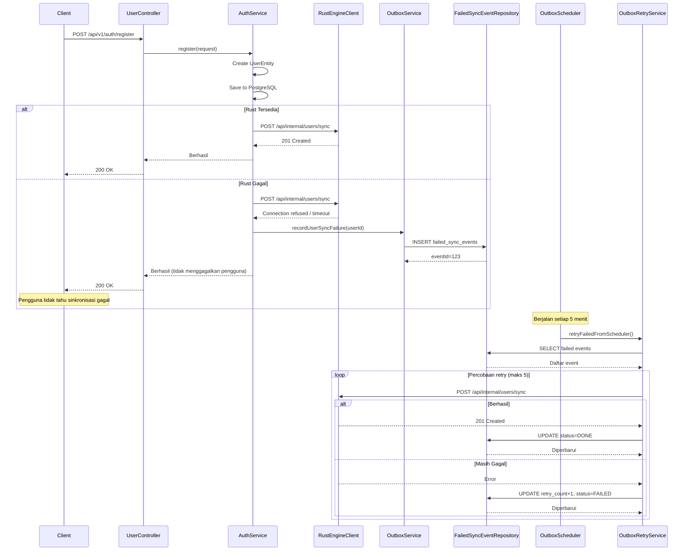

pattern outbox memastikan sinkronisasi yang andal ke engine gamifikasi Rust bahkan ketika Rust tidak tersedia. Tanpa pattern ini, downtime Rust akan menyebabkan registrasi pengguna atau pengiriman kuis gagal sepenuhnya.

## Pernyataan Masalah

Ketika registrasi pengguna berhasil tetapi Rust sedang down:
- **Tanpa outbox**: Registrasi pengguna gagal, pengguna melihat error
- **Dengan outbox**: Registrasi pengguna berhasil, sinkronisasi Rust dijadwalkan untuk retry

Sistem harus tahan terhadap:
- Downtime layanan Rust
- Masalah konektivitas jaringan
- HTTP error yang dapat di-retry (408, 429, 500+)
- Kegagalan koneksi database

## Alur pattern Outbox



## FailedSyncEventEntity

Event sinkronisasi yang gagal disimpan di tabel `failed_sync_events`:

```java
@Entity
@Table(name = "failed_sync_events")
public class FailedSyncEventEntity {
    @Id
    @GeneratedValue(strategy = GenerationType.IDENTITY)
    private Long eventId;
    
    @Enumerated(EnumType.STRING)
    private SyncEventType eventType;  // USER_SYNC, QUIZ_SYNC
    
    @Column(nullable = false, length = 4000)
    private String payloadJson;       // {"user_id": "uuid"}
    
    @Enumerated(EnumType.STRING)
    private SyncEventStatus status;   // FAILED, PENDING, DONE
    
    private int retryCount = 0;       // Ditambah pada setiap retry
    
    private String lastError;         // Pesan error terakhir
    
    private Instant nextRetryAt;      // Untuk exponential backoff
    
    private Instant createdAt;
    private Instant updatedAt;
}
```

### Enum SyncEventType

```java
public enum SyncEventType {
    USER_SYNC,    // Sinkronisasi data pengguna ke Rust
    QUIZ_SYNC     // Sinkronisasi percobaan kuis (mendatang)
}
```

### Enum SyncEventStatus

```java
public enum SyncEventStatus {
    FAILED,  // Percobaan sinkronisasi gagal
    PENDING, // Menunggu retry
    DONE     // Berhasil disinkronkan
}
```

## OutboxService

Mencatat percobaan sinkronisasi yang gagal:

```java
@Service
public class OutboxService {
    public void recordUserSyncFailure(UUID userId, String lastError) {
        FailedSyncEventEntity event = new FailedSyncEventEntity();
        event.setEventType(SyncEventType.USER_SYNC);
        event.setPayloadJson(buildPayloadJson(userId));  // {"user_id": "uuid"}
        event.setStatus(SyncEventStatus.FAILED);
        event.setRetryCount(0);
        event.setLastError(lastError);
        failedSyncEventRepository.save(event);
    }
}
```

Dipanggil dari `AuthService.syncNewUser()` ketika sinkronisasi Rust gagal.

## OutboxScheduler

Job terjadwal berjalan setiap 5 menit untuk me-retry event yang gagal:

```java
@Configuration
@EnableScheduling
@ConditionalOnProperty(name = "outbox.scheduler.enabled", havingValue = "true", matchIfMissing = true)
public class OutboxScheduler {
    @Scheduled(cron = "0 */5 * * * *")
    public void retryFailedSyncEvents() {
        outboxRetryService.retryFailedFromScheduler(maxRetry);
    }
}
```

Konfigurasi:
- **Default enabled**: Ya (`matchIfMissing = true`)
- **Max retry**: Dapat dikonfigurasi melalui `outbox.retry.max-attempts` (default: 5)
- **Cron schedule**: Setiap 5 menit (`0 */5 * * * *`)

<Callout type="warning">
Scheduler berjalan di production secara default. Untuk menonaktifkan, atur `outbox.scheduler.enabled=false` di application properties Anda.
</Callout>

## OutboxRetryService

Logika retry inti:

```java
@Service
public class OutboxRetryService {
    // Public API
    public FailedSyncEventsData listFailedSyncEvents() {
        // Mengembalikan 100 event FAILED/PENDING teratas
    }
    
    public RetrySummary retryEvents(Collection<Long> eventIds, boolean retryAll) {
        // Me-retry event tertentu atau semua yang pending
    }
    
    public int retryFailedFromScheduler(int maxRetry) {
        // Dipanggil oleh scheduler, menghormati batas maxRetry
    }
}
```

### Logika Retry

1. Mengambil event dengan status `FAILED` atau `PENDING` (maks 100)
2. Untuk setiap event:
   - Memeriksa `retryCount < maxRetry`
   - Mencoba sinkronisasi ke Rust
   - Jika berhasil: `status=DONE`, hapus `lastError`
   - Jika gagal: `retryCount++`, `status=FAILED`, perbarui `lastError`

### Endpoint Admin

| Endpoint | Method | Keterangan |
|----------|--------|-------------|
| `/api/v1/admin/failed-sync-events` | GET | Daftar semua event pending/failed |
| `/api/v1/admin/failed-sync-events/retry` | POST | Me-retry event tertentu atau semua |

**Request body untuk retry:**
```json
{
  "event_ids": [1, 2, 3],    // Opsional: event ID tertentu
  "retry_all": true          // Opsional: retry semua event (jika event_ids kosong)
}
```

**Response:**
```json
{
  "success": true,
  "message": "Retry failed sync events selesai",
  "data": {
    "processed_count": 10,
    "done_count": 7,
    "failed_count": 3
  }
}
```

## Interface RustEngineClient

Mendefinisikan kontrak sync client:

```java
public interface RustEngineClient {
    SyncResult syncUser(UUID userId);
    
    record SyncResult(int statusCode, String responseBody) {}
}
```

Implementasi:
- **RestClientRustEngineClient**: HTTP/REST client menggunakan Spring RestClient
- **GrpcUserSyncClient**: gRPC client (alternatif, mendatang)

### Konfigurasi RestClientRustEngineClient

```java
@Component
public class RestClientRustEngineClient implements RustEngineClient {
    private final RestClient restClient;
    
    public RestClientRustEngineClient(
        @Value("${rust.engine.base-url:http://localhost:8081}") String baseUrl,
        @Value("${internal.api.key:}") String internalApiKey
    ) {
        // Mengonfigurasi timeout (2s connect, 3s read)
    }
}
```

**Properti konfigurasi:**
- `rust.engine.base-url`: URL engine Rust (default: `http://localhost:8081`)
- `internal.api.key`: Header API key untuk endpoint internal

**Endpoint sinkronisasi**: `POST /api/internal/users/sync` dengan header `x-api-key`
