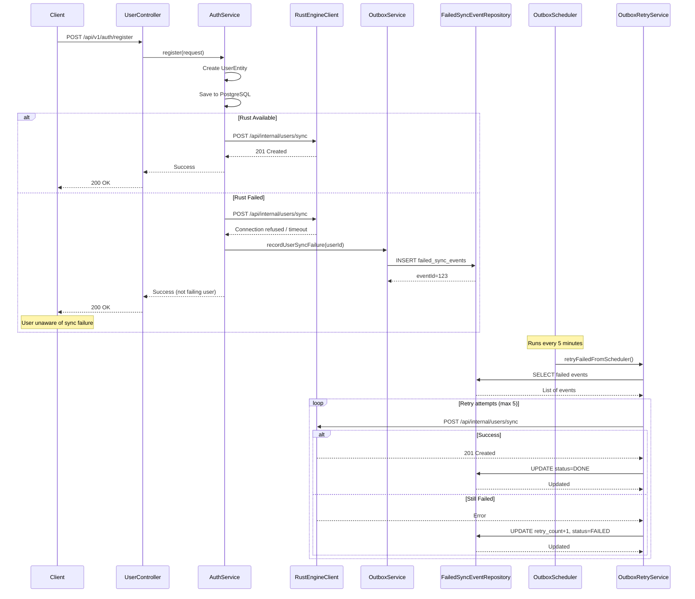

The outbox pattern ensures reliable synchronization to the Rust gamification engine even when Rust becomes unavailable. Without this pattern, any Rust downtime would cause user registration or quiz submission to fail entirely.

## Problem Statement

When user registration succeeds but Rust is down:
- **Without outbox**: User registration fails, user sees error
- **With outbox**: User registration succeeds, Rust sync scheduled for retry

The system must be resilient to:
- Rust service downtime
- Network connectivity issues
- Retryable HTTP errors (408, 429, 500+)
- Database connection failures

## Outbox Pattern Flow



## FailedSyncEventEntity

The failed sync events are stored in `failed_sync_events` table:

```java
@Entity
@Table(name = "failed_sync_events")
public class FailedSyncEventEntity {
    @Id
    @GeneratedValue(strategy = GenerationType.IDENTITY)
    private Long eventId;
    
    @Enumerated(EnumType.STRING)
    private SyncEventType eventType;  // USER_SYNC, QUIZ_SYNC
    
    @Column(nullable = false, length = 4000)
    private String payloadJson;       // {"user_id": "uuid"}
    
    @Enumerated(EnumType.STRING)
    private SyncEventStatus status;   // FAILED, PENDING, DONE
    
    private int retryCount = 0;       // Increment on each retry
    
    private String lastError;         // Last error message
    
    private Instant nextRetryAt;      // For exponential backoff
    
    private Instant createdAt;
    private Instant updatedAt;
}
```

### SyncEventType Enum

```java
public enum SyncEventType {
    USER_SYNC,    // Sync user data to Rust
    QUIZ_SYNC     // Quiz attempt sync (future)
}
```

### SyncEventStatus Enum

```java
public enum SyncEventStatus {
    FAILED,  // Sync attempt failed
    PENDING, // Awaiting retry
    DONE     // Successfully synced
}
```

## OutboxService

Records failed sync attempts:

```java
@Service
public class OutboxService {
    public void recordUserSyncFailure(UUID userId, String lastError) {
        FailedSyncEventEntity event = new FailedSyncEventEntity();
        event.setEventType(SyncEventType.USER_SYNC);
        event.setPayloadJson(buildPayloadJson(userId));  // {"user_id": "uuid"}
        event.setStatus(SyncEventStatus.FAILED);
        event.setRetryCount(0);
        event.setLastError(lastError);
        failedSyncEventRepository.save(event);
    }
}
```

Called from `AuthService.syncNewUser()` when Rust sync fails.

## OutboxScheduler

Scheduled job runs every 5 minutes to retry failed events:

```java
@Configuration
@EnableScheduling
@ConditionalOnProperty(name = "outbox.scheduler.enabled", havingValue = "true", matchIfMissing = true)
public class OutboxScheduler {
    @Scheduled(cron = "0 */5 * * * *")
    public void retryFailedSyncEvents() {
        outboxRetryService.retryFailedFromScheduler(maxRetry);
    }
}
```

Configuration:
- **Default enabled**: Yes (`matchIfMissing = true`)
- **Max retry**: Configurable via `outbox.retry.max-attempts` (default: 5)
- **Cron schedule**: Every 5 minutes (`0 */5 * * * *`)

<Callout type="warning">
The scheduler runs in production by default. To disable, set `outbox.scheduler.enabled=false` in your application properties.
</Callout>

## OutboxRetryService

Core retry logic:

```java
@Service
public class OutboxRetryService {
    // Public API
    public FailedSyncEventsData listFailedSyncEvents() {
        // Returns top 100 FAILED/PENDING events
    }
    
    public RetrySummary retryEvents(Collection<Long> eventIds, boolean retryAll) {
        // Retry specific events or all pending
    }
    
    public int retryFailedFromScheduler(int maxRetry) {
        // Called by scheduler, respects maxRetry limit
    }
}
```

### Retry Logic

1. Fetch events with status `FAILED` or `PENDING` (max 100)
2. For each event:
   - Check `retryCount < maxRetry`
   - Attempt sync to Rust
   - On success: `status=DONE`, clear `lastError`
   - On failure: `retryCount++`, `status=FAILED`, update `lastError`

### Admin endpoints

| Endpoint | Method | Description |
|----------|--------|-------------|
| `/api/v1/admin/failed-sync-events` | GET | List all pending/failed events |
| `/api/v1/admin/failed-sync-events/retry` | POST | Retry specific events or all |

**Request body for retry:**
```json
{
  "event_ids": [1, 2, 3],    // Optional: specific event IDs
  "retry_all": true          // Optional: retry all events (if event_ids empty)
}
```

**Response:**
```json
{
  "success": true,
  "message": "Retry failed sync events selesai",
  "data": {
    "processed_count": 10,
    "done_count": 7,
    "failed_count": 3
  }
}
```

## RustEngineClient Interface

Defines sync client contracts:

```java
public interface RustEngineClient {
    SyncResult syncUser(UUID userId);
    
    record SyncResult(int statusCode, String responseBody) {}
}
```

Implementations:
- **RestClientRustEngineClient**: HTTP/REST client using Spring RestClient
- **GrpcUserSyncClient**: gRPC client (alternative, future)

### RestClientRustEngineClient Configuration

```java
@Component
public class RestClientRustEngineClient implements RustEngineClient {
    private final RestClient restClient;
    
    public RestClientRustEngineClient(
        @Value("${rust.engine.base-url:http://localhost:8081}") String baseUrl,
        @Value("${internal.api.key:}") String internalApiKey
    ) {
        // Configures timeout (2s connect, 3s read)
    }
}
```

**Configuration properties:**
- `rust.engine.base-url`: Rust engine URL (default: `http://localhost:8081`)
- `internal.api.key`: API key header for internal endpoints

**Sync endpoint**: `POST /api/internal/users/sync` with `x-api-key` header
