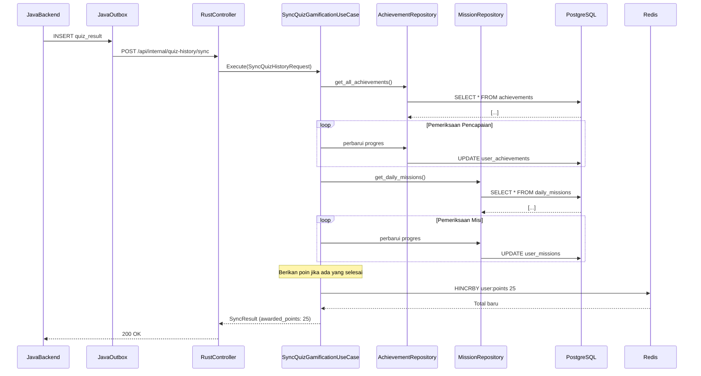

<Callout type="info">
Modul Gamification menangani tonggak pencapaian (achievement milestones), misi harian, dan distribusi hadiah. Ia memproses penyelesaian kuis dan memperbarui progres pengguna secara near real-time.
</Callout>

## Konteks Terbatas

Modul ini memiliki:

- Definisi pencapaian dan pelacakan progresi
- Pengaturan dan penyelesaian misi harian
- Akumulasi dan klaim poin hadiah
- Pembukaan pencapaian pada penyelesaian tonggak

## Entitas

```rust
// Achievement: mendefinisikan hadiah untuk menyelesaikan tugas
pub struct Achievement {
    pub id: Uuid,
    pub title: String,
    pub description: String,
    pub type_: AchievementType,  // Common, Rare, Epic, Legendary
    pub points: i32,
    pub order: i32,             // Urutan tampilan
}

// Daily mission: direset setiap hari, melacak progres
pub struct DailyMission {
    pub id: Uuid,
    pub title: String,
    pub description: String,
    pub target_value: i32,      // misalnya, 5 kuis diselesaikan
    pub points: i32,
    pub reward_amount: i32,     // Mata uang dalam game
}

// User achievement: melacak progres pengguna
pub struct UserAchievement {
    pub user_id: Uuid,
    pub achievement_id: Uuid,
    pub progress: i32,
    pub completed_at: Option<DateTime<Utc>>,
    pub claimed: bool,
}

// User mission: pelacakan untuk misi harian
pub struct UserMission {
    pub user_id: Uuid,
    pub mission_id: Uuid,
    pub progress: i32,
    pub completed_at: Option<DateTime<Utc>>,
    pub claimed: bool,
}
```

## Tipe Pencapaian

| Tipe | Kelangkaan | Bonus Poin |
|------|--------|-------------|
| Common | 60% | 10 |
| Rare | 25% | 25 |
| Epic | 10% | 50 |
| Legendary | 5% | 100 |

## Trait Repositori

```rust
#[async_trait]
pub trait AchievementRepository: Send + Sync {
    async fn get_all(&self) -> Result<Vec<Achievement>, RepositoryError>;
    async fn get_by_id(&self, id: Uuid) -> Result<Option<Achievement>, RepositoryError>;
    async fn insert_user_achievement(
        &self,
        ua: &UserAchievement,
    ) -> Result<(), RepositoryError>;
    async fn update_user_achievement_progress(
        &self,
        user_id: Uuid,
        achievement_id: Uuid,
        delta: i32,
    ) -> Result<(), RepositoryError>;
}

#[async_trait]
pub trait MissionRepository: Send + Sync {
    async fn get_daily_missions(&self) -> Result<Vec<DailyMission>, RepositoryError>;
    async fn get_user_mission(
        &self,
        user_id: Uuid,
        mission_id: Uuid,
    ) -> Result<Option<UserMission>, RepositoryError>;
    async fn insert_user_mission(
        &self,
        um: &UserMission,
    ) -> Result<(), RepositoryError>;
    async fn claim_mission_reward(
        &self,
        user_id: Uuid,
        mission_id: Uuid,
    ) -> Result<i32, RepositoryError>;  // Mengembalikan poin yang diberikan
}
```

## Use Case

<Cards>
<Card title="SyncQuizGamificationUseCase">
Memproses penyelesaian kuis: memeriksa pencapaian, memperbarui misi, memberikan poin. Idempoten per pasangan (user_id, article_id).
</Card>
<Card title="ClaimMissionRewardUseCase">
Mengklaim hadiah misi harian. Memvalidasi penyelesaian misi, mendistribusikan hadiah, memperbarui saldo poin, mencegah klaim ganda.
</Card>
</Cards>

## Alur Eksekusi: Penyelesaian Kuis Memicu Pembaruan Gamifikasi

<Diagram name="QuizGamificationSequence">

</Diagram>

## Endpoint

<Steps>
<Step title="GET /api/v1/missions/daily">
Mengambil misi harian yang aktif hari ini untuk pengguna yang terautentikasi.

Respons:
```json
{
  "missions": [
    {
      "id": "uuid",
      "title": "Selesaikan 5 Kuis",
      "description": "Selesaikan 5 kuis hari ini",
      "target_value": 5,
      "current_value": 3,
      "completed": false,
      "claimed": false
    }
  ],
  "points_available": 100
}
```
</Step>
<Step title="POST /api/v1/missions/:id/claim">
Mengklaim hadiah untuk misi yang telah diselesaikan.

Respons: `200 OK` atau `400` (sudah diklaim, belum selesai) / `404`

```json
{
  "success": true,
  "message": "Hadiah diklaim!",
  "data": {
    "points_awarded": 25
  }
}
```
</Step>
<Step title="GET /api/v1/achievements/users/:user_id">
Mengambil pencapaian pengguna dengan progres.

Respons:
```json
{
  "achievements": [
    {
      "id": "uuid",
      "title": "Quiz Whiz",
      "description": "Selesaikan 100 kuis",
      "type": "Common",
      "progress": 75,
      "total": 100,
      "completed": false,
      "claimed": false,
      "points": 10
    }
  ],
  "total_points": 425
}
```
</Step>
</Steps>

## Validasi

| Field | Batasan |
|-------|------------|
| `score` | Harus ≥ 0 |
| `accuracy` | Harus antara 0.0 dan 100.0 |
| `target_value` | Harus ≥ 1 |
| `progress` | Tidak boleh melebihi `target_value` |

## Perhitungan Poin

Ketika `SyncQuizGamificationUseCase` berjalan:

```rust
// Pseudocode
poin_diperoleh = 0;

for pencapaian in daftar_pencapaian {
    if tonggak_tercapai(progres, pencapaian.target) {
        berikan_poin(pencapaian.points);
        poin_diperoleh += pencapaian.points;
    }
}

for misi in daftar_misi {
    if sudah_selesai(misi) && !misi.claimed {
        poin_diperoleh += misi.points;
    }
}
```

## Strategi Pengujian

- **Unit**: AchievementRepository, MissionRepository di-mock dengan `mockall`
- **Integrasi**: Full stack dengan database uji, verifikasi pembukaan pencapaian
- **Kasus Tepi**: Idempotensi, penyelesaian ganda, skor nol/tidak valid