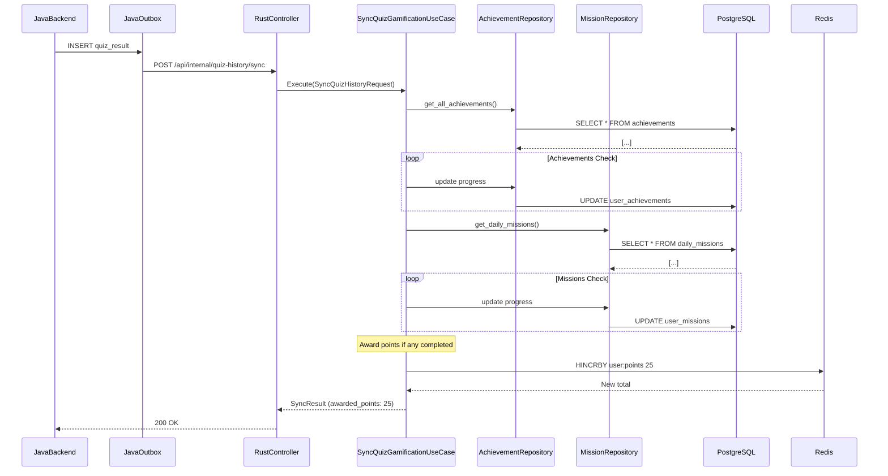

<Callout type="info">
The Gamification module handles achievement milestones, daily missions, and reward distribution. It processes quiz completions and updates user progress in near real-time.
</Callout>

## Bounded Context

The module owns:

- Achievement definitions and progression tracking
- Daily mission setup and completion
- Reward point accumulation and claiming
- Achievement unlocks on milestone completion

## Entities

```rust
// Achievement: defines a reward for completing a task
pub struct Achievement {
    pub id: Uuid,
    pub title: String,
    pub description: String,
    pub type_: AchievementType,  // Common, Rare, Epic, Legendary
    pub points: i32,
    pub order: i32,             // Display order
}

// Daily mission: resets daily, tracks progress
pub struct DailyMission {
    pub id: Uuid,
    pub title: String,
    pub description: String,
    pub target_value: i32,      // e.g., 5 quizzes completed
    pub points: i32,
    pub reward_amount: i32,     // In-game currency
}

// User achievement: tracks progress
pub struct UserAchievement {
    pub user_id: Uuid,
    pub achievement_id: Uuid,
    pub progress: i32,
    pub completed_at: Option<DateTime<Utc>>,
    pub claimed: bool,
}

// User mission: tracking for daily missions
pub struct UserMission {
    pub user_id: Uuid,
    pub mission_id: Uuid,
    pub progress: i32,
    pub completed_at: Option<DateTime<Utc>>,
    pub claimed: bool,
}
```

## Achievement Type

| Type | Rarity |Points Bonus |
|------|--------|-------------|
| Common | 60% | 10 |
| Rare | 25% | 25 |
| Epic | 10% | 50 |
| Legendary | 5% | 100 |

## Repository Traits

```rust
#[async_trait]
pub trait AchievementRepository: Send + Sync {
    async fn get_all(&self) -> Result<Vec<Achievement>, RepositoryError>;
    async fn get_by_id(&self, id: Uuid) -> Result<Option<Achievement>, RepositoryError>;
    async fn insert_user_achievement(
        &self,
        ua: &UserAchievement,
    ) -> Result<(), RepositoryError>;
    async fn update_user_achievement_progress(
        &self,
        user_id: Uuid,
        achievement_id: Uuid,
        delta: i32,
    ) -> Result<(), RepositoryError>;
}

#[async_trait]
pub trait MissionRepository: Send + Sync {
    async fn get_daily_missions(&self) -> Result<Vec<DailyMission>, RepositoryError>;
    async fn get_user_mission(
        &self,
        user_id: Uuid,
        mission_id: Uuid,
    ) -> Result<Option<UserMission>, RepositoryError>;
    async fn insert_user_mission(
        &self,
        um: &UserMission,
    ) -> Result<(), RepositoryError>;
    async fn claim_mission_reward(
        &self,
        user_id: Uuid,
        mission_id: Uuid,
    ) -> Result<i32, RepositoryError>;  // Returns points awarded
}
```

## Use Cases

<Cards>
<Card title="SyncQuizGamificationUseCase">
Processes quiz completions: checks achievements, updates missions, awards points. Idempotent per (user_id, article_id) pair.
</Card>
<Card title="ClaimMissionRewardUseCase">
Claims daily mission reward. Validates mission completion, deducts reward, updates points balance, prevents double-claiming.
</Card>
</Cards>

## Execution Flow: Quiz Completion Triggers Gamification Update

<Diagram name="QuizGamificationSequence">

</Diagram>

## Endpoints

<Steps>
<Step title="GET /api/v1/missions/daily">
Fetches today's active daily missions for the authenticated user.

Response:
```json
{
  "missions": [
    {
      "id": "uuid",
      "title": "Complete 5 Quizzes",
      "description": "Finish 5 quizzes today",
      "target_value": 5,
      "current_value": 3,
      "completed": false,
      "claimed": false
    }
  ],
  "points_available": 100
}
```
</Step>
<Step title="POST /api/v1/missions/:id/claim">
Claims reward for a completed mission.

Response: `200 OK` or `400` (already claimed, not completed) / `404`

```json
{
  "success": true,
  "message": "Reward claimed!",
  "data": {
    "points_awarded": 25
  }
}
```
</Step>
<Step title="GET /api/v1/achievements/users/:user_id">
Fetches user's achievements with progress.

Response:
```json
{
  "achievements": [
    {
      "id": "uuid",
      "title": "Quiz Whiz",
      "description": "Complete 100 quizzes",
      "type": "Common",
      "progress": 75,
      "total": 100,
      "completed": false,
      "claimed": false,
      "points": 10
    }
  ],
  "total_points": 425
}
```
</Step>
</Steps>

## Validation

| Field | Constraint |
|-------|------------|
| `score` | Must be ≥ 0 |
| `accuracy` | Must be between 0.0 and 100.0 |
| `target_value` | Must be ≥ 1 |
| `progress` | Must not exceed `target_value` |

## Points Calculation

When `SyncQuizGamificationUseCase` runs:

```rust
// Pseudocode
points_earned = 0;

for achievement in achievements {
    if is_milestone_reached(progress, achievement.target) {
        award_points(achievement.points);
        points_earned += achievement.points;
    }
}

for mission in missions {
    if is_completed(mission) && !mission.claimed {
        points_earned += mission.points;
    }
}
```

## Testing Strategy

- **Unit**: AchievementRepository, MissionRepository mocked with `mockall`
- **Integration**: Full stack with test database, verify achievement unlocking
- **Edge Cases**: Idempotency, double completion, zero/invalid scores
