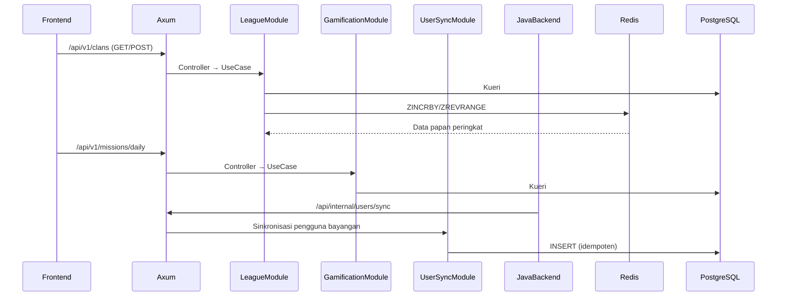
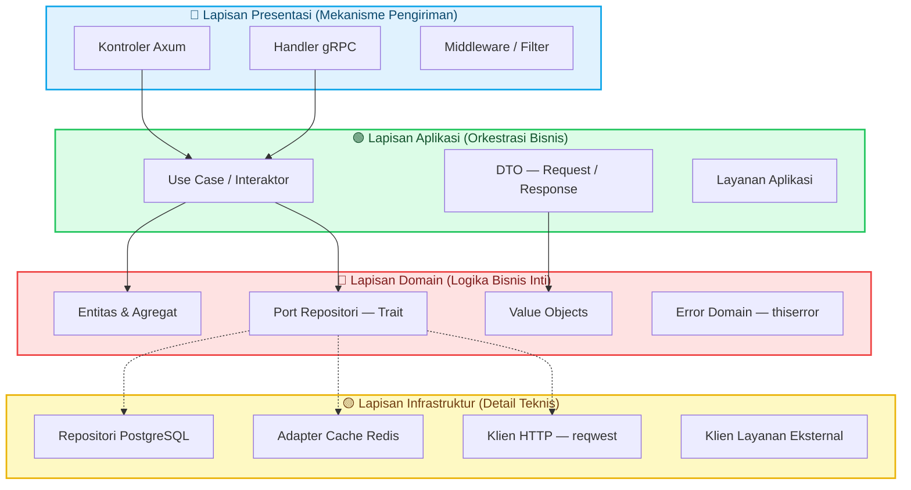
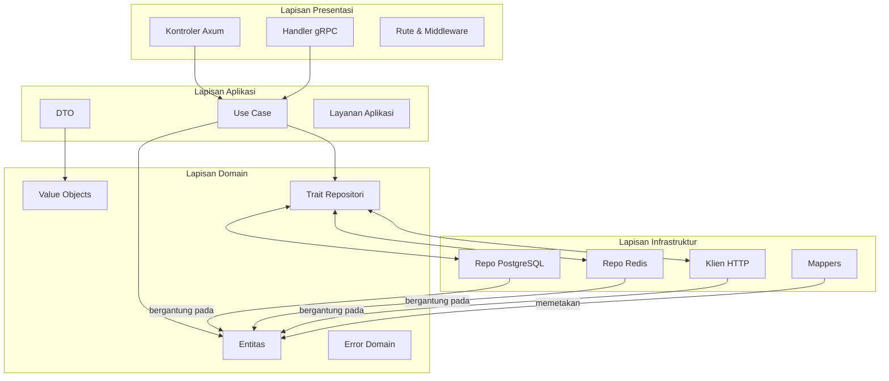

<Callout type="note">
Backend Rust adalah mesin gamifikasi berkinerja tinggi yang dibangun dengan Axum 0.8.8 dan Rust 2024 Edition. Ia berfungsi sebagai backend sekunder yang menangani manajemen klan, papan peringkat, pencapaian, dan misi — sambil mempertahankan data pengguna bayangan yang disinkronkan dari backend Java.
</Callout>

## Gambaran Umum

- **Framework**: Axum 0.8.8, Tower, Tower-HTTP
- **Versi Rust**: Edition 2024, MSRV 1.85
- **Port**: 8081 (utama), 8082 (gRPC)
- **Tujuan**: Mesin gamifikasi berkinerja tinggi dengan papan peringkat berbasis Redis

## Konteks Terbatas (Bounded Contexts)

Backend Rust diorganisir ke dalam tiga konteks terbatas yang terpisah:

<Cards>
<Card title="League" href="/docs/backend-rust/league">
Siklus hidup klan, manajemen keanggotaan, dan papan peringkat bertingkat menggunakan Redis sorted sets.
</Card>
<Card title="Gamification" href="/docs/backend-rust/gamification">
Pelacakan pencapaian, misi harian, poin hadiah, dan pemrosesan penyelesaian kuis.
</Card>
<Card title="User Sync" href="/docs/backend-rust/user-sync">
Sinkronisasi pengguna bayangan dari backend Java melalui REST outbox dan layanan gRPC.
</Card>
</Cards>

## Architecture

Clean Architecture (Hexagonal/Ports and Adapters) diterapkan secara konsisten per modul:

<Steps>
<Step title="Lapisan Domain">
Entitas, value objects, trait repositori (async-trait), dan error domain (thiserror).
</Step>
<Step title="Lapisan Aplikasi">
DTO, use case, dan layanan aplikasi yang mengorkestrasi logika domain.
</Step>
<Step title="Lapisan Infrastruktur">
PostgreSQL client, Redis client, HTTP client (reqwest), dan integrasi layanan eksternal.
</Step>
<Step title="Lapisan Presentasi">
Kontroler Axum, rute, handler gRPC, dan pengaturan middleware.
</Step>
</Steps>

### Alur Modul

<Callout type="info">
Ketiga modul berinteraksi sebagai berikut:
</Callout>

<Diagram name="RustBackendArchitecture">

</Diagram>

## Dependensi Utama

```toml
[dependencies]
axum = "0.8.8"           # Framework HTTP
tower = "0.5.2"          # Stack middleware
tower-http = "0.6.2"     # Middleware HTTP (cors, trace, compression)
sqlx = { version = "0.8.2", features = ["postgres", "uuid", "runtime-tokio", "macros"] }
redis = { version = "0.27.2", features = ["tokio-comp", "connection-manager"] }
utoipa = "4.2.3"         # Dokumentasi OpenAPI/Swagger
thiserror = "2.0.6"      # Tipe error
tokio = { version = "1.43.0", features = ["full"] }
async-trait = "0.1.88"   # Trait async
prost = "0.13.2"         # Protocol Buffers (gRPC)
tonic = "0.12.3"         # Framework gRPC
```

## Struktur API

| Prefiks | Tujuan | Autentikasi |
|--------|---------|----------------|
| `/api/v1/*` | Endpoint gamifikasi eksternal | JWT (via middleware) |
| `/api/internal/*` | Endpoint sinkronisasi Java | API key |
| `/grpc/*` | Layanan gRPC | mTLS (opsional) |

## Pengembangan

```bash
cd yomu-backend-rust
cargo run --release
cargo test --locked
cargo clippy --all-targets --all-features
cargo fmt --check
```

## Pemantauan

- `/metrics` — Endpoint metrik Prometheus (via `tower-http`)
- `/_health` — Endpoint health check
- Spesifikasi OpenAPI di `/api-docs/openapi.json`

## Dokumentasi Terkait

- [Gambaran Umum Backend Java](/docs/backend-java)
- [Integrasi Frontend](/docs/frontend)

## Clean Architecture (Hexagonal / Ports & Adapters)

Abstraksi zero-cost Rust menjadikannya bahasa yang ideal untuk Clean Architecture. Bagian ini menjelaskan bagaimana kami menerapkan Architecture Hexagonal pada backend berbasis Axum kami, yang memberlakukan batasan ketat antara logika domain dan kepentingan eksternal.

### Apa itu Clean Architecture?

Clean Architecture adalah filosofi desain yang diajukan oleh Robert C. Martin (Uncle Bob) yang mengorganisir kode ke dalam lingkaran konsentris, dengan **Aturan Dependensi (Dependency Rule)** sebagai landasannya: **dependensi harus selalu mengarah ke dalam**. Lapisan dalam tidak tahu apa-apa tentang lapisan luar.



**Aturan Dependensi** menetapkan bahwa:
- **Domain** tidak tahu apa-apa tentang HTTP, SQL, JSON, atau framework
- **Aplikasi** tahu tentang Domain, tetapi tidak tentang Axum atau PostgreSQL
- **Infrastruktur** mengimplementasikan Port (trait) yang didefinisikan oleh Domain
- **Presentasi** bergantung pada Aplikasi untuk mengeksekusi use case

Pembalikan dependensi ini berarti logika bisnis kami bersifat **agnostik terhadap framework**. Kami dapat mengganti Axum dengan Actix-web, SQLx dengan Diesel, atau PostgreSQL dengan SQLite — tanpa menyentuh satu baris pun kode domain atau aplikasi.

**Aturan Dependensi**: Lingkaran dalam (domain) tidak boleh bergantung pada lingkaran luar (infrastruktur/presentasi). Ini berarti kode domain tidak tahu apa-apa tentang HTTP, database, atau framework.

### Mengapa Clean Architecture untuk Yomu Rust?

1. **Testabilitas**: Logika domain dapat diuji secara terisolasi tanpa database atau jaringan
2. **Infrastruktur yang Dapat Ditukar**: Kami dapat menukar PostgreSQL dengan DB lain atau Redis dengan cache lain tanpa menyentuh kode domain/use case
3. **Independensi Framework**: Axum dan Tonic hanyalah mekanisme pengiriman — logika domain bersifat agnostik terhadap framework
4. **Menegakkan Disiplin**: Kompiler memberlakukan batasan, mencegah anggota tim secara tidak sengaja membocorkan SQL ke dalam use case

```rust
// BURUK: Use case bergantung pada tipe PostgreSQL konkret
async fn create_clan(&self, name: String) -> Result<Clan, SqlxError> {
    // Ini memasangkan logika domain ke implementasi database tertentu
}

// BAIK: Use case bergantung pada trait (Port)
async fn create_clan(&self, name: String) -> Result<Clan, DomainError> {
    // Ini hanya bergantung pada trait domain, bukan implementasinya
}
```

### Implementasi Empat Lapisan Kami

Setiap konteks terbatas (league, gamification, user_sync) mengikuti struktur berlapis ini:

<Diagram name="CleanArchitectureLayers">

</Diagram>

#### Deskripsi Lapisan

**Lapisan Domain** (`src/modules/league/domain/`)
- **Entitas**: `Clan`, `Achievement`, `ShadowUser` — objek dengan identitas
- **Value Objects**: `ClanName`, `Points`, `Badge` — immutable, tervalidasi
- **Trait Repositori**: `ClanRepository`, `AchievementRepository` — trait async yang mendefinisikan operasi
- **Error**: `DomainError` menggunakan `thiserror` — hanya error spesifik domain

Poin kunci: Lapisan domain memiliki **nol dependensi eksternal** selain `thiserror`, `uuid`, dan `std`.

**Lapisan Aplikasi** (`src/modules/league/application/`)
- **DTO**: Tipe request/response untuk use case
- **Use Case**: Koordinasi logika bisnis, bergantung HANYA pada lapisan domain
- **Layanan Aplikasi**: Kepentingan lintas sektoral (misalnya, manajemen transaksi)

**Lapisan Infrastruktur** (`src/modules/league/infrastructure/`)
- **Repo PostgreSQL**: Mengimplementasikan trait repositori domain menggunakan `sqlx`
- **Repo Redis**: Mengimplementasikan trait spesifik Redis menggunakan crate `redis`
- **Klien HTTP**: Integrasi layanan eksternal (backend Java, penyedia OAuth)
- **Mappers**: Mengubah baris DB menjadi entitas domain dan sebaliknya

**Lapisan Presentasi** (`src/modules/league/presentation/`)
- **Kontroler**: Fungsi handle Axum, mengonversi HTTP menjadi panggilan use case
- **Rute**: Definisi rute yang dianotasi OpenAPI
- **Middleware**: Autentikasi, logging, tracing

### Ports & Adapters (Hexagonal) dalam Praktik

Architecture Hexagonal memandang aplikasi sebagai inti (domain) dengan port (antarmuka) yang dihubungkan oleh adapter (implementasi):

<Diagram name="PortsAndAdapters">

</Diagram>

**Sisi Penggerak (Driving Side)** (kontroler/adapter yang mendorong data masuk):
- Frontend → Kontroler Axum → Use Case
- Backend Java → Handler gRPC → Use Case

**Sisi yang Digerakkan (Driven Side)** (adapter yang menarik data dari inti):
- Use Case → Trait Repositori → Implementasi PostgreSQL/Redis
- Use Case → Trait Layanan Eksternal → Implementasi Klien HTTP

### Penelusuran Kode

Mari telusuri alur untuk membuat klan melalui semua lapisan:

#### 1. Lapisan Domain: Trait Repositori (Port)

```rust
// domain/repositories/clan_repository.rs
use crate::domain::entities::Clan;
use crate::domain::errors::DomainError;
use async_trait::async_trait;

#[async_trait]
pub trait ClanRepository {
    async fn find_by_id(&self, id: Uuid) -> Result<Option<Clan>, DomainError>;
    async fn find_by_name(&self, name: &str) -> Result<Option<Clan>, DomainError>;
    async fn create(&self, clan: Clan) -> Result<Clan, DomainError>;
    async fn update(&self, clan: Clan) -> Result<Clan, DomainError>;
    async fn delete(&self, id: Uuid) -> Result<(), DomainError>;
    
    // Operasi papan peringkat
    async fn add_member_points(
        &self,
        clan_id: Uuid,
        user_id: Uuid,
        points: i32,
    ) -> Result<i64, DomainError>;
    
    async fn get_top_clans(&self, limit: i64) -> Result<Vec<Clan>, DomainError>;
}
```

Trait ini mendefinisikan operasi **apa** yang ada, bukan **bagaimana** mereka diimplementasikan. Ia hanya bergantung pada entitas domain dan error.

#### 2. Lapisan Aplikasi: Use Case (bergantung HANYA pada domain)

```rust
// application/use_cases/create_clan.rs
use crate::domain::entities::Clan;
use crate::domain::errors::DomainError;
use crate::domain::value_objects::ClanName;
use crate::domain::repositories::ClanRepository;
use crate::application::dto::CreateClanRequest;
use async_trait::async_trait;

#[async_trait]
pub trait CreateClanUseCase {
    async fn execute(&self, request: CreateClanRequest) -> Result<Clan, DomainError>;
}

pub struct CreateClanUseCaseImpl<R: ClanRepository> {
    repository: R,
}

impl<R: ClanRepository> CreateClanUseCaseImpl<R> {
    pub fn new(repository: R) -> Self {
        Self { repository }
    }
}

#[async_trait]
impl<R: ClanRepository + Send + Sync> CreateClanUseCase for CreateClanUseCaseImpl<R> {
    async fn execute(&self, request: CreateClanRequest) -> Result<Clan, DomainError> {
        // Validasi input
        let name = ClanName::new(request.name)?;
        
        // Periksa keunikan
        if self.repository.find_by_name(&name.0).await?.is_some() {
            return Err(DomainError::AlreadyExists("Nama klan".to_string()));
        }
        
        // Buat entitas domain
        let clan = Clan::new(name, request.description, request.created_by_user_id);
        
        // Simpan ke database melalui trait repositori
        self.repository.create(clan).await
    }
}
```

Use case:
- Bergantung pada trait `ClanRepository`, bukan implementasi konkret
- Berisi aturan bisnis (validasi, pemeriksaan keunikan)
- Mengembalikan tipe domain, bukan tipe transport

#### 3. Lapisan Infrastruktur: Implementasi PostgreSQL (Adapter)

```rust
// infrastructure/persistence/postgres/clan_repository.rs
use crate::domain::entities::Clan;
use crate::domain::errors::DomainError;
use crate::domain::repositories::ClanRepository;
use sqlx::{PgPool, PgRow};
use uuid::Uuid;
use async_trait::async_trait;
use crate::domain::value_objects::ClanName;

#[derive(Clone)]
pub struct ClanPostgresRepo {
    pool: PgPool,
}

impl ClanPostgresRepo {
    pub fn new(pool: PgPool) -> Self {
        Self { pool }
    }
}

#[async_trait]
impl ClanRepository for ClanPostgresRepo {
    async fn find_by_id(&self, id: Uuid) -> Result<Option<Clan>, DomainError> {
        let row: Option<PgRow> = sqlx::query_as(
            "SELECT id, name, description, created_by_user_id, created_at 
             FROM clans WHERE id = $1"
        )
        .bind(id)
        .fetch_optional(&self.pool)
        .await?;
        
        Ok(row.map(|r| r.into()))
    }
    
    async fn find_by_name(&self, name: &str) -> Result<Option<Clan>, DomainError> {
        let row: Option<PgRow> = sqlx::query_as(
            "SELECT id, name, description, created_by_user_id, created_at 
             FROM clans WHERE name = $1"
        )
        .bind(name)
        .fetch_optional(&self.pool)
        .await?;
        
        Ok(row.map(|r| r.into()))
    }
    
    async fn create(&self, clan: Clan) -> Result<Clan, DomainError> {
        let row: PgRow = sqlx::query_as(
            "INSERT INTO clans (id, name, description, created_by_user_id) 
             VALUES ($1, $2, $3, $4)
             RETURNING id, name, description, created_by_user_id, created_at"
        )
        .bind(clan.id())
        .bind(&clan.name().0)
        .bind(&clan.description())
        .bind(clan.created_by_user_id())
        .fetch_one(&self.pool)
        .await?;
        
        Ok(row.into())
    }
    
    async fn update(&self, clan: Clan) -> Result<Clan, DomainError> {
        let row: PgRow = sqlx::query_as(
            "UPDATE clans 
             SET name = $1, description = $2, created_by_user_id = $3
             WHERE id = $4
             RETURNING id, name, description, created_by_user_id, created_at"
        )
        .bind(&clan.name().0)
        .bind(&clan.description())
        .bind(clan.created_by_user_id())
        .bind(clan.id())
        .fetch_one(&self.pool)
        .await?;
        
        Ok(row.into())
    }
    
    async fn delete(&self, id: Uuid) -> Result<(), DomainError> {
        sqlx::query("DELETE FROM clans WHERE id = $1")
            .bind(id)
            .execute(&self.pool)
            .await?;
        Ok(())
    }
    
    async fn add_member_points(
        &self,
        clan_id: Uuid,
        user_id: Uuid,
        points: i32,
    ) -> Result<i64, DomainError> {
        // Perbarui poin pengguna di klan
        sqlx::query(
            "INSERT INTO clan_members (clan_id, user_id, points) 
             VALUES ($1, $2, $3)
             ON CONFLICT (clan_id, user_id) 
             DO UPDATE SET points = clan_members.points + $3"
        )
        .bind(clan_id)
        .bind(user_id)
        .bind(points)
        .execute(&self.pool)
        .await?;
        
        // Dapatkan total skor klan untuk papan peringkat
        let row: (i64,) = sqlx::query_as(
            "SELECT COALESCE(SUM(points), 0) as total FROM clan_members WHERE clan_id = $1"
        )
        .bind(clan_id)
        .fetch_one(&self.pool)
        .await?;
        
        Ok(row.0)
    }
    
    async fn get_top_clans(&self, limit: i64) -> Result<Vec<Clan>, DomainError> {
        // Gabung klan dengan poin anggota teragregasi, urutkan berdasarkan skor
        let rows: Vec<PgRow> = sqlx::query_as(
            "SELECT c.id, c.name, c.description, c.created_by_user_id, c.created_at,
                    COALESCE(SUM(cm.points), 0) as total_points
             FROM clans c
             LEFT JOIN clan_members cm ON c.id = cm.clan_id
             GROUP BY c.id
             ORDER BY total_points DESC
             LIMIT $1"
        )
        .bind(limit)
        .fetch_all(&self.pool)
        .await?;
        
        Ok(rows.into_iter().map(|r| r.into()).collect())
    }
}
```

Adapter PostgreSQL:
- Mengimplementasikan trait `ClanRepository`
- Menggunakan `sqlx` untuk kueri database
- Memetakan baris database ke entitas domain
- **Tidak memiliki pengetahuan tentang HTTP atau use case**

#### 4. Lapisan Presentasi: Kontroler Axum (Adapter Penggerak)

```rust
// presentation/api/v1/clans.rs
use axum::{extract::State, Json};
use crate::domain::errors::ApiError;
use crate::application::use_cases::create_clan::CreateClanUseCase;
use crate::application::dto::{CreateClanRequest, CreateClanResponse};

pub async fn create_clan(
    State(use_case): State<Box<dyn CreateClanUseCase + Send + Sync>>,
    Json(request): Json<CreateClanRequest>,
) -> Result<Json<CreateClanResponse>, ApiError> {
    let result = use_case.execute(request).await?;
    
    Ok(Json(CreateClanResponse::from_domain(result)))
}
```

Kontroler:
- Menerima request HTTP (body JSON)
- Memanggil use case dengan dependensi yang diinjeksi
- Memetakan response domain ke response HTTP
- Menggunakan `State` untuk dependency injection

### pattern Dependency Injection

Kami menggunakan constructor injection via parameter tipe generik alih-alih framework DI:

```rust
// presentation/api/v1/routes.rs
use crate::infrastructure::persistence::postgres::clan_repository::ClanPostgresRepo;
use crate::infrastructure::redis::clan_repository::ClanRedisRepo;
use crate::application::use_cases::create_clan::CreateClanUseCaseImpl;
use crate::application::use_cases::get_top_clans::GetTopClansUseCaseImpl;

pub fn create_routes() {
    // Buat instance infrastruktur
    let pg_repo = ClanPostgresRepo::new(pool);
    let redis_repo = ClanRedisRepo::new(redis_client);
    
    // Pasang use case dengan dependensi (constructor injection)
    let create_clan_use_case = Box::new(CreateClanUseCaseImpl::new(pg_repo));
    let get_top_clans_use_case = Box::new(GetTopClansUseCaseImpl::new(pg_repo, redis_repo));
    
    // Pasang rute dengan use case (via State)
    let routes = routes()
        .route("/clans", post(create_clan).with_state(create_clan_use_case))
        .route("/clans/top", get(get_top_clans).with_state(get_top_clans_use_case));
}
```

**Mengapa parameter tipe generik?**
- Resolusi dependensi waktu kompilasi (tanpa overhead runtime)
- Abstraksi zero-cost yang type-safe
- Tidak memerlukan framework DI eksternal
- Mudah menukar implementasi (mock, fake) dalam pengujian

### Organisasi File per Modul

Setiap konteks terbatas mencerminkan struktur 4 lapisan yang sama:

```
src/modules/
├── league/
│   ├── domain/
│   │   ├── entities/
│   │   │   ├── clan.rs
│   │   │   └── mod.rs
│   │   ├── value_objects/
│   │   │   ├── clan_name.rs
│   │   │   └── mod.rs
│   │   ├── repositories/
│   │   │   ├── clan_repository.rs
│   │   │   └── mod.rs
│   │   ├── errors.rs
│   │   └── mod.rs
│   ├── application/
│   │   ├── dto/
│   │   │   ├── create_clan.rs
│   │   │   └── mod.rs
│   │   ├── use_cases/
│   │   │   ├── create_clan.rs
│   │   │   ├── get_top_clans.rs
│   │   │   └── mod.rs
│   │   └── mod.rs
│   ├── infrastructure/
│   │   ├── persistence/
│   │   │   ├── postgres/
│   │   │   │   ├── clan_repository.rs
│   │   │   │   └── mod.rs
│   │   │   └── mod.rs
│   │   ├── cache/
│   │   │   ├── redis/
│   │   │   │   ├── clan_repository.rs
│   │   │   │   └── mod.rs
│   │   │   └── mod.rs
│   │   └── mod.rs
│   ├── presentation/
│   │   └── api/
│   │       └── v1/
│   │           ├── clans.rs
│   │           ├── routes.rs
│   │           └── mod.rs
│   └── mod.rs
├── gamification/
│   ├── domain/
│   ├── application/
│   ├── infrastructure/
│   └── presentation/
└── user_sync/
    ├── domain/
    ├── application/
    ├── infrastructure/
    └── presentation/
```

Setiap modul bersifat mandiri dengan batasan yang jelas. Organisasi ini:
- Membuat navigasi kode menjadi mudah
- Mendorong pemisahan konteks terbatas
- Memungkinkan pengujian modul secara independen

### Kelebihan dan Kekurangan Clean Architecture di Rust

#### Kelebihan

**Testabilitas luar biasa**:
```rust
// Pengujian berjalan tanpa database atau runtime async
#[cfg(test)]
mod tests {
    use super::*;
    use mockall::predicate::*;
    
    #[test]
    fn test_create_clan_success() {
        let mut mock_repo = MockClanRepository::new();
        mock_repo.expect_find_by_name().returning(|_| Ok(None));
        mock_repo.expect_create().returning(|c| Ok(c));
        
        let use_case = CreateClanUseCaseImpl::new(mock_repo);
        let result = use_case.execute(create_request()).unwrap();
        
        assert_eq!(result.name().0, "Test Clan");
    }
}
```

**Batasan yang ditegakkan kompiler**:
```rust
// Error kompilasi jika domain mencoba menggunakan sqlx
error[E0432]: import `sqlx` tidak terlihat di sini
  --> domain/entities/clan.rs:1:10
   |
1  | use sqlx::prelude::*;  // <- ERROR: dependensi database di domain
```

**Refactoring yang mudah**:
- Ganti driver database tanpa menyentuh domain/use case
- Tukar cache Redis dengan solusi lain
- Ganti Axum dengan framework HTTP lain

#### Kekurangan

**Lebih banyak file/boilerplate**:
- Setiap operasi mencakup beberapa lapisan
- Trait repositori + implementasi + use case + kontroler
- Lebih banyak kode untuk dipelihara (tetapi lebih terorganisir)

**Overhead async-trait**:
```rust
// Setiap metode trait async memiliki overhead boxed future
#[async_trait]
pub trait ClanRepository {
    async fn find_by_id(&self, id: Uuid) -> Result<Option<Clan>, DomainError>;
    // Dikompilasi menjadi: fn find_by_id(&self, id: Uuid) -> Box<dyn Future<Output = Result<...>>>;
}
```

**Parameter tipe generik bisa jadi verbose**:
```rust
// Verbose tapi type-safe
impl<R: ClanRepository + Send + Sync> CreateClanUseCaseImpl<R> {
    pub fn new(repository: R) -> Self {
        Self { repository }
    }
}
```

#### Penilaian Trade-off

Kompiler Rust menegakkan batasan Clean Architecture dengan sangat efektif sehingga utang Architecture praktis tidak mungkin terakumulasi secara tidak sengaja. Meskipun ada verbositas di awal, hasilnya adalah:

1. **Pengujian yang berjalan dalam mikrodetik** (tanpa setup database)
2. **Refactor yang divalidasi kompiler**
3. **Tim yang dapat bekerja secara independen pada modul yang berbeda**

Import `use crate::domain::repositories::ClanRepository;` sesekali adalah harga kecil untuk integritas Architecture.