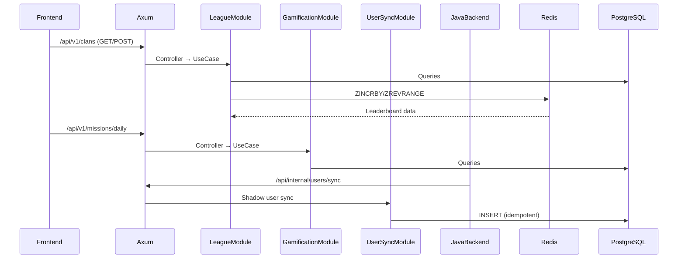
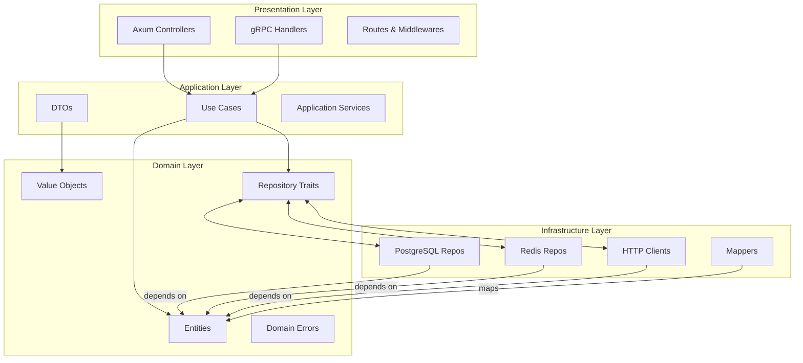
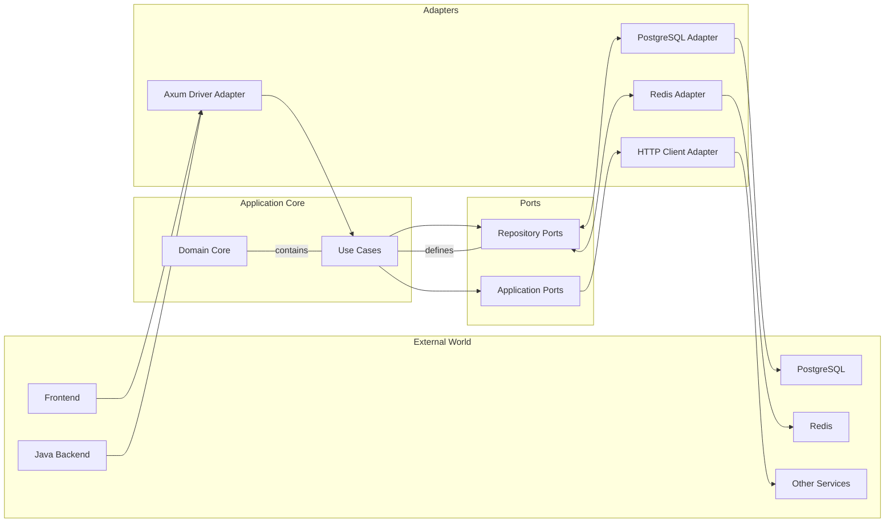

<Callout type="note">
The Rust backend is a high-performance gamification engine built with Axum 0.8.8 and Rust 2024 Edition. It serves as the secondary backend that handles clan management, leaderboards, achievements, and missions — while maintaining shadow user data synced from the Java backend.
</Callout>

## Overview

- **Framework**: Axum 0.8.8, Tower, Tower-HTTP
- **Rust Version**: Edition 2024, MSRV 1.85
- **Port**: 8081 (main), 8082 (gRPC)
- **Purpose**: High-performance gamification engine with Redis-backed leaderboards

## Bounded Contexts

The Rust backend is organized into three distinct bounded contexts:

<Cards>
<Card title="League" href="/docs/backend-rust/league">
Clan lifecycle, membership management, and tiered leaderboards using Redis sorted sets.
</Card>
<Card title="Gamification" href="/docs/backend-rust/gamification">
Achievement tracking, daily missions, reward points, and quiz completion processing.
</Card>
<Card title="User Sync" href="/docs/backend-rust/user-sync">
Shadow user synchronization from Java backend via REST outbox and gRPC services.
</Card>
</Cards>

## Architecture

Clean Architecture (Hexagonal/Ports and Adapters) is applied consistently per module:

<Steps>
<Step title="Domain Layer">
Entities, value objects, repository traits (async-trait), and domain errors (thiserror).
</Step>
<Step title="Application Layer">
DTOs, use cases, and application services that orchestrate domain logic.
</Step>
<Step title="Infrastructure Layer">
PostgreSQL, Redis clients, HTTP clients (reqwest), and external service integrations.
</Step>
<Step title="Presentation Layer">
Axum controllers, routes, gRPC handlers, and middleware setup.
</Step>
</Steps>

### Module Flow

<Callout type="info">
The three modules interact as follows:
</Callout>

<Diagram name="RustBackendArchitecture">

</Diagram>

## Key Dependencies

```toml
[dependencies]
axum = "0.8.8"           # HTTP framework
tower = "0.5.2"          # Middleware stack
tower-http = "0.6.2"     # HTTP middleware (cors, trace, compression)
sqlx = { version = "0.8.2", features = ["postgres", "uuid", "runtime-tokio", "macros"] }
redis = { version = "0.27.2", features = ["tokio-comp", "connection-manager"] }
utoipa = "4.2.3"         # OpenAPI/Swagger docs
thiserror = "2.0.6"      # Error types
tokio = { version = "1.43.0", features = ["full"] }
async-trait = "0.1.88"   # Async traits
prost = "0.13.2"         # Protocol Buffers (gRPC)
tonic = "0.12.3"         # gRPC framework
```

## API Structure

| Prefix | Purpose | Authentication |
|--------|---------|----------------|
| `/api/v1/*` | External gamification endpoints | JWT (via middleware) |
| `/api/internal/*` | Java synchronization endpoints | API key |
| `/grpc/*` | gRPC services | mTLS (optional) |

## Development

```bash
cd yomu-backend-rust
cargo run --release
cargo test --locked
cargo clippy --all-targets --all-features
cargo fmt --check
```

## Monitoring

- `/metrics` — Prometheus metrics endpoint (via `tower-http`)
- `/_health` — Health check endpoint
- OpenAPI spec at `/api-docs/openapi.json`

## Related Documentation

- [Java Backend Overview](/docs/backend-java)
- [Frontend Integration](/docs/frontend)

## Clean Architecture (Hexagonal / Ports & Adapters)

Rust's zero-cost abstractions make it an ideal language for Clean Architecture. This section explains how we apply Hexagonal Architecture to our Axum-based backend, enforcing strict boundaries between domain logic and external concerns.

### What is Clean Architecture?

Clean Architecture is a design philosophy that organizes code into concentric circles, with dependencies pointing inward:

```
┌─────────────────────────────────────┐
│      Presentation Layer             │
│  (Axum, gRPC, Middleware)          │
└──────────────┬──────────────────────┘
               │ depends on
┌──────────────▼──────────────────────┐
│      Application Layer              │
│  (Use Cases, DTOs)                 │
└──────────────┬──────────────────────┘
               │ depends on
┌──────────────▼──────────────────────┐
│      Domain Layer                   │
│  (Entities, Value Objects,        │
│   Repository Traits, Errors)       │
└─────────────────────────────────────┘
```

**The Dependency Rule**: Inner circles (domain) must never depend on outer circles (infrastructure/presentation). This means domain code knows nothing about HTTP, databases, or frameworks.

### Why Clean Architecture for Yomu Rust?

1. **Testability**: Domain logic can be tested in isolation without a database or network
2. **Swappable Infrastructure**: We can swap PostgreSQL for another DB or Redis for another cache without touching domain/use case code
3. **Framework Independence**: Axum and Tonic are just delivery mechanisms — domain logic is framework-agnostic
4. **Enforces Discipline**: The compiler enforces boundaries, preventing team members from accidentally leaking SQL into use cases

```rust
// BAD: Use case depend on concrete PostgreSQL types
async fn create_clan(&self, name: String) -> Result<Clan, SqlxError> {
    // This couples domain logic to a specific database implementation
}

// GOOD: Use case depends on trait (Port)
async fn create_clan(&self, name: String) -> Result<Clan, DomainError> {
    // This depends only on the domain trait, not the implementation
}
```

### Our Four-Layer Implementation

Each bounded context (league, gamification, user_sync) follows this layered structure:

<Diagram name="CleanArchitectureLayers">

</Diagram>

#### Layer Descriptions

**Domain Layer** (`src/modules/league/domain/`)
- **Entities**: `Clan`, `Achievement`, `ShadowUser` — objects with identity
- **Value Objects**: `ClanName`, `Points`, `Badge` — immutable, validated
- **Repository Traits**: `ClanRepository`, `AchievementRepository` — async traits defining operations
- **Errors**: `DomainError` using `thiserror` — domain-specific errors only

Key point: Domain layer has **zero external dependencies** beyond `thiserror`, `uuid`, and `std`.

**Application Layer** (`src/modules/league/application/`)
- **DTOs**: Request/response types for use cases
- **Use Cases**: Business logic coordination, depends ONLY on domain layer
- **Application Services**: Cross-cutting concerns (e.g., transaction management)

**Infrastructure Layer** (`src/modules/league/infrastructure/`)
- **PostgreSQL Repos**: Implement domain repository traits using `sqlx`
- **Redis Repos**: Implement Redis-specific traits using `redis` crate
- **HTTP Clients**: External service integrations (Java backend, OAuth providers)
- **Mappers**: Transform DB rows to domain entities and vice versa

**Presentation Layer** (`src/modules/league/presentation/`)
- **Controllers**: Axum handle functions, convert HTTP to use case calls
- **Routes**: OpenAPI-annotated route definitions
- **Middleware**: Authentication, logging, tracing

### Ports & Adapters (Hexagonal) in Practice

Hexagonal Architecture views the application as a core (domain) with ports (interfaces) that adapters (implementations) connect to:

<Diagram name="PortsAndAdapters">

</Diagram>

**Driving Side** (controllers/adapters that push data in):
- Frontend → Axum Controller → Use Case
- Java Backend → gRPC Handler → Use Case

**Driven Side** (adapters that pull data from the core):
- Use Case → Repository Trait → PostgreSQL/Redis Implementation
- Use Case → External Service Trait → HTTP Client Implementation

### Code Walkthrough

Let's trace the flow for creating a clan through all layers:

#### 1. Domain Layer: Repository Trait (Port)

```rust
// domain/repositories/clan_repository.rs
use crate::domain::entities::Clan;
use crate::domain::errors::DomainError;
use async_trait::async_trait;

#[async_trait]
pub trait ClanRepository {
    async fn find_by_id(&self, id: Uuid) -> Result<Option<Clan>, DomainError>;
    async fn find_by_name(&self, name: &str) -> Result<Option<Clan>, DomainError>;
    async fn create(&self, clan: Clan) -> Result<Clan, DomainError>;
    async fn update(&self, clan: Clan) -> Result<Clan, DomainError>;
    async fn delete(&self, id: Uuid) -> Result<(), DomainError>;
    
    // Leaderboard operations
    async fn add_member_points(
        &self,
        clan_id: Uuid,
        user_id: Uuid,
        points: i32,
    ) -> Result<i64, DomainError>;
    
    async fn get_top_clans(&self, limit: i64) -> Result<Vec<Clan>, DomainError>;
}
```

This trait defines **what** operations exist, not **how** they're implemented. It depends only on domain entities and errors.

#### 2. Application Layer: Use Case (depends ONLY on domain)

```rust
// application/use_cases/create_clan.rs
use crate::domain::entities::Clan;
use crate::domain::errors::DomainError;
use crate::domain::value_objects::ClanName;
use crate::domain::repositories::ClanRepository;
use crate::application::dto::CreateClanRequest;
use async_trait::async_trait;

#[async_trait]
pub trait CreateClanUseCase {
    async fn execute(&self, request: CreateClanRequest) -> Result<Clan, DomainError>;
}

pub struct CreateClanUseCaseImpl<R: ClanRepository> {
    repository: R,
}

impl<R: ClanRepository> CreateClanUseCaseImpl<R> {
    pub fn new(repository: R) -> Self {
        Self { repository }
    }
}

#[async_trait]
impl<R: ClanRepository + Send + Sync> CreateClanUseCase for CreateClanUseCaseImpl<R> {
    async fn execute(&self, request: CreateClanRequest) -> Result<Clan, DomainError> {
        // Validate input
        let name = ClanName::new(request.name)?;
        
        // Check uniqueness
        if self.repository.find_by_name(&name.0).await?.is_some() {
            return Err(DomainError::AlreadyExists("Clan name".to_string()));
        }
        
        // Create domain entity
        let clan = Clan::new(name, request.description, request.created_by_user_id);
        
        // Persist to database via repository trait
        self.repository.create(clan).await
    }
}
```

The use case:
- Depends on `ClanRepository` trait, not a concrete implementation
- Contains business rules (validation, uniqueness checks)
- Returns domain types, not transport types

#### 3. Infrastructure Layer: PostgreSQL Implementation (Adapter)

```rust
// infrastructure/persistence/postgres/clan_repository.rs
use crate::domain::entities::Clan;
use crate::domain::errors::DomainError;
use crate::domain::repositories::ClanRepository;
use sqlx::{PgPool, PgRow};
use uuid::Uuid;
use async_trait::async_trait;
use crate::domain::value_objects::ClanName;

#[derive(Clone)]
pub struct ClanPostgresRepo {
    pool: PgPool,
}

impl ClanPostgresRepo {
    pub fn new(pool: PgPool) -> Self {
        Self { pool }
    }
}

#[async_trait]
impl ClanRepository for ClanPostgresRepo {
    async fn find_by_id(&self, id: Uuid) -> Result<Option<Clan>, DomainError> {
        let row: Option<PgRow> = sqlx::query_as(
            "SELECT id, name, description, created_by_user_id, created_at 
             FROM clans WHERE id = $1"
        )
        .bind(id)
        .fetch_optional(&self.pool)
        .await?;
        
        Ok(row.map(|r| r.into()))
    }
    
    async fn find_by_name(&self, name: &str) -> Result<Option<Clan>, DomainError> {
        let row: Option<PgRow> = sqlx::query_as(
            "SELECT id, name, description, created_by_user_id, created_at 
             FROM clans WHERE name = $1"
        )
        .bind(name)
        .fetch_optional(&self.pool)
        .await?;
        
        Ok(row.map(|r| r.into()))
    }
    
    async fn create(&self, clan: Clan) -> Result<Clan, DomainError> {
        let row: PgRow = sqlx::query_as(
            "INSERT INTO clans (id, name, description, created_by_user_id) 
             VALUES ($1, $2, $3, $4)
             RETURNING id, name, description, created_by_user_id, created_at"
        )
        .bind(clan.id())
        .bind(&clan.name().0)
        .bind(&clan.description())
        .bind(clan.created_by_user_id())
        .fetch_one(&self.pool)
        .await?;
        
        Ok(row.into())
    }
    
    async fn update(&self, clan: Clan) -> Result<Clan, DomainError> {
        let row: PgRow = sqlx::query_as(
            "UPDATE clans 
             SET name = $1, description = $2, created_by_user_id = $3
             WHERE id = $4
             RETURNING id, name, description, created_by_user_id, created_at"
        )
        .bind(&clan.name().0)
        .bind(&clan.description())
        .bind(clan.created_by_user_id())
        .bind(clan.id())
        .fetch_one(&self.pool)
        .await?;
        
        Ok(row.into())
    }
    
    async fn delete(&self, id: Uuid) -> Result<(), DomainError> {
        sqlx::query("DELETE FROM clans WHERE id = $1")
            .bind(id)
            .execute(&self.pool)
            .await?;
        Ok(())
    }
    
    async fn add_member_points(
        &self,
        clan_id: Uuid,
        user_id: Uuid,
        points: i32,
    ) -> Result<i64, DomainError> {
        // Update user's points in clan
        sqlx::query(
            "INSERT INTO clan_members (clan_id, user_id, points) 
             VALUES ($1, $2, $3)
             ON CONFLICT (clan_id, user_id) 
             DO UPDATE SET points = clan_members.points + $3"
        )
        .bind(clan_id)
        .bind(user_id)
        .bind(points)
        .execute(&self.pool)
        .await?;
        
        // Get total clan score for leaderboard
        let row: (i64,) = sqlx::query_as(
            "SELECT COALESCE(SUM(points), 0) as total FROM clan_members WHERE clan_id = $1"
        )
        .bind(clan_id)
        .fetch_one(&self.pool)
        .await?;
        
        Ok(row.0)
    }
    
    async fn get_top_clans(&self, limit: i64) -> Result<Vec<Clan>, DomainError> {
        // Join clans with aggregated member points, order by score
        let rows: Vec<PgRow> = sqlx::query_as(
            "SELECT c.id, c.name, c.description, c.created_by_user_id, c.created_at,
                    COALESCE(SUM(cm.points), 0) as total_points
             FROM clans c
             LEFT JOIN clan_members cm ON c.id = cm.clan_id
             GROUP BY c.id
             ORDER BY total_points DESC
             LIMIT $1"
        )
        .bind(limit)
        .fetch_all(&self.pool)
        .await?;
        
        Ok(rows.into_iter().map(|r| r.into()).collect())
    }
}
```

The PostgreSQL adapter:
- Implements the `ClanRepository` trait
- Uses `sqlx` for database queries
- Maps database rows to domain entities
- Has **no knowledge of HTTP or use cases**

#### 4. Presentation Layer: Axum Controller (Driver Adapter)

```rust
// presentation/api/v1/clans.rs
use axum::{extract::State, Json};
usecrate::domain::errors::ApiError;
use crate::application::use_cases::create_clan::CreateClanUseCase;
use crate::application::dto::{CreateClanRequest, CreateClanResponse};

pub async fn create_clan(
    State(use_case): State<Box<dyn CreateClanUseCase + Send + Sync>>,
    Json(request): Json<CreateClanRequest>,
) -> Result<Json<CreateClanResponse>, ApiError> {
    let result = use_case.execute(request).await?;
    
    Ok(Json(CreateClanResponse::from_domain(result)))
}
```

The controller:
- Receives HTTP request (JSON body)
- Calls the use case with injected dependencies
- Maps domain response to HTTP response
- Uses `State` for dependency injection

### Dependency Injection Pattern

We use constructor injection via generic type parameters instead of a DI framework:

```rust
// presentation/api/v1/routes.rs
use crate::infrastructure::persistence::postgres::clan_repository::ClanPostgresRepo;
use crate::infrastructure::redis::clan_repository::ClanRedisRepo;
use crate::application::use_cases::create_clan::CreateClanUseCaseImpl;
use crate::application::use_cases::get_top_clans::GetTopClansUseCaseImpl;

pub fn create_routes() {
    // Create infrastructure instances
    let pg_repo = ClanPostgresRepo::new(pool);
    let redis_repo = ClanRedisRepo::new(redis_client);
    
    // Wire use cases with dependencies (constructor injection)
    let create_clan_use_case = Box::new(CreateClanUseCaseImpl::new(pg_repo));
    let get_top_clans_use_case = Box::new(GetTopClansUseCaseImpl::new(pg_repo, redis_repo));
    
    // Wire routes with use cases (via State)
    let routes = routes()
        .route("/clans", post(create_clan).with_state(create_clan_use_case))
        .route("/clans/top", get(get_top_clans).with_state(get_top_clans_use_case));
}
```

**Why generic type parameters?**
- Compile-time dependency resolution (no runtime overhead)
- Type-safe, zero-cost abstraction
- No external DI framework needed
- Easy to swap implementations (mocks, fakes) in tests

### File Organization per Module

Each bounded context mirrors the same 4-layer structure:

```
src/modules/
├── league/
│   ├── domain/
│   │   ├── entities/
│   │   │   ├── clan.rs
│   │   │   └── mod.rs
│   │   ├── value_objects/
│   │   │   ├── clan_name.rs
│   │   │   └── mod.rs
│   │   ├── repositories/
│   │   │   ├── clan_repository.rs
│   │   │   └── mod.rs
│   │   ├── errors.rs
│   │   └── mod.rs
│   ├── application/
│   │   ├── dto/
│   │   │   ├── create_clan.rs
│   │   │   └── mod.rs
│   │   ├── use_cases/
│   │   │   ├── create_clan.rs
│   │   │   ├── get_top_clans.rs
│   │   │   └── mod.rs
│   │   └── mod.rs
│   ├── infrastructure/
│   │   ├── persistence/
│   │   │   ├── postgres/
│   │   │   │   ├── clan_repository.rs
│   │   │   │   └── mod.rs
│   │   │   └── mod.rs
│   │   ├── cache/
│   │   │   ├── redis/
│   │   │   │   ├── clan_repository.rs
│   │   │   │   └── mod.rs
│   │   │   └── mod.rs
│   │   └── mod.rs
│   ├── presentation/
│   │   └── api/
│   │       └── v1/
│   │           ├── clans.rs
│   │           ├── routes.rs
│   │           └── mod.rs
│   └── mod.rs
├── gamification/
│   ├── domain/
│   ├── application/
│   ├── infrastructure/
│   └── presentation/
└── user_sync/
    ├── domain/
    ├── application/
    ├── infrastructure/
    └── presentation/
```

Each module is self-contained with clear boundaries. This organization:
- Makes code navigation straightforward
- Encourages bounded context separation
- Allows independent module testing

### Pros and Cons of Clean Architecture in Rust

#### Pros

**Amazing testability**:
```rust
// Tests run without database or async runtime
#[cfg(test)]
mod tests {
    use super::*;
    use mockall::predicate::*;
    
    #[test]
    fn test_create_clan_success() {
        let mut mock_repo = MockClanRepository::new();
        mock_repo.expect_find_by_name().returning(|_| Ok(None));
        mock_repo.expect_create().returning(|c| Ok(c));
        
        let use_case = CreateClanUseCaseImpl::new(mock_repo);
        let result = use_case.execute(create_request()).unwrap();
        
        assert_eq!(result.name().0, "Test Clan");
    }
}
```

**Compiler-enforced boundaries**:
```rust
// Compile error if domain tries to use sqlx
error[E0432]: import `sqlx` is not visible here
  --> domain/entities/clan.rs:1:10
   |
1  | use sqlx::prelude::*;  // <- ERROR: database dependency in domain
```

**Easy refactoring**:
- Change database driver without touching domain/use cases
- Swap Redis cache for another solution
- Replace Axum with another HTTP framework

#### Cons

**More files/boilerplate**:
- Each operation spans multiple layers
- Repository traits + implementations + use cases + controllers
- More code to maintain (but better organized)

**Async-trait overhead**:
```rust
// Each async trait method has a boxed future overhead
#[async_trait]
pub trait ClanRepository {
    async fn find_by_id(&self, id: Uuid) -> Result<Option<Clan>, DomainError>;
    // Compiles to: fn find_by_id(&self, id: Uuid) -> Box<dyn Future<Output = Result<...>>>;
}
```

**Generic type parameters can be verbose**:
```rust
// Verbose but type-safe
impl<R: ClanRepository + Send + Sync> CreateClanUseCaseImpl<R> {
    pub fn new(repository: R) -> Self {
        Self { repository }
    }
}
```

#### Trade-off Assessment

The Rust compiler enforces Clean Architecture boundaries so effectively that the architectural debt is practically impossible to accumulate accidentally. While there's upfront verbosity, the payoff is:

1. **Tests that run in microseconds** (no database setup)
2. **Refactors that the compiler validates**
3. **Teams that can work independently on different modules**

The occasional `use crate::domain::repositories::ClanRepository;` import is a small price for architectural integrity.
