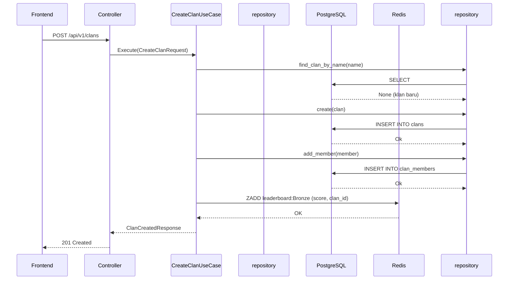
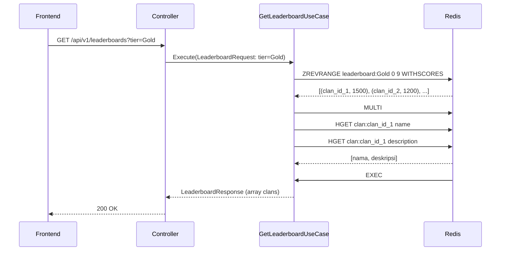

<Callout type="info">
Modul League mengelola siklus hidup klan, keanggotaan, penilaian, dan papan peringkat bertingkat. Ia menggunakan Redis sorted sets untuk kueri papan peringkat berkinerja tinggi dan PostgreSQL untuk data persisten.
</Callout>

## Konteks Terbatas

Modul ini memiliki:

- Pembuatan dan konfigurasi klan
- Siklus hidup keanggotaan klan (bergabung, keluar, naikkan jabatan, hapus)
- Pembaruan skor dan progresi tingkat (tier)
- Kueri papan peringkat berdasarkan tingkat dan peringkat global

## Entitas

```rust
// Entitas Clan dengan tingkat (tier)
pub struct Clan {
    pub id: Uuid,
    pub name: String,
    pub description: Option<String>,
    pub tier: ClanTier,     // Bronze, Silver, Gold, Diamond
    pub current_score: i64,
    pub created_at: DateTime<Utc>,
}

// Keanggotaan klan
pub struct ClanMember {
    pub clan_id: Uuid,
    pub user_id: Uuid,
    pub role: MemberRole,   // Leader, Member
    pub joined_at: DateTime<Utc>,
}

// Value object Score (invarian domain: score >= 0)
pub struct Score(pub i64);

// Enum tingkat
#[derive(Clone, Copy, PartialEq, Eq)]
pub enum ClanTier {
    Bronze,
    Silver,
    Gold,
    Diamond,
}
```

## Trait Repositori

```rust
#[async_trait]
pub trait ClanRepository: Send + Sync {
    async fn create(&self, clan: &Clan) -> Result<(), RepositoryError>;
    async fn get_by_id(&self, id: Uuid) -> Result<Option<Clan>, RepositoryError>;
    async fn add_member(&self, member: &ClanMember) -> Result<(), RepositoryError>;
    async fn is_user_in_any_clan(&self, user_id: Uuid) -> Result<bool, RepositoryError>;
    async fn get_leaderboard(&self, tier: ClanTier, limit: u32) -> Result<Vec<Uuid>, RepositoryError>;
}
```

## Use Case

<Cards>
<Card title="CreateClanUseCase">
Membuat klan baru dengan skor awal berdasarkan tingkat. Memvalidasi keunikan nama klan dan ketersediaan pengguna.
</Card>
<Card title="JoinClanUseCase">
Menangani bergabungnya klan dengan penetapan peran. Memeriksa ukuran klan maksimum dan kelayakan pengguna.
</Card>
<Card title="GetClanDetailUseCase">
Mengembalikan info klan dengan anggota terpaginasi dan posisi papan peringkat.
</Card>
<Card title="GetLeaderboardUseCase">
Mengambil klan teratas dari Redis leaderboard sorted sets berdasarkan tingkat atau global.
</Card>
<Card title="GetUserTierUseCase">
Menghitung dan mengembalikan tingkat pengguna berdasarkan skor klan mereka.
</Card>
</Cards>

## Alur Eksekusi: Buat Klan

<Diagram name="CreateClanSequence">

</Diagram>

## Alur Eksekusi: Dapatkan Papan Peringkat

<Diagram name="LeaderboardSequence">

</Diagram>

## Skema Redis

Sorted sets mempertahankan papan peringkat real-time:

| Kunci | Tujuan | Operasi |
|-----|---------|------------|
| `leaderboard:Bronze` | Papan peringkat tingkat Bronze | ZADD, ZINCRBY, ZREVRANGE |
| `leaderboard:Silver` | Papan peringkat tingkat Silver | ZADD, ZINCRBY, ZREVRANGE |
| `leaderboard:Gold` | Papan peringkat tingkat Gold | ZADD, ZINCRBY, ZREVRANGE |
| `leaderboard:Diamond` | Papan peringkat tingkat Diamond | ZADD, ZINCRBY, ZREVRANGE |
| `leaderboard:global` | Peringkat global gabungan | ZADD, ZINCRBY, ZREVRANGE |

## pattern Pembaruan Skor

Ketika QuizResult dipicu:

```rust
// ZINCRBY memperbarui skor secara atomik
redis::cmd("ZINCRBY")
    .arg("leaderboard:Gold")
    .arg(clan_delta)
    .arg(clan_id)
    .query_async(&mut conn)
    .await?;
```

## Endpoint

<Steps>
<Step title="POST /api/v1/clans">
Membuat klan baru.

```json
{
  "name": "The Code Warriors",
  "description": "Kami menyelesaikan masalah dengan kode",
  "tier": "Gold"
}
```

Respons: `201 Created` dengan `ClanResponse`
</Step>
<Step title="GET /api/v1/clans/:id">
Mengambil detail klan dengan anggota dan posisi papan peringkat.

Respons: `200 OK` dengan `ClanDetailResponse`
</Step>
<Step title="POST /api/v1/clans/:id/join">
Bergabung dengan klan. Memerlukan JWT valid dan pemeriksaan kapasitas klan.

Respons: `200 OK` / `400` (sudah dalam klan) / `404` (klan tidak ditemukan)
</Step>
<Step title="GET /api/v1/leaderboards">
Mendapatkan klan teratas berdasarkan tingkat.

Parameter kueri: `tier=Silver&limit=10`

Respons: `200 OK` dengan `{ clans: [{id, name, score, rank}] }`
</Step>
<Step title="GET /api/v1/users/:user_id/tier">
Mendapatkan info tingkat pengguna melalui klan mereka.

Respons: `200 OK` dengan `{ user_id, clan_id, tier, score }`
</Step>
</Steps>

## Aturan Validasi

- Nama klan: 3-30 karakter, hanya alfanumerik + garis bawah
- Deskripsi: maks 255 karakter
- Maks anggota per klan: 50
- Delta skor harus ≥ 0
- Transisi tingkat: Bronze→Silver→Gold→Diamond (hanya maju)

## Pengujian

- Unit test: entitas domain dan use case (mock mockall)
- Integration test: full stack dengan database uji
- Mocking Redis: `mockall::Mock` untuk perintah Redis