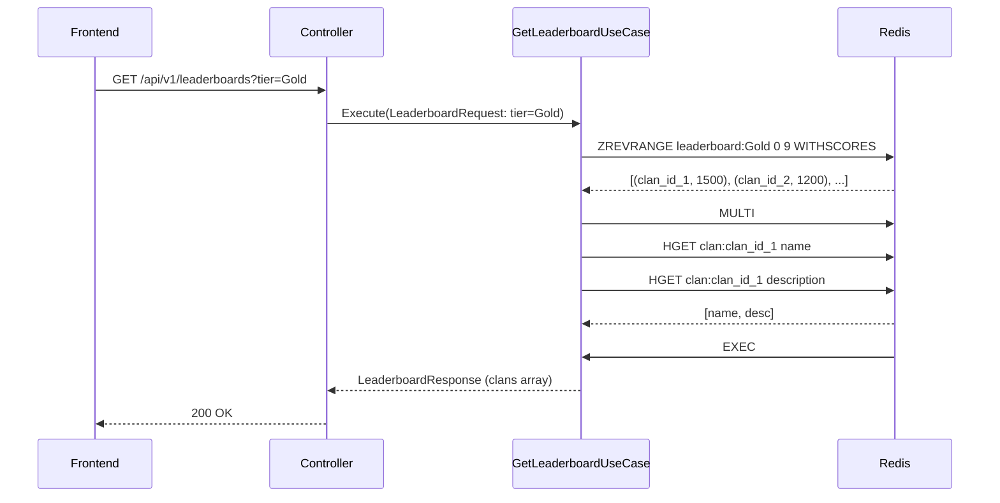

<Callout type="info">
The League module manages clan lifecycle, membership, scoring, and tiered leaderboards. It uses Redis sorted sets for high-performance leaderboard queries and PostgreSQL for persistent data.
</Callout>

## Bounded Context

The module owns:

- Clan creation and configuration
- Clan membership lifecycle (join, leave, promote, remove)
- Score updates and tier progression
- Leaderboard queries by tier and global rank

## Entities

```rust
// Clan entity with tier
pub struct Clan {
    pub id: Uuid,
    pub name: String,
    pub description: Option<String>,
    pub tier: ClanTier,     // Bronze, Silver, Gold, Diamond
    pub current_score: i64,
    pub created_at: DateTime<Utc>,
}

// Clan membership
pub struct ClanMember {
    pub clan_id: Uuid,
    pub user_id: Uuid,
    pub role: MemberRole,   // Leader, Member
    pub joined_at: DateTime<Utc>,
}

// Score value object (domain invariant: score >= 0)
pub struct Score(pub i64);

// Tier enum
#[derive(Clone, Copy, PartialEq, Eq)]
pub enum ClanTier {
    Bronze,
    Silver,
    Gold,
    Diamond,
}
```

## Repository Trait

```rust
#[async_trait]
pub trait ClanRepository: Send + Sync {
    async fn create(&self, clan: &Clan) -> Result<(), RepositoryError>;
    async fn get_by_id(&self, id: Uuid) -> Result<Option<Clan>, RepositoryError>;
    async fn add_member(&self, member: &ClanMember) -> Result<(), RepositoryError>;
    async fn is_user_in_any_clan(&self, user_id: Uuid) -> Result<bool, RepositoryError>;
    async fn get_leaderboard(&self, tier: ClanTier, limit: u32) -> Result<Vec<Uuid>, RepositoryError>;
}
```

## Use Cases

<Cards>
<Card title="CreateClanUseCase">
Creates a new clan with tier-based initial score. Validates clan name uniqueness and user availability.
</Card>
<Card title="JoinClanUseCase">
Handles clan joining with role assignment. Checks for maximum clan size and user eligibility.
</Card>
<Card title="GetClanDetailUseCase">
Returns clan info with paginated members and leaderboard position.
</Card>
<Card title="GetLeaderboardUseCase">
Fetches top clans from Redis leaderboard sorted sets by tier or global.
</Card>
<Card title="GetUserTierUseCase">
Calculates and returns user's tier based on their clan's score.
</Card>
</Cards>

## Execution Flow: Create Clan

<Diagram name="CreateClanSequence">
```mermaid
sequenceDiagram
    participant Frontend
    participant Controller
    participant CreateClanUseCase
    repository as ClanRepository
    participant PostgreSQL
    participant Redis

    Frontend->>Controller: POST /api/v1/clans
    Controller->>CreateClanUseCase: Execute(CreateClanRequest)
    CreateClanUseCase->>repository: find_clan_by_name(name)
    repository->>PostgreSQL: SELECT
    PostgreSQL-->>repository: None (new clan)
    
    CreateClanUseCase->>repository: create(clan)
    repository->>PostgreSQL: INSERT INTO clans
    PostgreSQL-->>repository: Ok
    
    CreateClanUseCase->>repository: add_member(member)
    repository->>PostgreSQL: INSERT INTO clan_members
    PostgreSQL-->>repository: Ok
    
    CreateClanUseCase->>Redis: ZADD leaderboard:Bronze (score, clan_id)
    Redis-->>CreateClanUseCase: OK
    
    CreateClanUseCase-->>Controller: ClanCreatedResponse
    Controller-->>Frontend: 201 Created
```
</Diagram>

## Execution Flow: Get Leaderboard

<Diagram name="LeaderboardSequence">

</Diagram>

## Redis Schema

Sorted sets maintain real-time leaderboards:

| Key | Purpose | Operations |
|-----|---------|------------|
| `leaderboard:Bronze` | Bronze tier leaderboard | ZADD, ZINCRBY, ZREVRANGE |
| `leaderboard:Silver` | Silver tier leaderboard | ZADD, ZINCRBY, ZREVRANGE |
| `leaderboard:Gold` | Gold tier leaderboard | ZADD, ZINCRBY, ZREVRANGE |
| `leaderboard:Diamond` | Diamond tier leaderboard | ZADD, ZINCRBY, ZREVRANGE |
| `leaderboard:global` | Combined global rank | ZADD, ZINCRBY, ZREVRANGE |

## Score Update Pattern

When a QuizResult fires:

```rust
// ZINCRBY updates score atomically
redis::cmd("ZINCRBY")
    .arg("leaderboard:Gold")
    .arg(clan_delta)
    .arg(clan_id)
    .query_async(&mut conn)
    .await?;
```

## Endpoints

<Steps>
<Step title="POST /api/v1/clans">
Create a new clan.

```json
{
  "name": "The Code Warriors",
  "description": "We solve problems with code",
  "tier": "Gold"
}
```

Response: `201 Created` with `ClanResponse`
</Step>
<Step title="GET /api/v1/clans/:id">
Fetch clan detail with members and leaderboard position.

Response: `200 OK` with `ClanDetailResponse`
</Step>
<Step title="POST /api/v1/clans/:id/join">
Join a clan. Requires valid JWT and clan capacity check.

Response: `200 OK` / `400` (already in clan) / `404` (clan not found)
</Step>
<Step title="GET /api/v1/leaderboards">
Get top clans by tier.

Query params: `tier=Silver&limit=10`

Response: `200 OK` with `{ clans: [{id, name, score, rank}] }`
</Step>
<Step title="GET /api/v1/users/:user_id/tier">
Get user's tier info via their clan.

Response: `200 OK` with `{ user_id, clan_id, tier, score }`
</Step>
</Steps>

## Validation Rules

- Clan name: 3-30 chars, alphanumeric + underscores only
- Description: max 255 chars
- Max members per clan: 50
- Score delta must be ≥ 0
- Tier transitions: Bronze→Silver→Gold→Diamond (forward-only)

## Testing

- Unit tests: domain entities and use cases (mockall mocks)
- Integration tests: full stack with test database
- Redis mocking: `mockall::Mock` for Redis commands
