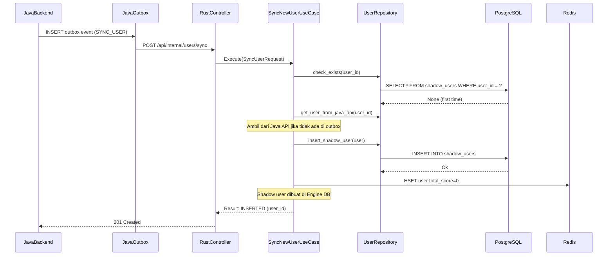
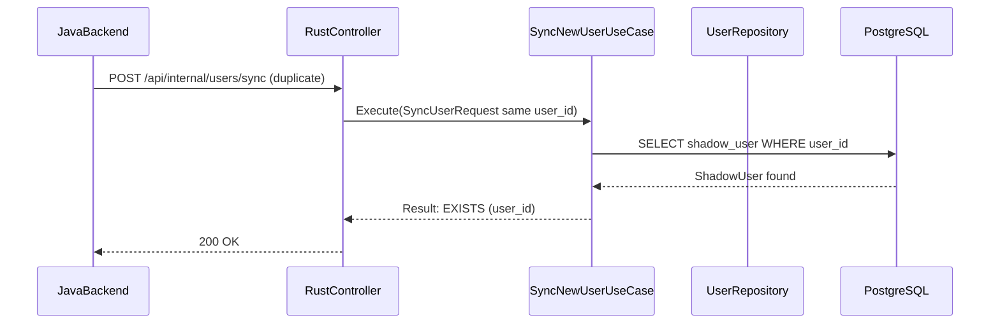

<Callout type="note">
User Sync module memelihara data shadow user di database Rust, yang disinkronisasi dari Core_DB backend Java. Module ini memastikan konsistensi data antara aplikasi Java utama dan engine gamifikasi.
</Callout>

## Tujuan

- **One-way sync**: Java → Rust (shadow users)
- **Idempotency**: Request sync berulang mengembalikan record yang sudah ada
- **Minimal schema**: Hanya menyimpan apa yang diperlukan module Rust
- **Dual interface**: REST untuk outbox sync, gRPC untuk ekspansi di masa depan

## Entities

```rust
// ShadowUser: mirror of Java's user table
#[derive(sqlx::FromRow)]
pub struct ShadowUser {
    pub user_id: Uuid,           // Primary key, synced from Java
    pub total_score: i64,
    pub created_at: DateTime<Utc>,
}

// QuizHistory: quiz result tracking
#[derive(sqlx::FromRow)]
pub struct QuizHistory {
    pub id: Uuid,
    pub user_id: Uuid,           // Foreign key to shadow_users
    pub article_id: Uuid,
    pub score: i32,              // 0-100 accuracy percentage
    pub accuracy: f32,
    pub completed_at: DateTime<Utc>,
}
```

## Repository Trait

```rust
#[async_trait]
pub trait UserRepository: Send + Sync {
    async fn insert_shadow_user(
        &self,
        user: &ShadowUser,
    ) -> Result<(), RepositoryError>;
    
    async fn exists_shadow_user(&self, user_id: Uuid) -> Result<bool, RepositoryError>;
    
    async fn check_exists(
        &self,
        user_id: Uuid,
    ) -> Result<UserCheckResponse, RepositoryError>;
    // Returns: { exists: bool, existing_user: Option<ShadowUser> }
    
    async fn insert_quiz_history(
        &self,
        quiz: &QuizHistory,
    ) -> Result<(), RepositoryError>;
    
    async fn get_user_total_score(&self, user_id: Uuid) -> Result<i64, RepositoryError>;
}
```

## Use Cases

<Cards>
<Card title="SyncNewUserUseCase">
Sync user IDEMPOTEN: memeriksa keberadaan, insert jika tidak ada. Mengembalikan user yang sudah ada pada request duplikat.
</Card>
<Card title="SyncQuizHistoryUseCase">
Sinkronisasi hasil kuis dengan idempotency key. Memicu update gamifikasi.
</Card>
</Cards>

## Execution Flow: Idempotent User Sync

<Diagram name="IdempotentUserSyncSequence">


Jika request duplikat tiba:


</Diagram>

## Endpoints

### REST API

<Steps>
<Step title="POST /api/internal/users/sync">
Sinkronisasi shadow user baru dari Java. Idempoten.

Request:
```json
{
  "user_id": "550e8400-e29b-41d4-a716-446655440000"
}
```

Headers: `X-API-Key: <secret_key>`

Responses:
- `201 Created` (new user inserted)
- `200 OK` (user already exists)
- `401 Unauthorized` (_invalid/no API key)
</Step>
<Step title="POST /api/internal/quiz-history/sync">
Mensinkronisasi hasil quiz history.

Request:
```json
{
  "user_id": "550e8400-e29b-41d4-a716-446655440000",
  "article_id": "123e4567-e89b-41d4-a716-446655440000",
  "score": 85,
  "accuracy": 92.5
}
```

Responses:
- `201 Created` (new record)
- `200 OK` (idempotent duplicate)
- `400 Bad Request` (invalid score/accuracy)
</Step>
</Steps>

### gRPC Services

<Cards>
<Card title="UserSyncService">
gRPC service untuk sinkronisasi user low-latency.

Methods:
- `SyncUser(SyncUserRequest) → SyncUserResponse`
- `GetUser(UserId) → ShadowUser`

Def file: `protos/usersync.proto`
</Card>
<Card title="QuizSyncService">
gRPC service untuk sinkronisasi hasil kuis.

Methods:
- `SyncQuiz(QuizHistoryRequest) → SyncResult`
- `GetUserQuizHistory(UserId) → QuizHistoryResponse`

Def file: `protos/quizsync.proto`
</Card>
</Cards>

## Proto Definitions

```protobuf
// protos/usersync.proto
syntax = "proto3";

package usersync;

message SyncUserRequest {
  string user_id = 1;
}

message SyncUserResponse {
  bool created = 1;
  string user_id = 2;
}

// protos/quizsync.proto
syntax = "proto3";

package quizsync;

message QuizHistoryRequest {
  string user_id = 1;
  string article_id = 2;
  int32 score = 3;
  float accuracy = 4;
}

message SyncResult {
  bool created = 1;
  string message = 2;
}
```

## Database Schema

```sql
-- Shadow users table
CREATE TABLE shadow_users (
    user_id UUID PRIMARY KEY,
    total_score BIGINT NOT NULL DEFAULT 0,
    created_at TIMESTAMPTZ NOT NULL DEFAULT NOW()
);

-- Quiz history table
CREATE TABLE quiz_history (
    id UUID PRIMARY KEY,
    user_id UUID NOT NULL REFERENCES shadow_users(user_id),
    article_id UUID NOT NULL,
    score INT NOT NULL,
    accuracy FLOAT NOT NULL,
    completed_at TIMESTAMPTZ NOT NULL,
    UNIQUE(user_id, article_id)
);

-- Indexes for gamification queries
CREATE INDEX idx_quiz_history_user ON quiz_history(user_id);
CREATE INDEX idx_quiz_history_user_completed ON quiz_history(user_id, completed_at DESC);
```

## Strategi Idempotency

1. **Database constraint**: `UNIQUE(user_id)` mencegah duplikat
2. **Upsert pattern**: `INSERT ... ON CONFLICT (user_id) DO NOTHING`
3. **Redis cache**: Short-lived cache dari user ID yang baru disinkronisasi

```rust
// Idempotent insert
match repository.check_exists(user_id).await? {
    true => Ok(Response::new(user)),   // Already exists
    false => {
        user_repo.insert_shadow_user(&user).await?;
        Ok(Response::new(user))         // Inserted
    }
}
```

## Testing

- **Unit**: `UserRepository` di-mock dengan `mockall`
- **Integration**: Full stack dengan PostgreSQL + Redis
- **Idempotency**: Request sync berulang mengembalikan hasil yang konsisten
- **Validation**: Score tidak valid ditolak sebelum database insert

## Error Handling

| Error | Code | Message |
|-------|------|---------|
| `UserAlreadyExists` | 409 | User already synchronized |
| `InvalidScore` | 400 | Score must be between 0 and 100 |
| `InvalidAccuracy` | 400 | Accuracy must be between 0.0 and 100.0 |
| `ApiKeyInvalid` | 401 | Invalid or missing API key |
