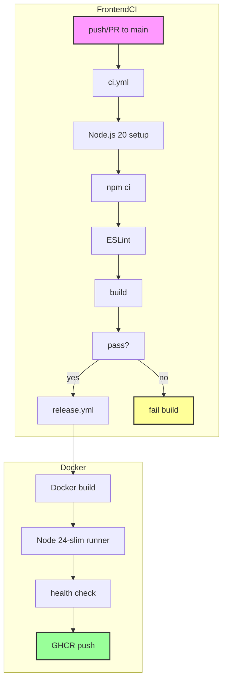

The Next.js frontend uses React 19.2.3 with Tailwind CSS and shadcn/ui components. The pipeline runs ESLint validation, Next.js build, and multi-arch Docker image building. Currently lacks E2E testing framework.



## Workflow Files

<Cards>
<Card title="ci.yml" icon="play">
Node.js 20 setup, npm ci, ESLint, Next.js build. Runs on push/PR to main branch.
</Card>
<Card title="release.yml" icon="package">
Three-stage pipeline: Docker build → lint&build → health check. Pushes multi-arch to GHCR.
</Card>
</Cards>

## Frontend Quality Gates

<Cards>
<Card title="ESLint" icon="linters">
ESLint only (no test framework). Lints src/app, src/components, src/features. Blocks build on lint errors.
</Card>
<Card title="Next.js Build" icon="build">
next build with standalone output mode. Validates build configuration and production readiness.
</Card>
<Card title="Docker Health Check" icon="checkup">
Container starts, checks /health endpoint, verifies response 200 OK. Ensures production readiness.
</Card>
</Cards>

## Frontend Build Tools

| Tool | Version | Purpose |
|------|---------|---------|
| Node.js | 20 | Runtime for CI |
| Node.js | 24-slim | Runtime for Docker |
| Next.js | 16.1.6 | Framework |
| React | 19.2.3 | UI library |
| Tailwind CSS | Latest | Styling |
| ESLint | Latest | Linting |
| shadcn/ui | Latest | Component library |
| Docker | Multi-stage | Image optimization |
| standalone output | Latest | Production build |

## ci.yml Stages

<Cards>
<Card title="Setup" icon="setup">
Checks out code, sets up Node.js 20, runs npm ci for deterministic builds.
</Card>
<Card title="Lint" icon="book">
Runs ESLint on src/app, src/components, src/features. ESLint config in .eslintrc.json.
</Card>
<Card title="Build" icon="build">
Runs next build with standalone output mode. Produces `/.next/standalone` directory.
</Card>
</Cards>

## release.yml Stages

<Cards>
<Card title="Build" icon="package">
Docker buildx build with --platform linux/amd64,linux/arm64. Tags image with version.
</Card>
<Card title="Lint & Build" icon="checklist">
Runs lint and Next.js build inside container. Ensures build works in production-like environment.
</Card>
<Card title="Test Image" icon="test">
Container starts, waits for health check endpoint. Verifies /health returns 200 OK.
</Card>
</Cards>

## Docker Build

```dockerfile
# Multi-stage Dockerfile
# Stage 1: deps (node:24-alpine) - install dependencies
# Stage 2: builder (node:24-alpine) - build Next.js
# Stage 3: runner (node:24-slim) - runtime with non-root user
```

- Uses node:24-slim final image (minimal attack surface)
- Non-root user (node) for security
- Standalone output mode for clean deployment
- Health check endpoint configured in Next.js config

## Current Limitations

<Cards>
<Card title="No Test Framework" icon="x">
No test framework configured. No Jest, no Vitest, no E2E tests. CI only runs lint and build.
</Card>
<Card title="No E2E Tests" icon="browser">
No Playwright or Cypress tests. No visual regression testing. Future enhancement recommended.
</Card>
<Card title="Minimal Validation" icon="shield">
CI validates code quality (ESLint) and build success only. No runtime testing.
</Card>
</Cards>

## Future Improvements

<Cards>
<Card title="Playwright E2E Tests" icon="test">
Add Playwright tests for critical user flows. Test authentication, dashboard, leaderboard pages.
</Card>
<Card title="Visual Regression" icon="eye">
Add Storybook Chromatic or Playwright visual diff. Catch UI regressions before deployment.
</Card>
<Card title="VitePress Docs" icon="docs">
Add VitePress for internal documentation site. Generate API docs from code.
</Card>
</Cards>

## Health Check Endpoint

<Cards>
<Card title="/health" icon="checkup">
Returns 200 OK when container is healthy. Checks database connection, Redis connection, and service status.
</Card>
<Card title="Config" icon="settings">
Configured in `next.config.js` with standalone output mode. Health check integrated into Dockerfile.
</Card>
</Cards>
