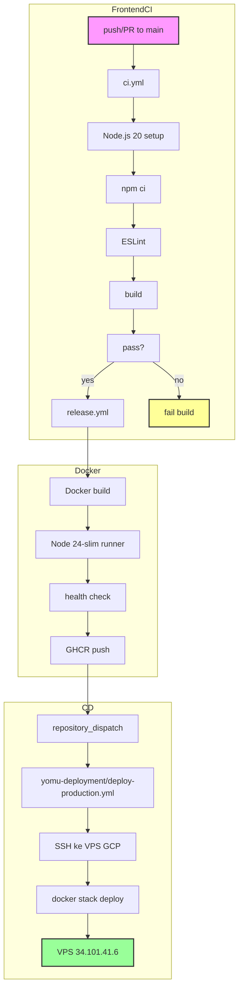

Frontend Next.js menggunakan React 19.2.3 dengan Tailwind CSS dan komponen shadcn/ui. Pipeline menjalankan validasi ESLint, build Next.js, dan pembuatan Docker image multi-arch. Deployment melalui GHCR → yomu-deployment → VPS Docker Swarm. Saat ini belum memiliki E2E testing framework.



## File Workflow

<Cards>
<Card title="ci.yml" icon="play">
Setup Node.js 20, npm ci, ESLint, Next.js build. Berjalan pada push/PR ke branch main.
</Card>
<Card title="release.yml" icon="package">
Pipeline tiga tahap: Docker build → lint&build → health check. Push multi-arch ke GHCR. Mengirim repository_dispatch ke yomu-deployment.
</Card>
</Cards>

## Quality Gate Frontend

<Cards>
<Card title="ESLint" icon="linters">
ESLint saja (tanpa test framework). Lint pada src/app, src/components, src/features. Mem-block build pada lint errors.
</Card>
<Card title="Next.js Build" icon="build">
next build dengan mode standalone output. Memvalidasi konfigurasi build dan kesiapan produksi.
</Card>
<Card title="Docker Health Check" icon="checkup">
Container starts, memeriksa endpoint /health, memverifikasi response 200 OK. Memastikan kesiapan produksi.
</Card>
</Cards>

## Alat Build Frontend

| Alat | Versi | Tujuan |
|------|---------|---------|
| Node.js | 20 | Runtime untuk CI |
| Node.js | 24-slim | Runtime untuk Docker |
| Next.js | 16.1.6 | Framework |
| React | 19.2.3 | UI library |
| Tailwind CSS | Terbaru | Styling |
| ESLint | Terbaru | Linting |
| shadcn/ui | Terbaru | Component library |
| Docker | Multi-stage | Image optimization |
| standalone output | Terbaru | Production build |

## Tahapan ci.yml

<Cards>
<Card title="Setup" icon="setup">
Meng-checkout kode, setup Node.js 20, menjalankan npm ci untuk build deterministik.
</Card>
<Card title="Lint" icon="book">
Menjalankan ESLint pada src/app, src/components, src/features. Konfigurasi ESLint di .eslintrc.json.
</Card>
<Card title="Build" icon="build">
Menjalankan next build dengan mode standalone output. Menghasilkan direktori `/.next/standalone`.
</Card>
</Cards>

## Tahapan release.yml

<Cards>
<Card title="Build" icon="package">
Docker buildx build dengan --platform linux/amd64,linux/arm64. Men-tag image dengan version.
</Card>
<Card title="Lint & Build" icon="checklist">
Menjalankan lint dan Next.js build di dalam container. Memastikan build berfungsi di environment mirip produksi.
</Card>
<Card title="Test Image" icon="test">
Container starts, menunggu health check endpoint. Memverifikasi /health mengembalikan 200 OK.
</Card>
</Cards>

## Build Docker

```dockerfile
# Multi-stage Dockerfile
# Stage 1: deps (node:24-alpine) - install dependencies
# Stage 2: builder (node:24-alpine) - build Next.js
# Stage 3: runner (node:24-slim) - runtime with non-root user
```

- Menggunakan image final node:24-slim (minimal attack surface)
- Non-root user (node) untuk keamanan
- Mode standalone output untuk deployment yang bersih
- Health check endpoint dikonfigurasi di Next.js config

## Deployment

<Cards>
<Card title="Image Registry" icon="registry">
Image: `ghcr.io/advprog-2026-a14-project/yomu-frontend:main` (production) atau `:staging` (staging)
</Card>
<Card title="Trigger Deploy" icon="trigger">
Setelan CI mengirim `repository_dispatch` ke repo yomu-deployment untuk memicu deploy ke VPS. Event type: `deploy-trigger` dengan payload `image_tag`.
</Card>
<Card title="Target Deployment" icon="server">
VPS GCP 34.101.41.6, user: pongo. Deploy via `docker stack deploy -c docker-compose.swarm.yml yomu`.
</Card>
</Cards>

## Alur CD

1. **Release Workflow** — Setelah CI lulus, `release.yml` membuild Docker image dan push ke GHCR
2. **Repository Dispatch** — Workflow mengirim event ke yomu-deployment dengan payload:
   ```json
   {
     "image_tag": "main"
   }
   ```
3. **Deploy Trigger** — `deploy-production.yml` di yomu-deployment menerima event `repository_dispatch`
4. **SSH Connection** — Workflow menggunakan `appleboy/ssh-action` untuk SSH ke VPS
5. **Stack Deploy** — Menjalankan `docker stack deploy` dengan image tag yang sesuai
6. **Rolling Update** — Docker Swarm melakukan rolling update service frontend
7. **Smoke Test** — Verifikasi endpoint root `/` Frontend

<Cards>
<Card title="Deploy Manual" icon="manual">
Gunakan workflow_dispatch di yomu-deployment dengan input `image_tag` untuk deploy manual. Berguna untuk rollback atau deploy hotfix.
</Card>
<Card title="Health Endpoint" icon="checkup">
Health check endpoint `/health` terintegrasi di Dockerfile. Memverifikasi container siap menerima traffic.
</Card>
</Cards>

## Keterbatasan Saat Ini

<Cards>
<Card title="No Test Framework" icon="x">
Tidak ada test framework yang dikonfigurasi. Tidak ada Jest, Vitest, atau E2E tests. CI hanya menjalankan lint dan build.
</Card>
<Card title="No E2E Tests" icon="browser">
Tidak ada Playwright atau Cypress tests. Tidak ada visual regression testing. Enhancement di masa depan direkomendasikan.
</Card>
<Card title="Minimal Validation" icon="shield">
CI hanya memvalidasi kualitas kode (ESLint) dan keberhasilan build. Tidak ada runtime testing.
</Card>
</Cards>

## Perbaikan di Masa Depan

<Cards>
<Card title="Playwright E2E Tests" icon="test">
Menambahkan Playwright tests untuk alur pengguna kritis. Menguji authentication, dashboard, halaman leaderboard.
</Card>
<Card title="Visual Regression" icon="eye">
Menambahkan Storybook Chromatic atau Playwright visual diff. Mendeteksi UI regressions sebelum deployment.
</Card>
<Card title="VitePress Docs" icon="docs">
Menambahkan VitePress untuk situs dokumentasi internal. Membuat API docs dari kode.
</Card>
</Cards>

## Health Check Endpoint

<Cards>
<Card title="/health" icon="checkup">
Mengembalikan 200 OK saat container sehat. Memeriksa koneksi database, koneksi Redis, dan status service.
</Card>
<Card title="Config" icon="settings">
Dikonfigurasi di `next.config.js` dengan mode standalone output. Health check terintegrasi ke dalam Dockerfile.
</Card>
</Cards>

## Tag Image

| Environment | Tag Pattern | Trigger |
|-------------|-------------|---------|
| Production | `main` | Push ke branch main |
| Staging | `staging` | Push ke branch staging |
| Specific | `<commit-sha>` | Workflow dispatch manual |
