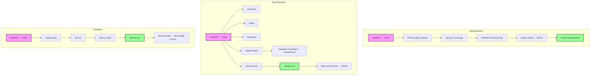

Dokumen ini menjelaskan pipeline CI/CD di ketiga subproyek Yomu. Setiap subproyek mempertahankan workflow GitHub Actions sendiri, tanpa workflow di level root.

<Cards>
<Card title="Kualitas Utama" icon="linters">
PMD 7.0.0, clippy, ESLint menegakkan standar kode. JaCoCo ≥80%, pelacakan tarpaulin.
</Card>
<Card title="Keamanan Diperkuat" icon="shield">
OWASP DepCheck CVSS ≥9.0 memblokir build. Pemindaian mingguan cargo-audit + cargo-deny. Upload SARIF ke tab GitHub Security.
</Card>
<Card title="Docker Teroptimasi" icon="container">
Multi-stage build di semua subproyek. Java menggunakan eclipse-temurin:21-jre, Rust alpine:3.20, Frontend node:24-slim.
</Card>
<Card title="Deployment" icon="rocket">
Java → Heroku (staging + production). Rust + Frontend → GHCR (multi-arch: amd64, arm64).
</Card>
</Cards>

## Matriks Layanan

| Subproyek | CI Workflow | Release Workflow | Security Workflow | CD Workflow |
|------------|-------------|------------------|-------------------|-------------|
| Java | `ci.yml` | `release.yml` | `security-audit.yml` | `cd.yml` |
| Rust | `ci.yml` | `release.yml` | `security-audit.yml` | — |
| Frontend | `ci.yml` | `release.yml` | — | — |

## Prinsip Utama

<Cards>
<Card title="Formatting" icon="code">
Java: Gradle Spotless. Rust: `cargo fmt` dengan lebar 100 karakter. Frontend: Prettier via ESLint.
</Card>
<Card title="Linting" icon="book">
Java: PMD 7.0.0 (prioritas 5). Rust: clippy (MSRV 1.85). Frontend: ESLint (belum ada framework test).
</Card>
<Card title="Testing" icon="test">
Java: JUnit 5 + MockMvc (H2 in-memory DB). Rust: nextest (7 test binaries, 2 retry, timeout 120 detik). Frontend: belum dikonfigurasi.
</Card>
<Card title="Pemindaian Keamanan" icon="shield-check">
Java: OWASP DepCheck (CVSS ≥9.0 memblokir). Rust: cargo-audit + cargo-deny (whitelist deny.toml). Selalu di branch main dan mingguan.
</Card>
<Card title="Docker Build" icon="docker">
Semua subproyek menggunakan multi-stage Dockerfile. Java: 2 stage (builder + runner). Rust: 3 stage. Frontend: 3 stage dengan health check.
</Card>
<Card title="Deployment" icon="cloud">
Java → Heroku (dipicu oleh workflow_run). Rust + Frontend → GHCR saja (manual atau orchestrator eksternal).
</Card>
</Cards>

## Struktur Direktori Workflow

| Subproyek | File Workflow |
|------------|----------------|
| Java | `.github/workflows/ci.yml`, `pmd.yml`, `security-audit.yml`, `release.yml`, `cd.yml` |
| Rust | `.github/workflows/ci.yml`, `sonar.yml`, `security-audit.yml`, `release.yml` |
| Frontend | `.github/workflows/ci.yml`, `release.yml` |

## Tautan

<Cards>
<Card title="Java Pipeline" href="/docs/cicd/java-pipeline">
Gradle PMD, JaCoCo, OWASP, deployment Heroku
</Card>
<Card title="Rust Pipeline" href="/docs/cicd/rust-pipeline">
cargo fmt, clippy, nextest, tarpaulin, SonarCloud
</Card>
<Card title="Frontend Pipeline" href="/docs/cicd/frontend-pipeline">
ESLint, Next.js build, health checks
</Card>
</Cards>
