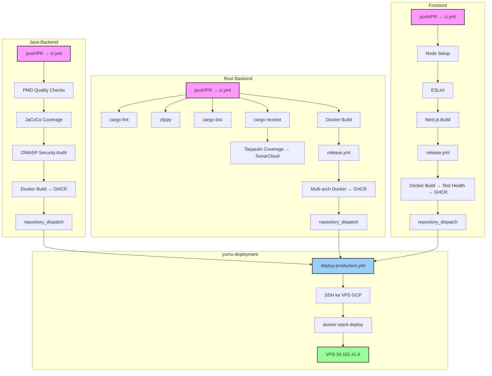

Dokumen ini menjelaskan pipeline CI/CD di ketiga subproyek Yomu. Setiap subproyek mempertahankan workflow GitHub Actions sendiri, tanpa workflow di level root. Semua deployment kini menuju Docker Swarm di VPS GCP melalui yomu-deployment.

<Cards>
<Card title="Kualitas Utama" icon="linters">
PMD 7.0.0, clippy, ESLint menegakkan standar kode. JaCoCo ≥80%, pelacakan tarpaulin.
</Card>
<Card title="Keamanan Diperkuat" icon="shield">
OWASP DepCheck CVSS ≥9.0 memblokir build. Pemindaian mingguan cargo-audit + cargo-deny. Upload SARIF ke tab GitHub Security.
</Card>
<Card title="Docker Teroptimasi" icon="container">
Multi-stage build di semua subproyek. Java menggunakan eclipse-temurin:21-jre, Rust alpine:3.20, Frontend node:24-slim.
</Card>
<Card title="Deployment" icon="rocket">
Semua layanan → GHCR → yomu-deployment → SSH → Docker Swarm di VPS GCP (34.101.41.6). Tag: main (production), staging (staging).
</Card>
</Cards>

## Matriks Layanan

| Subproyek | CI Workflow | Release Workflow | Security Workflow | CD Target |
|------------|-------------|------------------|-------------------|-----------|
| Java | `ci.yml` | `release.yml` | `security-audit.yml` | GHCR → VPS Swarm |
| Rust | `ci.yml` | `release.yml` | `security-audit.yml` | GHCR → VPS Swarm |
| Frontend | `ci.yml` | `release.yml` | — | GHCR → VPS Swarm |

## Prinsip Utama

<Cards>
<Card title="Formatting" icon="code">
Java: Gradle Spotless. Rust: `cargo fmt` dengan lebar 100 karakter. Frontend: Prettier via ESLint.
</Card>
<Card title="Linting" icon="book">
Java: PMD 7.0.0 (prioritas 5). Rust: clippy (MSRV 1.85). Frontend: ESLint (belum ada framework test).
</Card>
<Card title="Testing" icon="test">
Java: JUnit 5 + MockMvc (H2 in-memory DB). Rust: nextest (7 test binaries, 2 retry, timeout 120 detik). Frontend: belum dikonfigurasi.
</Card>
<Card title="Pemindaian Keamanan" icon="shield-check">
Java: OWASP DepCheck (CVSS ≥9.0 memblokir). Rust: cargo-audit + cargo-deny (whitelist deny.toml). Selalu di branch main dan mingguan.
</Card>
<Card title="Docker Build" icon="docker">
Semua subproyek menggunakan multi-stage Dockerfile. Java: 2 stage (builder + runner). Rust: 3 stage. Frontend: 3 stage dengan health check.
</Card>
<Card title="Deployment" icon="cloud">
Semua layanan → GHCR → repository_dispatch → yomu-deployment/deploy-production.yml → SSH → docker stack deploy di VPS Swarm.
</Card>
</Cards>

## Alur Deployment

Setiap subproyek mengikuti alur yang sama:

1. **CI Validation** — Push atau PR memicu `ci.yml` untuk validasi kualitas kode
2. **Docker Build** — Setelah CI lulus, `release.yml` membuild dan push Docker image ke GHCR
3. **Repository Dispatch** — Release workflow mengirim event `repository_dispatch` ke yomu-deployment
4. **Deploy Trigger** — Workflow `deploy-production.yml` di yomu-deployment menerima trigger
5. **SSH ke VPS** — Workflow SSH ke VPS GCP (34.101.41.6, user: pongo)
6. **Swarm Deploy** — Menjalankan `docker stack deploy -c docker-compose.swarm.yml yomu`
7. **Smoke Test** — Verifikasi health endpoint semua layanan

<Cards>
<Card title="Image Tags" icon="tag">
- `main`: Production deployment
- `staging`: Staging deployment
- `<commit-sha>`: Deployment spesifik (via workflow_dispatch)
</Card>
<Card title="VPS Access" icon="key">
SSH menggunakan `appleboy/ssh-action` dengan GCP_SSH_KEY secret. Host: 34.101.41.6, user: pongo.
</Card>
<Card title="Rollback" icon="undo">
Gunakan workflow_dispatch di yomu-deployment dengan image_tag spesifik untuk rollback ke versi sebelumnya.
</Card>
</Cards>

## Struktur Direktori Workflow

| Subproyek | File Workflow |
|------------|----------------|
| Java | `.github/workflows/ci.yml`, `pmd.yml`, `security-audit.yml`, `release.yml` |
| Rust | `.github/workflows/ci.yml`, `sonar.yml`, `security-audit.yml`, `release.yml` |
| Frontend | `.github/workflows/ci.yml`, `release.yml` |
| Deployment | `yomu-deployment/.github/workflows/deploy-production.yml` |

## Tautan

<Cards>
<Card title="Java Pipeline" href="/docs/cicd/java-pipeline">
Gradle PMD, JaCoCo, OWASP, deployment VPS Swarm
</Card>
<Card title="Rust Pipeline" href="/docs/cicd/rust-pipeline">
cargo fmt, clippy, nextest, tarpaulin, SonarCloud
</Card>
<Card title="Frontend Pipeline" href="/docs/cicd/frontend-pipeline">
ESLint, Next.js build, health checks
</Card>
</Cards>
