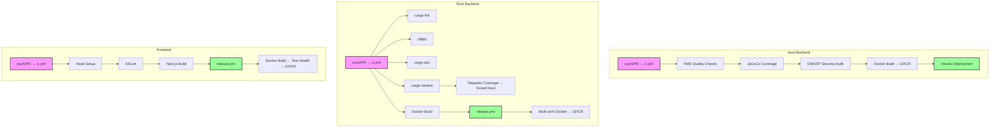

This document describes the CI/CD pipeline across all three Yomu subprojects. Each subproject maintains its own GitHub Actions workflows, with no root-level workflows.

<Cards>
<Card title="Quality First" icon="linters">
PMD 7.0.0, clippy, ESLint enforce code standards. JaCoCo ≥80%, tarpaulin tracking.
</Card>
<Card title="Security Hardened" icon="shield">
OWASP DepCheck CVSS ≥9.0 blocks builds. Cargo-audit + cargo-deny weekly scans. SARIF upload to GitHub Security tab.
</Card>
<Card title="Docker Optimized" icon="container">
Multi-stage builds across all subprojects. Java uses eclipse-temurin:21-jre, Rust alpine:3.20, Frontend node:24-slim.
</Card>
<Card title="Deployment" icon="rocket">
Java → Heroku (staging + production). Rust + Frontend → GHCR (multi-arch: amd64, arm64).
</Card>
</Cards>

## Service Matrix

| Subproject | CI Workflow | Release Workflow | Security Workflow | CD Workflow |
|------------|-------------|------------------|-------------------|-------------|
| Java | `ci.yml` | `release.yml` | `security-audit.yml` | `cd.yml` |
| Rust | `ci.yml` | `release.yml` | `security-audit.yml` | — |
| Frontend | `ci.yml` | `release.yml` | — | — |

## Key Principles

<Cards>
<Card title="Formatting" icon="code">
Java: Gradle Spotless. Rust: `cargo fmt` with 100-char width. Frontend: Prettier via ESLint.
</Card>
<Card title="Linting" icon="book">
Java: PMD 7.0.0 (priority 5). Rust: clippy (MSRV 1.85). Frontend: ESLint (no test framework yet).
</Card>
<Card title="Testing" icon="test">
Java: JUnit 5 + MockMvc (H2 in-memory DB). Rust: nextest (7 test binaries, 2 retries, 120s timeout). Frontend: none configured.
</Card>
<Card title="Security Scanning" icon="shield-check">
Java: OWASP DepCheck (CVSS ≥9.0 blocks). Rust: cargo-audit + cargo-deny (deny.toml whitelist). Always on main branch and weekly.
</Card>
<Card title="Docker Build" icon="docker">
All subprojects use multi-stage Dockerfiles. Java: 2 stages (builder + runner). Rust: 3 stages. Frontend: 3 stages with health check.
</Card>
<Card title="Deployment" icon="cloud">
Java → Heroku (triggered by workflow_run). Rust + Frontend → GHCR only (manual or external orchestrators).
</Card>
</Cards>

## Workflow Directory Structure

| Subproject | Workflow Files |
|------------|----------------|
| Java | `.github/workflows/ci.yml`, `pmd.yml`, `security-audit.yml`, `release.yml`, `cd.yml` |
| Rust | `.github/workflows/ci.yml`, `sonar.yml`, `security-audit.yml`, `release.yml` |
| Frontend | `.github/workflows/ci.yml`, `release.yml` |

## Links

<Cards>
<Card title="Java Pipeline" href="/docs/cicd/java-pipeline">
Gradle PMD, JaCoCo, OWASP, Heroku deployment
</Card>
<Card title="Rust Pipeline" href="/docs/cicd/rust-pipeline">
cargo fmt, clippy, nextest, tarpaulin, SonarCloud
</Card>
<Card title="Frontend Pipeline" href="/docs/cicd/frontend-pipeline">
ESLint, Next.js build, health checks
</Card>
</Cards>
