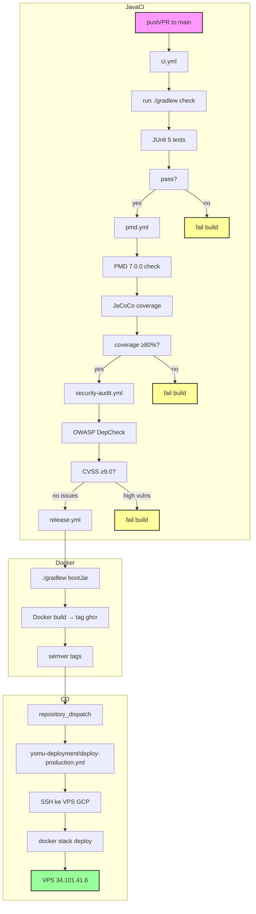

Backend Java menggunakan Gradle Kotlin DSL dengan Java 21 dan Spring Boot 4.0.2. Pipeline terdiri dari empat file workflow dengan quality gate untuk kode, keamanan, dan artifact Docker. Deployment kini melalui GHCR → yomu-deployment → VPS Docker Swarm.



## File Workflow

<Cards>
<Card title="ci.yml" icon="play">
Jalankan pada push/PR ke main. Menjalankan tugas Gradle check. Memicu pmd.yml via workflow_dispatch jika lulus.
</Card>
<Card title="pmd.yml" icon="linters">
PMD 7.0.0 dengan `rulesMinimumPriority=5`. Laporan coverage JaCoCo. Gagal pada masalah kualitas kode atau coverage di bawah 80%.
</Card>
<Card title="security-audit.yml" icon="shield">
OWASP DepCheck dengan `failBuildOnCVSS=9.0`. Upload SARIF ke tab GitHub Security. Berjalan mingguan dan pada dispatch manual.
</Card>
<Card title="release.yml" icon="package">
Tag Docker image dengan semver. Push ke GHCR. Memicu setelah CI sukses. Menggunakan multi-stage build. Mengirim repository_dispatch ke yomu-deployment.
</Card>
</Cards>

## Quality Gate Java

<Cards>
<Card title="Aturan PMD" icon="checklist">
- Tidak ada variabel, metode, atau import yang tidak digunakan
- Hindari metode pendek (panjang > 30)
- Tidak ada catch block kosong
- Tidak ada konflik penamaan variabel lokal
- Semua aturan diatur ke prioritas 5 (minimum)
</Card>
<Card title="Coverage JaCoCo" icon="chart">
- Minimum branch coverage: 80%
- Minimum line coverage: 80%
- Laporan coverage di `build/reports/jacoco`
- Gagal build jika threshold tidak terpenuhi
</Card>
<Card title="OWASP CVSS" icon="radar">
- Threshold severity CVSS: ≥9.0
- Memblokir build jika ditemukan kerentanan kritis
- Hasil SARIF tersedia di tab GitHub Security
- Scan terjadwal mingguan
</Card>
</Cards>

## Alat Build Java

| Alat | Versi | Tujuan |
|------|---------|---------|
| Gradle | Kotlin DSL | Orkestrator build, runner test |
| Java | 21 | Runtime dan target compile |
| Spring Boot | 4.0.2 | Web framework |
| H2 | In-memory | Database test |
| JUnit 5 | Terbaru | Unit testing |
| PMD | 7.0.0 | Analisis kode statis |
| JaCoCo | Terbaru | Code coverage |
| OWASP DepCheck | Terbaru | Scanning vuln dependency |
| Docker | Multi-stage | Optimasi image |

## Kegagalan Quality Gate (Simulasi)

<Cards>
<Card title="Test Case Hilang" icon="failure">
PMD menandai: Metode tidak digunakan, catch block kosong, konflik penamaan variabel lokal. Build gagal.
</Card>
<Card title="Penurunan Coverage" icon="drop">
JaCoCo melaporkan 75% branch coverage (threshold: 80%). Build gagal. Laporan coverage dihasilkan.
</Card>
<Card title="Dependency Rentan" icon="vuln">
OWASP mendeteksi Log4j CVE-2021-44228 (CVSS 10.0). Build diblokir. SARIF diupload ke GitHub Security tab.
</Card>
</Cards>

## Deployment

<Cards>
<Card title="Image Registry" icon="registry">
Image: `ghcr.io/advprog-2026-a14-project/yomu-backend-java:main` (production) atau `:staging` (staging)
</Card>
<Card title="Trigger Deploy" icon="trigger">
Setelan CI mengirim `repository_dispatch` ke repo yomu-deployment untuk memicu deploy ke VPS. Event type: `deploy-trigger` dengan payload `image_tag`.
</Card>
<Card title="Target Deployment" icon="server">
VPS GCP 34.101.41.6, user: pongo. Deploy via `docker stack deploy -c docker-compose.swarm.yml yomu`.
</Card>
</Cards>

## Alur CD

1. **Release Workflow** — Setelah CI lulus, `release.yml` membuild Docker image dan push ke GHCR
2. **Repository Dispatch** — Workflow mengirim event ke yomu-deployment dengan payload:
   ```json
   {
     "image_tag": "main"
   }
   ```
3. **Deploy Trigger** — `deploy-production.yml` di yomu-deployment menerima event `repository_dispatch`
4. **SSH Connection** — Workflow menggunakan `appleboy/ssh-action` untuk SSH ke VPS
5. **Stack Deploy** — Menjalankan `docker stack deploy` dengan image tag yang sesuai
6. **Rolling Update** — Docker Swarm melakukan rolling update service
7. **Smoke Test** — Verifikasi endpoint `/actuator/health/readiness`

<Cards>
<Card title="Deploy Manual" icon="manual">
Gunakan workflow_dispatch di yomu-deployment dengan input `image_tag` untuk deploy manual. Berguna untuk rollback atau deploy hotfix.
</Card>
<Card title="Cross-Repo Trigger" icon="cross">
Subproyek lain dapat memicu deploy infra melalui repository_dispatch. Berguna untuk orchestrasi multi-service.
</Card>
</Cards>

## Build Docker

```dockerfile
# Multi-stage build uses eclipse-temurin:21-jre
# Stage 1: builder (eclipse-temurin:21-jdk)
# Stage 2: runner (eclipse-temurin:21-jre)
```

Image final hanya berisi JRE runtime (bukan JDK), mengurangi attack surface dan ukuran image.

## Tag Image

| Environment | Tag Pattern | Trigger |
|-------------|-------------|---------|
| Production | `main` | Push ke branch main |
| Staging | `staging` | Push ke branch staging |
| Specific | `<commit-sha>` | Workflow dispatch manual |
