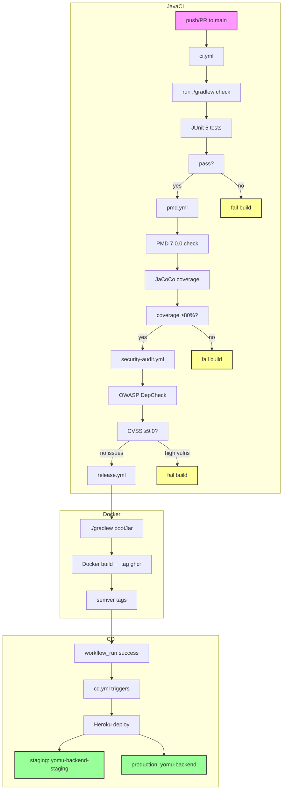

Backend Java menggunakan Gradle Kotlin DSL dengan Java 21 dan Spring Boot 4.0.2. Pipeline terdiri dari lima file workflow dengan quality gate untuk kode, keamanan, dan artifact Docker.



## Workflow Files

<Cards>
<Card title="ci.yml" icon="play">
Runs on push/PR to main. Executes Gradle check task. Triggers pmd.yml via workflow_dispatch if passed.
</Card>
<Card title="pmd.yml" icon="linters">
PMD 7.0.0 with `rulesMinimumPriority=5`. JaCoCo coverage report. Fails on code quality issues or coverage below 80%.
</Card>
<Card title="security-audit.yml" icon="shield">
OWASP DepCheck with `failBuildOnCVSS=9.0`. SARIF upload to GitHub Security tab. Runs weekly and on manual dispatch.
</Card>
<Card title="release.yml" icon="package">
Tags Docker images with semver. Pushes to GHCR. Triggers after successful CI. Uses multi-stage build.
</Card>
<Card title="cd.yml" icon="cloud">
Triggers on `workflow_run` success from ci.yml. Deploys to Heroku with deploy tags (staging/production). URLs included below.
</Card>
</Cards>

## Java Quality Gates

<Cards>
<Card title="PMD Rules" icon="checklist">
- No unused variables, methods, or imports
- Avoid short methods (length > 30)
- No empty catch blocks
- No local variable naming conflicts
- All rules set to priority 5 (minimum)
</Card>
<Card title="JaCoCo Coverage" icon="chart">
- Minimum branch coverage: 80%
- Minimum line coverage: 80%
- Coverage reports in `build/reports/jacoco`
- Fails build if thresholds not met
</Card>
<Card title="OWASP CVSS" icon="radar">
- CVSS severity threshold: ≥9.0
- Blocks build if critical vulnerabilities found
- SARIF results available in GitHub Security tab
- Weekly scheduled scans
</Card>
</Cards>

## Java Build Tools

| Tool | Version | Purpose |
|------|---------|---------|
| Gradle | Kotlin DSL | Build orchestrator, test runner |
| Java | 21 | Runtime and compile target |
| Spring Boot | 4.0.2 | Web framework |
| H2 | In-memory | Test database |
| JUnit 5 | Latest | Unit testing |
| PMD | 7.0.0 | Static code analysis |
| JaCoCo | Latest | Code coverage |
| OWASP DepCheck | Latest | Dependency vuln scanning |
| Docker | Multi-stage | Image optimization |

## Quality Gate Failures (Simulated)

<Cards>
<Card title="Missing Test Case" icon="failure">
PMD flags: Unused method, empty catch block, local variable naming conflict. Build fails.
</Card>
<Card title="Coverage Drop" icon="drop">
JaCoCo reports 75% branch coverage (threshold: 80%). Build fails. Coverage report generated.
</Card>
<Card title="Vulnerable Dependency" icon="vuln">
OWASP detects Log4j CVE-2021-44228 (CVSS 10.0). Build blocks. SARIF uploaded to GitHub Security tab.
</Card>
</Cards>

## Deployment URLs

| Environment | URL | Tag Pattern |
|-------------|-----|-------------|
| Staging | `https://yomu-backend-staging.herokuapp.com` | `deploy/staging/YYYYMMDD-HHMMSS-SHA` |
| Production | `https://yomu-backend.herokuapp.com` | `deploy/production/YYYYMMDD-HHMMSS-SHA` |

## Docker Build

```dockerfile
# Multi-stage build uses eclipse-temurin:21-jre
# Stage 1: builder (eclipse-temurin:21-jdk)
# Stage 2: runner (eclipse-temurin:21-jre)
```

The final image contains only the runtime JRE (not JDK), reducing attack surface and image size.
