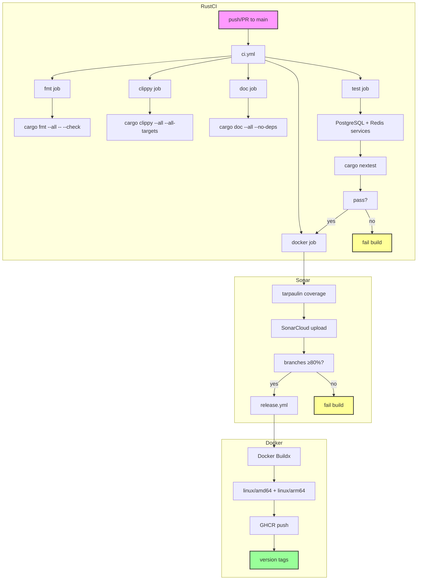

Rust backend menggunakan Edition 2024 dengan MSRV 1.85 dan Axum 0.8.8. Pipeline menjalankan empat workflow files dengan parallel quality jobs, SonarCloud coverage, dan multi-arch Docker builds.

## Workflow Files

<Cards>
<Card title="ci.yml" icon="play">
Empat parallel jobs: fmt, clippy, doc, test (PostgreSQL + Redis). Docker job berjalan terakhir. Semua harus lulus.
</Card>
<Card title="sonar.yml" icon="chart">
tarpaulin coverage → SonarCloud. PostgreSQL + Redis services. Trigger setelah ci.yml sukses.
</Card>
<Card title="security-audit.yml" icon="shield">
cargo-audit + cargo-deny (deny.toml whitelist). Trigger pada perubahan Cargo.toml dan scan mingguan.
</Card>
<Card title="release.yml" icon="package">
Multi-arch Docker build (amd64, arm64). Push ke GHCR dengan version tags. Label SBOM disertakan.
</Card>
</Cards>

## Rust Quality Tools

<Cards>
<Card title="fmt" icon="code">
cargo fmt dengan `max_width=100`. Gagal jika kode tidak diformat. Berjalan pertama di CI pipeline.
</Card>
<Card title="clippy" icon="book">
cargo clippy --all --all-targets dengan MSRV 1.85. Tidak ada warnings yang diizinkan. Clippy.toml dikonfigurasi.
</Card>
<Card title="doc" icon="read">
cargo doc --all --no-deps dengan RUSTDOCFLAGS=-D warnings. Gagal pada doc warnings.
</Card>
<Card title="nextest" icon="test">
cargo nextest dengan 7 test binaries, 2 retries, 120s timeout. PostgreSQL + Redis services.
</Card>
<Card title="tarpaulin" icon="chart">
tarpaulin coverage untuk SonarCloud. Melacak branch dan line coverage. Minimum 80% branches.
</Card>
</Cards>

## Rust Quality Gates

| Tool | Threshold | Purpose |
|------|-----------|---------|
| cargo fmt | harus lulus | Formatting kode |
| clippy | tanpa warnings | Kualitas kode |
| cargo doc | tanpa warnings | Kualitas dokumentasi |
| nextest | lolos semua tests | Kebenaran fungsional |
| tarpaulin | ≥80% branches | Kualitas coverage |
| cargo-audit | tanpa high vulns | Security scanning |
| cargo-deny | cocok whitelist | License compliance |

## Rust Build Tools

| Tool | Version | Purpose |
|------|---------|---------|
| Rust | 1.85 MSRV | Runtime dan compile target |
| Rust Edition | 2024 | Language features |
| Axum | 0.8.8 | Web framework |
| tokio | Latest | Async runtime |
| nextest | Latest | Parallel test runner |
| tarpaulin | Latest | Coverage tool |
| cargo-audit | Latest | Dependency vuln scanning |
| cargo-deny | Latest | License/deny checks |
| Docker | Multi-stage | Image optimization |
| Buildx | Latest | Multi-arch builds |

## Rust CI Pipeline Jobs

<Cards>
<Card title="fmt job" icon="checklist">
Menjalankan `cargo fmt --all -- --check`. Memeriksa formatting tanpa mengubah file. Fast fail jika kode tidak diformat.
</Card>
<Card title="clippy job" icon="linters">
Menjalankan `cargo clippy --all --all-targets -- -W warnings`. Mengaktifkan semua lints dan memperlakukan warnings sebagai error.
</Card>
<Card title="doc job" icon="book">
Menjalankan `cargo doc --all --no-deps`. Mengatur RUSTDOCFLAGS=-D warnings untuk gagal pada doc warnings.
</Card>
<Card title="test job" icon="test">
Menjalankan `cargo nextest`. Memulai PostgreSQL 17 dan Redis 7 services. Membuild dan menjalankan 7 test binaries.
</Card>
<Card title="docker job" icon="docker">
Setelah semua jobs lain lulus, membuild Docker image dengan Buildx. Menjalankan `docker buildx build --platform linux/amd64,linux/arm64`.
</Card>
</Cards>

## Integrasi SonarCloud

<Cards>
<Card title="tarpaulin → SonarCloud" icon="cloud">
Setelah ci.yml lulus, sonar.yml menjalankan tarpaulin coverage dan upload ke SonarCloud. Memerlukan secret SONAR_TOKEN.
</Card>
<Card title="Coverage Metrics" icon="chart">
- Branch coverage dilacak
- Line coverage dilacak
- Code smells dilacak
- Minimum 80% branches diperlukan
</Card>
</Cards>

## Security Scanning

<Cards>
<Card title="cargo-audit" icon="vuln">
Memindai Cargo.lock untuk known vulnerabilities pada dependencies. Berjalan mingguan dan pada manual dispatch.
</Card>
<Card title="cargo-deny" icon="shield">
Memberlakukan deny.toml license whitelist dan advisory database. Mem-block builds jika pelanggaran license atau advisory ditemukan.
</Card>
<Card title="Triggers" icon="clock">
- Scan terjadwal mingguan
- Dipicu ketika Cargo.toml atau Cargo.lock berubah
- Manual dispatch tersedia
</Card>
</Cards>

## Multi-Arch Docker Build

<Cards>
<Card title="Platforms" icon="cpu">
Membangun untuk linux/amd64 dan linux/arm64. Docker Buildx digunakan untuk cross-platform builds.
</Card>
<Card title="Labels" icon="tag">
Label SBOM (Software Bill of Materials) disertakan. Version tags di-push ke GHCR.
</Card>
<Card title="Image Size" icon="compress">
Multi-stage build mengurangi ukuran image final. Base image Rust 1.85 Alpine.
</Card>
</Cards>
