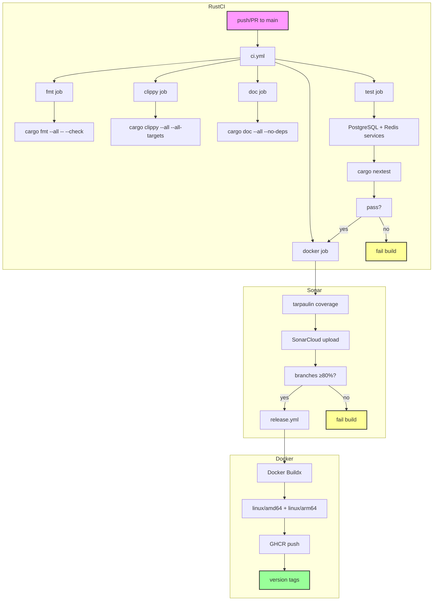

The Rust backend uses Edition 2024 with MSRV 1.85 and Axum 0.8.8. The pipeline runs four workflow files with parallel quality jobs, SonarCloud coverage, and multi-arch Docker builds.

## Workflow Files

<Cards>
<Card title="ci.yml" icon="play">
Four parallel jobs: fmt, clippy, doc, test (PostgreSQL + Redis). Docker job runs last. All must pass.
</Card>
<Card title="sonar.yml" icon="chart">
tarpaulin coverage → SonarCloud. PostgreSQL + Redis services. Triggers after ci.yml success.
</Card>
<Card title="security-audit.yml" icon="shield">
cargo-audit + cargo-deny (deny.toml whitelist). Triggers on Cargo.toml changes and weekly scan.
</Card>
<Card title="release.yml" icon="package">
Multi-arch Docker build (amd64, arm64). Pushes to GHCR with version tags. SBOM labels included.
</Card>
</Cards>

## Rust Quality Tools

<Cards>
<Card title="fmt" icon="code">
cargo fmt with `max_width=100`. Fails if code not formatted. Runs first in CI pipeline.
</Card>
<Card title="clippy" icon="book">
cargo clippy --all --all-targets with MSRV 1.85. No warnings allowed. Clippy.toml configured.
</Card>
<Card title="doc" icon="read">
cargo doc --all --no-deps with RUSTDOCFLAGS=-D warnings. Fails on doc warnings.
</Card>
<Card title="nextest" icon="test">
cargo nextest with 7 test binaries, 2 retries, 120s timeout. PostgreSQL + Redis services.
</Card>
<Card title="tarpaulin" icon="chart">
tarpaulin coverage for SonarCloud. Tracks branch and line coverage. Minimum 80% branches.
</Card>
</Cards>

## Rust Quality Gates

| Tool | Threshold | Purpose |
|------|-----------|---------|
| cargo fmt | must pass | Code formatting |
| clippy | no warnings | Code quality |
| cargo doc | no warnings | Documentation quality |
| nextest | pass all tests | Functional correctness |
| tarpaulin | ≥80% branches | Coverage quality |
| cargo-audit | no high vulns | Security scanning |
| cargo-deny | match whitelist | License compliance |

## Rust Build Tools

| Tool | Version | Purpose |
|------|---------|---------|
| Rust | 1.85 MSRV | Runtime and compile target |
| Rust Edition | 2024 | Language features |
| Axum | 0.8.8 | Web framework |
| tokio | Latest | Async runtime |
| nextest | Latest | Parallel test runner |
| tarpaulin | Latest | Coverage tool |
| cargo-audit | Latest | Dependency vuln scanning |
| cargo-deny | Latest | License/deny checks |
| Docker | Multi-stage | Image optimization |
| Buildx | Latest | Multi-arch builds |

## Rust CI Pipeline Jobs

<Cards>
<Card title="fmt job" icon="checklist">
Runs `cargo fmt --all -- --check`. Checks formatting without modifying files. Fast fail if code not formatted.
</Card>
<Card title="clippy job" icon="linters">
Runs `cargo clippy --all --all-targets -- -W warnings`. Enables all lints and treats warnings as errors.
</Card>
<Card title="doc job" icon="book">
Runs `cargo doc --all --no-deps`. Sets RUSTDOCFLAGS=-D warnings to fail on documentation warnings.
</Card>
<Card title="test job" icon="test">
Runs `cargo nextest`. Starts PostgreSQL 17 and Redis 7 services. Builds and runs 7 test binaries.
</Card>
<Card title="docker job" icon="docker">
After all other jobs pass, builds Docker image with Buildx. Runs `docker buildx build --platform linux/amd64,linux/arm64`.
</Card>
</Cards>

## SonarCloud Integration

<Cards>
<Card title="tarpaulin → SonarCloud" icon="cloud">
After ci.yml passes, sonar.yml runs tarpaulin coverage and uploads to SonarCloud. Requires SONAR_TOKEN secret.
</Card>
<Card title="Coverage Metrics" icon="chart">
- Branch coverage tracked
- Line coverage tracked
- Code smells tracked
- Minimum 80% branches required
</Card>
</Cards>

## Security Scanning

<Cards>
<Card title="cargo-audit" icon="vuln">
Scans Cargo.lock for known vulnerabilities in dependencies. Runs weekly and on manual dispatch.
</Card>
<Card title="cargo-deny" icon="shield">
Enforces deny.toml license whitelist and advisory database. Blocks builds if license or advisory violations found.
</Card>
<Card title="Triggers" icon="clock">
- Weekly scheduled scan
- Triggered when Cargo.toml or Cargo.lock changes
- Manual dispatch available
</Card>
</Cards>

## Multi-Arch Docker Build

<Cards>
<Card title="Platforms" icon="cpu">
Builds for linux/amd64 and linux/arm64. Docker Buildx used for cross-platform builds.
</Card>
<Card title="Labels" icon="tag">
SBOM (Software Bill of Materials) labels included. Version tags pushed to GHCR.
</Card>
<Card title="Image Size" icon="compress">
Multi-stage build reduces final image size. Rust 1.85 Alpine base image.
</Card>
</Cards>
