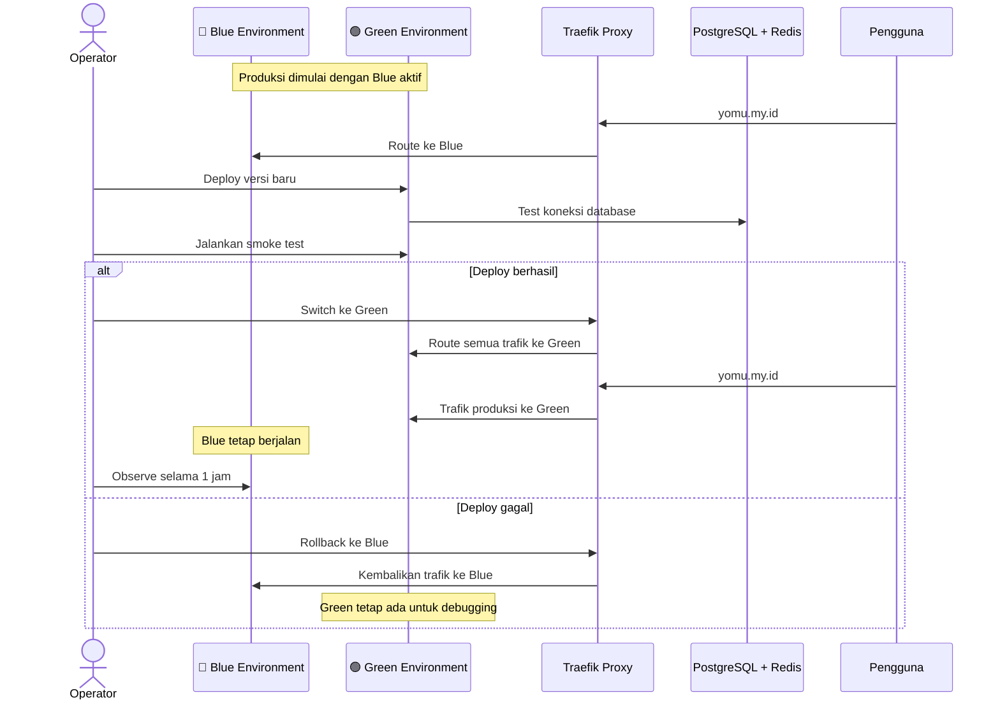
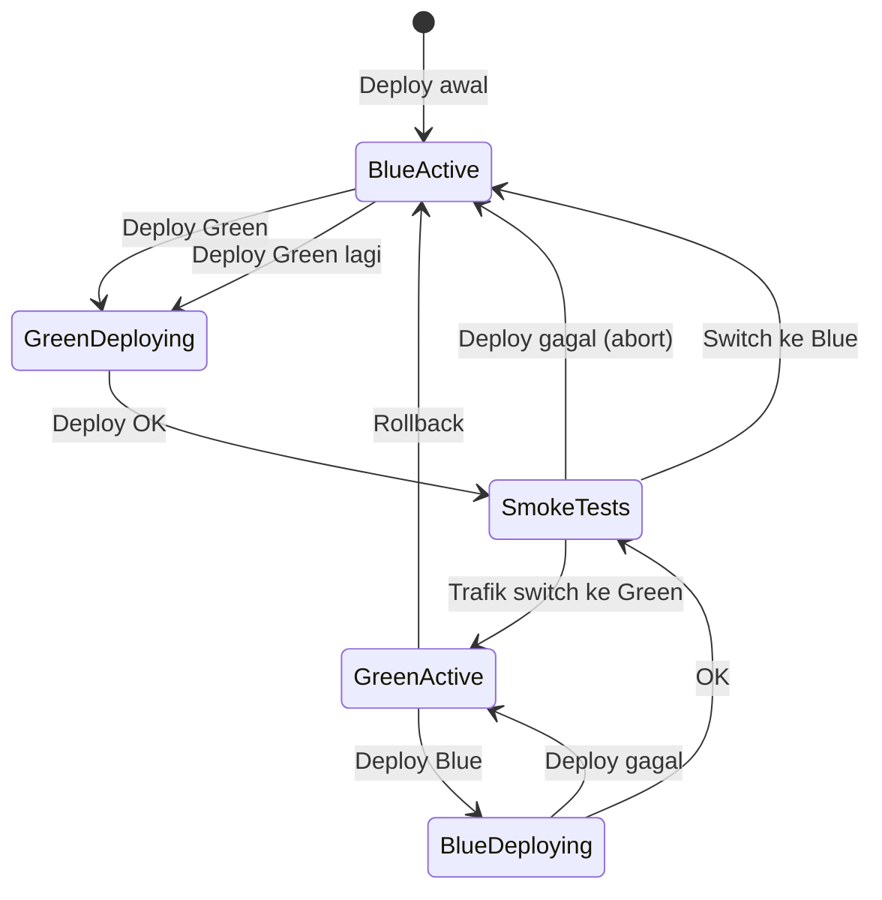
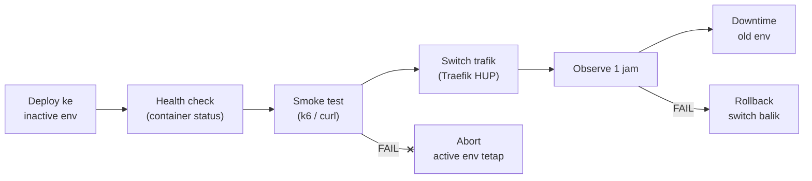

Blue-green deployment memastikan rilis versi baru tanpa downtime dengan memelihara dua environment identik (blue dan green). Hanya satu environment yang menerima trafik produksi pada satu waktu.

## Alur Kerja Blue-Green



## State Machine Deployment



## File Konfigurasi Routing

Traefik mengawasi folder `/etc/traefik/dynamic/`. Switch dilakukan dengan mengganti file `routing.yml` dengan isi dari `blue-active.yml` atau `green-active.yml`:

```bash
cp traefik/dynamic/green-active.yml traefik/dynamic/routing.yml
docker kill --signal=HUP traefik
```

Perubahan routing tanpa restart container, bersifat seketika.

### Contoh `blue-active.yml`

```yaml
http:
  routers:
    frontend-router:
      rule: "Host(`yomu.my.id`) || PathPrefix(`/`)"
      service: frontend-blue
      entryPoints:
        - web
    java-router:
      rule: "PathPrefix(`/api/java`)"
      service: java-blue
      middlewares:
        - strip-java-prefix
  middlewares:
    strip-java-prefix:
      stripPrefix:
        prefixes:
          - "/api/java"
  services:
    frontend-blue:
      loadBalancer:
        servers:
          - url: "http://frontend-blue:3000"
    java-blue:
      loadBalancer:
        servers:
          - url: "http://java-blue:8080"
```

## Skrip Deployment

| Skrip | Fungsi |
|-------|--------|
| `./scripts/deploy-blue.sh` | Deploy environment Blue, tunggu health |
| `./scripts/deploy-green.sh` | Deploy environment Green, tunggu health |
| `./scripts/switch-traffic.sh blue` | Alihkan trafik produksi ke Blue |
| `./scripts/switch-traffic.sh green` | Alihkan trafik produksi ke Green |
| `./scripts/rollback.sh` | Deteksi environment aktif, rollback ke lawannya |
| `./scripts/full-deploy.sh --target green --image-tag v1.2.0` | Pipeline lengkap: deploy, health check, smoke test, switch |

### Pipeline Full Deploy



## Manfaat Blue-Green

| Manfaat | Deskripsi |
|---------|-----------|
| **Zero Downtime** | Peralihan trafik seketika tanpa interrupt |
| **Rollback Instan** | Kembalikan ke environment sebelumnya dalam 1 detik |
| **Safe Testing** | Uji versi baru dengan trafik nyata sebelum switch |
| **Isolasi Lengkap** | Blue dan Green tidak berbagi runtime — port, jaringan, dan proses terpisah |
| **Recovery Cepat** | Jika Green gagal, Blue tetap siap melayani |

## Praktik Terbaik

- Setelah switch ke environment baru, biarkan environment lama tetap berjalan selama **1–2 jam** untuk memastikan stabilitas sebelum dihentikan.
- Jalankan **smoke test** (via skrip atau k6) sebelum switch.
- Gunakan **monitoring** aktif pada saat switch untuk mendeteksi lonjakan error rate atau latency.
- Environment yang tidak aktif dapat dijadikan **staging sementara** untuk pengujian internal.
