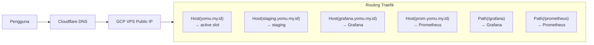

Platform Yomu dideploy di domain publik `yomu.my.id` dengan subdomain untuk staging dan monitoring.

## DNS Records

| Record | Type | Target | Keterangan |
|--------|------|--------|------------|
| `yomu.my.id` | A | VPS Public IP (GCP) | Produksi utama |
| `staging.yomu.my.id` | CNAME atau A | VPS Public IP | Staging environment |
| `grafana.yomu.my.id` | CNAME atau A | VPS Public IP | Dashboard Grafana |
| `prom.yomu.my.id` | CNAME atau A | VPS Public IP | Prometheus (dengan restriksi akses) |

## Routing Matrix



## Struktur Path Produksi

| Path | Router | Target | Middleware |
|------|--------|--------|------------|
| `yomu.my.id/` | `frontend-router` | `frontend-(blue/green)` | — |
| `yomu.my.id/api/java/*` | `java-router` | `java-(blue/green)` | `strip-java-prefix` |
| `yomu.my.id/api/rust/*` | `rust-router` | `rust-(blue/green)` | `strip-rust-prefix` |
| `yomu.my.id/grafana/*` | `grafana-router` | grafana@docker | `strip-grafana-prefix` |
| `yomu.my.id/prometheus/*` | `prometheus-router` | prometheus@docker | `strip-prometheus-prefix` |

## Struktur Path Staging

| Path | Router | Target | Middleware |
|------|--------|--------|------------|
| `staging.yomu.my.id/` | `staging-frontend-router` | `frontend-staging` | — |
| `staging.yomu.my.id/api/java/*` | `staging-java-router` | `java-staging` | `staging-strip-java-prefix` |
| `staging.yomu.my.id/api/rust/*` | `staging-rust-router` | `rust-staging` | `staging-strip-rust-prefix` |

## Opsi TLS/HTTPS

### 1. Let's Encrypt via Traefik (Recommended)

Aktifkan TLS otomatis dengan uncomment block di `traefik/traefik.yml`:

```yaml
certificatesResolvers:
  letsencrypt:
    acme:
      tlsChallenge: {}
      email: admin@yomu.my.id
      storage: /etc/traefik/acme.json
```

Traefik akan secara otomatis:
- Request sertifikat dari Let's Encrypt
- Menyimpan ke `/etc/traefik/acme.json`
- Renew otomatis saat mendekati kedaluwarsa

Tambahkan label ke router:

```yaml
routers:
  frontend-router:
    rule: "Host(`yomu.my.id`)"
    tls:
      certResolver: letsencrypt
```

### 2. Cloudflare Origin Certificates

Download Cloudflare origin certificate dari dashboard Cloudflare, simpan ke `traefik/certificates/`, dan konfigurasi di dynamic config:

```yaml
tls:
  certificates:
    - certFile: /etc/traefik/certs/origin.pem
      keyFile: /etc/traefik/certs/origin-key.pem
```

### 3. Self-Signed (Hanya Staging)

```bash
openssl req -x509 -nodes -days 365 -newkey rsa:2048 \
  -keyout traefik/certificates/staging-key.pem \
  -out traefik/certificates/staging.pem \
  -subj "/CN=staging.yomu.my.id"
```

Mount ke Traefik dan konfigurasi sebagai `tls` di router staging.

## Keamanan

| Aspek | Konfigurasi |
|-------|-------------|
| Grafana sign-up | Disabled (`GF_USERS_ALLOW_SIGN_UP: false`) |
| Grafana default user | `admin` + password dari `.env` |
| Prometheus | Via Traefik PathPrefix (bisa tambahkan auth middleware) |
| Traefik dashboard | `:3001` — bind ke localhost atau tambahkan IP restriksi |
| DB password | Via `.env`, tidak ter-commit ke repo |
| Internal API key | `INTERNAL_API_KEY` + `JAVA_CORE_API_KEY` di `.env` |
