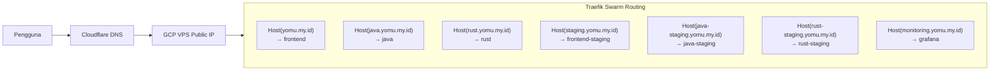

Platform Yomu dideploy di domain publik `yomu.my.id` dengan routing berbasis subdomain untuk production, staging, dan monitoring.

## DNS Records

| Record | Type | Target | Keterangan |
|--------|------|--------|------------|
| `yomu.my.id` | A | VPS Public IP (GCP) | Frontend production |
| `java.yomu.my.id` | A | VPS Public IP (GCP) | Java backend production |
| `rust.yomu.my.id` | A | VPS Public IP (GCP) | Rust backend production |
| `staging.yomu.my.id` | A | VPS Public IP (GCP) | Frontend staging |
| `java-staging.yomu.my.id` | A | VPS Public IP (GCP) | Java backend staging |
| `rust-staging.yomu.my.id` | A | VPS Public IP (GCP) | Rust backend staging |
| `monitoring.yomu.my.id` | A | VPS Public IP (GCP) | Grafana dashboard |

## Routing Matrix



## Routing Subdomain Production

| Subdomain | Router | Target Service | Traefik Label |
|-----------|--------|----------------|---------------|
| `yomu.my.id` | `frontend-router` | `frontend` | `Host(\`yomu.my.id\`)` |
| `java.yomu.my.id` | `java-router` | `java` | `Host(\`java.yomu.my.id\`)` |
| `rust.yomu.my.id` | `rust-router` | `rust` | `Host(\`rust.yomu.my.id\`)` |

## Routing Subdomain Staging

| Subdomain | Router | Target Service | Traefik Label |
|-----------|--------|----------------|---------------|
| `staging.yomu.my.id` | `staging-frontend-router` | `frontend-staging` | `Host(\`staging.yomu.my.id\`)` |
| `java-staging.yomu.my.id` | `staging-java-router` | `java-staging` | `Host(\`java-staging.yomu.my.id\`)` |
| `rust-staging.yomu.my.id` | `staging-rust-router` | `rust-staging` | `Host(\`rust-staging.yomu.my.id\`)` |

## Routing Monitoring

| Subdomain | Router | Target Service | Traefik Label |
|-----------|--------|----------------|---------------|
| `monitoring.yomu.my.id` | `grafana-router` | `grafana` | `Host(\`monitoring.yomu.my.id\`)` |

## Konfigurasi Traefik Labels

Routing dikonfigurasi via labels di `docker-compose.swarm.yml`:

```yaml
services:
  frontend:
    deploy:
      labels:
        - "traefik.enable=true"
        - "traefik.http.routers.frontend.rule=Host(`yomu.my.id`)"
        - "traefik.http.routers.frontend.entrypoints=websecure"
        - "traefik.http.routers.frontend.tls=true"
        - "traefik.http.routers.frontend.tls.certresolver=letsencrypt"
  
  java:
    deploy:
      labels:
        - "traefik.enable=true"
        - "traefik.http.routers.java.rule=Host(`java.yomu.my.id`)"
        - "traefik.http.routers.java.entrypoints=websecure"
        - "traefik.http.routers.java.tls=true"
        - "traefik.http.routers.java.tls.certresolver=letsencrypt"
  
  rust:
    deploy:
      labels:
        - "traefik.enable=true"
        - "traefik.http.routers.rust.rule=Host(`rust.yomu.my.id`)"
        - "traefik.http.routers.rust.entrypoints=websecure"
        - "traefik.http.routers.rust.tls=true"
        - "traefik.http.routers.rust.tls.certresolver=letsencrypt"
```

## Opsi TLS/HTTPS

### 1. Let's Encrypt via Traefik (Recommended)

Aktifkan TLS otomatis dengan konfigurasi di `traefik.yml`:

```yaml
certificatesResolvers:
  letsencrypt:
    acme:
      tlsChallenge: {}
      email: admin@yomu.my.id
      storage: /etc/traefik/acme.json
```

Traefik akan secara otomatis:
- Request sertifikat dari Let's Encrypt
- Menyimpan ke `/etc/traefik/acme.json`
- Renew otomatis saat mendekati kedaluwarsa

### 2. Cloudflare Origin Certificates

Download Cloudflare origin certificate dari dashboard Cloudflare, simpan ke `traefik/certificates/`, dan konfigurasi di dynamic config:

```yaml
tls:
  certificates:
    - certFile: /etc/traefik/certs/origin.pem
      keyFile: /etc/traefik/certs/origin-key.pem
```

### 3. Self-Signed (Hanya Staging)

```bash
openssl req -x509 -nodes -days 365 -newkey rsa:2048 \
  -keyout traefik/certificates/staging-key.pem \
  -out traefik/certificates/staging.pem \
  -subj "/CN=staging.yomu.my.id"
```

Mount ke Traefik dan konfigurasi sebagai `tls` di router staging.

## Keamanan

| Aspek | Konfigurasi |
|-------|-------------|
| Grafana sign-up | Disabled (`GF_USERS_ALLOW_SIGN_UP: false`) |
| Grafana default user | `admin` + password dari `.env` |
| Prometheus | Via Traefik subdomain (bisa tambahkan auth middleware) |
| Traefik dashboard | `:3001` — bind ke localhost atau tambahkan IP restriksi |
| DB password | Via `.env`, tidak ter-commit ke repo |
| Internal API key | `INTERNAL_API_KEY` + `JAVA_CORE_API_KEY` di `.env` |
