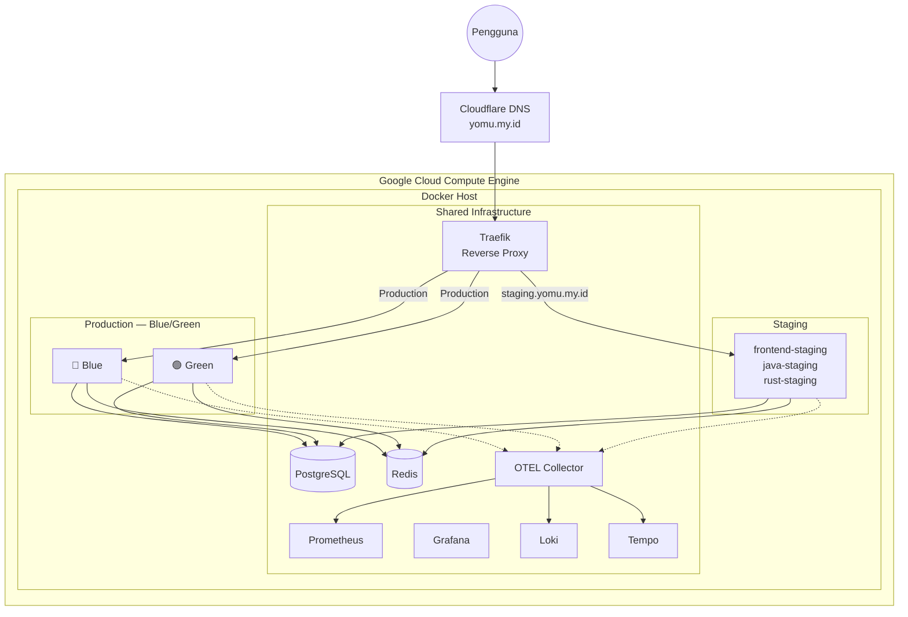

Platform Yomu dideploy pada satu **Google Cloud Compute Engine (VPS)** dengan arsitektur **Docker Compose** yang memisahkan layanan berdasarkan lingkungannya.

## Target Deployment

| Komponen | Detail |
|----------|--------|
| **Cloud Provider** | Google Cloud Platform (GCP) |
| **Compute** | Compute Engine VM (VPS) — Ubuntu LTS |
| **Domain** | `yomu.my.id` |
| **Orchestration** | Docker Compose v2 |
| **Reverse Proxy** | Traefik v3.1 |
| **Container Registry** | GitHub Container Registry (GHCR) |

## Arsitektur Deployment

## Lingkungan

| Lingkungan | Domain | Strategi | Database |
|------------|--------|----------|----------|
| **Production** | `yomu.my.id` | Blue-Green (satu aktif) | `yomu_db`, `yomu_engine` |
| **Staging** | `staging.yomu.my.id` | Always-on | `yomu_db_staging`, `yomu_engine_staging` |

## Navigasi Sub-bagian

<Cards>
  <Card title="Blue-Green Deployment" icon="🔵🟢" href="/docs/deployment/blue-green">
    Mekanisme routing, skrip deploy, switch traffic, dan rollback
  </Card>
  <Card title="Observabilitas" icon="📊" href="/docs/deployment/observability">
    Metrics (Prometheus), logs (Loki), traces (Tempo), dashboards (Grafana)
  </Card>
  <Card title="Jaringan" icon="🌐" href="/docs/deployment/network">
    Isolasi jaringan Docker, DNS, dan arsitektur routing
  </Card>
  <Card title="Domain & TLS" icon="🔒" href="/docs/deployment/domain">
    DNS records, sertifikat TLS, dan konfigurasi Traefik
  </Card>
</Cards>
