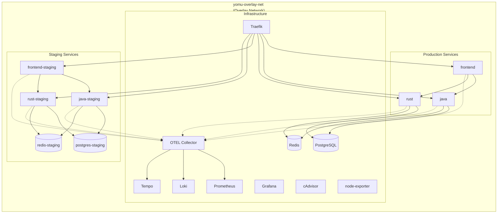
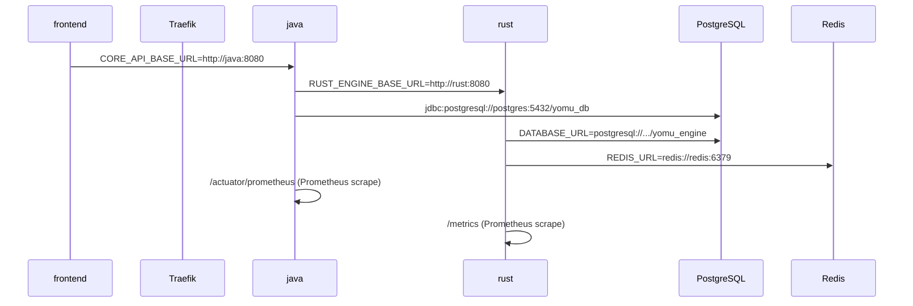
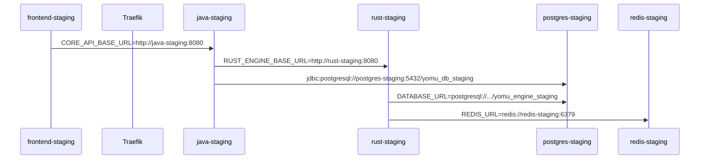

Platform Yomu menggunakan **satu overlay network** Docker Swarm untuk menghubungkan semua layanan dalam stack terkoordinasi.

## Arsitektur Jaringan



## Konfigurasi Network

| Jaringan | Anggota | Tujuan |
|----------|---------|--------|
| `yomu-overlay-net` | Semua services (infra + prod + staging) | Service discovery, komunikasi internal, telemetry |

### Overlay Network Setup

```bash
# Buat overlay network sebelum deploy stack
docker network create -d overlay --attachable yomu-overlay-net

# Deploy stack dengan network
docker stack deploy -c docker-compose.swarm.yml yomu
```

### Service Discovery

Semua service discovery menggunakan **nama service Docker** dalam overlay network:

- `frontend`, `java`, `rust` → Production services
- `frontend-staging`, `java-staging`, `rust-staging` → Staging services
- `postgres`, `redis` → Production database
- `postgres-staging`, `redis-staging` → Staging database
- `otel-collector`, `prometheus`, `grafana` → Observability

Docker Swarm secara otomatis membuat DNS entries untuk setiap service name.

## Port Expose

| Layanan | Port Publik (Host) | Port Internal (Container) |
|---------|-------------------|---------------------------|
| Traefik Web | :80 | :80 |
| Traefik WebSecure | :443 | :443 |
| Traefik Dashboard | :3001 | :8080 |
| Prometheus | — (via Traefik /prometheus) | :9090 |
| Grafana | — (via Traefik /grafana) | :3000 |
| Loki | — (internal only) | :3100 |
| Tempo | — (internal only) | :3200, :4317, :4318 |
| OTEL Collector | — (internal only) | :4317, :4318, :8889 |
| cAdvisor | — (internal only) | :8080 |
| node-exporter | — (internal only) | :9100 |
| postgres-exporter | — (internal only) | :9187 |
| redis-exporter | — (internal only) | :9121 |

**Semua aplikasi** tidak memiliki port mapping ke host — akses hanya melalui Traefik reverse proxy dengan routing subdomain.

## Routing Internal Antar Service



### Routing Staging



## Traefik Swarm Provider

Traefik menggunakan **Docker Swarm provider** untuk auto-discovery services via labels:

```yaml
# traefik configuration
providers:
  docker:
    endpoint: "unix:///var/run/docker.sock"
    exposedByDefault: false
    swarmModeRefreshSeconds: 5
```

### Service Labels

Setiap service mendefinisikan routing via labels di `docker-compose.swarm.yml`:

```yaml
services:
  frontend:
    image: ghcr.io/yomu/frontend:latest
    deploy:
      labels:
        - "traefik.enable=true"
        - "traefik.http.routers.frontend.rule=Host(`yomu.my.id`)"
        - "traefik.http.routers.frontend.entrypoints=websecure"
        - "traefik.http.routers.frontend.tls=true"
```

Traefik secara otomatis mendeteksi service baru dan update routing table tanpa restart.
