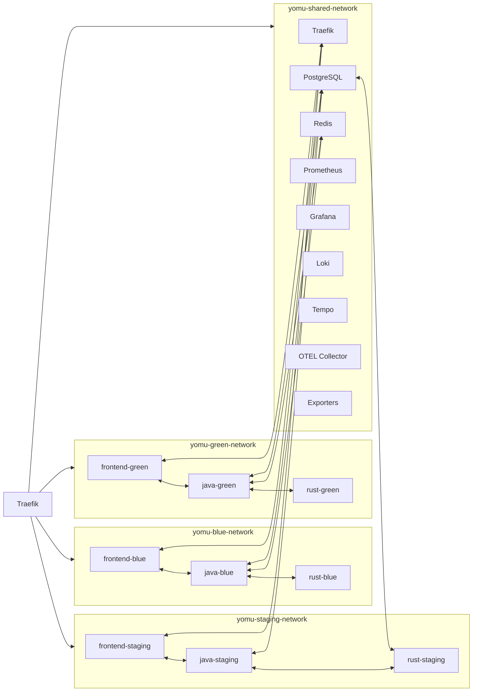
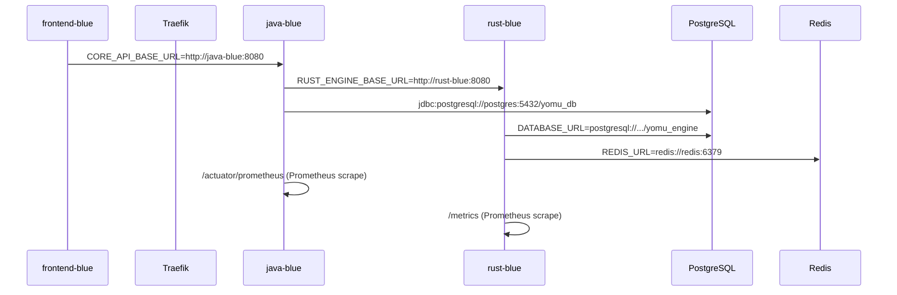

Platform Yomu menggunakan **empat jaringan Docker bridge** untuk mengisolasi lalu lintas antar environment produksi, staging, dan infrastruktur bersama.

## Arsitektur Jaringan

## Isolasi Jaringan

| Jaringan | Anggota | Tujuan |
|----------|---------|--------|
| `yomu-shared-network` | Semua infrastructure + semua apps | Service discovery, akses DB, telemetry |
| `yomu-blue-network` | `frontend-blue`, `java-blue`, `rust-blue`, Traefik | Komunikasi internal Blue |
| `yomu-green-network` | `frontend-green`, `java-green`, `rust-green`, Traefik | Komunikasi internal Green |
| `yomu-staging-network` | `frontend-staging`, `java-staging`, `rust-staging`, Traefik | Komunikasi internal Staging |

### Aturan Isolasi

- **Blue dan Green tidak bisa bicara langsung** — mereka tidak berbagi jaringan yang sama (kecuali shared).
- Traefik adalah **satu-satunya gateway** yang menghubungkan keempat jaringan.
- Routing ke Blue atau Green aktif hanya melalui file konfigurasi Traefik (`routing.yml`).
- Staging menggunakan `Host(staging.yomu.my.id)` sehingga tidak pernah konflik dengan produksi (`yomu.my.id`).

## Port Expose

| Layanan | Port Publik (Host) | Port Internal (Container) |
|---------|-------------------|---------------------------|
| Traefik Web | :80 | :80 |
| Traefik WebSecure | :443 | :443 |
| Traefik Dashboard | :3001 | :8080 |
| Prometheus | :9090 | :9090 |
| Grafana | — (via Traefik /grafana) | :3000 |
| Loki | :3100 | :3100 |
| Tempo | — (internal only) | :3200, :4317, :4318 |
| OTEL Collector | — (internal only) | :4317, :4318, :8889 |
| postgres-exporter | — (internal only) | :9187 |
| redis-exporter | — (internal only) | :9121 |

**Aplikasi production, staging, blue, green** tidak memiliki port mapping ke host — semua akses melalui Traefik reverse proxy.

## Routing Internal Antar Service

## Discovery

Semua service discovery menggunakan **nama service Docker** (bukan IP statis):

- `java-blue` → `yomu-blue-network`
- `postgres` → `yomu-shared-network`
- `redis` → `yomu-shared-network`
- `otel-collector` → `yomu-shared-network`

Docker Compose secara otomatis membuat DNS entries untuk setiap nama service pada setiap jaringan yang mereka ikuti.
