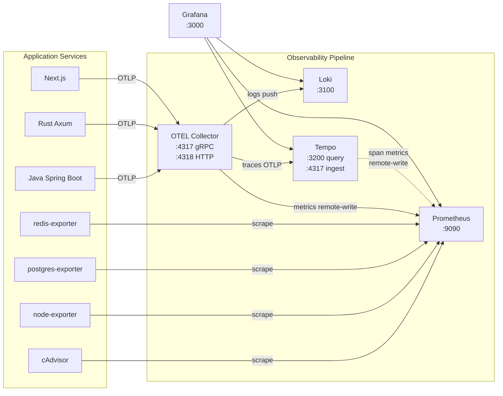
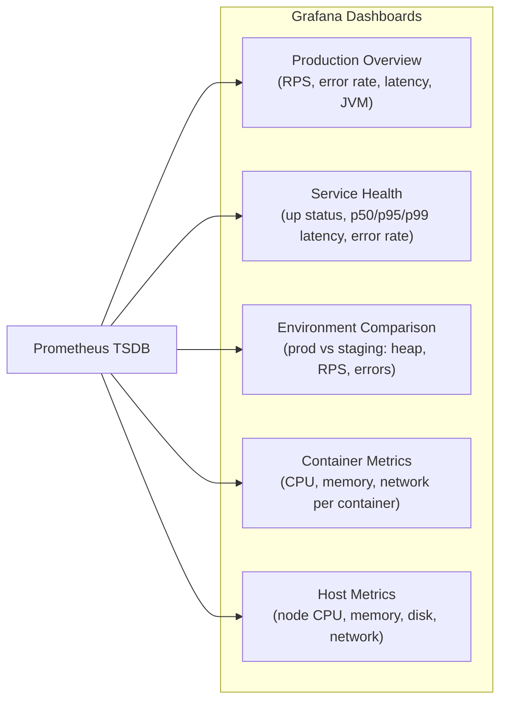
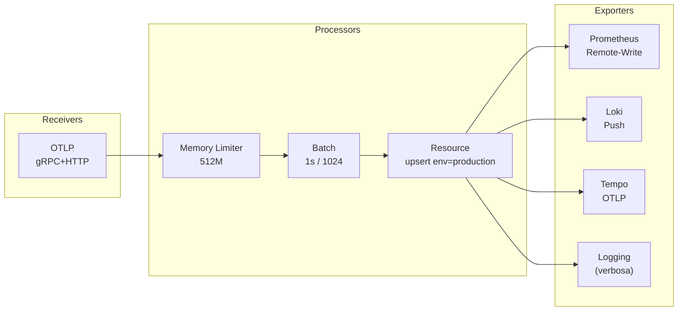

Platform Yomu mengekspos **tiga pilar observabilitas** (metrics, logs, traces) melalui stack Grafana yang berjalan pada VPS.

## Three Pillars



## Metrics (Prometheus)

Prometheus melakukan scrape pada seluruh layanan setiap 15 detik.

| Job | Target | Path | Labels |
|-----|--------|------|--------|
| `prometheus` | `prometheus:9090` | `/metrics` | env: infrastructure |
| `traefik` | `traefik:8080` | `/metrics` | env: infrastructure |
| `java` | `java:8080` | `/actuator/prometheus` | env: production, service: java |
| `java-staging` | `java-staging:8080` | `/actuator/prometheus` | env: staging, service: java |
| `rust` | `rust:8080` | `/metrics` | env: production, service: rust |
| `rust-staging` | `rust-staging:8080` | `/metrics` | env: staging, service: rust |
| `frontend` | `frontend:3000` | `/api/metrics` | env: production, service: frontend |
| `frontend-staging` | `frontend-staging:3000` | `/api/metrics` | env: staging, service: frontend |
| `cadvisor` | `cadvisor:8080` | `/metrics` | env: infrastructure, service: cadvisor |
| `node-exporter` | `node-exporter:9100` | `/metrics` | env: infrastructure, service: node |
| `postgres` | `postgres-exporter:9187` | `/metrics` | env: infrastructure, service: postgres |
| `redis` | `redis-exporter:9121` | `/metrics` | env: infrastructure, service: redis |

### Alert Rules

```yaml
# prometheus/rules/alerts.yml
groups:
  - name: yomu-alerts
    rules:
      - alert: ServiceDown
        expr: up == 0
        for: 1m
        annotations:
          summary: "Service {{ $labels.job }} down"
          description: "{{ $labels.job }} tidak merespon selama 1 menit"
      
      - alert: HighErrorRate
        expr: rate(traefik_service_requests_total{code=~"5.."}[5m]) > 0.1
        for: 5m
        annotations:
          summary: "High error rate detected"
          description: "Error rate > 10% pada {{ $labels.service }}"
      
      - alert: JavaHeapHigh
        expr: jvm_memory_used_bytes / jvm_memory_max_bytes > 0.85
        for: 5m
        annotations:
          summary: "JVM heap usage high"
          description: "Heap usage > 85% pada {{ $labels.job }}"
      
      - alert: ContainerHighCPU
        expr: rate(container_cpu_usage_seconds_total[5m]) > 0.8
        for: 5m
        annotations:
          summary: "Container CPU usage high"
          description: "CPU usage > 80% pada {{ $labels.name }}"
      
      - alert: ContainerHighMemory
        expr: container_memory_usage_bytes / container_spec_memory_limit_bytes > 0.9
        for: 5m
        annotations:
          summary: "Container memory usage high"
          description: "Memory usage > 90% pada {{ $labels.name }}"
      
      - alert: HighLatency
        expr: histogram_quantile(0.95, rate(traefik_service_request_duration_seconds_bucket[5m])) > 2
        for: 5m
        annotations:
          summary: "High latency detected"
          description: "P95 latency > 2s pada {{ $labels.service }}"
```

### Dashboard Metrics



## Logs (Loki)

| Aspek | Detail |
|-------|--------|
| **Storage** | Filesystem local (`/loki`) |
| **Retention** | 7 hari |
| **Ingest** | OTEL Collector → `loki:3100` via HTTP push |
| **Ingest Protocol** | OTLP logs dari semua aplikasi |
| **Query Language** | LogQL |

Contoh kueri LogQL di Grafana:

```
{service="java"} |= "ERROR"
{service="rust-staging"} |= "panic" | json
{service="frontend"} |= "API call failed"
```

## Traces (Tempo)

| Aspek | Detail |
|-------|--------|
| **Storage** | Filesystem local (`/tmp/tempo/traces`) |
| **Retention** | 7 hari |
| **Ingest** | OTEL Collector → `tempo:4317` via OTLP gRPC |
| **Query** | TraceQL via Grafana pada `tempo:3200` |
| **Span Metrics** | Tempo `metrics_generator` → remote-write ke Prometheus |
| **Service Graphs** | Otomatis dibuat dari span data |

### Java Auto-Instrumentasi

Java backend menggunakan OTEL Java Agent yang sudah tertanam dalam Dockerfile:

```bash
-javaagent:/app/otel/opentelemetry-javaagent.jar
-Dotel.resource.attributes=service.name=java-backend
-Dotel.exporter.otlp.endpoint=http://otel-collector:4317
```

### Rust / Frontend Manual Instrumentasi

Kirim traces ke OTEL Collector:

```bash
OTEL_EXPORTER_OTLP_ENDPOINT=http://otel-collector:4317
OTEL_SERVICE_NAME=rust-backend
```

## OTEL Collector Pipeline



| Pipeline | Receivers | Exporters |
|----------|-----------|-----------|
| **Traces** | OTLP | Tempo, Logging |
| **Metrics** | OTLP | Prometheus Remote-Write, Logging |
| **Logs** | OTLP | Loki Push, Logging |

## Grafana Dashboards

Grafana tersedia di **`monitoring.yomu.my.id`** dengan dashboard berikut:

| Dashboard | Panel Utama |
|-----------|-------------|
| **Production Overview** | Request rate, error rate, p95 latency, JVM memory, Traefik throughput |
| **Service Health** | Up/down status per service, latency p50/p95/p99, error rate by status code, Traefik traffic metrics |
| **Environment Comparison** | Prod vs Staging JVM heap, request rates, error rates, service up counts |
| **Container Metrics** | CPU, memory, network usage per container (dari cAdvisor) |
| **Host Metrics** | Node CPU, memory, disk I/O, network (dari node-exporter) |

Semua dashboard diprovision secara otomatis pada saat Grafana pertama kali start.

## Akses Dashboard

| Service | URL | Credentials |
|---------|-----|-------------|
| Grafana | `https://monitoring.yomu.my.id` | `admin` / password dari `.env` |
| Prometheus | `https://monitoring.yomu.my.id/prometheus` | Basic auth (opsional) |
| Tempo | Internal only (via Grafana) | — |
| Loki | Internal only (via Grafana) | — |
