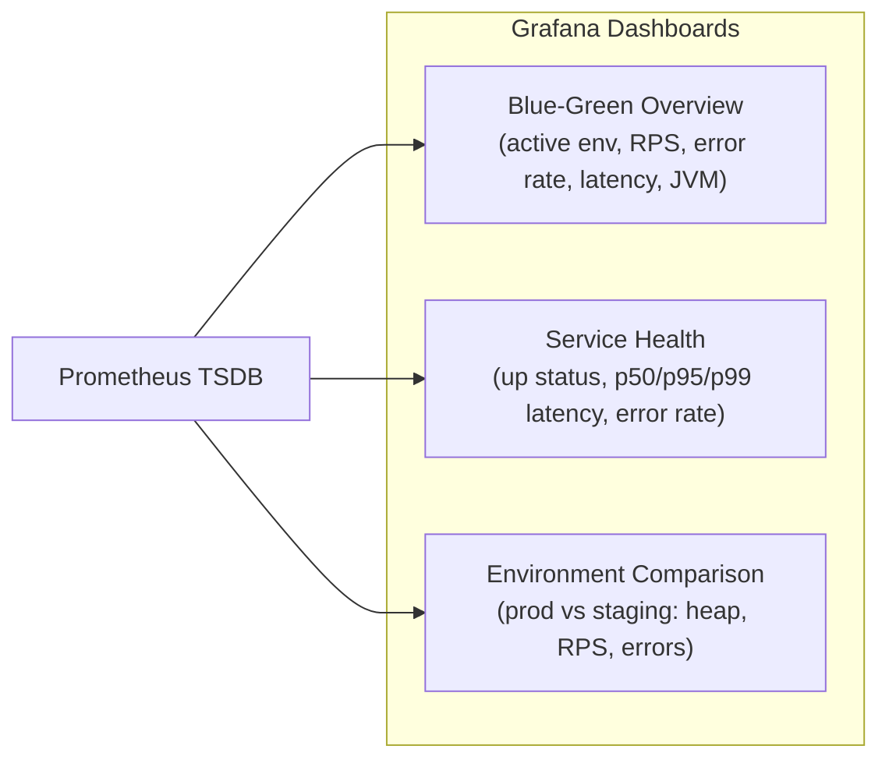
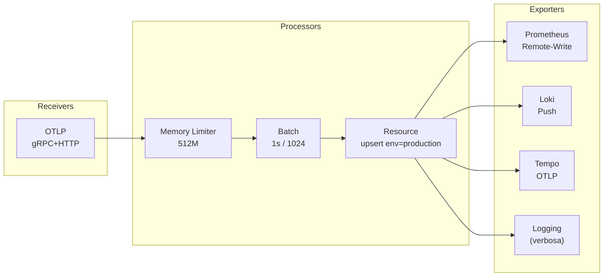

Platform Yomu mengekspos **tiga pilar observabilitas** (metrics, logs, traces) melalui stack Grafana yang berjalan pada VPS.

## Three Pillars

```mermaid
flowchart LR
    subgraph Applications["Application Services"]
        Java["Java Spring Boot"]
        Rust["Rust Axum"]
        Frontend["Next.js"]
        PgExp["postgres-exporter"]
        RdExp["redis-exporter"]
    end

    subgraph Pipeline["Observability Pipeline"]
        OTel["OTEL Collector\n:4317 gRPC\n:4318 HTTP"]
        Prom["Prometheus\n:9090"]
        Loki["Loki\n:3100"]
        Tempo["Tempo\n:3200 query\n:4317 ingest"]
    end

    Graf["Grafana\n:3000"]

    Java -->|OTLP| OTel
    Rust -->|OTLP| OTel
    Frontend -->|OTLP| OTel
    PgExp -->|scrape| Prom
    RdExp -->|scrape| Prom

    OTel -->|metrics (remote-write)| Prom
    OTel -->|logs (push)| Loki
    OTel -->|traces (OTLP)| Tempo
    Tempo -.->|span metrics\nremote-write| Prom

    Graf --> Prom
    Graf --> Loki
    Graf --> Tempo
```

## Metrics (Prometheus)

Prometheus melakukan scrape pada seluruh layanan setiap 15 detik.

| Job | Target | Path | Labels |
|-----|--------|------|--------|
| `prometheus` | `prometheus:9090` | `/metrics` | env: infrastructure |
| `traefik` | `traefik:8080` | `/metrics` | env: infrastructure |
| `java-blue` | `java-blue:8080` | `/actuator/prometheus` | env: blue, service: java, slot: blue |
| `java-green` | `java-green:8080` | `/actuator/prometheus` | env: green, service: java, slot: green |
| `java-staging` | `java-staging:8080` | `/actuator/prometheus` | env: staging, service: java, slot: staging |
| `rust-blue` | `rust-blue:8080` | `/metrics` | env: blue, service: rust, slot: blue |
| `rust-green` | `rust-green:8080` | `/metrics` | env: green, service: rust, slot: green |
| `rust-staging` | `rust-staging:8080` | `/metrics` | env: staging, service: rust, slot: staging |
| `frontend-blue` | `frontend-blue:3000` | `/api/metrics` | env: blue, service: frontend, slot: blue |
| `frontend-green` | `frontend-green:3000` | `/api/metrics` | env: green, service: frontend, slot: green |
| `frontend-staging` | `frontend-staging:3000` | `/api/metrics` | env: staging, service: frontend, slot: staging |
| `postgres` | `postgres-exporter:9187` | `/metrics` | env: infrastructure, service: postgres |
| `redis` | `redis-exporter:9121` | `/metrics` | env: infrastructure, service: redis |

### Alert Rules

```yaml
# prometheus/rules/alerts.yml
groups:
  - name: yomu-alerts
    rules:
      - alert: ServiceDown
        expr: up == 0
        for: 1m
      - alert: HighErrorRate
        expr: rate(traefik_service_requests_total{code=~"5.."}[5m]) > 0.1
        for: 5m
      - alert: JavaHeapHigh
        expr: jvm_memory_used_bytes / jvm_memory_max_bytes > 0.85
        for: 5m
      - alert: BlueGreenOutOfSync
        expr: (count(up{job=~"java-blue|rust-blue|frontend-blue"} == 1) == 0)
              and
              (count(up{job=~"java-green|rust-green|frontend-green"} == 1) == 0)
        for: 2m
```

### Dashboard Metrics



## Logs (Loki)

| Aspek | Detail |
|-------|--------|
| **Storage** | Filesystem local (`/loki`) |
| **Retention** | 7 hari |
| **Ingest** | OTEL Collector → `loki:3100` via HTTP push |
| **Ingest Protocol** | OTLP logs dari semua aplikasi |
| **Query Language** | LogQL |

Contoh kueri LogQL di Grafana:

```
{service="java-blue"} |= "ERROR"
{service="rust-staging"} |= "panic" | json
```

## Traces (Tempo)

| Aspek | Detail |
|-------|--------|
| **Storage** | Filesystem local (`/tmp/tempo/traces`) |
| **Retention** | 7 hari |
| **Ingest** | OTEL Collector → `tempo:4317` via OTLP gRPC |
| **Query** | TraceQL via Grafana pada `tempo:3200` |
| **Span Metrics** | Tempo `metrics_generator` → remote-write ke Prometheus |
| **Service Graphs** | Otomatis dibuat dari span data |

### Java Auto-Instrumentasi

Java backend menggunakan OTEL Java Agent yang sudah tertanam dalam Dockerfile:

```bash
-javaagent:/app/otel/opentelemetry-javaagent.jar
-Dotel.resource.attributes=service.name=java-backend
-Dotel.exporter.otlp.endpoint=http://otel-collector:4317
```

### Rust / Frontend Manual Instrumentasi

Kirim traces ke OTEL Collector:

```bash
OTEL_EXPORTER_OTLP_ENDPOINT=http://otel-collector:4317
OTEL_SERVICE_NAME=rust-backend
```

## OTEL Collector Pipeline



| Pipeline | Receivers | Exporters |
|----------|-----------|-----------|
| **Traces** | OTLP | Tempo, Logging |
| **Metrics** | OTLP | Prometheus Remote-Write, Logging |
| **Logs** | OTLP | Loki Push, Logging |

## Grafana Dashboards

| Dashboard | Panel Utama |
|-----------|-------------|
| **Blue-Green Overview** | Active environment stat, request rate, error rate, p95 latency, JVM memory, Traefik throughput |
| **Service Health** | Up/down status per service, latency p50/p95/p99, error rate by status code, Traefik traffic metrics |
| **Environment Comparison** | Prod vs Staging JVM heap, request rates, error rates, service up counts |

Semua dashboard diprovision secara otomatis pada saat Grafana pertama kali start.
