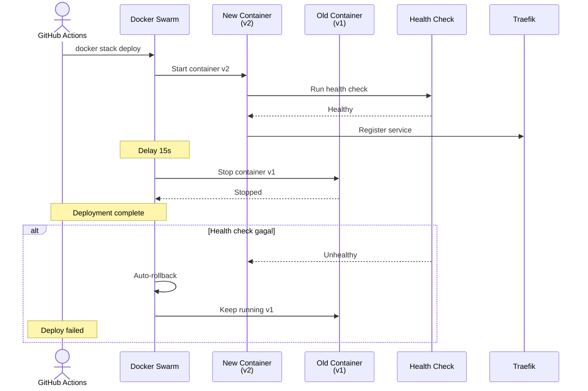
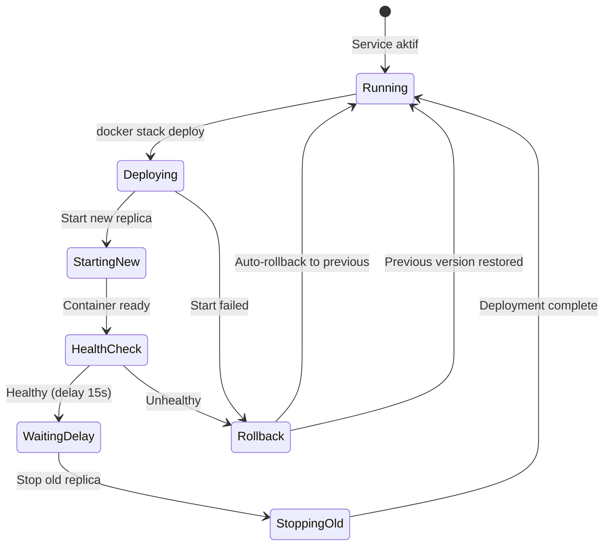
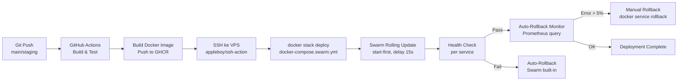

Rolling deployment dengan Docker Swarm memastikan rilis versi baru tanpa downtime dengan memulai container baru terlebih dahulu, menunggu health check lolos, kemudian menghentikan container lama secara bertahap.

## Alur Kerja Rolling Deployment



## State Machine Deployment



## Pipeline CI/CD



## Konfigurasi Rolling Update

Docker Swarm rolling update dikonfigurasi per service di `docker-compose.swarm.yml`:

```yaml
services:
  frontend:
    image: ghcr.io/yomu/frontend:latest
    deploy:
      replicas: 1
      update_config:
        parallelism: 1        # Update 1 replica sekaligus
        delay: 15s            # Tunggu 15 detik antar update
        order: start-first    # Start baru sebelum stop lama
        failure_action: rollback  # Auto-rollback jika health check gagal
      restart_policy:
        condition: on-failure
    healthcheck:
      test: ["CMD", "curl", "-f", "http://localhost:3000/health"]
      interval: 10s
      timeout: 5s
      retries: 3
      start_period: 30s
```

### Parameter Update Config

| Parameter | Value | Deskripsi |
|-----------|-------|-----------|
| `parallelism` | `1` | Jumlah replica yang diupdate bersamaan |
| `delay` | `15s` | Jeda waktu antar update replica |
| `order` | `start-first` | Start container baru sebelum stop yang lama |
| `failure_action` | `rollback` | Auto-rollback ke versi sebelumnya jika gagal |

### Health Check per Service

| Service | Health Check Endpoint | Interval | Timeout |
|---------|----------------------|----------|---------|
| **frontend** | `GET /health` | 10s | 5s |
| **java** | `GET /actuator/health` | 10s | 5s |
| **rust** | `GET /health` | 10s | 5s |

## CD Trigger

Deployment otomatis dipicu oleh GitHub Actions saat push ke branch `main` atau `staging`:

```yaml
# .github/workflows/deploy.yml
jobs:
  deploy:
    runs-on: ubuntu-latest
    steps:
      - uses: appleboy/ssh-action@master
        with:
          host: ${{ secrets.VPS_HOST }}
          username: ${{ secrets.VPS_USER }}
          key: ${{ secrets.VPS_SSH_KEY }}
          script: |
            cd /opt/yomu
            docker stack deploy -c docker-compose.swarm.yml yomu
```

### Alur Deployment

1. **Push code** ke branch `main` (production) atau `staging` (staging)
2. **GitHub Actions** build Docker image dan push ke GHCR
3. **SSH ke VPS** via `appleboy/ssh-action`
4. **`docker stack deploy`** deploy stack dengan konfigurasi baru
5. **Swarm rolling update** start container baru → health check → delay 15s → stop container lama
6. **Auto-rollback** jika health check gagal

## Auto-Rollback Monitor

Script `auto-rollback-monitor.sh` memantau metrik deployment via Prometheus dan trigger rollback manual jika error rate melebihi threshold:

```bash
#!/bin/bash
# auto-rollback-monitor.sh

ERROR_RATE=$(curl -s 'http://prometheus:9090/api/v1/query?query=rate(traefik_service_requests_total{code=~"5.."}[5m])' | jq '.data.result[0].value[1]')
P95_LATENCY=$(curl -s 'http://prometheus:9090/api/v1/query?query=histogram_quantile(0.95, rate(traefik_service_request_duration_seconds_bucket[5m]))' | jq '.data.result[0].value[1]')

if (( $(echo "$ERROR_RATE > 0.05" | bc -l) )); then
    echo "ERROR: Error rate > 5% ($ERROR_RATE)"
    docker service rollback yomu_frontend
    docker service rollback yomu_java
    docker service rollback yomu_rust
    exit 1
fi

if (( $(echo "$P95_LATENCY > 2.0" | bc -l) )); then
    echo "ERROR: P95 latency > 2s ($P95_LATENCY)"
    docker service rollback yomu_frontend
    docker service rollback yomu_java
    docker service rollback yomu_rust
    exit 1
fi

echo "OK: Deployment healthy"
```

### Threshold Monitoring

| Metrik | Threshold | Aksi |
|--------|-----------|------|
| **Error Rate** | > 5% (5xx responses) | Rollback semua service |
| **P95 Latency** | > 2 detik | Rollback semua service |

## Skrip Deployment

| Skrip | Fungsi |
|-------|--------|
| `deploy-staging.sh` | Deploy staging environment via SSH |
| `health-check.sh` | Verifikasi health check semua service |
| `auto-rollback-monitor.sh` | Monitor error rate dan latency, trigger rollback |
| `smoke-test-subdomains.sh` | Test routing semua subdomain setelah deploy |

### Contoh deploy-staging.sh

```bash
#!/bin/bash
# deploy-staging.sh

ssh ${VPS_USER}@${VPS_HOST} << 'EOF'
  cd /opt/yomu
  docker stack deploy -c docker-compose.swarm.yml yomu
  ./health-check.sh
  ./smoke-test-subdomains.sh
EOF
```

## Manfaat Rolling Deployment dengan Swarm

| Manfaat | Deskripsi |
|---------|-----------|
| **Zero Downtime** | Container baru start dulu sebelum yang lama stop (`start-first`) |
| **Auto-Rollback** | Swarm built-in rollback jika health check gagal |
| **Gradual Update** | Update 1 replica dengan delay 15s untuk stabilitas |
| **Health Check Native** | Integrasi health check per service di Docker |
| **Sederhana** | Satu command `docker stack deploy`, tidak perlu switch manual |
| **Resource Efisien** | Tidak perlu duplikasi environment seperti blue-green |

## Praktik Terbaik

- Pastikan **health check** terdefinisi untuk semua service dengan timeout yang sesuai
- Gunakan **delay 15s** untuk memberi waktu stabilisasi container baru
- Monitor **error rate dan latency** selama 5-10 menit setelah deploy
- Simpan **image tag** di GHCR untuk rollback manual jika diperlukan
- Jalankan **smoke test** setelah deployment untuk verifikasi routing
