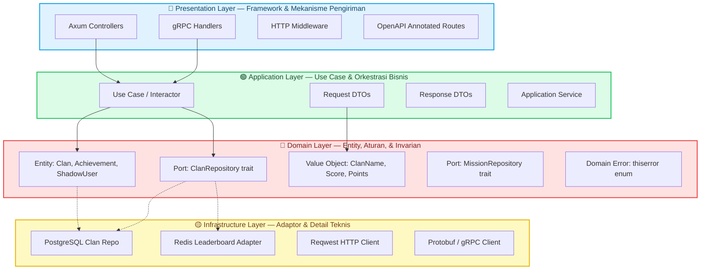
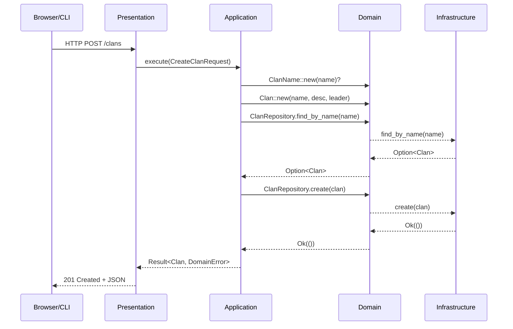

# Clean Architecture

Clean Architecture adalah filosofi desain perangkat lunak yang diperkenalkan oleh **Robert C. Martin (Uncle Bob)** yang menyusun kode dalam lapisan konsentris, dengan satu aturan yang tidak dapat dilanggar: **dependensi selalu mengarah ke dalam**.

## Filosofi Inti

Pada intinya, Clean Architecture adalah formalisasi dari **Prinsip Dependency Inversion** ("D" dalam SOLID). Prinsip ini menyatakan bahwa kebijakan tingkat tinggi (aturan bisnis) tidak boleh bergantung pada detail tingkat rendah (framework, database, UI). Sebaliknya, keduanya harus bergantung pada abstraksi.

### Lingkaran Konsentris

Bayangkan empat lingkaran konsentris. Lingkaran paling dalam adalah yang paling abstrak; lingkaran paling luar adalah yang paling konkret.



### Aturan Dependensi (Tidak Dapat Dilanggar)

> **Tidak ada yang berada di lingkaran dalam yang boleh mengetahui apa pun tentang sesuatu di lingkaran luar.**

Artinya:

| Arah | Diperbolehkan? | Contoh |
|-----------|----------|---------|
| Domain → Application | ✅ Ya | Entity digunakan oleh use case |
| Domain → Infrastructure | ❌ **Tidak Pernah** | Entity tidak boleh mengimpor `sqlx` |
| Application → Presentation | ❌ **Tidak Pernah** | Use case tidak boleh mengimpor `axum` |
| Infrastructure → Domain | ✅ Ya | PostgreSQL repo mengimplementasikan trait `ClanRepository` |
| Presentation → Infrastructure | ❌ **Tidak Pernah** | Controller tidak boleh membuat `PgPool` secara langsung |

## Empat Layer di Yomu Rust

### 1. Domain Layer — "Mengapa"

Domain layer berisi **apa itu bisnis dan apa yang dilakukannya**. Ini adalah jantung sistem dan memiliki **nol dependensi eksternal** selain `std`, `uuid`, dan `thiserror`.

**Isi:**
- **Entity** — Objek dengan identitas yang bertahan sepanjang waktu (`Clan`, `Achievement`, `ShadowUser`)
- **Value Object** — Immutable, tervalidasi, dapat dibandingkan berdasarkan atribut (`ClanName`, `Score`, `Points`)
- **Port Repository** — Trait async yang mendefinisikan operasi "apa" yang ada, bukan "bagaimana" (`ClanRepository`, `AchievementRepository`)
- **Domain Error** — Error spesifik bisnis menggunakan `thiserror` (`DomainError::AlreadyExists`, `DomainError::InvalidScore`)

**Mengapa nol dependensi?** Karena aturan bisnis harus bertahan lebih lama dari framework. Jika Axum mati dalam 10 tahun, aturan tentang bagaimana clan dibuat harus tetap persis sama. Domain layer menyandikan **pengetahuan bisnis tacit** yang mahal untuk ditemukan kembali.

```rust
// domain/entities/clan.rs
pub struct Clan {
    id: Uuid,
    name: ClanName,           // Value Object — divalidasi saat pembuatan
    description: Option<String>,
    leader_id: Uuid,
    created_at: DateTime<Utc>,
}

impl Clan {
    pub fn new(name: ClanName, description: Option<String>, leader_id: Uuid) -> Self {
        Self {
            id: Uuid::new_v4(),
            name,
            description,
            leader_id,
            created_at: Utc::now(),
        }
    }

    pub fn name(&self) -> &ClanName { &self.name }
    pub fn id(&self) -> Uuid { self.id }
}
```

### 2. Application Layer — "Bagaimana"

Application layer berisi **use case** — operasi bisnis spesifik yang mengorkestrasi objek domain untuk mencapai tujuan pengguna.

**Isi:**
- **Use Case / Interactor** — Satu class/struct per operasi bisnis (`CreateClanUseCase`, `SyncQuizGamificationUseCase`)
- **DTO** — Objek request/response untuk batasan use case
- **Application Service** — Orkestrasi lintas-sektor (manajemen transaction, event publishing)

**Karakteristik utama:** Application layer HANYA bergantung pada Domain layer. Ia mengetahui tentang `Clan` dan `ClanRepository`, tetapi tidak tentang `sqlx::PgPool` atau `axum::extract::State`.

```rust
// application/use_cases/create_clan.rs
pub struct CreateClanUseCaseImpl<R: ClanRepository> {
    repository: R,
}

#[async_trait]
impl<R: ClanRepository + Send + Sync> CreateClanUseCase for CreateClanUseCaseImpl<R> {
    async fn execute(&self, request: CreateClanRequest) -> Result<Clan, DomainError> {
        // 1. Validasi input (logika domain)
        let name = ClanName::new(request.name)?;

        // 2. Periksa aturan bisnis (logika domain)
        if self.repository.find_by_name(&name.0).await?.is_some() {
            return Err(DomainError::AlreadyExists("Clan name".to_string()));
        }

        // 3. Buat entity (logika domain)
        let clan = Clan::new(name, request.description, request.created_by_user_id);

        // 4. Simpan melalui port (abstraksi, bukan DB konkret)
        self.repository.create(&clan).await?;

        Ok(clan)
    }
}
```

Perhatikan bahwa use case:
- Bergantung pada **trait** `ClanRepository`, bukan `ClanPostgresRepo`
- Mengembalikan `DomainError`, bukan `sqlx::Error`
- Berisi validasi, pemeriksaan keunikan, dan pembuatan entity
- Memiliki **nol** kode HTTP, SQL, atau framework

### 3. Infrastructure Layer — "Dengan Apa"

Infrastructure layer berisi **adaptor** yang mengimplementasikan Port (trait) yang didefinisikan oleh Domain.

**Isi:**
- **PostgreSQL Repository** — `ClanPostgresRepo` mengimplementasikan `ClanRepository`
- **Redis Adapter** — `RedisLeaderboardAdapter` mengimplementasikan trait leaderboard
- **HTTP Client** — `ReqwestJavaClient` memanggil API Java
- **Mapper** — Mentransformasi baris database menjadi entity domain dan sebaliknya

**Karakteristik utama:** Infrastructure bergantung pada Domain. Ia mengetahui tentang entity dan trait, tetapi entity tidak tahu apa-apa tentangnya.

```rust
// infrastructure/persistence/postgres/clan_repository.rs
pub struct ClanPostgresRepo {
    pool: PgPool,  // sqlx — konkret, spesifik framework
}

#[async_trait]
impl ClanRepository for ClanPostgresRepo {
    async fn create(&self, clan: &Clan) -> Result<(), DomainError> {
        sqlx::query_as(
            "INSERT INTO clans (id, name, description, leader_id, created_at)
             VALUES ($1, $2, $3, $4, $5)"
        )
        .bind(clan.id())
        .bind(&clan.name().0)
        .bind(&clan.description())
        .bind(clan.leader_id())
        .bind(clan.created_at())
        .execute(&self.pool)
        .await
        .map_err(|e| DomainError::Database(e.to_string()))?;

        Ok(())
    }
}
```

Adaptor ini:
- Mengimplementasikan **trait** yang didefinisikan oleh Domain
- Menggunakan `sqlx`, `tokio`, dan `PgPool` — semuanya spesifik framework
- Memetakan `sqlx::Error` ke `DomainError` sebelum melewati batasan
- **Tidak mengetahui** apa pun tentang HTTP atau use case

### 4. Presentation Layer — "Bagaimana Disampaikan"

Presentation layer berisi **mekanisme pengiriman** yang mengonversi request eksternal menjadi pemanggilan use case.

**Isi:**
- **Axum Controller** — Menangani HTTP request, mengekstrak parameter, mengembalikan JSON
- **gRPC Handler** — Menangani pesan protobuf
- **Middleware** — Authentication, logging, tracing, rate limiting
- **Spesifikasi OpenAPI** — Definisi route teranotasi untuk `utoipa`

**Karakteristik utama:** Presentation bergantung pada Application. Ia memanggil use case, tetapi tidak tahu bagaimana cara kerjanya.

```rust
// presentation/api/v1/clans.rs
pub async fn create_clan(
    State(use_case): State<Arc<dyn CreateClanUseCase + Send + Sync>>,
    Json(request): Json<CreateClanRequest>,
) -> Result<Json<CreateClanResponse>, ApiError> {
    let clan = use_case.execute(request).await?;
    Ok(Json(CreateClanResponse::from_domain(clan)))
}
```

Controller ini:
- Menerima HTTP request dengan body JSON
- Mendelegasikan ke use case melalui dependensi yang diinjeksi
- Memetakan response domain ke HTTP response
- Memiliki **nol logika bisnis** — hanya plumbing HTTP

## Mengapa Clean Architecture untuk Yomu Rust?

### 1. Compiler sebagai Penegak Architecture

Dalam bahasa tanpa sistem tipe yang ketat, Clean Architecture hanyalah sebuah **konvensi** — pengembang dapat melanggarnya secara tidak sengaja. Di Rust, ini adalah **hukum**:

```rust
// Ini TIDAK akan kompilasi jika domain mencoba menggunakan sqlx
error[E0432]: import `sqlx` is not visible here
  --> domain/entities/clan.rs:1:10
   |
1  | use sqlx::prelude::*;  // ERROR: dependensi database di domain
```

Sistem visibilitas Rust (`pub(crate)`, batasan modul) dan aturan orphan membuat domain secara fisik tidak mungkin mengimpor crate infrastructure. Architecture ini **ditegakkan secara mekanis**.

### 2. Testabilitas Tanpa Infrastruktur

Domain dan application layer dapat diuji dengan **nol** database, jaringan, atau async runtime:

```rust
#[test]
fn test_create_clan_success() {
    let mut mock_repo = MockClanRepository::new();
    mock_repo.expect_find_by_name().returning(|_| Ok(None));
    mock_repo.expect_create().returning(|c| Ok(c));

    let use_case = CreateClanUseCaseImpl::new(mock_repo);
    let result = use_case.execute(create_request()).unwrap();

    assert_eq!(result.name().0, "Test Clan");
    // Test selesai dalam mikrodetik — tanpa setup DB
}
```

### 3. Independensi Framework

Clean Architecture di Rust berarti:
- **Axum** dapat diganti — tukar dengan Actix-web, Warp, atau CLI tool
- **SQLx** dapat diganti — tukar dengan Diesel, SeaORM, atau in-memory store untuk testing
- **PostgreSQL** dapat diganti — tukar dengan SQLite, MySQL, atau flat file
- **Redis** dapat diganti — tukar dengan Memcached, atau HashMap in-memory untuk dev lokal

### 4. Skalabilitas Tim

Dengan batasan yang ketat:
- **Ahli domain** bekerja di `domain/` tanpa perlu tahu HTTP atau SQL
- **Spesialis infrastructure** mengoptimalkan query di `infrastructure/` tanpa menyentuh aturan bisnis
- **Desainer API** mendefinisikan DTO di `application/` dan route di `presentation/`
- Tim dapat bekerja secara independen dengan konflik merge minimal

## Trade-off Clean Architecture

| Manfaat | Biaya |
|---------|------|
| Logika domain dapat diuji tanpa DB | Lebih banyak file per fitur (trait + impl + use case + controller) |
| Infrastructure dapat ditukar | Boilerplate untuk mapping DTO |
| Batasan ditegakkan oleh compiler | Parameter tipe generik yang verbose (`impl<R: ClanRepository>`) |
| Independensi framework | Kurva pembelajaran untuk pengembang junior |
| Otonomi tim | Repository pattern menambah indireksi |

## Clean Architecture vs. Architecture Heksagonal

**Architecture Heksagonal** (Alistair Cockburn) dan **Clean Architecture** (Robert C. Martin) pada praktiknya **sinonim**:

| Istilah | Asal | Metafora |
|------|--------|----------|
| Clean Architecture | Uncle Bob | Lingkaran konsentris |
| Architecture Heksagonal | Alistair Cockburn | Heksagon dengan port dan adaptor |
| Ports & Adapters | Keduanya | Interface = Port, Implementasi = Adaptor |
| Onion Architecture | Jeffrey Palermo | Lapisan seperti bawang |

Semuanya mendeskripsikan prinsip yang sama: **domain di tengah, dependensi mengarah ke dalam**.

## Struktur File Berlapis Yomu

```
src/modules/league/
├── domain/
│   ├── entities/
│   │   ├── clan.rs
│   │   ├── clan_member.rs
│   │   └── mod.rs
│   ├── value_objects/
│   │   ├── clan_name.rs
│   │   └── mod.rs
│   ├── repositories/
│   │   ├── clan_repository.rs       # Port (trait)
│   │   └── mod.rs
│   ├── errors.rs                     # Domain errors (thiserror)
│   └── mod.rs
├── application/
│   ├── dto/
│   │   ├── create_clan.rs
│   │   └── mod.rs
│   ├── use_cases/
│   │   ├── create_clan.rs
│   │   ├── get_leaderboard.rs
│   │   └── mod.rs
│   └── mod.rs
├── infrastructure/
│   ├── persistence/
│   │   ├── postgres/
│   │   │   ├── clan_repository.rs    # Adaptor (impl)
│   │   │   └── mod.rs
│   │   └── mod.rs
│   ├── cache/
│   │   ├── redis/
│   │   │   └── leaderboard_adapter.rs
│   │   └── mod.rs
│   └── mod.rs
└── presentation/
    └── api/
        └── v1/
            ├── clans.rs              # Controller
            ├── routes.rs
            └── mod.rs
```

## Alur Dependensi



## Bacaan Lebih Lanjut

- [The Clean Architecture — Robert C. Martin](https://blog.cleancoder.com/uncle-bob/2012/08/13/the-clean-architecture.html)
- [Hexagonal Architecture — Alistair Cockburn](https://alistair.cockburn.us/hexagonal-architecture/)
- [Implementing Domain-Driven Design — Vaughn Vernon](https://www.oreilly.com/library/view/implementing-domain-driven-design/9780133039900/)
- [Rust for Rustaceans — Jon Gjengset](https://rust-for-rustaceans.com/) — untuk pattern kepemilikan lanjutan dalam Layered Architecture
