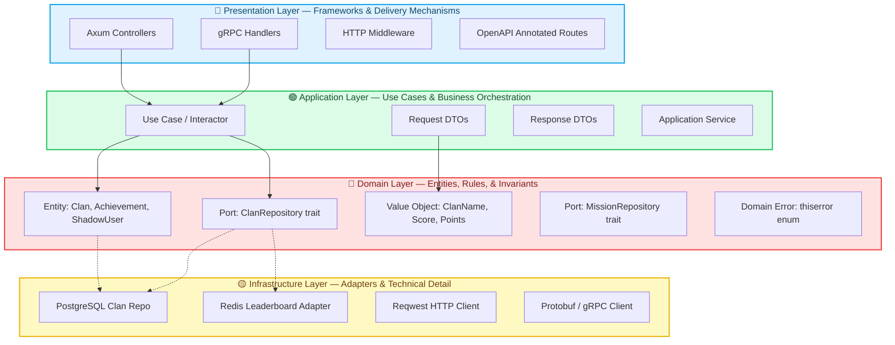
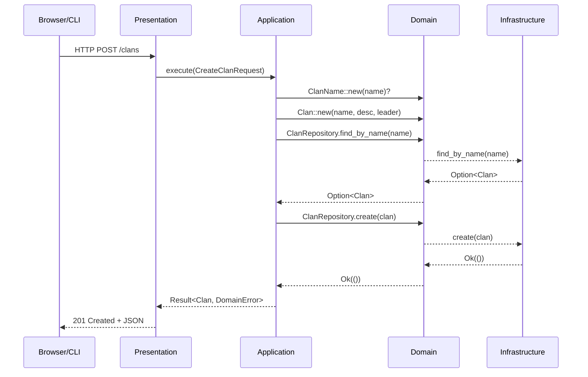

# Clean Architecture

Clean Architecture is a software design philosophy introduced by **Robert C. Martin (Uncle Bob)** that structures code into concentric layers, with a single inviolable rule: **dependencies always point inward**.

## The Core Philosophy

At its heart, Clean Architecture is a formalization of the **Dependency Inversion Principle** (the "D" in SOLID). It states that high-level policy (business rules) should never depend on low-level detail (frameworks, databases, UI). Instead, both should depend on abstractions.

### The Concentric Circles

Imagine four concentric circles. The innermost circle is the most abstract; the outermost is the most concrete.



### The Dependency Rule (Inviolable)

> **Nothing in an inner circle can know anything at all about something in an outer circle.**

This means:

| Direction | Allowed? | Example |
|-----------|----------|---------|
| Domain → Application | ✅ Yes | Entity used by use case |
| Domain → Infrastructure | ❌ **Never** | Entity cannot import `sqlx` |
| Application → Presentation | ❌ **Never** | Use case cannot import `axum` |
| Infrastructure → Domain | ✅ Yes | PostgreSQL repo implements `ClanRepository` trait |
| Presentation → Infrastructure | ❌ **Never** | Controller cannot create `PgPool` directly |

## The Four Layers in Yomu Rust

### 1. Domain Layer — The "Why"

The Domain layer contains **what the business is and does**. It is the heart of the system and has **zero external dependencies** beyond `std`, `uuid`, and `thiserror`.

**Contents:**
- **Entities** — Objects with identity that persist over time (`Clan`, `Achievement`, `ShadowUser`)
- **Value Objects** — Immutable, validated, equatable by attributes (`ClanName`, `Score`, `Points`)
- **Repository Ports** — Async traits defining "what" operations exist, not "how" (`ClanRepository`, `AchievementRepository`)
- **Domain Errors** — Business-specific errors using `thiserror` (`DomainError::AlreadyExists`, `DomainError::InvalidScore`)

**Why zero dependencies?** Because business rules should outlive frameworks. If Axum dies in 10 years, the rules for how clans are created should remain exactly the same. The domain layer encodes **tacit business knowledge** that is expensive to rediscover.

```rust
// domain/entities/clan.rs
pub struct Clan {
    id: Uuid,
    name: ClanName,           // Value Object — validated at creation
    description: Option<String>,
    leader_id: Uuid,
    created_at: DateTime<Utc>,
}

impl Clan {
    pub fn new(name: ClanName, description: Option<String>, leader_id: Uuid) -> Self {
        Self {
            id: Uuid::new_v4(),
            name,
            description,
            leader_id,
            created_at: Utc::now(),
        }
    }

    pub fn name(&self) -> &ClanName { &self.name }
    pub fn id(&self) -> Uuid { self.id }
}
```

### 2. Application Layer — The "How"

The Application layer contains **use cases** — specific business operations that orchestrate domain objects to accomplish a user goal.

**Contents:**
- **Use Cases / Interactors** — One class/struct per business operation (`CreateClanUseCase`, `SyncQuizGamificationUseCase`)
- **DTOs** — Request/response objects for use case boundaries
- **Application Services** — Cross-cutting orchestration (transaction management, event publishing)

**Key characteristic:** Application layer depends ONLY on Domain layer. It knows about `Clan` and `ClanRepository`, but not about `sqlx::PgPool` or `axum::extract::State`.

```rust
// application/use_cases/create_clan.rs
pub struct CreateClanUseCaseImpl<R: ClanRepository> {
    repository: R,
}

#[async_trait]
impl<R: ClanRepository + Send + Sync> CreateClanUseCase for CreateClanUseCaseImpl<R> {
    async fn execute(&self, request: CreateClanRequest) -> Result<Clan, DomainError> {
        // 1. Validate input (domain logic)
        let name = ClanName::new(request.name)?;

        // 2. Check business rule (domain logic)
        if self.repository.find_by_name(&name.0).await?.is_some() {
            return Err(DomainError::AlreadyExists("Clan name".to_string()));
        }

        // 3. Create entity (domain logic)
        let clan = Clan::new(name, request.description, request.created_by_user_id);

        // 4. Persist via port (abstraction, not concrete DB)
        self.repository.create(&clan).await?;

        Ok(clan)
    }
}
```

Notice the use case:
- Depends on `ClanRepository` **trait**, not `ClanPostgresRepo`
- Returns `DomainError`, not `sqlx::Error`
- Contains validation, uniqueness checks, and entity creation
- Has **zero** HTTP, SQL, or framework code

### 3. Infrastructure Layer — The "With What"

The Infrastructure layer contains **adapters** that implement the Ports (traits) defined by Domain.

**Contents:**
- **PostgreSQL Repositories** — `ClanPostgresRepo` implements `ClanRepository`
- **Redis Adapters** — `RedisLeaderboardAdapter` implements leaderboard traits
- **HTTP Clients** — `ReqwestJavaClient` calls Java APIs
- **Mappers** — Transform database rows to domain entities and vice versa

**Key characteristic:** Infrastructure depends on Domain. It knows about entities and traits, but entities know nothing about it.

```rust
// infrastructure/persistence/postgres/clan_repository.rs
pub struct ClanPostgresRepo {
    pool: PgPool,  // sqlx — concrete, framework-specific
}

#[async_trait]
impl ClanRepository for ClanPostgresRepo {
    async fn create(&self, clan: &Clan) -> Result<(), DomainError> {
        sqlx::query_as(
            "INSERT INTO clans (id, name, description, leader_id, created_at)
             VALUES ($1, $2, $3, $4, $5)"
        )
        .bind(clan.id())
        .bind(&clan.name().0)
        .bind(&clan.description())
        .bind(clan.leader_id())
        .bind(clan.created_at())
        .execute(&self.pool)
        .await
        .map_err(|e| DomainError::Database(e.to_string()))?;

        Ok(())
    }
}
```

The adapter:
- Implements the **trait** defined by Domain
- Uses `sqlx`, `tokio`, and `PgPool` — all framework-specific
- Maps `sqlx::Error` to `DomainError` before crossing the boundary
- Has **no knowledge** of HTTP or use cases

### 4. Presentation Layer — The "How It's Delivered"

The Presentation layer contains **delivery mechanisms** that convert external requests into use case invocations.

**Contents:**
- **Axum Controllers** — Handle HTTP requests, extract parameters, return JSON
- **gRPC Handlers** — Handle protobuf messages
- **Middleware** — Authentication, logging, tracing, rate limiting
- **OpenAPI Specs** — Annotated route definitions for `utoipa`

**Key characteristic:** Presentation depends on Application. It calls use cases, but doesn't know how they work.

```rust
// presentation/api/v1/clans.rs
pub async fn create_clan(
    State(use_case): State<Arc<dyn CreateClanUseCase + Send + Sync>>,
    Json(request): Json<CreateClanRequest>,
) -> Result<Json<CreateClanResponse>, ApiError> {
    let clan = use_case.execute(request).await?;
    Ok(Json(CreateClanResponse::from_domain(clan)))
}
```

The controller:
- Receives HTTP request with JSON body
- Delegates to use case via injected dependency
- Maps domain response to HTTP response
- Has **zero business logic** — only HTTP plumbing

## Why Clean Architecture for Yomu Rust?

### 1. The Compiler as Architecture Enforcer

In languages without strict type systems, Clean Architecture is a **convention** — developers can violate it accidentally. In Rust, it's a **law**:

```rust
// This will NOT compile if domain tries to use sqlx
error[E0432]: import `sqlx` is not visible here
  --> domain/entities/clan.rs:1:10
   |
1  | use sqlx::prelude::*;  // ERROR: database dependency in domain
```

Rust's visibility system (`pub(crate)`, module boundaries) and orphan rules make it physically impossible for domain code to import infrastructure crates. The architecture is **mechanically enforced**.

### 2. Testability Without Infrastructure

Domain and application layers can be tested with **zero** database, network, or async runtime:

```rust
#[test]
fn test_create_clan_success() {
    let mut mock_repo = MockClanRepository::new();
    mock_repo.expect_find_by_name().returning(|_| Ok(None));
    mock_repo.expect_create().returning(|c| Ok(c));

    let use_case = CreateClanUseCaseImpl::new(mock_repo);
    let result = use_case.execute(create_request()).unwrap();

    assert_eq!(result.name().0, "Test Clan");
    // Test completes in microseconds — no DB setup
}
```

### 3. Framework Independence

Rust's Clean Architecture means:
- **Axum** is replaceable — swap with Actix-web, Warp, or a CLI tool
- **SQLx** is replaceable — swap with Diesel, SeaORM, or an in-memory store for testing
- **PostgreSQL** is replaceable — swap with SQLite, MySQL, or a flat file
- **Redis** is replaceable — swap with Memcached, or an in-memory HashMap for local dev

### 4. Team Scaling

With strict boundaries:
- **Domain experts** work on `domain/` without knowing HTTP or SQL
- **Infrastructure specialists** optimize queries in `infrastructure/` without touching business rules
- **API designers** define DTOs in `application/` and routes in `presentation/`
- Teams can work independently with minimal merge conflicts

## Trade-offs of Clean Architecture

| Benefit | Cost |
|---------|------|
| Testable domain logic without DB | More files per feature (trait + impl + use case + controller) |
| Swappable infrastructure | Boilerplate for DTO mapping |
| Compiler-enforced boundaries | Verbose generic type parameters (`impl<R: ClanRepository>`) |
| Framework independence | Learning curve for junior developers |
| Team autonomy | Repository pattern adds indirection |

## Clean Architecture vs. Hexagonal Architecture

**Hexagonal Architecture** (Alistair Cockburn) and **Clean Architecture** (Robert C. Martin) are **synonymous** in practice:

| Term | Origin | Metaphor |
|------|--------|----------|
| Clean Architecture | Uncle Bob | Concentric circles |
| Hexagonal Architecture | Alistair Cockburn | Hexagon with ports and adapters |
| Ports & Adapters | Both | Interfaces = Ports, Implementations = Adapters |
| Onion Architecture | Jeffrey Palermo | Layers like an onion |

All describe the same principle: **domain in the center, dependencies point inward**.

## Yomu's Layered File Structure

```
src/modules/league/
├── domain/
│   ├── entities/
│   │   ├── clan.rs
│   │   ├── clan_member.rs
│   │   └── mod.rs
│   ├── value_objects/
│   │   ├── clan_name.rs
│   │   └── mod.rs
│   ├── repositories/
│   │   ├── clan_repository.rs       # Port (trait)
│   │   └── mod.rs
│   ├── errors.rs                     # Domain errors (thiserror)
│   └── mod.rs
├── application/
│   ├── dto/
│   │   ├── create_clan.rs
│   │   └── mod.rs
│   ├── use_cases/
│   │   ├── create_clan.rs
│   │   ├── get_leaderboard.rs
│   │   └── mod.rs
│   └── mod.rs
├── infrastructure/
│   ├── persistence/
│   │   ├── postgres/
│   │   │   ├── clan_repository.rs    # Adapter (impl)
│   │   │   └── mod.rs
│   │   └── mod.rs
│   ├── cache/
│   │   ├── redis/
│   │   │   └── leaderboard_adapter.rs
│   │   └── mod.rs
│   └── mod.rs
└── presentation/
    └── api/
        └── v1/
            ├── clans.rs              # Controller
            ├── routes.rs
            └── mod.rs
```

## The Dependency Flow



## Further Reading

- [The Clean Architecture — Robert C. Martin](https://blog.cleancoder.com/uncle-bob/2012/08/13/the-clean-architecture.html)
- [Hexagonal Architecture — Alistair Cockburn](https://alistair.cockburn.us/hexagonal-architecture/)
- [Implementing Domain-Driven Design — Vaughn Vernon](https://www.oreilly.com/library/view/implementing-domain-driven-design/9780133039900/)
- [Rust for Rustaceans — Jon Gjengset](https://rust-for-rustaceans.com/) — for advanced ownership patterns in layered architectures
