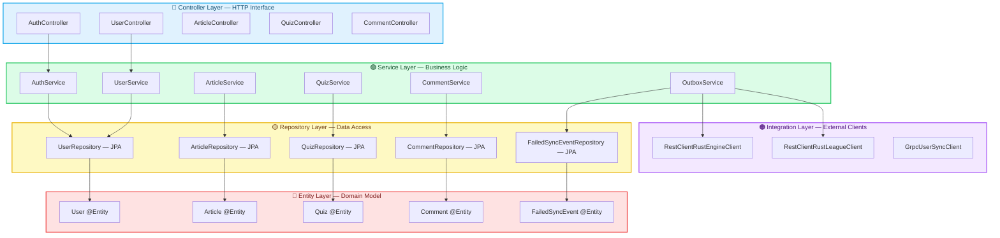

# Layered Architecture

Backend Java Yomu menggunakan **Layered Architecture (Layered Architecture)**, standar de facto untuk aplikasi Spring Boot. Tidak seperti Clean Architecture Rust yang memberlakukan batasan konsentris ketat melalui compiler, Layered Architecture Java memanfaatkan **konvensi built-in framework** (Dependency Injection, auto-configuration, dan Spring Data JPA) untuk mencapai separation of concerns yang pragmatis.

## Filosofi Inti

Layered Architecture mengatur kode ke dalam layer horizontal di mana setiap layer memiliki tanggung jawab spesifik. Spring Boot klasik menggunakan tiga layer:



### Aturan Dependensi Berlapis

Tidak seperti Clean Architecture yang memiliki aturan "dependensi hanya ke dalam" yang ketat, Layered Architecture memiliki **aliran yang lebih pragmatis**:

| Layer | Bergantung Pada | Yang Diketahui |
|-------|-----------|---------------|
| **Controller** | Service, DTOs | HTTP, JSON, validation, Spring annotations |
| **Service** | Repository, Entities, Integration | Business logic, transaction, Spring `@Transactional` |
| **Repository** | Entities, JPA/Hibernate | Query database, mapping ORM, Spring Data |
| **Entity** | JPA annotations (`@Entity`, `@Id`) | Domain state, constraint validasi, relationship |
| **Integration** | HTTP clients, gRPC stubs | Protokol service eksternal, serialization |

## Lima Layer di Yomu Java

### 1. Entity Layer — The "What"

Di Spring Boot, entity adalah **objek domain yang dimapping dengan JPA** yang memiliki dua tujuan: merepresentasikan state domain DAN mendefinisikan schema database.

**Konten:**
- **JPA Entities** — Kelas `@Entity` dengan mapping `@Id`, `@Column`, `@OneToMany`
- **Validation Constraints** — Anotasi `@NotNull`, `@Email`, `@Size`
- **Entity Relationships** — `@OneToOne`, `@ManyToOne`, `@OneToMany` untuk mapping relasional

**Mengapa entity JPA sebagai domain?** Spring Data JPA secara ketat menggabungkan domain model dengan persistence framework. Ini adalah **trade-off yang disadari**: menghilangkan boilerplate mapping tetapi berarti entities tahu tentang JPA.

```java
// src/main/java/com/yomu/user/domain/User.java
@Entity
@Table(name = "users")
public class User {
    @Id
    @GeneratedValue(strategy = GenerationType.UUID)
    private UUID userId;

    @Column(nullable = false, unique = true)
    private String username;

    @Column(nullable = false, unique = true)
    @Email
    private String email;

    @Column(nullable = false)
    @Enumerated(EnumType.STRING)
    private Role role = Role.PELAJAR;

    @Column
    private String googleSub;

    @OneToMany(mappedBy = "author", cascade = CascadeType.ALL)
    private List<Article> articles = new ArrayList<>();

    // Getters, setters, business methods...
    public boolean isAdmin() {
        return this.role == Role.ADMIN;
    }
}
```

### 2. Repository Layer — "Cara Kita Menyimpan"

Spring Data JPA menyediakan interface repository yang auto-generate query pada runtime. Ini **sangat berbeda** dari definisi trait eksplisit Rust.

**Konten:**
- **Repository Interfaces** — Memperluas `JpaRepository<T, ID>` atau `CrudRepository`
- **Query Methods** — Nama method diurai menjadi SQL (`findByEmail`, `findByRoleAndDeletedAtIsNull`)
- **Custom Queries** — Anotasi `@Query` untuk JPQL/SQL kompleks

**Karakteristik utama:** Repository adalah implementasi yang **di-generate oleh framework**. Anda mendefinisikan interface; Spring membuat kelasnya pada runtime melalui proxy.

```java
// src/main/java/com/yomu/user/repository/UserRepository.java
public interface UserRepository extends JpaRepository<User, UUID> {
    // Auto-generated query: SELECT * FROM users WHERE email = ? AND deleted_at IS NULL
    Optional<User> findByEmailAndDeletedAtIsNull(String email);

    // Auto-generated query dengan pagination
    Page<User> findByRole(Role role, Pageable pageable);

    // Custom JPQL query
    @Query("SELECT u FROM User u WHERE u.role = :role AND u.createdAt > :since")
    List<User> findActiveUsersByRole(@Param("role") Role role, @Param("since") Instant since);
}
```

### 3. Service Layer — "Business Logic"

Service layer berisi **operasi bisnis** yang mengorkestrasi repository dan external services. Tidak seperti use case Rust (satu per file), service Java sering mengelompokkan operasi terkait ke dalam satu kelas.

**Konten:**
- **Services** — Kelas `@Service` dengan dependensi `@Autowired`
- **Transactional Boundaries** — Anotasi `@Transactional` untuk atomicity
- **Business Rules** — Validasi, transisi state, logic kalkulasi
- **Cross-Cutting Concerns** — Logging, metrics, event publishing

**Karakteristik utama:** Services adalah singleton **stateless** yang dikelola oleh IoC container Spring. Mereka menyimpan referensi ke repository dan integration clients.

```java
// src/main/java/com/yomu/auth/service/AuthService.java
@Service
@RequiredArgsConstructor
public class AuthService {
    private final UserRepository userRepository;
    private final JwtService jwtService;
    private final PasswordEncoder passwordEncoder;
    private final AuthUserSyncService authUserSyncService;

    @Transactional
    public AuthResponse login(LoginRequest request) {
        // 1. Find user
        User user = userRepository
            .findByEmailAndDeletedAtIsNull(request.getEmail())
            .orElseThrow(() -> new AuthenticationException("Invalid credentials"));

        // 2. Validate password
        if (!passwordEncoder.matches(request.getPassword(), user.getPasswordHash())) {
            throw new AuthenticationException("Invalid credentials");
        }

        // 3. Generate JWT
        String token = jwtService.generateToken(user);

        // 4. Sync to Rust (async outbox)
        authUserSyncService.syncUser(user);

        return new AuthResponse(token, user.getRole().name());
    }
}
```

### 4. Controller Layer — "HTTP Interface"

Controller menangani HTTP request, mendelegasikan ke service, dan mengembalikan response yang terstandarisasi.

**Konten:**
- **REST Controllers** — Kelas `@RestController` dengan `@RequestMapping`
- **Request DTOs** — Objek input yang dianotasi `@Valid`
- **Response Wrappers** — `ApiResponse<T>` untuk struktur JSON seragam
- **Exception Handlers** — `@ControllerAdvice` untuk error handling terpusat

**Karakteristik utama:** Controller adalah **tipis**. Mereka tidak mengandung business logic — hanya mapping HTTP concern.

```java
// src/main/java/com/yomu/auth/controller/AuthController.java
@RestController
@RequestMapping("/api/v1/auth")
@RequiredArgsConstructor
public class AuthController {
    private final AuthService authService;

    @PostMapping("/login")
    public ResponseEntity<ApiResponse<AuthResponse>> login(
            @RequestBody @Valid LoginRequest request) {
        AuthResponse response = authService.login(request);
        return ResponseEntity.ok(ApiResponse.success("Login successful", response));
    }
}
```

### 5. Integration Layer — "Dunia Eksternal"

Integration layer mengelola komunikasi dengan external services (Rust backend, OAuth providers, payment gateways).

**Konten:**
- **HTTP Clients** — Wrapper `RestClient` atau `WebClient` untuk REST APIs
- **gRPC Clients** — Implementasi stub untuk protobuf services
- **Message Publishers** — Outbox event writers, Kafka producers (future)
- **DTO Mappers** — Konversi antara schema eksternal dan DTO internal

```java
// src/main/java/com/yomu/integration/rust/RestClientRustEngineClient.java
@Component
@RequiredArgsConstructor
public class RestClientRustEngineClient {
    private final RestClient restClient;
    @Value("${rust.engine.base-url}")
    private String rustBaseUrl;
    @Value("${internal.api.key}")
    private String apiKey;

    public void syncUser(ShadowUserDto user) {
        restClient.post()
            .uri(rustBaseUrl + "/api/internal/users/sync")
            .header("X-API-Key", apiKey)
            .body(user)
            .retrieve()
            .toBodilessEntity();
    }
}
```

## Mengapa Layered Architecture untuk Yomu Java?

### 1. Sinergi Framework

Spring Boot **dirancang** untuk Layered Architecture. DI container, auto-configuration, dan starter dependencies mengasumsikan struktur ini:

- `@Entity` → `@Repository` → `@Service` → `@Controller` adalah **happy path**
- Spring Data JPA menghasilkan repository dari interface — tanpa implementasi manual
- `@Transactional` membungkus method service dengan AOP proxy
- `@Valid` memicu Bean Validation secara otomatis

Menerapkan Clean Architecture di Spring Boot berarti **melawan framework**:

```java
// Melawan Spring: memisahkan domain dari JPA
// Opsi A: Duplicate models (JPA Entity + Domain Entity + Mapper)
// Opsi B: Menerima kebocoran JPA ke domain
// Kebanyakan tim memilih B, yang secara pragmatis adalah Layered Architecture
```

### 2. Kecepatan Developer

Layered Architecture di Spring Boot menawarkan **kecepatan maksimum** untuk domain CRUD-heavy:

| Tugas | Spring Boot Berlapis | Rust Clean Arch |
|------|-------------------|-----------------|
| Menambah entity baru | 1 file (`@Entity`) | 3 files (Entity, Value Object, Factory) |
| Menambah repository | 1 interface (`JpaRepository`) | 2 files (Trait + Postgres impl) |
| Menambah query | Konvensi nama method | SQL macro + compile-time checking |
| Menambah CRUD endpoint | Controller + Service (2 files) | Controller + Use Case + DTOs (4+ files) |
| Transaction boundary | Anotasi `@Transactional` | Manajemen transaction manual |

Untuk backend Java Yomu — yang menangani **authentication, content CRUD, dan outbox events** — operasinya mayoritas CRUD dengan business rules yang straightforward. Overhead dari batasan ketat Clean Architecture memberikan diminishing returns.

### 3. Familiaritas Tim

Ekosistem Java memiliki **puluhan tahun** praktik Layered Architecture:

- **Hiring**: Kebanyakan developer Spring Boot tahu Controller-Service-Repository
- **Tooling**: IntelliJ IDEA mengenali layer ini dan menyediakan navigasi
- **Documentation**: Panduan resmi Spring semuanya menggunakan pattern ini
- **Community**: Jawaban Stack Overflow mengasumsikan struktur ini

Memperkenalkan Clean Architecture ke tim Java berarti pelatihan ulang dan melawan konvensi ekosistem.

### 4. Transactional Boundaries

ACID transaction Java **elegan** di Layered Architecture:

```java
@Service
@RequiredArgsConstructor
public class OutboxService {
    private final ClanRepository clanRepository;
    private final OutboxMessageRepository outboxRepository;

    @Transactional
    public void createClanWithOutbox(Clan clan) {
        // Kedua operasi dalam SATU atomic transaction
        clanRepository.save(clan);
        outboxRepository.save(new OutboxMessage("clan.created", clan));
        // Jika salah satu gagal, KEDUANYA rollback
    }
}
```

Di Clean Architecture, transaction membentang beberapa layer (Application memanggil Domain memanggil Infrastructure), membuat manajemen boundary menjadi kompleks. AOP proxy `@Transactional` Spring menangani ini dengan mulus di Layered Architecture.

### 5. Integrasi ORM

JPA/Hibernate **terintegrasi dalam** Layered Architecture:

- **Lazy Loading**: `@OneToMany(fetch = LAZY)` berfungsi karena entity ADALAH model persistence
- **Dirty Checking**: Hibernate secara otomatis mendeteksi field yang berubah dan menghasilkan UPDATE SQL
- **Caching**: Anotasi second-level cache (`@Cacheable`) berada di entities
- **Migrations**: Schema Flyway/Liquibase mapping 1:1 dengan kelas `@Entity`

Memisahkan domain dari persistence (seperti yang diperlukan Clean Architecture) berarti **kehilangan benefit ini** atau menambahkan layer mapping yang berat (MapStruct, ModelMapper).

## Trade-offs Layered Architecture

| Benefit | Cost |
|---------|------|
| Kecepatan developer maksimum | Business logic bisa bocor ke controllers |
| Sinergi framework | Domain model terikat ke JPA annotations |
| Transaction mudah dengan `@Transactional` | Lebih sulit diuji tanpa Spring context |
| Repository auto-generated | Kontrol lebih sedikit atas SQL (risiko N+1 query) |
| Familiaritas tim | Developer junior mungkin melewatkan logic service layer |
| ORM benefits (lazy loading, caching) | Entities bisa mutable di luar services |

## Kapan Layered Architecture Gagal

Layered Architecture menjadi problematik ketika:

1. **Business rules kompleks** — Jika services tumbuh hingga 500+ baris dengan kondisi bersarang, extract domain services atau gunakan DDD aggregates
2. **Multiple delivery mechanisms** — Jika logic yang sama harus diekspos via REST, gRPC, CLI, dan message queue, port abstraction Clean Architecture unggul
3. **Cakupan test tinggi diperlukan** — `@SpringBootTest` lambat; unit testing murni memerlukan Mockito mocks dari repositories
4. **Framework migration** — Beralih dari Spring Boot ke Quarkus atau Micronaut lebih sulit ketika `@Autowired`, `@Entity`, dan `@Transactional` meresap di seluruh codebase

## Layered Architecture vs. Clean Architecture: Perbandingan

| Aspek | Layered Architecture (Java) | Clean Architecture (Rust) |
|--------|----------------------------|---------------------------|
| **Framework coupling** | Entities tahu JPA; Services tahu Spring | Domain tidak tahu apa-apa |
| **Test speed** | Perlu Spring context atau Mockito | Pure unit tests, microseconds |
| **Repository impl** | Auto-generated oleh Spring Data | Hand-written dengan SQLx macros |
| **Transaction mgmt** | AOP proxy `@Transactional` | Manual atau `sqlx::Transaction` |
| **Boilerplate** | Rendah — framework menangani wiring | Tinggi — traits, DTOs, mappers |
| **Compiler enforcement** | Tidak ada — berbasis konvensi | Absolut — orphan rules + visibility |
| **Team onboarding** | Cepat — pengetahuan Spring standar | Lambat — perlu Rust + pelatihan Architecture |
| **Flexibilitas** | Sedang — terikat ekosistem Spring | Tinggi — semua bisa ditukar |
| **Terbaik untuk** | Aplikasi enterprise CRUD-heavy standar | Domain logic kompleks berkinerja tinggi |

## Rasional Yomu: Mengapa Bukan Clean Architecture di Java?

Yomu Java menangani:
- **Auth** — JWT generation, password hashing, OAuth flow (mayoritas panggilan framework)
- **CRUD** — Artikel, kuis, comments, users (persistence straightforward)
- **Outbox** — Penulisan event dan scheduling (transactional tetapi tidak kompleks secara algoritmik)

Domain ini **tidak mendapatkan manfaat** dari batasan ketat Clean Architecture:

- Tidak ada complex calculation engine (itu tugas Rust)
- Tidak ada multiple delivery mechanisms (hanya REST + outbox scheduler)
- Tidak perlu mengganti database (PostgreSQL sudah cukup)
- Tim sudah tahu konvensi Spring Boot

**Biaya** Clean Architecture di Java (duplicate models, mapping layers, melawan Spring) **melebihi manfaatnya** untuk domain Java Yomu.

## Pendekatan "Pragmatic Layered"

Yomu Java bukan Layered Architecture murni — ia memiliki **batasan pragmatis**:

```
src/main/java/com/yomu/
├── auth/
│   ├── controller/      # HTTP layer
│   ├── service/         # Business logic
│   ├── repository/      # Data access
│   ├── dto/             # Request/Response DTOs
│   └── domain/          # User entity (JPA-mapped)
├── integration/
│   └── rust/            # External service clients
├── security/
│   ├── JwtService.java  # Token generation/validation
│   └── SecurityConfig.java  # Spring Security setup
└── common/
    ├── api/             # ApiResponse wrapper
    └── exception/       # Global exception handlers
```

**Penyimpangan notable dari Layered Architecture murni:**
- **Security package** membentang semua layer (JWT logic bersifat cross-cutting)
- **Integration package** adalah layer terpisah untuk panggilan eksternal
- **Common package** menampung utilitas bersama (ApiResponse, exception handling)
- **DTOs per feature** daripada global DTO layer

## Bacaan Lebih Lanjut

- [Spring Boot Documentation — Layered Architecture](https://docs.spring.io/spring-boot/docs/current/reference/htmlsingle/#using.structuring-your-code)
- [Martin Fowler — Patterns of Enterprise Application Architecture](https://martinfowler.com/books/eaa.html) — Transaction Script vs. Domain Model
- [Vlad Mihalcea — High-Performance Java Persistence](https://vladmihalcea.com/books/high-performance-java-persistence/) — JPA optimization in layered apps
- [Baeldung — Spring Boot Layered Architecture](https://www.baeldung.com/spring-boot-start)
