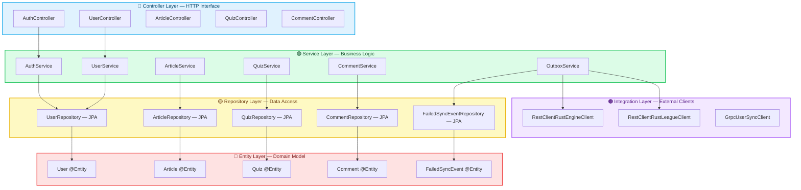

# Layered Architecture

Yomu's Java backend uses **Layered Architecture**, the de facto standard for Spring Boot applications. Unlike Rust's Clean Architecture, which enforces strict concentric boundaries through the compiler, Java's Layered Architecture leverages the **framework's built-in conventions** (Dependency Injection, auto-configuration, and Spring Data JPA) to achieve a pragmatic separation of concerns.

## The Core Philosophy

Layered Architecture organizes code into horizontal layers where each layer has a specific responsibility. The classic Spring Boot stack uses three layers:



### The Layered Dependency Rule

Unlike Clean Architecture's strict "dependencies only inward" rule, Layered Architecture has a **more pragmatic flow**:

| Layer | Depends On | What It Knows |
|-------|-----------|---------------|
| **Controller** | Service, DTOs | HTTP, JSON, validation, Spring annotations |
| **Service** | Repository, Entities, Integration | Business logic, transactions, Spring `@Transactional` |
| **Repository** | Entities, JPA/Hibernate | Database queries, ORM mappings, Spring Data |
| **Entity** | JPA annotations (`@Entity`, `@Id`) | Domain state, validation constraints, relationships |
| **Integration** | HTTP clients, gRPC stubs | External service protocols, serialization |

## The Five Layers in Yomu Java

### 1. Entity Layer — The "What"

In Spring Boot, entities are **JPA-mapped domain objects** that serve dual purpose: they represent domain state AND define database schema.

**Contents:**
- **JPA Entities** — `@Entity` classes with `@Id`, `@Column`, `@OneToMany` mappings
- **Validation Constraints** — `@NotNull`, `@Email`, `@Size` annotations
- **Entity Relationships** — `@OneToOne`, `@ManyToOne`, `@OneToMany` for relational mapping

**Why JPA entities as domain?** Spring Data JPA tightly couples the domain model to the persistence framework. This is a **conscious trade-off**: it eliminates mapping boilerplate but means entities know about JPA.

```java
// src/main/java/com/yomu/user/domain/User.java
@Entity
@Table(name = "users")
public class User {
    @Id
    @GeneratedValue(strategy = GenerationType.UUID)
    private UUID userId;

    @Column(nullable = false, unique = true)
    private String username;

    @Column(nullable = false, unique = true)
    @Email
    private String email;

    @Column(nullable = false)
    @Enumerated(EnumType.STRING)
    private Role role = Role.PELAJAR;

    @Column
    private String googleSub;

    @OneToMany(mappedBy = "author", cascade = CascadeType.ALL)
    private List<Article> articles = new ArrayList<>();

    // Getters, setters, business methods...
    public boolean isAdmin() {
        return this.role == Role.ADMIN;
    }
}
```

### 2. Repository Layer — The "How We Persist"

Spring Data JPA provides repository interfaces that auto-generate queries at runtime. This is **radically different** from Rust's explicit trait definitions.

**Contents:**
- **Repository Interfaces** — Extending `JpaRepository<T, ID>` or `CrudRepository`
- **Query Methods** — Method names parsed into SQL (`findByEmail`, `findByRoleAndDeletedAtIsNull`)
- **Custom Queries** — `@Query` annotations for complex JPQL/SQL

**Key characteristic:** Repositories are **framework-generated** implementations. You define the interface; Spring creates the class at runtime via proxies.

```java
// src/main/java/com/yomu/user/repository/UserRepository.java
public interface UserRepository extends JpaRepository<User, UUID> {
    // Auto-generated query: SELECT * FROM users WHERE email = ? AND deleted_at IS NULL
    Optional<User> findByEmailAndDeletedAtIsNull(String email);

    // Auto-generated query with pagination
    Page<User> findByRole(Role role, Pageable pageable);

    // Custom JPQL query
    @Query("SELECT u FROM User u WHERE u.role = :role AND u.createdAt > :since")
    List<User> findActiveUsersByRole(@Param("role") Role role, @Param("since") Instant since);
}
```

### 3. Service Layer — The "Business Logic"

The Service layer contains **business operations** orchestrating repositories and external services. Unlike Rust's use cases (one per file), Java services often group related operations into a single class.

**Contents:**
- **Services** — `@Service` classes with `@Autowired` dependencies
- **Transactional Boundaries** — `@Transactional` annotations for atomicity
- **Business Rules** — Validation, state transitions, calculation logic
- **Cross-Cutting Concerns** — Logging, metrics, event publishing

**Key characteristic:** Services are **stateless** singletons managed by Spring's IoC container. They hold references to repositories and integration clients.

```java
// src/main/java/com/yomu/auth/service/AuthService.java
@Service
@RequiredArgsConstructor
public class AuthService {
    private final UserRepository userRepository;
    private final JwtService jwtService;
    private final PasswordEncoder passwordEncoder;
    private final AuthUserSyncService authUserSyncService;

    @Transactional
    public AuthResponse login(LoginRequest request) {
        // 1. Find user
        User user = userRepository
            .findByEmailAndDeletedAtIsNull(request.getEmail())
            .orElseThrow(() -> new AuthenticationException("Invalid credentials"));

        // 2. Validate password
        if (!passwordEncoder.matches(request.getPassword(), user.getPasswordHash())) {
            throw new AuthenticationException("Invalid credentials");
        }

        // 3. Generate JWT
        String token = jwtService.generateToken(user);

        // 4. Sync to Rust (async outbox)
        authUserSyncService.syncUser(user);

        return new AuthResponse(token, user.getRole().name());
    }
}
```

### 4. Controller Layer — The "HTTP Interface"

Controllers handle HTTP requests, delegate to services, and return standardized responses.

**Contents:**
- **REST Controllers** — `@RestController` classes with `@RequestMapping`
- **Request DTOs** — `@Valid` annotated input objects
- **Response Wrappers** — `ApiResponse<T>` for uniform JSON structure
- **Exception Handlers** — `@ControllerAdvice` for centralized error handling

**Key characteristic:** Controllers are **thin**. They contain no business logic — only HTTP concern mapping.

```java
// src/main/java/com/yomu/auth/controller/AuthController.java
@RestController
@RequestMapping("/api/v1/auth")
@RequiredArgsConstructor
public class AuthController {
    private final AuthService authService;

    @PostMapping("/login")
    public ResponseEntity<ApiResponse<AuthResponse>> login(
            @RequestBody @Valid LoginRequest request) {
        AuthResponse response = authService.login(request);
        return ResponseEntity.ok(ApiResponse.success("Login successful", response));
    }
}
```

### 5. Integration Layer — The "External World"

The Integration layer manages communication with external services (Rust backend, OAuth providers, payment gateways).

**Contents:**
- **HTTP Clients** — `RestClient` or `WebClient` wrappers for REST APIs
- **gRPC Clients** — Stub implementations for protobuf services
- **Message Publishers** — Outbox event writers, Kafka producers (future)
- **DTO Mappers** — Conversion between external schemas and internal DTOs

```java
// src/main/java/com/yomu/integration/rust/RestClientRustEngineClient.java
@Component
@RequiredArgsConstructor
public class RestClientRustEngineClient {
    private final RestClient restClient;
    @Value("${rust.engine.base-url}")
    private String rustBaseUrl;
    @Value("${internal.api.key}")
    private String apiKey;

    public void syncUser(ShadowUserDto user) {
        restClient.post()
            .uri(rustBaseUrl + "/api/internal/users/sync")
            .header("X-API-Key", apiKey)
            .body(user)
            .retrieve()
            .toBodilessEntity();
    }
}
```

## Why Layered Architecture for Yomu Java?

### 1. Framework Synergy

Spring Boot is **designed** for Layered Architecture. Its DI container, auto-configuration, and starter dependencies assume this structure:

- `@Entity` → `@Repository` → `@Service` → `@Controller` is the **happy path**
- Spring Data JPA generates repositories from interfaces — no manual implementation
- `@Transactional` wraps service methods with AOP proxies
- `@Valid` triggers Bean Validation automatically

Attempting Clean Architecture in Spring Boot means **fighting the framework**:

```java
// Fighting Spring: separating domain from JPA
// Option A: Duplicate models (JPA Entity + Domain Entity + Mapper)
// Option B: Accept JPA leakage into domain
// Most teams choose B, which is pragmatically Layered Architecture
```

### 2. Developer Velocity

Layered Architecture in Spring Boot offers **maximum velocity** for CRUD-heavy domains:

| Task | Spring Boot Layered | Rust Clean Arch |
|------|-------------------|-----------------|
| Add a new entity | 1 file (`@Entity`) | 3 files (Entity, Value Object, Factory) |
| Add a repository | 1 interface (`JpaRepository`) | 2 files (Trait + Postgres impl) |
| Add a query | Method name convention | SQL macro + compile-time checking |
| Add a CRUD endpoint | Controller + Service (2 files) | Controller + Use Case + DTOs (4+ files) |
| Transaction boundary | `@Transactional` annotation | Manual transaction management |

For Yomu's Java backend — which handles **authentication, content CRUD, and outbox events** — the operations are predominantly CRUD with straightforward business rules. The overhead of Clean Architecture's strict boundaries yields diminishing returns.

### 3. Team Familiarity

The Java ecosystem has **decades** of Layered Architecture practice:

- **Hiring**: Most Spring Boot developers know Controller-Service-Repository
- **Tooling**: IntelliJ IDEA recognizes these layers and provides navigation
- **Documentation**: Spring's official guides all use this pattern
- **Community**: Stack Overflow answers assume this structure

Introducing Clean Architecture to a Java team means retraining and fighting ecosystem conventions.

### 4. Transactional Boundaries

Java's ACID transactions are **elegant** in Layered Architecture:

```java
@Service
@RequiredArgsConstructor
public class OutboxService {
    private final ClanRepository clanRepository;
    private final OutboxMessageRepository outboxRepository;

    @Transactional
    public void createClanWithOutbox(Clan clan) {
        // Both operations in ONE atomic transaction
        clanRepository.save(clan);
        outboxRepository.save(new OutboxMessage("clan.created", clan));
        // If either fails, BOTH rollback
    }
}
```

In Clean Architecture, transactions span multiple layers (Application calls Domain calls Infrastructure), making boundary management complex. Spring's `@Transactional` AOP proxy handles this seamlessly in Layered Architecture.

### 5. ORM Integration

JPA/Hibernate is **deeply integrated** into Layered Architecture:

- **Lazy Loading**: `@OneToMany(fetch = LAZY)` works because the entity IS the persistence model
- **Dirty Checking**: Hibernate automatically detects changed fields and generates UPDATE SQL
- **Caching**: Second-level cache annotations (`@Cacheable`) sit on entities
- **Migrations**: Flyway/Liquibase schemas map 1:1 with `@Entity` classes

Separating domain from persistence (as Clean Architecture requires) means **losing these benefits** or adding heavy mapping layers (MapStruct, ModelMapper).

## Trade-offs of Layered Architecture

| Benefit | Cost |
|---------|------|
| Maximum developer velocity | Business logic can leak into controllers |
| Framework synergy | Domain model coupled to JPA annotations |
| Easy transactions with `@Transactional` | Harder to test without Spring context |
| Auto-generated repositories | Less control over SQL (N+1 query risks) |
| Team familiarity | Junior devs may skip service layer logic |
| ORM benefits (lazy loading, caching) | Entities mutable outside services |

## When Layered Architecture Breaks Down

Layered Architecture becomes problematic when:

1. **Business rules are complex** — If services grow to 500+ lines with nested conditionals, extract domain services or use DDD aggregates
2. **Multiple delivery mechanisms** — If the same logic must be exposed via REST, gRPC, CLI, and message queue, Clean Architecture's port abstraction shines
3. **High test coverage required** — `@SpringBootTest` is slow; pure unit testing requires Mockito mocks of repositories
4. **Framework migration** — Switching from Spring Boot to Quarkus or Micronaut is harder when `@Autowired`, `@Entity`, and `@Transactional` pervade the codebase

## Layered Architecture vs. Clean Architecture: A Comparison

| Aspect | Layered Architecture (Java) | Clean Architecture (Rust) |
|--------|----------------------------|---------------------------|
| **Framework coupling** | Entities know JPA; Services know Spring | Domain knows nothing |
| **Test speed** | Needs Spring context or Mockito | Pure unit tests, microseconds |
| **Repository impl** | Auto-generated by Spring Data | Hand-written with SQLx macros |
| **Transaction mgmt** | `@Transactional` AOP proxy | Manual or `sqlx::Transaction` |
| **Boilerplate** | Low — framework handles wiring | High — traits, DTOs, mappers |
| **Compiler enforcement** | None — convention-based | Absolute — orphan rules + visibility |
| **Team onboarding** | Fast — standard Spring knowledge | Slow — requires Rust + architecture training |
| **Flexibility** | Medium — tied to Spring ecosystem | High — swappable everything |
| **Best for** | CRUD-heavy, standard enterprise apps | High-performance, complex domain logic |

## Yomu's Rationale: Why Not Clean Architecture in Java?

Yomu Java handles:
- **Auth** — JWT generation, password hashing, OAuth flow (mostly framework calls)
- **CRUD** — Articles, quizzes, comments, users (straightforward persistence)
- **Outbox** — Event writing and scheduling (transactional but not algorithmically complex)

These domains **don't benefit** from the strict boundaries of Clean Architecture:

- No complex calculation engine (that's Rust's job)
- No multiple delivery mechanisms (just REST + outbox scheduler)
- No need to swap databases (PostgreSQL is sufficient)
- Team knows Spring Boot conventions

**The cost** of Clean Architecture in Java (duplicate models, mapping layers, fighting Spring) **outweighs the benefit** for Yomu's Java domain.

## The "Pragmatic Layered" Approach

Yomu Java isn't pure Layered Architecture — it has **pragmatic boundaries**:

```
src/main/java/com/yomu/
├── auth/
│   ├── controller/      # HTTP layer
│   ├── service/         # Business logic
│   ├── repository/      # Data access
│   ├── dto/             # Request/Response DTOs
│   └── domain/          # User entity (JPA-mapped)
├── integration/
│   └── rust/            # External service clients
├── security/
│   ├── JwtService.java  # Token generation/validation
│   └── SecurityConfig.java  # Spring Security setup
└── common/
    ├── api/             # ApiResponse wrapper
    └── exception/       # Global exception handlers
```

**Notable deviations from pure Layered Architecture:**
- **Security package** spans all layers (JWT logic is cross-cutting)
- **Integration package** is a separate layer for external calls
- **Common package** houses shared utilities (ApiResponse, exception handling)
- **DTOs per feature** rather than a global DTO layer

## Further Reading

- [Spring Boot Documentation — Layered Architecture](https://docs.spring.io/spring-boot/docs/current/reference/htmlsingle/#using.structuring-your-code)
- [Martin Fowler — Patterns of Enterprise Application Architecture](https://martinfowler.com/books/eaa.html) — Transaction Script vs. Domain Model
- [Vlad Mihalcea — High-Performance Java Persistence](https://vladmihalcea.com/books/high-performance-java-persistence/) — JPA optimization in layered apps
- [Baeldung — Spring Boot Layered Architecture](https://www.baeldung.com/spring-boot-start)
