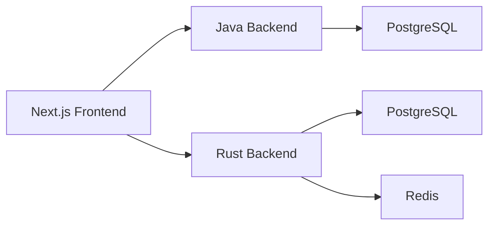
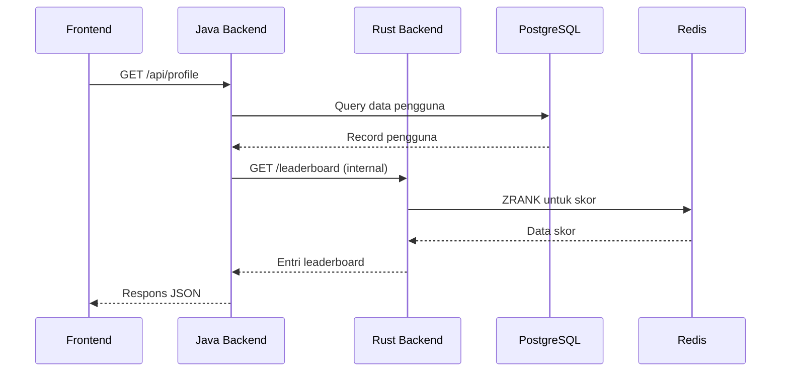
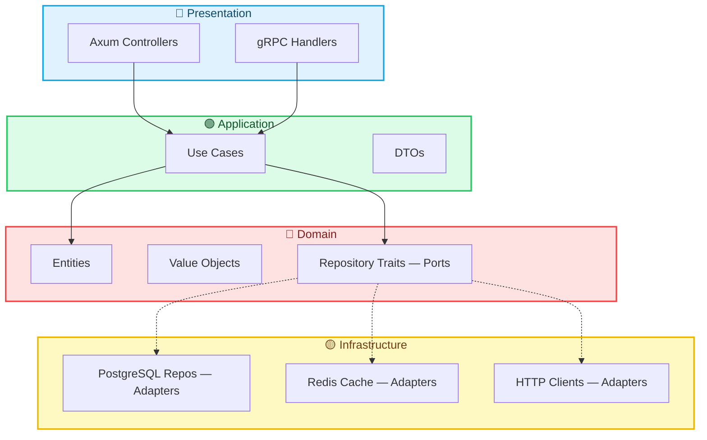

## Gambaran Umum

Bagian ini mendokumentasikan keputusan Architecture utama yang membentuk platform Yomu. Setiap keputusan mencerminkan keseimbangan kami antara keunggulan teknis, kemampuan tim, dan tujuan produk.

## Keputusan Architecture Inti

:::callout[type=note]
Kami memilih Architecture **polyglot microservices** — bukan monolith, dan bukan pure microservices dengan message queue.
:::

Keputusan ini menyeimbangkan beberapa kebutuhan yang bersaing:

| Faktor | Monolith | Polyglot Microservices | Pure Microservices |
|--------|----------|------------------------|-------------------|
| Kecepatan pengembangan | Cepat | Sedang | Lambat |
| Skalabilitas tim | Sulit | Mudah | Kompleks |
| Kesederhanaan deployment | Sederhana | Sedang | Kompleks |
| Performa | Baik | Sangat Baik | Terbaik |
| Overhead operasional | Rendah | Sedang | Tinggi |

### Mengapa Polyglot Microservices?

Backend Yomu dibagi menjadi layanan khusus, masing-masing dioptimalkan untuk beban kerjanya:



**Backend Java** menangani autentikasi, manajemen pengguna, dan operasi konten — logika bisnis berat dengan kebutuhan relasional yang kompleks.

**Backend Rust** menangani gamifikasi (leaderboard, pencapaian), klan, dan pembaruan skor real-time — operasi performa tinggi yang memerlukan latensi rendah dan konkurensi tinggi.

### Mengapa Bukan Pure Microservices dengan Message Queue?

Microservices penuh dengan Kafka/RabbitMQ menimbulkan kompleksitas operasional yang signifikan:

- Pemeliharaan infrastruktur message queue
- Menangani idempotensi dan pengiriman duplikat
- Debugging alur async di seluruh layanan
- Versioning skema event dan migrasi

Untuk ukuran tim dan tahap produk kami, **pattern outbox** menyediakan konsistensi yang cukup tanpa overhead operasional.

### Bagaimana Layanan Berkomunikasi



## Gaya Architecture

### Mengapa Dua Architecture Berbeda?

Yomu secara sengaja menggunakan **pattern Architecture yang berbeda** untuk kedua backend-nya. Ini bukan inkonsistensi — ini adalah **keputusan kontekstual** berdasarkan kemampuan bahasa, konvensi framework, dan kompleksitas domain.

### Rust: Clean Architecture (Hexagonal / Ports & Adapters)

Setiap modul Rust mengikuti [Clean Architecture](/docs/design-architecture/clean-architecture) dengan empat lapisan yang dipisahkan secara ketat:



**Backend Rust menangani logika gamifikasi** — sebuah domain dengan aturan bisnis kompleks: milestone pencapaian, rantai penyelesaian misi, perhitungan skor klan, progresi tier, dan peringkat leaderboard. Clean Architecture mengisolasi aturan-aturan ini dari Axum, SQLx, dan Redis, membuat domain:

- **Dapat diuji tanpa database** — mock repository traits dengan `mockall`
- **Agnostik terhadap framework** — ganti Axum dengan Actix-web tanpa menyentuh logika bisnis
- **Ditegakkan oleh compiler** — aturan visibilitas Rust (`pub(crate)`, batasan modul) membuat mustahil secara fisik bagi kode domain untuk mengimpor `sqlx` atau `axum`

```rust
// Domain TIDAK TAHU apa pun tentang HTTP, SQL, atau JSON
pub struct Clan {
    id: Uuid,
    name: ClanName,        // Value object — tervalidasi
    leader_id: Uuid,
    created_at: DateTime<Utc>,
}
```

Biayanya adalah **verbositas**: setiap fitur memerlukan trait (port), implementasi (adapter), use case, DTO, dan controller. Untuk mesin gamifikasi performa tinggi Yomu, overhead ini dibenarkan oleh jaminan kebenaran dan kemampuan pengujian.

Baca [pendalaman Clean Architecture](/docs/design-architecture/clean-architecture) selengkapnya untuk fondasi teoritis, Dependency Rule, dan mengapa sistem tipe Rust membuat Clean Architecture dapat ditegakkan secara mekanis.

### Java: Layered Architecture (Controller → Service → Repository)

Java mengikuti [Layered Architecture](/docs/design-architecture/layered) dengan struktur MVC konvensional Spring Boot:

```
src/
├── main/java/com/yomu/
│   ├── auth/        # Controller, service, repository
│   ├── user/        # Manajemen pengguna
│   ├── bacaankuis/  # Artikel dan kuis
│   ├── forum/       # Komentar dan diskusi
│   ├── outbox/      # Sinkronisasi event
│   └── security/    # JWT, OAuth, filter
```

**Backend Java menangani autentikasi dan CRUD konten** — domain yang didominasi oleh integrasi framework (Spring Security, JPA/Hibernate, OAuth2) daripada logika algoritmik kompleks. Layered Architecture memanfaatkan kekuatan Spring Boot:

- **Spring Data JPA** menghasilkan repository secara otomatis dari interface — nol boilerplate
- **`@Transactional`** membungkus metode service dengan proxy AOP untuk atomisitas
- **Bean Validation** (`@Valid`, `@Email`, `@NotNull`) terintegrasi dengan controller
- **Keakraban tim** — sebagian besar pengembang Spring mengenal Controller-Service-Repository

```java
// Entity berfungsi ganda sebagai domain model DAN skema persistence
@Entity
public class User {
    @Id @GeneratedValue(strategy = GenerationType.UUID)
    private UUID userId;

    @Column(nullable = false, unique = true)
    private String username;

    @Column(nullable = false)
    @Enumerated(EnumType.STRING)
    private Role role = Role.PELAJAR;
}
```

Mencoba Clean Architecture di Java berarti **melawan framework**: menduplikasi entity (JPA Entity + Domain Entity + Mapper), mem-wire transaksi secara manual alih-alih `@Transactional`, dan kehilangan lazy loading, dirty checking, dan second-level cache.

Trade-off-nya adalah **coupling**: anotasi JPA berada pada entity, service bergantung pada IoC container Spring, dan repository dihasilkan oleh framework. Untuk domain Java Yomu — yang didominasi CRUD dengan aturan sederhana — coupling ini dapat diterima.

Baca [pendalaman Layered Architecture](/docs/design-architecture/layered) selengkapnya untuk fondasi teoritis, sinergi framework, dan kapan Layered Architecture mulai bermasalah.

### Perbandingan

| Dimensi | Rust Clean Architecture | Java Layered Architecture |
|-----------|------------------------|---------------------------|
| **Fokus utama** | Isolasi logika domain kompleks | Kecepatan integrasi framework |
| **Kompleksitas domain** | Tinggi (pencapaian, misi, skoring) | Sedang (CRUD, alur auth) |
| **Coupling framework** | Nol — domain agnostik framework | Tinggi — entity menggunakan anotasi JPA |
| **Kecepatan pengujian** | Mikrodetik (tidak perlu DB) | Detik (Spring context atau Mockito) |
| **Penegakan compiler** | Mutlak — tidak bisa impor sqlx di domain | Tidak ada — berbasis konvensi |
| **Boilerplate** | Tinggi (traits, DTOs, mappers) | Rendah (Spring menghasilkan repository) |
| **Onboarding tim** | Lambat (pelatihan Rust + Architecture) | Cepat (pengetahuan Spring standar) |
| **Terbaik untuk** | Domain algoritmik, kritis performa | Aplikasi CRUD-heavy, enterprise standar |

### Mengapa Tidak Menyatukan pada Satu Architecture?

Kami mengevaluasi penggunaan Architecture yang sama untuk kedua backend dan menolaknya:

**Opsi A: Clean Architecture di keduanya**
- Java akan kehilangan Spring Data JPA, `@Transactional`, dan lazy loading
- Boilerplate masif untuk CRUD sederhana (entity duplikat, SQL manual, mapping manual)
- Perlu pelatihan ulang tim
- **Putusan**: Over-engineering untuk domain Java

**Opsi B: Layered Architecture di keduanya**
- Rust akan kehilangan batasan yang ditegakkan compiler
- Logika bisnis akan bocor ke controller Axum dan query SQLx
- Pengujian akan memerlukan PostgreSQL + Redis untuk setiap unit test
- **Putusan**: Under-engineering untuk domain Rust

**Opsi C: Architecture kontekstual (dipilih)**
- Rust mendapat batasan ketat untuk logika gamifikasi kompleks
- Java mendapat kecepatan untuk CRUD auth/konten standar
- Setiap backend dioptimalkan untuk ekosistem bahasanya
- **Putusan**: Architecture polyglot pragmatis

## Matriks Keputusan

### Keputusan: Polyglot Microservices

| Keputusan | Alasan | Alternatif Dipertimbangkan | Kelebihan | Kekurangan |
|----------|-----------|------------------------|------|------|
| Polyglot (Java + Rust) | Optimalkan setiap layanan untuk beban kerjanya | Microservices bahasa tunggal | Performa terbaik untuk gamifikasi, ekosistem matang untuk auth | Kompleksitas deployment, panggilan antar-layanan |
| Berbasis layanan (bukan pure microservices) | Infrastruktur messaging minimal | Kafka/RabbitMQ | Operasi lebih sederhana, pattern outbox untuk konsistensi | Jendela eventual consistency |
| Clean Architecture (hanya Rust) | Testabilitas, maintainabilitas, pemisahan lapisan untuk logika gamifikasi kompleks | Layered Architecture untuk Rust | Logika domain terisolasi, batasan ditegakkan compiler, mudah di-mock | Boilerplate tinggi: traits + DTOs + mappers per fitur |
| pattern BFF (Next.js API) | Sembunyikan kompleksitas backend dari frontend | Panggilan langsung frontend → backend | Auth terpusat, pemformatan response, caching | Hop ekstra, beban server Next.js |

## Sub-Halaman

- [Pilihan Teknologi](/docs/design-decisions/technology-choices) — Mengapa Java, Rust, Next.js, PostgreSQL, Redis
- [pattern Desain](/docs/design-decisions/patterns) — Repository, Use Case, Factory, Outbox, dan lainnya
