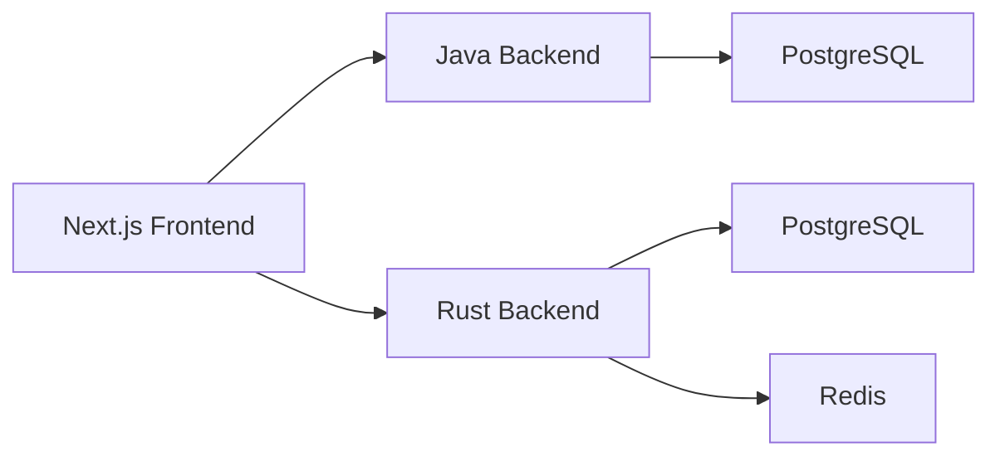

## Overview

This section documents the key architectural decisions that shaped the Yomu platform. Each decision reflects our balance between technical excellence, team capability, and product goals.

## Core Architectural Decision

:::callout[type=note]
We chose a **polyglot microservices** architecture — not a monolith, and not pure microservices with message queues.
:::

This decision balances several competing needs:

| Factor | Monolith | Polyglot Microservices | Pure Microservices |
|--------|----------|------------------------|-------------------|
| Development speed | Fast | Medium | Slow |
| Team scaling | Hard | Easy | Complex |
| Deployment simplicity | Simple | Medium | Complex |
| Performance | Good | Very Good | Best |
| Operational overhead | Low | Medium | High |

### Why Polyglot Microservices?

Yomu's backend is split into specialized services, each optimized for its workload:



**The Java backend** handles authentication, user management, and content operations — heavy business logic with complex relational requirements.

**The Rust backend** handles gamification (leaderboards, achievements), clans, and real-time score updates — high-performance operations requiring low latency and high concurrency.

### Why Not Pure Microservices with Message Queues?

Full microservices with Kafka/RabbitMQ introduce significant operational complexity:

- Message queue infrastructure maintenance
- Handling idempotency and duplicate delivery
- Debugging async flows across services
- Event schema versioning and migrations

For our team size and product stage, the **outbox pattern** provides sufficient consistency without the operational overhead.

### How Services Communicate


## Architecture Style

### Layered Architecture per Service

Each Rust module follows [Clean Architecture](/docs/design-architecture/clean-architecture):

```
gamification/
├── domain/          # Entities, value objects, core business logic
├── use_cases/       # Interactors, business rules
├── infrastructure/  # Adapters: DB, Redis, HTTP clients
└── presentation/    # Handlers, DTOs, OpenAPI specs
```

Java follows a [Layered Architecture](/docs/design-architecture/layered) with Spring Boot's conventional MVC structure:

```
src/
├── main/java/com/yomu/
│   ├── auth/        # Controllers, services, repositories
│   ├── user/        # User management
│   ├── bacaankuis/  # Articles and quizzes
│   ├── forum/       # Comments and discussions
│   ├── outbox/      # Event synchronization
│   └── security/    # JWT, OAuth, filters
```

**Note:** Java uses Spring Boot's conventional layered architecture (Controller → Service → Repository), not Hexagonal/Clean Architecture. The strict separation of domain, application, and infrastructure layers is enforced only in Rust.

## Decision Matrix

### Decision: Polyglot Microservices

| Decision | Rationale | Alternatives Considered | Pros | Cons |
|----------|-----------|------------------------|------|------|
| Polyglot (Java + Rust) | Optimize each service for its workload | Single language microservices | Best performance for gamification, mature ecosystem for auth | Deployment complexity, inter-service calls |
| Service-based (not pure microservices) | Minimal messaging infrastructure | Kafka/RabbitMQ | Simpler operations, outbox pattern for consistency | Eventual consistency window |
| Clean Architecture | Testability, maintainability, layer separation | Layered architecture | Domain logic isolated, easy to mock, refactor | More files, learning curve |
| BFF Pattern (Next.js API) | Hide backend complexity from frontend | Direct frontend → backend calls | Centralized auth, response formatting, caching | Extra hop, Next.js server load |

## Sub-Pages

- [Technology Choices](/docs/design-decisions/technology-choices) — Why Java, Rust, Next.js, PostgreSQL, Redis
- [Design Patterns](/docs/design-decisions/patterns) — Repository, Use Case, Factory, Outbox, and more
